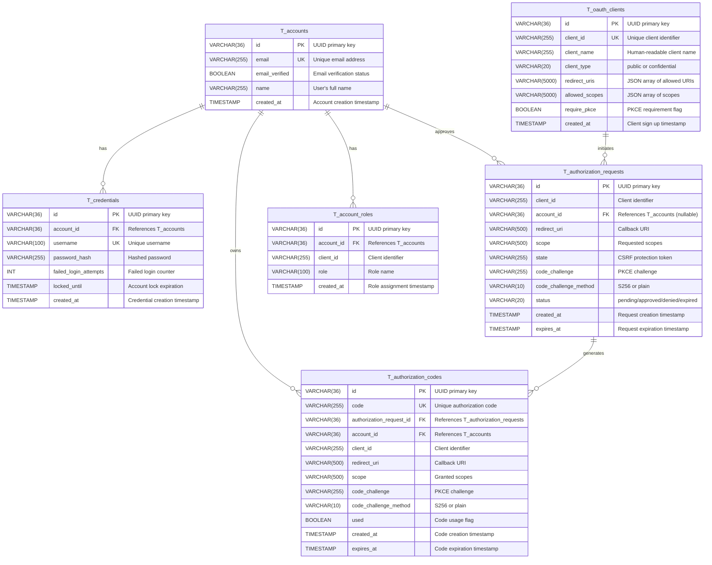

# Database Model Documentation

## Overview

The AbsrAuth OAuth 2.0 Authorization Server uses a relational database model designed to support the OAuth 2.0 Authorization Code Flow with PKCE (Proof Key for Code Exchange) extension. The schema is compatible with both MySQL and H2 databases and follows a naming convention where all tables are prefixed with `T_`, foreign keys with `FK_`, and indices with `I_`.

## Entity Relationship Diagram



## Table Descriptions

### T_accounts

The `T_accounts` table stores user account information. Each account represents a resource owner in the OAuth 2.0 flow.

**Key Features:**
- Uses UUID as primary key for distributed system compatibility
- Email must be unique and is used for account identification
- Supports email verification workflow
- Tracks account creation time

**Constraints:**
- `I_accounts_email`: Unique constraint on email field

### T_credentials

The `T_credentials` table stores authentication credentials for user accounts. It maintains a one-to-many relationship with accounts (though typically one-to-one in practice).

**Key Features:**
- Stores bcrypt-hashed passwords (never plaintext)
- Tracks failed login attempts for security
- Supports account locking mechanism via `locked_until`
- Username is unique across the system

**Constraints:**
- `FK_credentials_account_id`: Foreign key to T_accounts with CASCADE delete
- `I_credentials_username`: Unique index on username

**Security Features:**
- Failed login attempt tracking
- Temporary account locking capability
- Cascading delete ensures credential cleanup when account is deleted

### T_oauth_clients

The `T_oauth_clients` table stores registered OAuth 2.0 client applications that can request authorization.

**Key Features:**
- Supports both public (SPA, mobile) and confidential (server-side) clients
- Stores redirect URIs as JSON array for validation
- Stores allowed scopes as JSON array for authorization
- PKCE can be enforced per client

**Client Types:**
- `public`: Clients that cannot securely store secrets (SPAs, mobile apps)
- `confidential`: Clients that can securely store secrets (server applications)

**Constraints:**
- `I_oauth_clients_client_id`: Unique index on client_id

**Default Data:**
- A test SPA client is pre-configured for development (see V01.006 migration)

### T_authorization_requests

The `T_authorization_requests` table tracks OAuth 2.0 authorization requests throughout their lifecycle.

**Key Features:**
- Stores PKCE challenge for security validation
- Tracks request status (pending, approved, denied, expired)
- Maintains state parameter for CSRF protection
- Short-lived (typically 10 minutes)

**Status Values:**
- `pending`: Initial state, awaiting user authentication/consent
- `approved`: User has granted authorization
- `denied`: User has denied authorization
- `expired`: Request has exceeded its lifetime

**Indices:**
- `I_authorization_requests_client_id_account_id`: Composite index for lookups
- `I_authorization_requests_status_expires_at`: Index for cleanup queries

**Relationships:**
- Links to client via `client_id` (not enforced FK for flexibility)
- Links to account via `account_id` after user authentication

### T_authorization_codes

The `T_authorization_codes` table stores generated authorization codes that can be exchanged for access tokens.

**Key Features:**
- One-time use codes (tracked via `used` flag)
- Very short-lived (typically 5 minutes)
- Stores PKCE challenge for verification during token exchange
- Denormalized data for security validation

**Constraints:**
- `FK_authorization_codes_authorization_request_id`: Links to authorization request with CASCADE delete
- `FK_authorization_codes_account_id`: Links to account with CASCADE delete
- `I_authorization_codes_code`: Unique index on authorization code
- `I_authorization_codes_expires_at`: Index for cleanup queries

**Security Features:**
- Single-use enforcement via `used` flag
- Short expiration time (5 minutes)
- PKCE code_verifier validation
- Cascading deletes maintain referential integrity

### T_account_roles

The `T_account_roles` table stores role assignments for user accounts within the context of specific OAuth clients.

**Key Features:**
- Links accounts to roles within client applications
- Supports multi-tenancy by scoping roles to clients
- Enables fine-grained authorization control
- Tracks when roles were assigned

**Constraints:**
- `FK_account_roles_account`: Foreign key to T_accounts with CASCADE delete
- `I_account_roles_unique`: Unique constraint on (account_id, client_id, role)
- `I_account_roles_account_client`: Composite index for efficient lookups

**Use Cases:**
- Assigning admin roles to users for specific applications
- Managing user permissions per client application
- Supporting role-based access control (RBAC) in JWT tokens

## Naming Conventions

The database follows strict naming conventions for consistency and clarity:

- **Tables**: Prefixed with `T_` (e.g., `T_accounts`, `T_oauth_clients`)
- **Foreign Keys**: Format `FK_<tableName>_<columnName>` (e.g., `FK_credentials_account_id`)
- **Indices**: Format `I_<tableName>_<columnName(s)>` (e.g., `I_accounts_email`)
- **Primary Keys**: Always named `id` using VARCHAR(36) for UUID storage
- **Timestamps**: Use `created_at` and `expires_at` naming pattern

## Data Flow

### Authorization Code Flow

1. **Client Registration**: OAuth client is registered in `T_oauth_clients`
2. **User Sign Up**: User creates account in `T_accounts` with credentials in `T_credentials`
3. **Authorization Request**: Client initiates flow, creating entry in `T_authorization_requests`
4. **User Authentication**: User logs in using credentials from `T_credentials`
5. **User Consent**: User approves request, updating `T_authorization_requests` status
6. **Code Generation**: Authorization code created in `T_authorization_codes`
7. **Token Exchange**: Client exchanges code for token (code marked as `used`)

## Database Compatibility

The schema is designed to work with both MySQL and H2 databases:

- Uses standard SQL data types
- Avoids database-specific features
- Named constraints for explicit control
- Separate CREATE INDEX statements for compatibility
- BOOLEAN type supported by both databases
- VARCHAR lengths within common limits

## Indexes and Performance

Strategic indexes are placed for common query patterns:

- **Unique Indexes**: Enforce business rules (email, username, client_id, code)
- **Composite Indexes**: Support multi-column queries (client_id + account_id)
- **Expiration Indexes**: Enable efficient cleanup of expired records
- **Foreign Key Indexes**: Implicit indexes on FK columns for join performance

## Security Considerations

- **Password Storage**: Only hashed passwords stored, never plaintext
- **PKCE Support**: Code challenge stored for verification
- **Expiration**: All temporary entities have expiration timestamps
- **Cascade Deletes**: Automatic cleanup of related records
- **Account Locking**: Failed login tracking with lockout capability
- **One-Time Codes**: Authorization codes can only be used once
- **State Parameter**: CSRF protection for authorization requests

## Maintenance

### Cleanup Queries

Expired records should be periodically cleaned:

```sql
-- Clean expired authorization requests
DELETE FROM T_authorization_requests 
WHERE expires_at < CURRENT_TIMESTAMP;

-- Clean expired authorization codes
DELETE FROM T_authorization_codes 
WHERE expires_at < CURRENT_TIMESTAMP;
```

### Monitoring Queries

```sql
-- Check for locked accounts
SELECT a.email, c.locked_until, c.failed_login_attempts
FROM T_accounts a
JOIN T_credentials c ON a.id = c.account_id
WHERE c.locked_until > CURRENT_TIMESTAMP;

-- Check active authorization requests
SELECT client_id, status, COUNT(*) as count
FROM T_authorization_requests
GROUP BY client_id, status;
```

## Migration History

- **V01.001**: Create T_accounts table
- **V01.002**: Create T_credentials table with FK to T_accounts
- **V01.003**: Create T_oauth_clients table
- **V01.004**: Create T_authorization_requests table
- **V01.005**: Create T_authorization_codes table with FKs
- **V01.006**: Insert default test client for development
- **V01.007**: Create T_account_roles table for role-based access control
