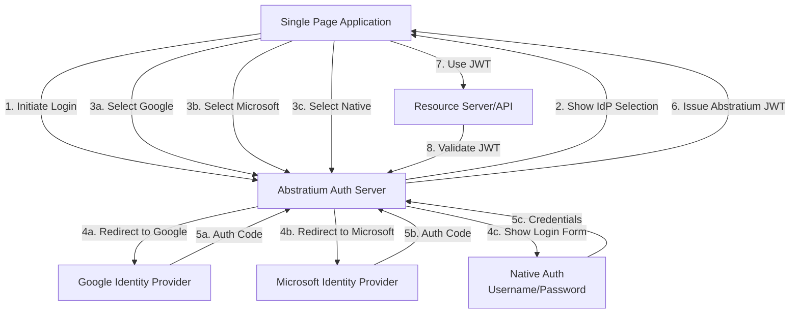
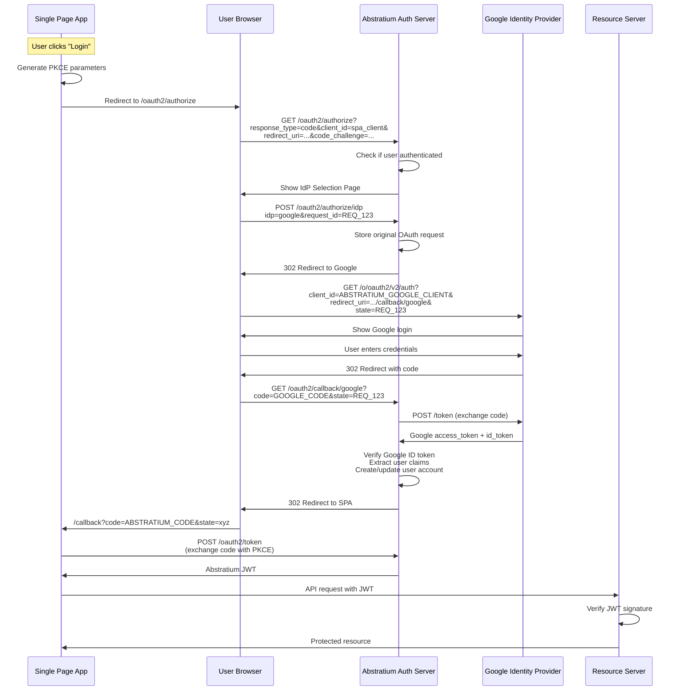
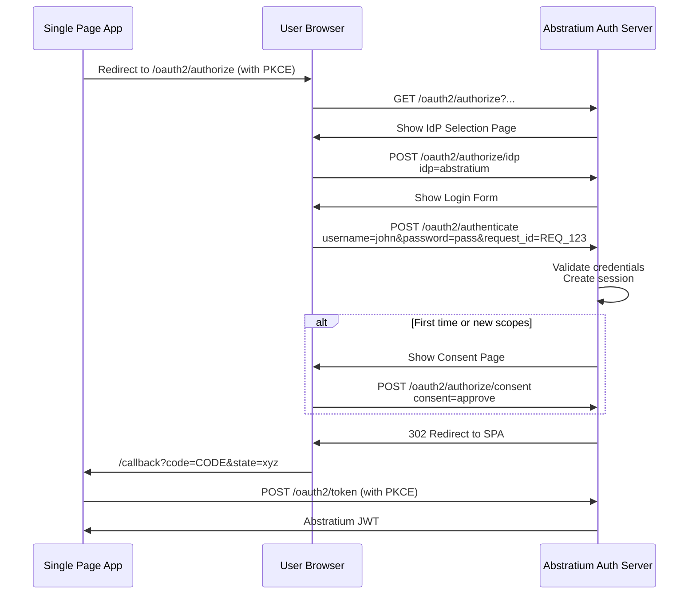
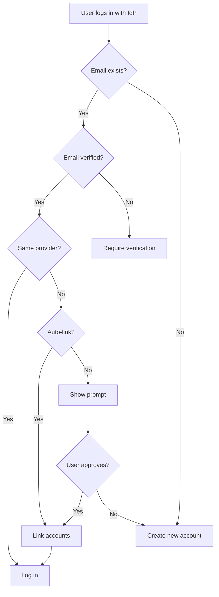

# Federated Login and Identity Provider Integration

This document describes how the Abstratium Authorization Server supports federated login, allowing users to authenticate using external identity providers (Google, Microsoft, etc.) or native Abstratium accounts.

## Table of Contents

- [Overview](#overview)
- [Architecture](#architecture)
- [Flow 1: Federated Login via External IdP](#flow-1-federated-login-via-external-idp)
- [Flow 2: Native Abstratium Login](#flow-2-native-abstratium-login)
- [Identity Provider Selection](#identity-provider-selection)
- [Token Mapping and Claims](#token-mapping-and-claims)
- [Account Linking](#account-linking)
- [Implementation Considerations](#implementation-considerations)

## Overview

### What is Federated Login?

Federated login allows users to authenticate using external Identity Providers (IdPs) like Google, Microsoft, GitHub, etc. The Abstratium Authorization Server acts as a **broker** between the client application (SPA) and external IdPs.

### Key Concepts

1. **Client Application (SPA)** - Your Single Page Application
2. **Abstratium Authorization Server** - Your OAuth 2.0 server (acts as both Authorization Server and OAuth Client)
3. **External Identity Provider** - Google, Microsoft, GitHub, etc.
4. **Resource Server** - Your backend API that validates Abstratium-issued JWTs

### Trust Model

```
SPA → trusts → Abstratium Auth Server → trusts → External IdP
                        ↓
                  Issues JWT for
                  Resource Server
```

The SPA and Resource Server **only trust tokens issued by Abstratium**, not tokens from external IdPs.

---

## Architecture

### High-Level Architecture



---

## Flow 1: Federated Login via External IdP

### Complete Flow with Google Example



### Key Steps Explained

#### 1. Initial Authorization Request
```http
GET /oauth2/authorize?
  response_type=code&
  client_id=spa_client&
  redirect_uri=https://app.example.com/callback&
  scope=openid profile email&
  state=xyz123&
  code_challenge=CHALLENGE&
  code_challenge_method=S256
```

#### 2. IdP Selection Page
The auth server shows a page with options:
- Login with Google
- Login with Microsoft  
- Login with Abstratium (native)

#### 3. Redirect to External IdP
```http
GET https://accounts.google.com/o/oauth2/v2/auth?
  response_type=code&
  client_id=ABSTRATIUM_GOOGLE_CLIENT_ID&
  redirect_uri=https://auth.abstratium.com/oauth2/callback/google&
  scope=openid profile email&
  state=REQ_123
```

#### 4. Google Callback
```http
GET /oauth2/callback/google?
  code=GOOGLE_AUTH_CODE&
  state=REQ_123
```

#### 5. Exchange Google Code
```http
POST https://oauth2.googleapis.com/token
Content-Type: application/x-www-form-urlencoded

grant_type=authorization_code&
code=GOOGLE_AUTH_CODE&
client_id=ABSTRATIUM_GOOGLE_CLIENT_ID&
client_secret=GOOGLE_CLIENT_SECRET&
redirect_uri=https://auth.abstratium.com/oauth2/callback/google
```

#### 6. Abstratium Issues Own Token
The auth server:
1. Verifies Google's ID token
2. Creates/updates user in database
3. Generates Abstratium authorization code
4. Redirects to SPA with Abstratium code

#### 7. SPA Exchanges Code for Token
```http
POST /oauth2/token
Content-Type: application/x-www-form-urlencoded

grant_type=authorization_code&
code=ABSTRATIUM_AUTH_CODE&
redirect_uri=https://app.example.com/callback&
client_id=spa_client&
code_verifier=ORIGINAL_CODE_VERIFIER
```

---

## Flow 2: Native Abstratium Login

### Username/Password Authentication



### Key Points

1. **OAuth 2.0 Compliant**: Uses Authorization Code Flow, not Resource Owner Password Credentials
2. **No Direct Password to Token**: Credentials go through proper authentication endpoint
3. **Consistent Flow**: Same OAuth flow as federated login from SPA perspective
4. **Consent Support**: Can require user consent for scopes

---

## Identity Provider Selection

### IdP Selection Page UI

```
┌─────────────────────────────────────────┐
│         Abstratium Authorization        │
│                                         │
│  app.example.com wants to access:      │
│  • Your profile information             │
│  • Your email address                   │
│                                         │
│  ┌─────────────────────────────────┐   │
│  │  🔵 Continue with Google        │   │
│  └─────────────────────────────────┘   │
│                                         │
│  ┌─────────────────────────────────┐   │
│  │  🔷 Continue with Microsoft     │   │
│  └─────────────────────────────────┘   │
│                                         │
│  ┌─────────────────────────────────┐   │
│  │  🔐 Continue with Abstratium    │   │
│  └─────────────────────────────────┘   │
│                                         │
│  Don't have an account? Sign up         │
└─────────────────────────────────────────┘
```

### IdP Selection Request

```http
POST /oauth2/authorize/idp
Content-Type: application/x-www-form-urlencoded

idp=google&
request_id=REQ_123
```

**Supported `idp` values:**
- `google`
- `microsoft`
- `github`
- `abstratium` (native)

---

## Token Mapping and Claims

### External IdP Token Claims

#### Google ID Token
```json
{
  "iss": "https://accounts.google.com",
  "sub": "110169484474386276334",
  "email": "john.doe@gmail.com",
  "email_verified": true,
  "name": "John Doe",
  "picture": "https://lh3.googleusercontent.com/...",
  "given_name": "John",
  "family_name": "Doe"
}
```

#### Microsoft ID Token
```json
{
  "iss": "https://login.microsoftonline.com/{tenant}/v2.0",
  "sub": "AAAAAAAAAAAAAAAAAAAAAIkzqFVrSaSaFHy782bbtaQ",
  "email": "john.doe@outlook.com",
  "name": "John Doe",
  "preferred_username": "john.doe@outlook.com",
  "oid": "00000000-0000-0000-66f3-3332eca7ea81"
}
```

### Abstratium JWT (Normalized)

```json
{
  "iss": "https://auth.abstratium.com",
  "sub": "abstratium_user_12345",
  "aud": "spa_client",
  "exp": 1719302400,
  "iat": 1719298800,
  "email": "john.doe@gmail.com",
  "email_verified": true,
  "name": "John Doe",
  "given_name": "John",
  "family_name": "Doe",
  "picture": "https://lh3.googleusercontent.com/...",
  "federated_provider": "google",
  "federated_id": "google:110169484474386276334",
  "auth_method": "federated"
}
```

### Claim Mapping

| Abstratium | Google | Microsoft | Native |
|-----------|--------|-----------|--------|
| `sub` | Generated | Generated | User ID |
| `email` | `email` | `email` or `preferred_username` | Email |
| `name` | `name` | `name` | Name |
| `picture` | `picture` | `picture` | Avatar |
| `federated_provider` | `"google"` | `"microsoft"` | `null` |
| `auth_method` | `"federated"` | `"federated"` | `"native"` |

---

## Account Linking

### Email-Based Linking Strategy



### Database Schema

```sql
CREATE TABLE users (
    id UUID PRIMARY KEY,
    email VARCHAR(255) UNIQUE NOT NULL,
    email_verified BOOLEAN DEFAULT FALSE,
    name VARCHAR(255),
    picture VARCHAR(500),
    created_at TIMESTAMP DEFAULT CURRENT_TIMESTAMP
);

CREATE TABLE federated_identities (
    id UUID PRIMARY KEY,
    user_id UUID NOT NULL REFERENCES users(id),
    provider VARCHAR(50) NOT NULL,
    provider_user_id VARCHAR(255) NOT NULL,
    email VARCHAR(255),
    connected_at TIMESTAMP DEFAULT CURRENT_TIMESTAMP,
    UNIQUE(provider, provider_user_id)
);

CREATE TABLE native_credentials (
    id UUID PRIMARY KEY,
    user_id UUID NOT NULL UNIQUE REFERENCES users(id),
    username VARCHAR(100) UNIQUE,
    password_hash VARCHAR(255) NOT NULL,
    failed_login_attempts INT DEFAULT 0,
    created_at TIMESTAMP DEFAULT CURRENT_TIMESTAMP
);
```

---

## Implementation Considerations

### 1. External IdP Configuration

```yaml
oauth2:
  providers:
    google:
      client_id: "YOUR_GOOGLE_CLIENT_ID"
      client_secret: "YOUR_GOOGLE_CLIENT_SECRET"
      authorization_endpoint: "https://accounts.google.com/o/oauth2/v2/auth"
      token_endpoint: "https://oauth2.googleapis.com/token"
      jwks_uri: "https://www.googleapis.com/oauth2/v3/certs"
      scopes: ["openid", "profile", "email"]
      redirect_uri: "https://auth.abstratium.com/oauth2/callback/google"
```

### 2. Required API Endpoints

```java
// IdP selection
GET  /oauth2/authorize          // Shows IdP selection page
POST /oauth2/authorize/idp      // Handles IdP selection

// Native authentication
POST /oauth2/authenticate       // Validates credentials

// Consent
GET  /oauth2/authorize/consent  // Shows consent page
POST /oauth2/authorize/consent  // Processes consent

// IdP callbacks
GET /oauth2/callback/google
GET /oauth2/callback/microsoft
GET /oauth2/callback/github
```

### 3. Security Considerations

#### State Parameter Management
- Generate cryptographically random state
- Store with original request in server session
- Validate on callback
- Short expiration (5-10 minutes)

#### ID Token Validation
1. Verify signature using IdP's JWKS
2. Verify `iss` matches expected issuer
3. Verify `aud` matches your client_id
4. Verify `exp` (not expired)
5. Verify `nonce` if used

#### Session Management
- Secure, HTTP-only cookies
- Session timeout
- Regenerate session ID after auth

### 4. Error Handling

Redirect to SPA with error:
```
https://app.example.com/callback?
  error=access_denied&
  error_description=User+cancelled+authentication&
  state=xyz123
```

### 5. User Experience

#### First-Time User
1. Select IdP
2. Authenticate with IdP
3. Abstratium creates account
4. Optional: Profile completion
5. Redirect to SPA

#### Returning User
1. Select IdP
2. IdP may skip login (SSO)
3. Skip consent if previously granted
4. Redirect to SPA

---

## Complete SPA Example

```javascript
// 1. Initiate login
function login() {
  const codeVerifier = generateRandomString(128);
  const codeChallenge = await sha256Base64Url(codeVerifier);
  const state = generateRandomString(32);
  
  sessionStorage.setItem('code_verifier', codeVerifier);
  sessionStorage.setItem('state', state);
  
  const params = new URLSearchParams({
    response_type: 'code',
    client_id: 'spa_client',
    redirect_uri: 'https://app.example.com/callback',
    scope: 'openid profile email',
    state: state,
    code_challenge: codeChallenge,
    code_challenge_method: 'S256'
  });
  
  window.location.href = `https://auth.abstratium.com/oauth2/authorize?${params}`;
}

// 2. Handle callback
async function handleCallback() {
  const params = new URLSearchParams(window.location.search);
  const code = params.get('code');
  const state = params.get('state');
  
  if (state !== sessionStorage.getItem('state')) {
    throw new Error('Invalid state');
  }
  
  const codeVerifier = sessionStorage.getItem('code_verifier');
  const response = await fetch('https://auth.abstratium.com/oauth2/token', {
    method: 'POST',
    headers: { 'Content-Type': 'application/x-www-form-urlencoded' },
    body: new URLSearchParams({
      grant_type: 'authorization_code',
      code: code,
      redirect_uri: 'https://app.example.com/callback',
      client_id: 'spa_client',
      code_verifier: codeVerifier
    })
  });
  
  const tokens = await response.json();
  storeTokensInMemory(tokens);
  
  sessionStorage.removeItem('code_verifier');
  sessionStorage.removeItem('state');
}
```

---

## Summary

The Abstratium Authorization Server supports:

1. **Federated Login**: Google, Microsoft, GitHub, etc.
2. **Native Login**: Username/password via OAuth 2.0 flow
3. **Consistent Tokens**: All auth methods produce Abstratium JWTs
4. **Account Linking**: Email-based or explicit linking
5. **Security**: PKCE, state validation, ID token verification

The SPA always uses the same OAuth 2.0 Authorization Code Flow with PKCE, regardless of which authentication method the user chooses.
