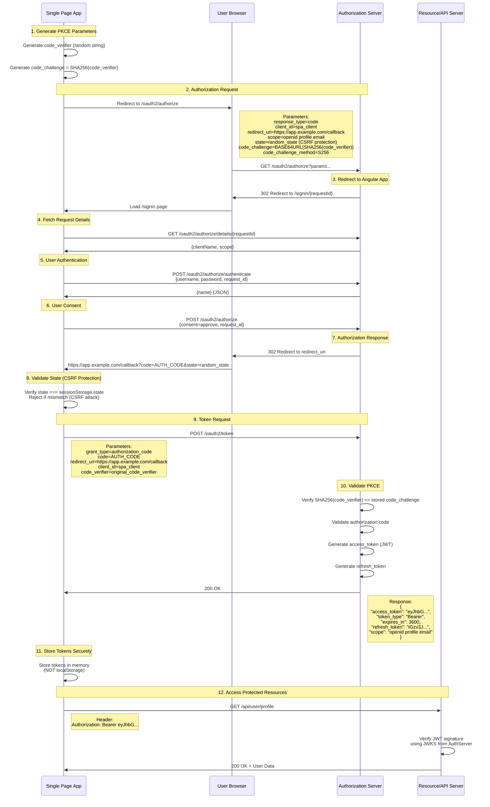
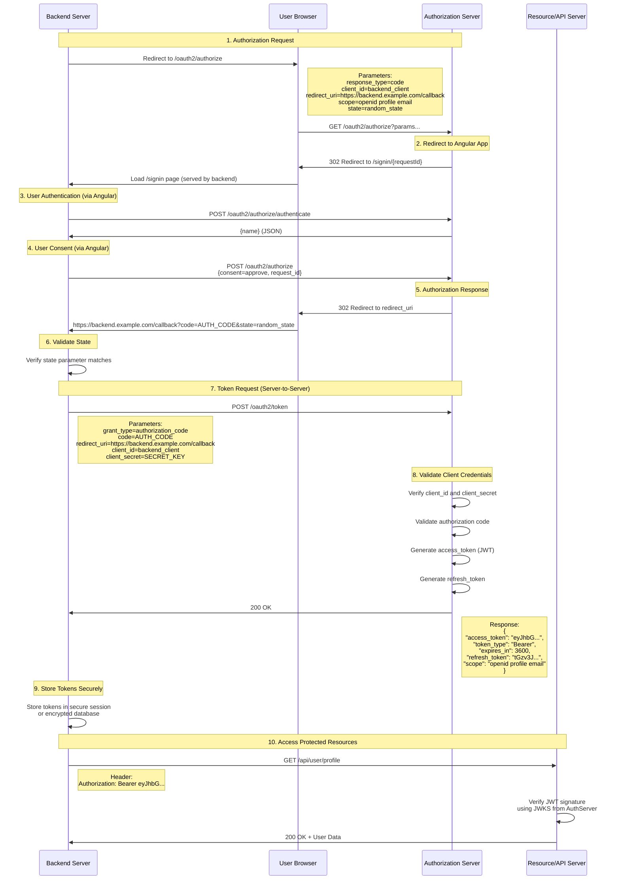
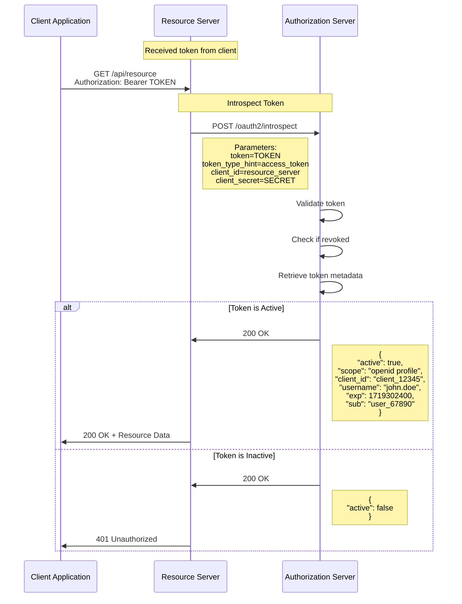
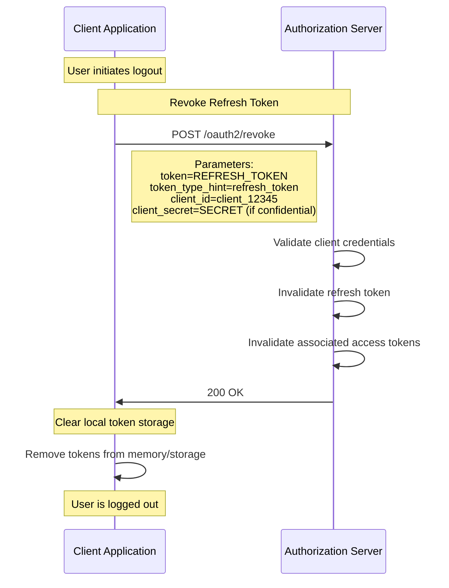
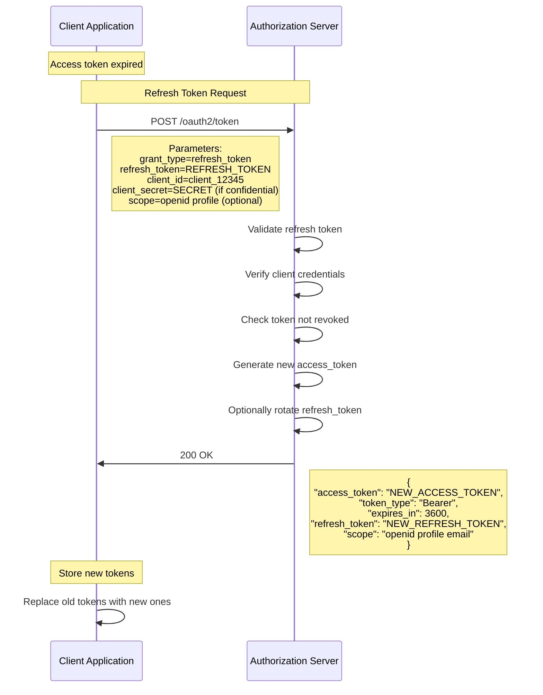

# OAuth 2.0 Authorization Flows

This document describes the OAuth 2.0 authorization flows supported by the Abstratium Authorization Server.

## Table of Contents

- [Supported Flows](#supported-flows)
- [Flow 1: Authorization Code Flow with PKCE (for SPAs)](#flow-1-authorization-code-flow-with-pkce-for-spas)
- [Flow 2: Authorization Code Flow (for Backend Servers)](#flow-2-authorization-code-flow-for-backend-servers)
- [Optional Operations](#optional-operations)
- [Token Refresh Flow](#token-refresh-flow)
- [Discovery and Key Management](#discovery-and-key-management)

## Supported Flows

This authorization server implements two OAuth 2.0 flows:

1. **Authorization Code Flow with PKCE** - Recommended for Single Page Applications (SPAs) and mobile apps
2. **Authorization Code Flow** - For confidential clients like backend servers

Both flows are based on:
- [RFC 6749](https://datatracker.ietf.org/doc/html/rfc6749) - OAuth 2.0 Authorization Framework
- [RFC 7636](https://datatracker.ietf.org/doc/html/rfc7636) - Proof Key for Code Exchange (PKCE)
- [RFC 6819](https://datatracker.ietf.org/doc/html/rfc6819) - OAuth 2.0 Threat Model and Security Considerations
- [RFC 9700](https://datatracker.ietf.org/doc/html/rfc9700) - OAuth 2.0 Security Best Current Practice

---

## Flow 1: Authorization Code Flow with PKCE (for SPAs)

**Use Case:** Single Page Applications (React, Angular, Vue.js) running in a browser

**Security:** PKCE prevents authorization code interception attacks without requiring client secrets

### Flow Diagram



### Step-by-Step Details

#### 1. Generate PKCE Parameters
```javascript
// Generate code_verifier (43-128 characters)
const code_verifier = generateRandomString(128);

// Generate code_challenge
const code_challenge = base64UrlEncode(sha256(code_verifier));
```

#### 2. Authorization Request
```http
GET /oauth2/authorize?
  response_type=code&
  client_id=spa_client_12345&
  redirect_uri=https://app.example.com/callback&
  scope=openid%20profile%20email&
  state=xyz123&
  code_challenge=E9Melhoa2OwvFrEMTJguCHaoeK1t8URWbuGJSstw-cM&
  code_challenge_method=S256
```

**Response:**
```http
HTTP/1.1 302 Found
Location: /signin/{requestId}
```

#### 3. Fetch Authorization Request Details
```http
GET /oauth2/authorize/details/{requestId}
```

**Response:**
```json
{
  "clientName": "Example Client",
  "scope": "openid profile email"
}
```

#### 4. Authenticate User
```http
POST /oauth2/authorize/authenticate
Content-Type: application/x-www-form-urlencoded

username=john.doe&
password=secret123&
request_id={requestId}
```

**Response:**
```json
{
  "name": "John Doe"
}
```

#### 5. Submit Consent
```http
POST /oauth2/authorize
Content-Type: application/x-www-form-urlencoded

consent=approve&
request_id={requestId}
```

**Response:**
```http
HTTP/1.1 302 Found
Location: https://app.example.com/callback?code=AUTH_CODE&state=xyz123
```

#### 6. Token Request
```http
POST /oauth2/token
Content-Type: application/x-www-form-urlencoded

grant_type=authorization_code&
code=SplxlOBeZQQYbYS6WxSbIA&
redirect_uri=https://app.example.com/callback&
client_id=spa_client_12345&
code_verifier=dBjftJeZ4CVP-mB92K27uhbUJU1p1r_wW1gFWFOEjXk
```

#### 7. Token Response
```json
{
  "access_token": "eyJhbGciOiJSUzI1NiIsInR5cCI6IkpXVCJ9...",
  "token_type": "Bearer",
  "expires_in": 3600,
  "refresh_token": "tGzv3JOkF0XG5Qx2TlKWIA",
  "scope": "openid profile email"
}
```

---

## Flow 2: Authorization Code Flow (for Backend Servers)

**Use Case:** Confidential clients like backend servers, server-side web applications

**Security:** Uses client secret for authentication, PKCE is optional but recommended

### Flow Diagram



### Step-by-Step Details

#### 1. Authorization Request
```http
GET /oauth2/authorize?
  response_type=code&
  client_id=backend_client_12345&
  redirect_uri=https://backend.example.com/callback&
  scope=openid%20profile%20email&
  state=xyz123
```

#### 6. Token Request (with Client Secret)
```http
POST /oauth2/token
Content-Type: application/x-www-form-urlencoded

grant_type=authorization_code&
code=SplxlOBeZQQYbYS6WxSbIA&
redirect_uri=https://backend.example.com/callback&
client_id=backend_client_12345&
client_secret=your_client_secret_here
```

**Alternative: HTTP Basic Authentication**
```http
POST /oauth2/token
Authorization: Basic base64(client_id:client_secret)
Content-Type: application/x-www-form-urlencoded

grant_type=authorization_code&
code=SplxlOBeZQQYbYS6WxSbIA&
redirect_uri=https://backend.example.com/callback
```

---

## Optional Operations

### Token Introspection (Optional)

**Use Case:** Validate token status and retrieve token metadata

**When to Use:**
- Resource servers need to validate opaque tokens
- Need to check if a token has been revoked
- Need detailed token metadata beyond JWT claims



#### Introspection Request
```http
POST /oauth2/introspect
Content-Type: application/x-www-form-urlencoded

token=eyJhbGciOiJSUzI1NiIsInR5cCI6IkpXVCJ9...&
token_type_hint=access_token&
client_id=resource_server&
client_secret=resource_secret
```

#### Introspection Response (Active Token)
```json
{
  "active": true,
  "scope": "openid profile email",
  "client_id": "client_12345",
  "username": "john.doe",
  "token_type": "Bearer",
  "exp": 1719302400,
  "iat": 1719298800,
  "sub": "user_67890",
  "aud": "https://api.example.com",
  "iss": "https://auth.example.com"
}
```

#### Introspection Response (Inactive Token)
```json
{
  "active": false
}
```

---

### Token Revocation (Optional)

**Use Case:** Invalidate access tokens or refresh tokens

**When to Use:**
- User logs out
- Security breach detected
- Token compromise suspected
- User revokes application access



#### Revocation Request
```http
POST /oauth2/revoke
Content-Type: application/x-www-form-urlencoded

token=tGzv3JOkF0XG5Qx2TlKWIA&
token_type_hint=refresh_token&
client_id=client_12345&
client_secret=your_client_secret
```

**Note:** The response is always `200 OK` regardless of whether the token was valid. This prevents token scanning attacks.

---

## Token Refresh Flow

**Use Case:** Obtain new access tokens without re-authenticating the user



#### Refresh Token Request
```http
POST /oauth2/token
Content-Type: application/x-www-form-urlencoded

grant_type=refresh_token&
refresh_token=tGzv3JOkF0XG5Qx2TlKWIA&
client_id=client_12345&
client_secret=your_client_secret&
scope=openid profile
```

#### Refresh Token Response
```json
{
  "access_token": "eyJhbGciOiJSUzI1NiIsInR5cCI6IkpXVCJ9...",
  "token_type": "Bearer",
  "expires_in": 3600,
  "refresh_token": "new_refresh_token_here",
  "scope": "openid profile email"
}
```

---

## Discovery and Key Management

### Server Metadata Discovery

Clients can discover the authorization server's capabilities and endpoints.

```http
GET /.well-known/oauth-authorization-server
```

#### Response
```json
{
  "issuer": "https://auth.example.com",
  "authorization_endpoint": "https://auth.example.com/oauth2/authorize",
  "token_endpoint": "https://auth.example.com/oauth2/token",
  "introspection_endpoint": "https://auth.example.com/oauth2/introspect",
  "revocation_endpoint": "https://auth.example.com/oauth2/revoke",
  "jwks_uri": "https://auth.example.com/.well-known/jwks.json",
  "response_types_supported": ["code"],
  "grant_types_supported": ["authorization_code", "refresh_token"],
  "code_challenge_methods_supported": ["S256", "plain"],
  "scopes_supported": ["openid", "profile", "email"],
  "token_endpoint_auth_methods_supported": ["client_secret_post", "client_secret_basic"]
}
```

### JSON Web Key Set (JWKS)

Resource servers retrieve public keys to verify JWT signatures.

```http
GET /.well-known/jwks.json
```

#### Response
```json
{
  "keys": [
    {
      "kty": "RSA",
      "use": "sig",
      "kid": "key-2024-01",
      "alg": "RS256",
      "n": "0vx7agoebGcQSuuPiLJXZptN9nndrQmbXEps2aiAFbWhM78LhWx...",
      "e": "AQAB"
    }
  ]
}
```

---

## Security Best Practices

### For Single Page Applications (SPAs)
1. **Always use PKCE** - Protects against authorization code interception
2. **Store tokens in memory** - Never use localStorage or sessionStorage for access tokens
3. **Use short-lived access tokens** - Minimize impact of token theft
4. **Implement token refresh** - Use refresh tokens to obtain new access tokens
5. **Validate state parameter** - **CRITICAL**: Always validate state in callback to prevent CSRF attacks
6. **Use HTTPS only** - All communication must be encrypted
7. **Clear sensitive data** - Remove code_verifier and state from sessionStorage after use

### For Backend Servers
1. **Protect client secrets** - Store securely, never expose in client-side code
2. **Use PKCE even with client secret** - Defense in depth
3. **Validate redirect URIs** - Prevent authorization code interception
4. **Implement proper session management** - Secure token storage
5. **Use refresh token rotation** - Detect token theft
6. **Monitor for suspicious activity** - Log and alert on anomalies

### For Resource Servers
1. **Verify JWT signatures** - Use JWKS endpoint to get public keys
2. **Validate token claims** - Check `iss`, `aud`, `exp`, `nbf`
3. **Use introspection for critical operations** - Real-time token validation
4. **Implement rate limiting** - Prevent abuse
5. **Cache JWKS keys** - But refresh periodically

---

## Error Handling

### Common Error Responses

#### Authorization Endpoint Errors
Errors are returned via redirect to `redirect_uri`:
```
https://client.example.com/callback?
  error=invalid_request&
  error_description=Missing+required+parameter:+client_id&
  state=xyz123
```

#### Token Endpoint Errors
```json
{
  "error": "invalid_grant",
  "error_description": "Authorization code is invalid or expired"
}
```

### Error Codes
- `invalid_request` - Missing or invalid parameters
- `invalid_client` - Client authentication failed
- `invalid_grant` - Authorization code or refresh token is invalid
- `unauthorized_client` - Client not authorized for this grant type
- `unsupported_grant_type` - Grant type not supported
- `invalid_scope` - Requested scope is invalid or exceeds granted scope
- `access_denied` - User denied authorization request

---

## Complete Flow Examples

### SPA Example (React/Angular/Vue)

```javascript
// 1. Initiate authorization
function login() {
  const codeVerifier = generateRandomString(128);
  const codeChallenge = await generateCodeChallenge(codeVerifier);
  const state = generateRandomString(32);
  
  // Store for later use
  sessionStorage.setItem('code_verifier', codeVerifier);
  sessionStorage.setItem('state', state);
  
  const params = new URLSearchParams({
    response_type: 'code',
    client_id: 'spa_client_12345',
    redirect_uri: 'https://app.example.com/callback',
    scope: 'openid profile email',
    state: state,
    code_challenge: codeChallenge,
    code_challenge_method: 'S256'
  });
  
  window.location.href = `https://auth.example.com/oauth2/authorize?${params}`;
}

// 2. Handle callback
async function handleCallback() {
  const params = new URLSearchParams(window.location.search);
  const code = params.get('code');
  const state = params.get('state');
  
  // CRITICAL: Validate state to prevent CSRF attacks
  const storedState = sessionStorage.getItem('state');
  if (!state || !storedState || state !== storedState) {
    console.error('CSRF Protection: State mismatch');
    sessionStorage.removeItem('state');
    sessionStorage.removeItem('code_verifier');
    throw new Error('Security Error: Invalid state parameter. Possible CSRF attack detected.');
  }
  
  // Clear state after successful validation
  sessionStorage.removeItem('state');
  
  // Exchange code for tokens
  const codeVerifier = sessionStorage.getItem('code_verifier');
  const response = await fetch('https://auth.example.com/oauth2/token', {
    method: 'POST',
    headers: { 'Content-Type': 'application/x-www-form-urlencoded' },
    body: new URLSearchParams({
      grant_type: 'authorization_code',
      code: code,
      redirect_uri: 'https://app.example.com/callback',
      client_id: 'spa_client_12345',
      code_verifier: codeVerifier
    })
  });
  
  const tokens = await response.json();
  
  // Store tokens in memory (use a state management solution)
  storeTokensInMemory(tokens);
  
  // Clean up code_verifier
  sessionStorage.removeItem('code_verifier');
}

// 3. Use access token
async function fetchUserProfile() {
  const accessToken = getAccessTokenFromMemory();
  
  const response = await fetch('https://api.example.com/user/profile', {
    headers: {
      'Authorization': `Bearer ${accessToken}`
    }
  });
  
  return await response.json();
}

// 4. Refresh token
async function refreshAccessToken() {
  const refreshToken = getRefreshTokenFromMemory();
  
  const response = await fetch('https://auth.example.com/oauth2/token', {
    method: 'POST',
    headers: { 'Content-Type': 'application/x-www-form-urlencoded' },
    body: new URLSearchParams({
      grant_type: 'refresh_token',
      refresh_token: refreshToken,
      client_id: 'spa_client_12345'
    })
  });
  
  const tokens = await response.json();
  storeTokensInMemory(tokens);
}

// 5. Logout
async function logout() {
  const refreshToken = getRefreshTokenFromMemory();
  
  // Revoke refresh token
  await fetch('https://auth.example.com/oauth2/revoke', {
    method: 'POST',
    headers: { 'Content-Type': 'application/x-www-form-urlencoded' },
    body: new URLSearchParams({
      token: refreshToken,
      token_type_hint: 'refresh_token',
      client_id: 'spa_client_12345'
    })
  });
  
  // Clear tokens from memory
  clearTokensFromMemory();
  
  // Redirect to home
  window.location.href = '/';
}
```

### Backend Server Example (Node.js/Java/Python)

```javascript
// 1. Initiate authorization
app.get('/login', (req, res) => {
  const state = generateRandomString(32);
  req.session.state = state;
  
  const params = new URLSearchParams({
    response_type: 'code',
    client_id: 'backend_client_12345',
    redirect_uri: 'https://backend.example.com/callback',
    scope: 'openid profile email',
    state: state
  });
  
  res.redirect(`https://auth.example.com/oauth2/authorize?${params}`);
});

// 2. Handle callback
app.get('/callback', async (req, res) => {
  const { code, state } = req.query;
  
  // Validate state
  if (state !== req.session.state) {
    return res.status(400).send('Invalid state parameter');
  }
  
  // Exchange code for tokens
  const response = await fetch('https://auth.example.com/oauth2/token', {
    method: 'POST',
    headers: { 
      'Content-Type': 'application/x-www-form-urlencoded',
      'Authorization': 'Basic ' + Buffer.from(
        `${CLIENT_ID}:${CLIENT_SECRET}`
      ).toString('base64')
    },
    body: new URLSearchParams({
      grant_type: 'authorization_code',
      code: code,
      redirect_uri: 'https://backend.example.com/callback'
    })
  });
  
  const tokens = await response.json();
  
  // Store tokens in secure session
  req.session.accessToken = tokens.access_token;
  req.session.refreshToken = tokens.refresh_token;
  
  res.redirect('/dashboard');
});

// 3. Protected route
app.get('/api/user', async (req, res) => {
  const accessToken = req.session.accessToken;
  
  const response = await fetch('https://api.example.com/user/profile', {
    headers: {
      'Authorization': `Bearer ${accessToken}`
    }
  });
  
  const userData = await response.json();
  res.json(userData);
});

// 4. Logout
app.post('/logout', async (req, res) => {
  const refreshToken = req.session.refreshToken;
  
  // Revoke refresh token
  await fetch('https://auth.example.com/oauth2/revoke', {
    method: 'POST',
    headers: { 
      'Content-Type': 'application/x-www-form-urlencoded',
      'Authorization': 'Basic ' + Buffer.from(
        `${CLIENT_ID}:${CLIENT_SECRET}`
      ).toString('base64')
    },
    body: new URLSearchParams({
      token: refreshToken,
      token_type_hint: 'refresh_token'
    })
  });
  
  // Destroy session
  req.session.destroy();
  res.redirect('/');
});
```

---

## Conclusion

This authorization server provides secure OAuth 2.0 flows for both public clients (SPAs) and confidential clients (backend servers). Always follow security best practices and use PKCE for enhanced security, especially for public clients.

For more information, refer to the RFC specifications linked at the beginning of this document.
