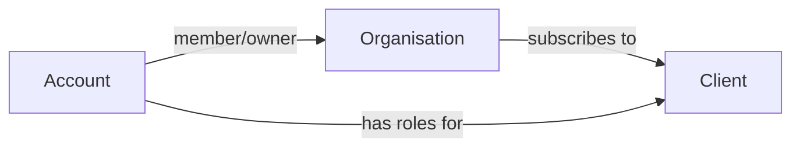
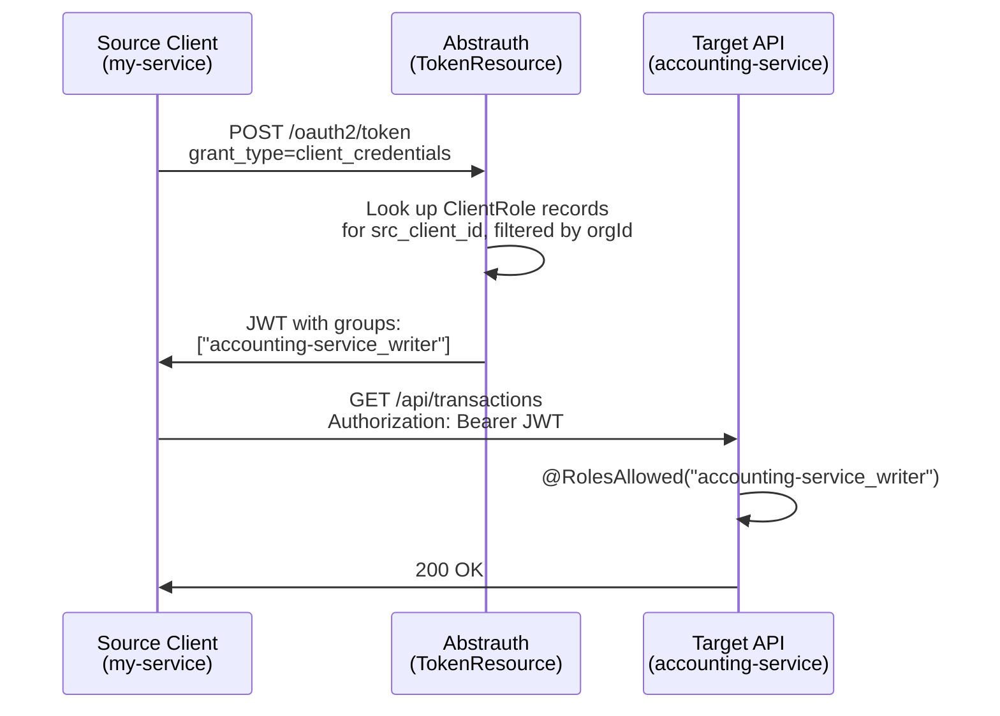

# User Guide

## Concepts

Abstrauth™ is a multi-tenant OAuth 2.0 Authorization Server. The key concepts are:

- **Account** - a user's login identity (email + auth provider). Global, not scoped to any organisation.
- **Organisation** - the tenant boundary. Every user belongs to one or more organisations. The `orgId` in the JWT is what downstream applications use as `tenantId`.
- **Client (Application)** - an OAuth client registered in Abstrauth™. Can be **private** (only the owning org uses it) or **public** (other orgs can subscribe).
- **Subscription** - links an organisation to a client. Access is denied unless a subscription exists.
- **Role** - assigned per account, per client, within an organisation. Emitted in the JWT `groups` claim for RBAC.



## Initial Onboarding (Signup)

When signup is enabled (`ALLOW_SIGNUP=true`), the first user to sign up provides an email, name, password, and an **organisation name**. This creates:

1. An **account**
2. An **organisation** (the user becomes both owner and member)
3. The first account ever created also receives the **admin** role

Subsequent users who sign up each get their own organisation automatically.

## Signing In

1. Click **Sign in** on the home page.
2. Authenticate using native credentials (email/password) or a federated provider (Google, Microsoft).
3. If you belong to **multiple organisations**, you are prompted to select one. The last-used org is pre-selected from browser storage.
4. If you belong to only one organisation, it is selected automatically.
5. A JWT is issued containing your `orgId`, roles for the active organisation, and standard OIDC claims.

To work under a different organisation, sign out and sign back in selecting the other org.

## Navigation

Once signed in, the header provides links to:

- **Clients** - manage OAuth applications
- **Accounts** - manage user accounts and roles
- **Organisations** - view and create organisations
- **User Profile** (your name) - inspect your JWT token claims
- Your current organisation name (clickable link to its detail page)

## Organisations

All signed-in users can view and create organisations.

### Viewing Your Organisations

Navigate to **Organisations** to see all organisations you belong to. Each tile shows:

- Organisation name and ID
- Your roles (`owner` and/or `member`)
- Whether it is the **current** organisation (the one in your JWT)

Click an organisation name to view its detail page.

### Creating a New Organisation

1. Click **+ New Organisation**
2. Enter a name
3. Click **Create Organisation**

You automatically become the **owner** and **member**, and receive the `manage-accounts` and `manage-clients` roles for Abstrauth™ within that org. To use the new org, sign out and back in selecting it.

### Organisation Detail (Owners Only)

Owners can **rename** the organisation via the Edit Name button on the detail page.

### Members and Owners

- **Member** - can sign in under the org and access org-scoped data.
- **Owner** - can add/remove members, manage subscriptions, and assign roles to users from a client's allowlist. Does **not** automatically have `manage-accounts` or `manage-clients` - those are separate role assignments.

## Account Management

Requires the role `abstratium-abstrauth_manage-accounts`.

### Viewing Accounts

Navigate to **Accounts** to see all accounts that are members of your current organisation. Each tile shows:

- Name, email, auth provider (native/google/microsoft)
- Email verification status
- All assigned roles (grouped by client)

Use the filter to search by name, email, role, or provider.

### Adding an Account to Your Organisation

1. Click **+ Add Account**
2. Enter the user's email and select their auth provider (native, Google, or Microsoft)
3. For native accounts, also enter the user's full name
4. Click **Create Account**

Two outcomes are possible:

- **New account**: an invite link is generated. Share it with the user - they use it to set their password on first sign-in.
- **Existing account** (email already registered): the account is simply added to your organisation.

**Security warning:** Do not assign sensitive roles before the user has confirmed they can sign in. An intercepted invite link could be exploited.

### Managing Roles

Each account has roles assigned per client. To add a role:

1. Click **+ Add Role** on the account tile
2. Select a **client** (dropdown shows all clients your org owns or subscribes to)
3. Select or type a **role**:
   - For **public clients** (subscribed from another org): choose from the client's allowed-roles dropdown
   - For **private clients** (your org owns it): type any role name (alphanumeric + hyphens)
4. Click **Add Role**

To remove a role, click the delete button next to it and confirm.

**Notes:**

- The `admin` role can only be assigned by existing admins.
- Default roles from subscribed clients are automatically assigned on a user's first sign-in to that client.
- Users can only see and manage accounts within their own organisation.

### Deleting an Account

Click the delete button on the account tile and confirm. This permanently removes the account and all associated data.

## Client Management

Requires the role `abstratium-abstrauth_manage-clients`.

### Viewing Clients

Navigate to **Clients** to see:

- All clients **owned by your organisation**
- All **public clients** your org subscribes to (marked "External")

Use the filter to search by name, client ID, type, URI, or scope.

### Creating a Client

1. Click **+ Add Client**
2. Fill in:
   - **Client ID** - unique identifier (letters, numbers, underscores). The actual client ID used in your application will be prepended with your organisation's unique prefix.
   - **Client Name** - human-readable name
   - **Client Type** - always `confidential` (BFF pattern)
   - **Public** - check if other organisations should be able to subscribe
   - **Auto-subscribe** - (only available when Public is checked) if enabled, subscriptions are created lazily on first sign-in from any org
   - **Redirect URIs** - one per line; required when scopes are set
   - **Allowed Scopes** - `openid profile email` for user-facing apps; leave empty for M2M/role-only clients
   - **Require PKCE** - always required (cannot be disabled)
3. Click **Create Client**
4. **Copy the generated client secret immediately** - it is shown only once

### Editing a Client

Click the edit button on the client card (only for clients owned by your org). You can modify the name, type, scopes, redirect URIs, public/auto-subscribe flags. The client ID cannot be changed.

### Deleting a Client

Click the delete button on the client card and confirm. This removes the client and all associated data.

### Public vs Private Clients

| | Private (`publik = false`) | Public (`publik = true`) |
|---|---|---|
| **Who can use it** | Only the owning organisation | Any org that subscribes |
| **Subscription** | Auto-created at client creation | Org owner subscribes manually (or auto-subscribe on first sign-in) |
| **Role assignment** | Free-text roles | Restricted to the client's allowed-roles list |

### Client Secret Management

Abstrauth™ supports multiple active secrets per client for zero-downtime secret rotation. This allows you to generate a new secret, update your applications to use it, and then revoke the old secret without any service interruption.

#### Viewing Client Secrets

1. Navigate to the **Clients** page
2. Find the client you want to manage
3. Click the **🔑 Manage Secrets** button
4. You'll see a list of all secrets (active and revoked) with:
   - Description
   - Creation date
   - Expiration date (if set)
   - Status (Active, Expired, or Revoked)

**Note:** The actual secret value is only shown once when you create it. After that, only metadata is visible.

#### Creating a New Secret

1. Click **🔑 Manage Secrets** for the client
2. Click **+ Generate New Secret**
3. Enter a description (e.g., "Production secret - Jan 2026")
4. Optionally set an expiration period in days (e.g., 90 days)
5. Click **Generate Secret**
6. **IMPORTANT:** Copy the secret immediately - you won't be able to see it again!
7. Store the secret securely (password manager, environment variables, etc.)

**Best Practices:**
- Use descriptive names that indicate the secret's purpose or environment
- Set expiration dates for secrets (e.g., 90 days) to enforce regular rotation
- Never commit secrets to version control
- Store secrets in secure secret management systems (HashiCorp Vault, AWS Secrets Manager, etc.)

#### Rotating Secrets (Zero-Downtime)

To rotate a secret without service interruption:

1. **Generate a new secret** (see above)
2. **Update your application** to use the new secret
3. **Deploy and test** that the new secret works
4. **Revoke the old secret** once you're confident the new one is working
5. **Optionally delete** the revoked secret to clean up

This process ensures your service continues running throughout the rotation.

#### Revoking a Secret

1. Click **🔑 Manage Secrets** for the client
2. Find the secret you want to revoke
3. Click **🔒 Revoke** next to the secret
4. Confirm the action

**Note:** You cannot revoke the last active secret. You must have at least one active secret at all times.

#### Deleting a Revoked Secret

Once a secret is revoked, you can permanently delete it:

1. Click **🔑 Manage Secrets** for the client
2. Find the revoked secret
3. Click **🗑️ Delete** next to the secret
4. Confirm the permanent deletion

**Warning:** Deletion is permanent and cannot be undone. Only delete secrets you're certain you no longer need.

#### Expiration Warnings

If you've set an expiration date for a secret, Abstrauth™ will send email notifications to the account that created the secret:

- **30 days before expiration** - First warning
- **3 days before expiration** - Final warning
- **When the secret expires** - Expiration notice

**Email Configuration:** Email notifications require SMTP configuration. See the environment variables section for details:
- `ABSTRAUTH_EMAIL_ENABLED`: Enable/disable email notifications (default: `false` in dev, `true` in prod)
- `SMTP_HOST`: SMTP server hostname
- `SMTP_PORT`: SMTP server port (default: `587`)
- `SMTP_USERNAME`: SMTP authentication username
- `SMTP_PASSWORD`: SMTP authentication password
- `EMAIL_FROM`: Sender email address (default: `noreply@abstratium.dev`)

#### Security Considerations

- **Multiple active secrets** allow for zero-downtime rotation
- **Expired secrets** are automatically marked as expired but not deleted
- **Revoked secrets** cannot be used for authentication
- **Account tracking** - Each secret records who created it for audit purposes
- **Regular rotation** is recommended (e.g., every 90 days)

### Machine-to-Machine (M2M) Authentication

Abstrauth™ supports service-to-service authentication using the OAuth 2.0 Client Credentials Grant. This allows backend services, microservices, and automated jobs to authenticate without user interaction.

#### Use Cases

- Microservice-to-microservice communication
- Backend services accessing APIs
- Automated jobs and scripts
- CI/CD pipelines calling protected APIs

#### How Client Roles Work

M2M authorization uses **client roles** (stored in `T_client_roles`). A client role defines that a **source client** (the caller) may act with a specific **role** when calling a **target client** (the API). Roles must first be declared in the target client's allowed-roles list (`T_client_allowed_roles`) before they can be assigned as a client role.

When the source client authenticates via the client credentials grant, `TokenResource` looks up all `ClientRole` records for that client (filtered to the client's own organisation via `@TenantId`). Each role is formatted as `targetClientId_role` and placed in the JWT `groups` claim, enabling `@RolesAllowed` on the target service.



#### Setting Up M2M

Note that clients exist in order to model applications that use Abstrauth™ for authentication. It is highly likely that you will already have clients stored for those applications. When one needs to call a second one, you just need to configure the caller so that it has the roles that are required to call the target client (the second application).

Note that it might be better to use the token exchange API to change a users token for one that allows a call to a downstream service to be made in their name. For that to work, the user needs all the required roles in the downstream client also, otherwise the call won't succeed.

VERY IMPORTANT: the JWT that is created contains the organisation ID of the client that signed in. Calls made with that JWT will affect downstream data belonging to that organisation (if multitenancy is properly implemented downstream. See MULTITENANCY_DESIGN.md). If your organisation doesn't own the client, your organisation cannot know the client secret, and so cannot write software that will sign in as that client. This means you cannot re-use clients that dispayed just because your organisation subscribes to them. You will have to create your own clients in order to use them for M2M authentication.

**Step 1 — Create the target API client** (if it doesn't exist) and add allowed roles:
1. Navigate to **Clients** → find or create the target API client
2. Click **Allowed Roles** and add the roles the client exposes (e.g., `writer`, `reader`)

**Step 2 — Create the calling service client:**
1. Navigate to **Clients** → **+ Add Client**
2. Fill in:
   - **Client ID**: `my-service`
   - **Client Name**: `My Backend Service`
   - **Redirect URIs**: leave empty
   - **Allowed Scopes**: leave empty (role-based authorization only)
3. Click **Create Client** and **copy the generated client secret** — shown only once

**Step 3 — Assign client roles:**
1. On the source client card, click **Client Roles**
2. Click **+ Add Client Role**
3. Select the **target client** and the **role** from the dropdown
4. Click **Add**

**Important:** Scopes and redirect URIs should be left empty for M2M clients. If scopes are configured, the client is treated as a user-facing application.

#### Obtaining an Access Token

Use the client credentials grant to get an access token:

```bash
curl -X POST http://localhost:8080/oauth2/token \
  -H "Content-Type: application/x-www-form-urlencoded" \
  -d "grant_type=client_credentials" \
  -d "client_id=my-service" \
  -d "client_secret=YOUR_CLIENT_SECRET"
```

**Response:**
```json
{
  "access_token": "eyJhbGciOiJQUzI1NiIsInR5cCI6IkpXVCJ9...",
  "token_type": "Bearer",
  "expires_in": 3600
}
```

**Note:** For clients with no scopes, the `scope` field will be omitted from the response.

#### Using the Access Token

Once you have an access token, use it to access protected resources:

```bash
export TOKEN="eyJhbGciOiJQUzI1NiIsInR5cCI6IkpXVCJ9..."

curl -v -X GET http://localhost:8080/api/auth/check \
  -H "Authorization: Bearer $TOKEN"
```

**Success Response (200 OK):**
```json
{
  "authenticated": true,
  "clientId": "my-service",
  "groups": ["accounting-service_writer"]
}
```

**Failure Responses:**
- **Invalid token**: Returns `401 Unauthorized` or redirects to login
- **Expired token**: Returns `401 Unauthorized`
- **No token**: Redirects to login page

#### Role-Based Authorization

M2M clients use the `groups` claim for `@RolesAllowed` authorization. The format is `{targetClientId}_{role}` — the `orgId` UUID prefix is stripped from the client ID when constructing the group name.

**Token Claims:**
```json
{
  "iss": "https://<stage>.abstrauth.abstratium.dev",
  "sub": "my-service",
  "aud": "my-service",
  "exp": 1234567890,
  "iat": 1234564290,
  "jti": "unique-token-id",
  "client_id": "my-service",
  "orgId": "<owning-org-uuid>",
  "groups": ["accounting-service_writer"]
}
```

**Backend Code (target API):**
```java
@POST
@Path("/transactions")
@RolesAllowed("accounting-service_writer")
public Response createTransaction(TransactionRequest req) {
    String caller = jwt.getSubject();  // "my-service" — useful for audit logs
    return Response.ok().build();
}
```

#### Scope-Based vs Role-Based

**Scope-Based (User Authentication):**
- Client configured with scopes: `["openid", "profile", "email"]`
- Used for user login flows
- Claims filtered based on requested scopes
- Roles added to `groups` claim depending on what roles are assigned to the user account that signs in

**Role-Based (M2M Services):**
- Client configured with **empty** scopes: `[]`
- Used for service-to-service authentication
- Client roles (source → target) added to `groups` claim
- Cannot request scopes

**Important:** An M2M client needs neither scopes nor redirect URIs; a User Client needs scopes, redirect URIs, and optionally roles assigned to user accounts.  An M2M client can also be a User Client, but doesn't need to be, you can create extra M2M clients that are used like "Service Accounts" for connecting to downstream services.

#### Security Best Practices

1. **Rotate secrets regularly** (e.g., every 90 days)
2. **Use descriptive client names** to identify services
3. **Grant minimum required roles** (principle of least privilege)
4. **Store secrets securely** (environment variables, secret managers)
5. **Monitor token usage** via logs and metrics
6. **Set up alerts** for failed authentication attempts

#### Example: Python Service

```python
import requests
import os

# Configuration
TOKEN_URL = "http://localhost:8080/oauth2/token"
API_URL = "http://localhost:8080/api/data"
CLIENT_ID = "my-service"
CLIENT_SECRET = os.environ["CLIENT_SECRET"]

# Get access token
token_response = requests.post(TOKEN_URL, data={
    "grant_type": "client_credentials",
    "client_id": CLIENT_ID,
    "client_secret": CLIENT_SECRET
})
token_response.raise_for_status()
access_token = token_response.json()["access_token"]

# Use token to access API
api_response = requests.get(API_URL, headers={
    "Authorization": f"Bearer {access_token}"
})
api_response.raise_for_status()
print(api_response.json())
```

#### Example: Java Service

```java
import java.net.http.*;
import java.net.URI;

public class ServiceClient {
    private static final String TOKEN_URL = "http://localhost:8080/oauth2/token";
    private static final String CLIENT_ID = "my-service";
    private static final String CLIENT_SECRET = System.getenv("CLIENT_SECRET");
    
    public String getAccessToken() throws Exception {
        HttpClient client = HttpClient.newHttpClient();
        String body = String.format(
            "grant_type=client_credentials&client_id=%s&client_secret=%s",
            CLIENT_ID, CLIENT_SECRET
        );
        
        HttpRequest request = HttpRequest.newBuilder()
            .uri(URI.create(TOKEN_URL))
            .header("Content-Type", "application/x-www-form-urlencoded")
            .POST(HttpRequest.BodyPublishers.ofString(body))
            .build();
            
        HttpResponse<String> response = client.send(request, 
            HttpResponse.BodyHandlers.ofString());
        
        // Parse JSON and extract access_token
        return parseAccessToken(response.body());
    }
}
```

## Subscriptions

Subscriptions connect organisations to clients. Without a subscription, users from that org cannot sign in to the application.

- **Private clients**: a subscription is created automatically when the client is created (only the owning org can use it).
- **Public clients with auto-subscribe**: a subscription is created lazily the first time a user from any org initiates sign-in to that client.
- **Public clients without auto-subscribe**: an org owner must explicitly subscribe before their users can access the application.

Org owners manage subscriptions from the organisation management area.

## User Profile

Click your name in the header to view the **User Profile** page. This displays all claims in your current JWT identity token, including `orgId`, `groups` (roles), `email`, `name`, and standard OIDC claims.

## Change Password

Users with native (email/password) accounts can change their password from the user profile area.

## Installation

It is intended that Abstrauth™ be run using docker.
Abstrauth™ supports MySql and will soon also support postgresql and MS SQL Server.

You need to add a database/schema and a user to the database manually. Thereafter, Abstrauth™ can access that database with that user and it will create all of the necessary tables and an initial OAuth2 client with the client_id `abstratium-abstrauth`. This client is used by the application itself, and users sign into the application using this client in order to manage other clients, as well as accounts and roles.

### Prerequisites

Before installation, ensure you have:

- **Docker** installed and running
- **MySQL 8.0+** database server
- **Network connectivity** between Docker container and MySQL
- **OpenSSL** for generating JWT keys
- **GitHub account** (if pulling from GitHub Container Registry)
- **nginx** or similar for reverse proxying and terminating TLS

### Create the Database, User and Grant Permissions

#### MySQL

Abstrauth™ requires a MySQL database. Create a database and user with the following steps:

1. **Connect to MySQL** as root or admin user:

(change `<password>` to your password)

```bash
docker run -it --rm --network abstratium mysql mysql -h abstratium-mysql --port 3306 -u root -p<password>

DROP USER IF EXISTS 'abstrauth'@'%';

CREATE USER 'abstrauth'@'%' IDENTIFIED BY '<password>';

DROP DATABASE IF EXISTS abstrauth;

CREATE DATABASE abstrauth CHARACTER SET utf8mb4 COLLATE utf8mb4_unicode_ci;
GRANT ALL PRIVILEGES ON abstrauth.* TO abstrauth@'%'; -- on own database

FLUSH PRIVILEGES;

EXIT;
```

Abstrauth™ will automatically create all necessary tables and an initial OAuth2 client (`abstratium-abstrauth`) when it first connects to the database.

**Important:** The default client is configured as a **confidential client** (required for the BFF pattern). You MUST set the client secret via environment variable (see below).

New versions will update the database as needed.

### Generate JWT Keys

Abstrauth™ uses RSA keys for signing and verifying JWT tokens. You need to generate a private/public key pair.

1. **Generate a new RSA private key** (2048 bits minimum):
   ```bash
   openssl genpkey -algorithm RSA -out privateKey.pem -pkeyopt rsa_keygen_bits:2048
   ```

2. **Extract the public key**:
   ```bash
   openssl rsa -in privateKey.pem -pubout -out publicKey.pem
   ```

3. **Convert private key to base64** (without headers/newlines):
   ```bash
   grep -v '^-----' privateKey.pem | tr -d '\n'
   ```
   Use this output below for `SMALLRYE_JWT_SIGN_KEY`.

4. **Convert public key to base64** (without headers/newlines):
   ```bash
   grep -v '^-----' publicKey.pem | tr -d '\n'
   ```
   Use this output below for `MP_JWT_VERIFY_PUBLICKEY`.

5. **Secure the private key**:
   ```bash
   chmod 600 privateKey.pem
   # Store securely and never commit to version control
   ```

### Generate Client Secret, Cookie Encryption Key, and CSRF Token Signature Key

**Important:** Abstrauth™ uses the Backend For Frontend (BFF) pattern and CSRF protection, which requires:
1. A client secret for the default OAuth client
2. A cookie encryption key for securing HTTP-only cookies
3. A CSRF token signature key for HMAC-signing CSRF tokens

1. **Generate a secure client secret** (32+ characters recommended):
   ```bash
   openssl rand -base64 32
   ```
   Use this output for `ABSTRAUTH_CLIENT_SECRET`.

2. **Generate a cookie encryption key** (must be at least 32 characters):
   ```bash
   openssl rand -base64 32
   ```
   Use this output for `COOKIE_ENCRYPTION_SECRET`.

3. **Generate a CSRF token signature key** (must be at least 32 characters):
   ```bash
   openssl rand -base64 64 | tr -d '\n'
   ```
   Use this output for `CSRF_TOKEN_SIGNATURE_KEY`.

4. **Generate password pepper** (must be at least 32 characters):
   ```bash
   openssl rand -base64 32
   ```
   Use this output for `PASSWORD_PEPPER`.

5. **Store securely**:
   - Never commit these secrets to version control
   - Use a secrets manager in production (e.g., AWS Secrets Manager, HashiCorp Vault)
   - Rotate secrets periodically

**Security Note:** The client secret in the database (`client_secret_hash`) must match the secret provided via `ABSTRAUTH_CLIENT_SECRET`. The database stores a BCrypt hash for security. In development, a default hash is provided, but **you MUST change this in production**.

### Pull and Run the Docker Container

1. **Pull the latest image** from GitHub Container Registry:
   ```bash
   docker pull ghcr.io/abstratium-dev/abstrauth:latest
   ```

2. **Run the container**:

_Replace all `TODO_...` values with the values generated above.

   ```bash
   docker run -d \
     --name abstrauth \
     --network your-network \
     -p 127.0.0.1:41080:8080 \
     -p 127.0.0.1:9002:9002 \
     -e QUARKUS_DATASOURCE_JDBC_URL="jdbc:mysql://your-mysql-host:3306/abstrauth" \
     -e QUARKUS_DATASOURCE_USERNAME="abstrauth" \
     -e QUARKUS_DATASOURCE_PASSWORD="TODO_YOUR_SECURE_PASSWORD" \
     -e SMALLRYE_JWT_SIGN_KEY="TODO_YOUR_BASE64_PRIVATE_KEY_HERE" \
     -e MP_JWT_VERIFY_PUBLICKEY="TODO_YOUR_BASE64_PUBLIC_KEY_HERE" \
     -e ABSTRAUTH_CLIENT_SECRET="TODO_YOUR_GENERATED_CLIENT_SECRET" \
     -e COOKIE_ENCRYPTION_SECRET="TODO_YOUR_GENERATED_COOKIE_ENCRYPTION_KEY" \
     -e CSRF_TOKEN_SIGNATURE_KEY="TODO_YOUR_GENERATED_CSRF_TOKEN_SIGNATURE_KEY" \
     -e DEFAULT_ORG_UUID="TODO_YOUR_GENERATED_DEFAULT_ORG_UUID" \
     -e OAUTH_GOOGLE_CLIENT_ID="TODO_YOUR_GOOGLE_CLIENT_ID" \
     -e OAUTH_GOOGLE_CLIENT_SECRET="TODO_YOUR_GOOGLE_CLIENT_SECRET" \
     -e ALLOW_SIGNUP="TODO_TRUE_OR_FALSE" \
     -e ABSTRAUTH_BASE_URL="https://auth.yourdomain.com" \
     -e PASSWORD_PEPPER="TODO_YOUR_PASSWORD_PEPPER" \
     -e QUARKUS_OIDC_BFF_AUTHENTICATION_FORCE_REDIRECT_HTTPS_SCHEME="TODO_TRUE_IF_BEHIND_REVERSE_PROXY_WHICH_ENDS_TLS_TUNNEL" \
     -e ABSTRA_BRAND_LOGO_URL="https://your-company.com/logo.svg" \
     -e ABSTRA_BRAND_LOGO_ALT="Your Company Logo" \
     -e ABSTRA_BRAND_NAME="YOUR COMPANY" \
     -e ABSTRAUTH_AUDIT_RETENTION_DAYS="90"
     ghcr.io/abstratium-dev/abstrauth:latest
   ```

   **Required Environment Variables:**
   - `QUARKUS_DATASOURCE_JDBC_URL`: Database connection URL (format: `jdbc:mysql://<host>:<port>/<database>`)
   - `QUARKUS_DATASOURCE_USERNAME`: Database username
   - `QUARKUS_DATASOURCE_PASSWORD`: Database password (use strong, unique password)
   - `SMALLRYE_JWT_SIGN_KEY`: Base64-encoded RSA private key for signing JWTs (min 2048 bits for PS256)
   - `MP_JWT_VERIFY_PUBLICKEY`: Base64-encoded RSA public key for verifying JWTs (must match private key)
   - `ABSTRAUTH_CLIENT_SECRET`: Client secret for the default OAuth client (BFF pattern, generate with `openssl rand -base64 32`)
   - `COOKIE_ENCRYPTION_SECRET`: Encryption key for HTTP-only cookies (min 32 chars, generate with `openssl rand -base64 32`)
   - `CSRF_TOKEN_SIGNATURE_KEY`: HMAC signature key for CSRF tokens (min 32 chars, generate with `openssl rand -base64 64 | tr -d '\n'`)
   - `STAGE`: Deployment stage identifier exposed to the frontend (e.g., "dev", "test", "prod", defaults to "dev")
   - `DEFAULT_ORG_UUID`: UUID for the default organisation that existing data is migrated into (generate with `uuidgen`)
   - `ABSTRAUTH_BASE_URL`: Public base URL of the Abstrauth™ deployment (e.g., `https://auth.yourdomain.com`). Used for links in emails such as secret expiration notifications. Must be set per stage; production has no default.

   **Optional Environment Variables:**
   - `OAUTH_GOOGLE_CLIENT_ID`: Google OAuth client ID (required only for "Sign in with Google")
   - `OAUTH_GOOGLE_CLIENT_SECRET`: Google OAuth client secret (required only for "Sign in with Google")
   - `ALLOW_SIGNUP`: Allow user self-registration (`true` in dev, `false` in prod, default: `false`)
   - `PASSWORD_PEPPER`: Application-wide secret for password security (generate with `openssl rand -base64 32`, WARNING: changing requires re-hashing all passwords)
   - `RATE_LIMIT_ENABLED`: Enable rate limiting on OAuth endpoints (default: `true`)
   - `RATE_LIMIT_OAUTH_MAX_REQUESTS`: Max requests per IP per window (default: `100`)
   - `RATE_LIMIT_OAUTH_WINDOW_SECONDS`: Rate limit time window in seconds (default: `60`)
   - `RATE_LIMIT_OAUTH_BAN_DURATION_SECONDS`: Ban duration after exceeding limits (default: `300`)
   - `QUARKUS_MANAGEMENT_ENABLED`: Enable management interface (default: `true`)
   - `QUARKUS_MANAGEMENT_PORT`: Management interface port (default: `9002`)
   - `QUARKUS_OIDC_BFF_AUTHENTICATION_FORCE_REDIRECT_HTTPS_SCHEME`: set to true if Abstrauth™ runs behind a reverse proxy that terminates TLS
   - `ALLOW_NATIVE_SIGNIN`: if true, users can sign in with email & password, otherwise they can only sign in  (default: `true`)
   - `ABSTRAUTH_EMAIL_ENABLED`: Enable/disable email notifications (default: `false` in dev, `true` in prod)
   - `SECRET_EXPIRATION_NOTIFICATION_CRON`: Cron expression for the secret expiration notification job (default: `0 0 6 * * ?`, i.e., 06:00 UTC daily). Use standard Quartz cron syntax.
   - `SMTP_HOST`: SMTP server hostname
   - `SMTP_PORT`: SMTP server port (default: `587`)
   - `SMTP_USERNAME`: SMTP authentication username
   - `SMTP_PASSWORD`: SMTP authentication password
   - `EMAIL_FROM`: Sender email address (default: `noreply@abstratium.dev`)
   - `ABSTRAUTH_WARNING_MESSAGE`: Custom warning message displayed in a yellow banner at the top of the UI. Useful for indicating non-production environments (e.g., "You are in a development environment"). Leave empty for production (default: empty in prod, environment-specific in dev/test).
   - `ABSTRA_BRAND_LOGO_URL`: URL of the logo image shown in the header. Defaults to `https://abstratium.dev/abstratium-logo-small.png`.
   - `ABSTRA_BRAND_LOGO_ALT`: Alt text for the header logo image. Defaults to `Abstratium Logo`.
   - `ABSTRA_BRAND_NAME`: Brand name text shown next to the logo in the header. Defaults to `ABSTRATIUM`.
   - `ABSTRAUTH_AUDIT_RETENTION_DAYS`: Number of days to retain Envers audit history (changes to accounts, credentials, roles, federated identities, and organisation memberships). Default: `90`. Audit rows older than this period are purged daily at 02:00 UTC. This value is also displayed on the legal/privacy page.
   - `ABSTRAUTH_TOKEN_EXCHANGE_MAX_DEPTH`: Maximum number of token exchange hops in a delegation chain (default: `3`). A value of 3 allows BFF → Service A → Service B but rejects a fourth hop. Set to `1` to prohibit any chaining of exchanged tokens.
   - `ABSTRA_LEGAL_CONTENT_FILE`: **Required for non-abstratium deployments.** Absolute path inside the container to an HTML file containing your organisation's legal page content. When set, this file's contents are served to the frontend and displayed instead of the built-in abstratium legal text — with no misconfiguration warnings. If this variable is not set and the deployment is not on `abstratium.dev`, the legal page will display a prominent error warning to users, and the home page will display a disclaimer stating that abstratium is not responsible for this deployment. Example: `-e ABSTRA_LEGAL_CONTENT_FILE=/config/legal.html -v /host/legal.html:/config/legal.html`.

----

> **⚠ LEGAL NOTICE FOR OPERATORS AND DEPLOYERS**
>
> This software ships with a legal page (`src/main/webui/src/app/core/legal/legal.component.html`)
> that is **specific to abstratium informatique sàrl** and applies **only** to the official deployment
> at **abstratium.dev**.
>
> If you deploy this software on **any other domain**, the legal page will automatically display a
> prominent misconfiguration warning to users, and the abstratium legal text will be visually
> invalidated. However, **you are still legally required** to:
>
> 1. Replace the legal page with one that correctly names **your** organisation as data controller.
> 2. Ensure the page accurately reflects **your** data processing practices, applicable law, and contact details.
> 3. Comply with the GDPR, Swiss revDSG, and any other applicable data protection law in your jurisdiction.
>
> Failure to do so may expose **you** (the operator) to regulatory action. abstratium informatique sàrl
> accepts no liability whatsoever for deployments made by third parties.
>
> See the checklist below for full configuration steps.


3. **Verify the container is running**:
   ```bash
   docker ps
   docker logs abstrauth
   curl http://localhost:41080/m/health
   curl http://localhost:41080/m/info
   ```

4. Update the client information in the database:
   ```sql
   UPDATE T_oauth_clients SET redirect_uris = '["http://localhost:8080/api/auth/callback", "https://your.host/api/auth/callback"]';
   ```

5. **Access the application**:
   - Main application: http://localhost:41080
   - Management interface: http://localhost:9002/m/info

## Monitoring and Health Checks

Abstrauth™ provides several endpoints for monitoring:

- **Health Check**: `http://localhost:9002/m/health`
  - Returns application health status
  - Includes database connectivity check

- **Info Endpoint**: `http://localhost:9002/m/info`
  - Returns build information, version, and configuration
  - Useful for verifying deployment

## Troubleshooting

### Container logs error on startup

If you see the following error, you can safely ignore it. The reason that it is logged is because Abstrauth™ uses the Quarkus extension `quarkus-oidc` to validate tokens, and it periodically checks the JWKS endpoint for key updates, including at startup. Since the server isn't entirely up and running at this point, the check initially fails, but as soon as you try and sign in, it re-fetches the keys and works.

```bash
2026-01-02 20:49:41,709 ERROR [io.qua.oid.run.OidcProviderClientImpl] (vert.x-eventloop-thread-1) [skey:] Request https://auth.abstratium.dev/.well-known/jwks.json has failed: status: 502, ...
```

### Container won't start

1. Check Docker logs: `docker logs abstrauth`
2. Verify environment variables are set correctly
3. Ensure database is accessible from container
4. Check network connectivity: `docker network inspect your-network`

### Database connection errors

1. Verify MySQL is running: `mysql -u abstrauth -p -h your-mysql-host`
2. Check firewall rules allow connection on port 3306
3. Verify database user has correct permissions
4. Check JDBC URL format is correct

### JWT token errors

1. Verify keys are correctly base64-encoded
2. Ensure public key matches private key
3. Check key length is at least 2048 bits
4. Verify no extra whitespace in environment variables

## Security Best Practices

1. **Never use default/test keys in production**
2. **Store secrets in secure secret management systems** (e.g., HashiCorp Vault, AWS Secrets Manager)
3. **Use strong, unique passwords** for database and admin accounts
4. **Enable HTTPS** in production (configure reverse proxy)
5. **Regularly update** the Docker image to get security patches
6. **Monitor logs** for suspicious activity
7. **Backup database regularly**
8. **Limit network access** to database and management interface
9. **Rotate JWT keys periodically** (requires user re-authentication)
10. **Keep `ALLOW_SIGNUP=false`** unless you need public registration

## Integrating Abstrauth™ into Your Application

See [client-example](client-example/README.md).

### Additional Resources

- [OAuth 2.0 Flows Documentation](docs/oauth/FLOWS.md)
- [Federated Login Guide](docs/oauth/FEDERATED_LOGIN.md)
- [Security Best Practices](docs/security/SECURITY_DESIGN.md)
- [RFC 6749 - OAuth 2.0](https://datatracker.ietf.org/doc/html/rfc6749)
- [RFC 7636 - PKCE](https://datatracker.ietf.org/doc/html/rfc7636)
