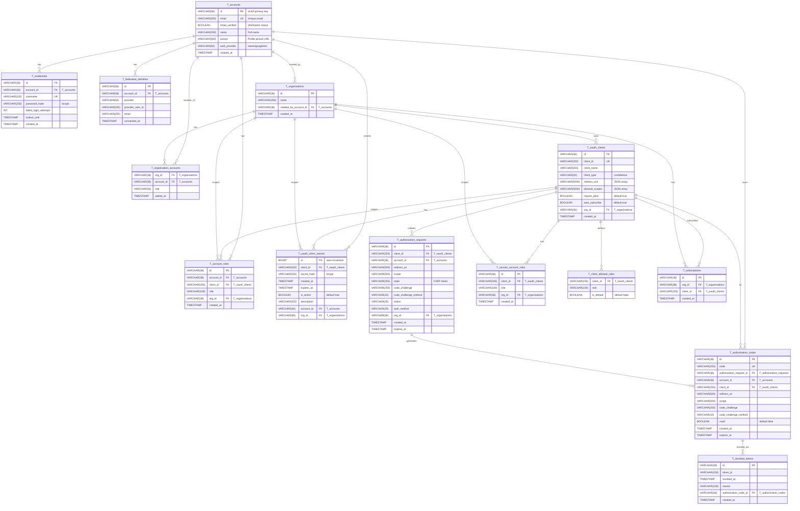

# Database Model Documentation

## Overview

The AbsrAuth OAuth 2.0 Authorization Server uses a relational database model supporting the Authorization Code Flow with PKCE. The schema works with both MySQL and H2 and follows a strict naming convention: tables prefixed with `T_`, foreign keys with `FK_`, and indices with `I_`.

## Entity Relationship Diagram

## Table Descriptions

### T_accounts

User accounts (resource owners).

| Column | Type | Constraints | Description |
|--------|------|-------------|-------------|
| id | VARCHAR(36) | PK | UUID |
| email | VARCHAR(255) | NOT NULL, UK | Unique email |
| email_verified | BOOLEAN | DEFAULT FALSE | Verification status |
| name | VARCHAR(255) | | Full name |
| picture | VARCHAR(500) | | Profile picture URL |
| auth_provider | VARCHAR(50) | DEFAULT 'native' | Initial creation method |
| created_at | TIMESTAMP | DEFAULT CURRENT_TIMESTAMP | |

**Indexes:** `I_accounts_email` (unique)

### T_credentials

Local authentication credentials. One account typically has one credential record.

| Column | Type | Constraints | Description |
|--------|------|-------------|-------------|
| id | VARCHAR(36) | PK | UUID |
| account_id | VARCHAR(36) | NOT NULL, FK | T_accounts CASCADE |
| username | VARCHAR(100) | NOT NULL, UK | Unique username |
| password_hash | VARCHAR(255) | NOT NULL | bcrypt hash |
| failed_login_attempts | INT | DEFAULT 0 | Lockout counter |
| locked_until | TIMESTAMP | NULL | Temporary lock expiry |
| created_at | TIMESTAMP | DEFAULT CURRENT_TIMESTAMP | |

**Indexes:** `I_credentials_account_id` (unique), `I_credentials_username` (unique)

### T_federated_identities

Links accounts to external identity providers (Google, etc.). One account can have multiple identities.

| Column | Type | Constraints | Description |
|--------|------|-------------|-------------|
| id | VARCHAR(36) | PK | UUID |
| account_id | VARCHAR(36) | NOT NULL, FK | T_accounts CASCADE |
| provider | VARCHAR(50) | NOT NULL | Provider name |
| provider_user_id | VARCHAR(255) | NOT NULL | Provider's user ID |
| email | VARCHAR(255) | | Provider email |
| connected_at | TIMESTAMP | DEFAULT CURRENT_TIMESTAMP | |

**Indexes:** `I_federated_account_id`, `I_federated_provider_user` (unique on provider, provider_user_id)

### T_oauth_clients

Registered OAuth 2.0 clients. Only **confidential** clients (BFF pattern) are supported.

| Column | Type | Constraints | Description |
|--------|------|-------------|-------------|
| id | VARCHAR(36) | PK | UUID |
| client_id | VARCHAR(255) | NOT NULL, UK | Unique client identifier |
| client_name | VARCHAR(255) | NOT NULL | Human-readable name |
| client_type | VARCHAR(20) | NOT NULL | `confidential` only |
| redirect_uris | VARCHAR(5000) | NOT NULL | JSON array of allowed URIs |
| allowed_scopes | VARCHAR(5000) | | JSON array of scopes |
| require_pkce | BOOLEAN | DEFAULT TRUE | Always true |
| auto_subscribe | BOOLEAN | NOT NULL DEFAULT TRUE | Auto-subscribe org on first use |
| org_id | VARCHAR(36) | FK | T_organisations |
| created_at | TIMESTAMP | DEFAULT CURRENT_TIMESTAMP | |

**Indexes:** `I_oauth_clients_client_id` (unique)

### T_oauth_client_secrets

Multiple secrets per client, enabling rotation without downtime.

| Column | Type | Constraints | Description |
|--------|------|-------------|-------------|
| id | BIGINT | PK AUTO_INCREMENT | Surrogate key |
| client_id | VARCHAR(255) | NOT NULL, FK | T_oauth_clients CASCADE |
| secret_hash | VARCHAR(255) | NOT NULL | bcrypt hash |
| created_at | TIMESTAMP | NOT NULL DEFAULT CURRENT_TIMESTAMP | |
| expires_at | TIMESTAMP | NULL | Secret expiry |
| is_active | BOOLEAN | NOT NULL DEFAULT TRUE | |
| description | VARCHAR(255) | | Human-readable note |
| account_id | VARCHAR(36) | FK | Creator, T_accounts SET NULL |
| org_id | VARCHAR(36) | FK | T_organisations |

**Indexes:** `I_client_active` (client_id, is_active), `I_expires_at`, `I_client_secrets_account`, `I_client_secrets_org_id`

### T_authorization_requests

Tracks OAuth authorization requests through their lifecycle.

| Column | Type | Constraints | Description |
|--------|------|-------------|-------------|
| id | VARCHAR(36) | PK | UUID |
| client_id | VARCHAR(255) | NOT NULL, FK | T_oauth_clients CASCADE |
| account_id | VARCHAR(36) | FK | T_accounts CASCADE |
| redirect_uri | VARCHAR(500) | NOT NULL | Callback URI |
| scope | VARCHAR(500) | | Requested scopes |
| state | VARCHAR(255) | | CSRF token |
| code_challenge | VARCHAR(255) | | PKCE challenge |
| code_challenge_method | VARCHAR(10) | | S256 or plain |
| status | VARCHAR(25) | NOT NULL | pending/approved/denied/expired/org_selection_pending |
| auth_method | VARCHAR(20) | | native/google/etc |
| org_id | VARCHAR(36) | FK | Selected organisation |
| created_at | TIMESTAMP | DEFAULT CURRENT_TIMESTAMP | |
| expires_at | TIMESTAMP | NOT NULL | |

**Indexes:** `I_authorization_requests_account_id`, `I_authorization_requests_client_id`, `I_authorization_requests_status_expires_at`

### T_authorization_codes

One-time authorization codes exchanged for tokens.

| Column | Type | Constraints | Description |
|--------|------|-------------|-------------|
| id | VARCHAR(36) | PK | UUID |
| code | VARCHAR(255) | NOT NULL, UK | Unique code |
| authorization_request_id | VARCHAR(36) | NOT NULL, FK | T_authorization_requests CASCADE |
| account_id | VARCHAR(36) | NOT NULL, FK | T_accounts CASCADE |
| client_id | VARCHAR(255) | NOT NULL, FK | T_oauth_clients CASCADE |
| redirect_uri | VARCHAR(500) | NOT NULL | |
| scope | VARCHAR(500) | | Granted scopes |
| code_challenge | VARCHAR(255) | | PKCE challenge |
| code_challenge_method | VARCHAR(10) | | S256 or plain |
| used | BOOLEAN | DEFAULT FALSE | One-time flag |
| created_at | TIMESTAMP | DEFAULT CURRENT_TIMESTAMP | |
| expires_at | TIMESTAMP | NOT NULL | |

**Indexes:** `I_authorization_codes_authorization_request_id`, `I_authorization_codes_client_id`, `I_authorization_codes_account_id`, `I_authorization_codes_code` (unique), `I_authorization_codes_expires_at`

### T_revoked_tokens

Records revoked tokens to prevent replay attacks and support revocation.

| Column | Type | Constraints | Description |
|--------|------|-------------|-------------|
| id | VARCHAR(36) | PK | UUID |
| token_jti | VARCHAR(255) | NOT NULL | Token JTI |
| revoked_at | TIMESTAMP | NOT NULL DEFAULT CURRENT_TIMESTAMP | |
| reason | VARCHAR(100) | NOT NULL | Why revoked |
| authorization_code_id | VARCHAR(36) | FK | T_authorization_codes CASCADE |
| created_at | TIMESTAMP | NOT NULL DEFAULT CURRENT_TIMESTAMP | |

**Indexes:** `idx_authorization_code_id`, `idx_token_jti`, `idx_revoked_at`

### T_account_roles

User roles scoped to a client and organisation.

| Column | Type | Constraints | Description |
|--------|------|-------------|-------------|
| id | VARCHAR(36) | PK | UUID |
| account_id | VARCHAR(36) | NOT NULL, FK | T_accounts CASCADE |
| client_id | VARCHAR(255) | NOT NULL, FK | T_oauth_clients CASCADE |
| role | VARCHAR(100) | NOT NULL | Role name |
| org_id | VARCHAR(36) | FK | T_organisations |
| created_at | TIMESTAMP | DEFAULT CURRENT_TIMESTAMP | |

**Indexes:** `I_account_roles_account`, `I_account_roles_client`, `I_account_roles_unique` (account_id, client_id, role), `I_account_roles_org_id`

### T_service_account_roles

Roles that a service account (client) can assert on behalf of users.

| Column | Type | Constraints | Description |
|--------|------|-------------|-------------|
| id | VARCHAR(36) | PK | UUID |
| client_id | VARCHAR(255) | NOT NULL, FK | T_oauth_clients CASCADE |
| role | VARCHAR(100) | NOT NULL | Role name |
| org_id | VARCHAR(36) | FK | T_organisations |
| created_at | TIMESTAMP | DEFAULT CURRENT_TIMESTAMP | |

**Indexes:** `I_service_account_roles_client`, `I_service_account_roles_unique` (client_id, role), `I_service_account_roles_org_id`

### T_client_allowed_roles

Roles a client is permitted to assign or request.

| Column | Type | Constraints | Description |
|--------|------|-------------|-------------|
| client_id | VARCHAR(255) | NOT NULL, FK | T_oauth_clients CASCADE |
| role | VARCHAR(100) | NOT NULL | Role name |
| is_default | BOOLEAN | DEFAULT FALSE | Auto-assign on subscription |

**PK:** (client_id, role)
**Indexes:** `I_client_allowed_roles_client`

### T_organisations

Multi-tenancy organisations.

| Column | Type | Constraints | Description |
|--------|------|-------------|-------------|
| id | VARCHAR(36) | PK | UUID |
| name | VARCHAR(255) | NOT NULL | Organisation name |
| created_by_account_id | VARCHAR(36) | FK | Creator, T_accounts SET NULL |
| created_at | TIMESTAMP | DEFAULT CURRENT_TIMESTAMP | |

**Indexes:** `I_organisations_created_by`

### T_organisation_accounts

Membership of accounts in organisations.

| Column | Type | Constraints | Description |
|--------|------|-------------|-------------|
| org_id | VARCHAR(36) | NOT NULL, FK | T_organisations CASCADE |
| account_id | VARCHAR(36) | NOT NULL, FK | T_accounts CASCADE |
| role | VARCHAR(50) | NOT NULL | member/owner/etc |
| added_at | TIMESTAMP | DEFAULT CURRENT_TIMESTAMP | |

**PK:** (org_id, account_id, role)
**Indexes:** `I_org_accounts_org`, `I_org_accounts_account`

### T_subscriptions

Organisation subscriptions to clients.

| Column | Type | Constraints | Description |
|--------|------|-------------|-------------|
| id | VARCHAR(36) | PK | UUID |
| org_id | VARCHAR(36) | NOT NULL, FK | T_organisations CASCADE |
| client_id | VARCHAR(255) | NOT NULL, FK | T_oauth_clients CASCADE |
| created_at | TIMESTAMP | DEFAULT CURRENT_TIMESTAMP | |

**Indexes:** `I_subscriptions_org`, `I_subscriptions_client`, `I_subscriptions_unique` (org_id, client_id)

## Naming Conventions

- **Tables**: Prefixed with `T_`
- **Foreign Keys**: `FK_<table>_<column>`
- **Indices**: `I_<table>_<column(s)>`
- **Primary Keys**: `id`, VARCHAR(36)
- **Timestamps**: `created_at`, `expires_at`

## Security Considerations

- Passwords stored as bcrypt hashes only
- PKCE required for all authorization requests
- Authorization codes are single-use with short expiry
- Account lockout after repeated failed logins
- Cascade deletes maintain referential integrity
- CSRF protection via `state` parameter
- Token revocation tracked to prevent replay

