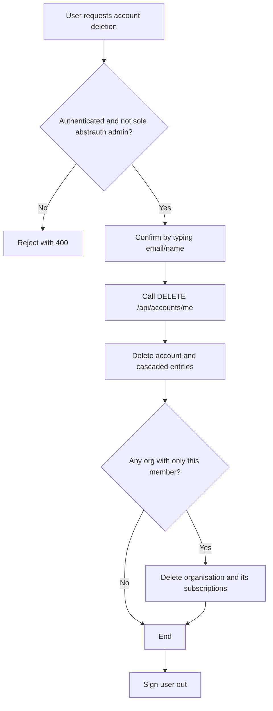

# GDPR / Swiss FADP Design

This document records the data-protection design decisions for Abstratium Abstrauth, focusing on the rights to access and erasure under the EU GDPR and the Swiss FADP.

## Scope

The system stores the following categories of personal data:

- Account identity: email, name, profile picture, auth provider.
- Credentials: native username/password hash, lock status, failed login attempts.
- Roles: per-client, per-organisation role assignments.
- Federated identities: external provider user ids, emails, connection timestamps.
- Organisation membership: roles such as member/owner in `T_organisation_accounts`.
- Audit history: Envers revision rows in `*_AUD` tables, including deletion records.

OAuth clients and client secrets are owned by the organisation, not by an individual user. They are not deleted when a single user deletes their account.

## Decisions

1. **Account deletion is a cross-tenant operation.** A user's account, roles, credentials, federated identities and organisation memberships span all organisations they belong to. Deletion is performed through `NonMultitenancyAccountService.deleteAccountWithCascade()` so that no tenant-owned data is left behind.

2. **Organisation memberships are deleted with the account.** `T_organisation_accounts` rows are now removed via JPA `CascadeType.REMOVE` on both the `Account` and `NonMultitenancyAccount` entities.

3. **Transient OAuth data is handled by database cascades.** `T_authorisation_codes` and `T_revoked_tokens` retain `ON DELETE CASCADE` foreign keys and are removed automatically when the account is deleted. This is acceptable because these tables are explicitly excluded from Envers auditing.

4. **Ownership references are removed before implementing deletion.** The columns `T_oauth_client_secrets.account_id` and `T_organisations.created_by_account_id` have been dropped. Client secrets and organisations belong to the organisation, not to the user, so they are not deleted on account deletion.

5. **Single-member organisations are deleted.** If deleting an account leaves an organisation with no remaining members, the organisation is also deleted. This is necessary because the organisation name and metadata are not personal data in a multi-member context, but for a single-person organisation they effectively identify the user.

6. **Audit data is retained for a fixed period, then deleted.** We do not anonymise Envers rows. Instead, we keep the full audit history for a configurable number of days (default: 90 days) and then delete it permanently. The legal basis for this retention is a documented **legitimate interest assessment** (LIA) covering security, abuse investigation and operational accountability. See the LIA section below for the approved assessment.

## Deletion Policy

### When a user deletes their own account

The following data is deleted:

- The `T_accounts` row.
- All `T_account_roles` rows for the account.
- All `T_credentials` rows for the account.
- All `T_federated_identities` rows for the account.
- All `T_organisation_accounts` rows for the account.
- All `T_authorisation_requests` rows for the account (manual deletion, no FK).
- All `T_authorisation_codes` rows for the account (DB cascade).
- All `T_revoked_tokens` rows linked to those authorization codes (DB cascade).
- Any organisation where the account was the sole member.

The following data is **not** deleted:

- OAuth clients and their secrets (owned by the organisation).
- Organisations that still have other members.
- Subscriptions of remaining organisations.
- Audit history rows in `*_AUD` tables (handled separately by the retention job).

### Last-admin safeguard

The account deletion endpoint keeps the existing safeguard: an account that has the only `ADMIN` role for the `abstratium-abstrauth` client cannot be deleted. This protects the system from becoming unmanageable.

### Audit retention

All `*_AUD` rows older than the configured retention period are deleted by a scheduled job. The retention period is:

- Configurable via `application.properties` using `abstrauth.audit.retention.days` (default 90 days, overridable via the `ABSTRAUTH_AUDIT_RETENTION_DAYS` environment variable).
- Applied uniformly across all Envers audit tables and orphaned `REVINFO` rows.
- Logged when the purge runs, including the number of rows deleted and the retention period used.
- Displayed on the public `/public/config` endpoint and shown to users on the legal/privacy page.

The purge schedule runs daily.

## Right of Access (view my data)

Before deleting their account, a user must be able to query all personal data the system holds about them. This is the GDPR/FADP **right of access**.

### Data to include

The response should contain everything that identifies the user, including:

- Account profile: email, name, profile picture, email verified status, auth provider, created at timestamp.
- Credentials: username, password hash, failed login attempts, locked until timestamp.
- Roles: every `T_account_roles` row for the account, including client and organisation context.
- Federated identities: provider, provider user id, email, connected at timestamp.
- Organisation memberships: every `T_organisation_accounts` row, including the org id and role.
- Pending and historical OAuth data: active `T_authorisation_requests` and `T_authorisation_codes` rows for the account (optional, since these are transient and expire quickly).
- Audit history: Envers revision rows from `T_accounts_AUD`, `T_credentials_AUD`, `T_account_roles_AUD`, `T_federated_identities_AUD` and `T_organisation_accounts_AUD` for the account (within the current retention period).

### How the data should be fetched

Because the account, roles, and memberships may span multiple organisations, the query must be **cross-tenant**. The backend should use the non-multitenancy entities (`NonMultitenancyAccount`, `NonMultitenancyCredential`, `NonMultitenancyAccountRole`, `NonMultitenancyFederatedIdentity`, `NonMultitenancyOrganisationAccount`) or a dedicated non-multitenancy service to collect all rows for the authenticated account, regardless of the tenant context derived from the current JWT.

Suggested endpoints:

- `GET /api/accounts/me/data` — returns a structured JSON object grouped by data category.
- `GET /api/accounts/me/data/export` — returns the same data as a downloadable JSON file, with a `Content-Disposition: attachment` header, for portability.

The UI should provide a **"View my data"** page that calls `GET /api/accounts/me/data` and renders the categories clearly, and a **"Download my data"** button that calls the export endpoint.

## User Flow

## Implementation Tasks

The work is split into independent features that can be implemented, reviewed, and tested one at a time.

### Feature 1: Self-service account deletion

- [x] Add backend endpoint `DELETE /api/accounts/me` for self-service account deletion.
- [x] Extend `NonMultitenancyAccountService.deleteAccountWithCascade()` to delete single-member organisations.
- [x] Add backend and integration tests for the full deletion cascade.
- [x] Add tests for the single-member organisation deletion path.
- [x] Add UI dialog for self-deletion with confirmation.
- [x] Sign the user out of the UI after successful self-deletion.

### Feature 2: Harder deletion confirmation for accounts and roles

Confirmation is enforced in the UI only (no backend changes). The existing confirm dialog is extended with a typed-phrase input; the confirm button is disabled until the phrase matches exactly.

- [x] Extend `ConfirmDialogService` / `ConfirmDialogConfig` with an optional `requiredPhrase` field.
- [x] Extend `ConfirmDialogComponent` to render a text input and disable the confirm button until the phrase matches.
- [x] Self-deletion on the `/user` page requires the user to type their email address.
- [x] Self-deletion button on the Accounts page requires the user to type their email address.
- [x] Administrator account deletion requires the user to type the target account's email.
- [x] Role deletion requires the user to type the role name.
- [x] Update Angular unit tests to cover the new typed-phrase requirement.
- [x] Update e2e tests to type the required phrase before confirming deletion.

### Feature 3: Right of access (view my data)

- [x] Add backend endpoint to view all personal data of the authenticated user (`GET /api/accounts/me/data`).
- [x] Add backend endpoint to download/export personal data in a machine-readable format (`GET /api/accounts/me/data/export`).
- [x] Add backend tests for the right of access endpoint and the export endpoint.
- [x] Add UI page for "view my data" (extend route `/user` so that the certificate data can be expanded and isn't the main point of the page).
- [x] Add "Download my data" button to the view-my-data page.
- [x] Update the Angular controller to call the new backend endpoints (data view, export, self-delete).

### Feature 4: Audit retention and purge

- [x] Add configuration property `abstrauth.audit.retention.days` with a sensible default (e.g. 90 days).
- [x] Periodically remove all audit data that is older than X days, where X is configurable via an environment variable or `application.properties` entry.
- [x] Add periodic scheduler to delete `*_AUD` rows older than the configured retention period.
- [x] Decide and document the audit purge schedule (e.g. daily at 03:00 UTC).
- [x] Log each purge run, including the number of rows deleted and the retention period used.
- [x] Clean up orphaned `REVINFO` rows that no longer reference any audit table.
- [x] Add tests for the audit retention purge.

### Feature 5: Documentation and legal approval

- [x] Document the legitimate interest assessment (LIA) for audit retention and obtain DPO/legal approval.
- [x] Update the user-facing legal/privacy page to display the currently configured retention period and the user's rights.
- [x] Update user-facing privacy documentation to state the retention periods and deletion rights.

## Legitimate Interest Assessment (LIA) for audit retention

### Purpose of processing

Abstrauth maintains an audit trail of changes to personal data so that we can:

1. Investigate security incidents, unauthorised access, and abuse.
2. Reconstruct the state of an account before and after a change for operational troubleshooting.
3. Demonstrate compliance with internal policies and regulatory obligations to data protection authorities.

### Data categories retained

The audit trail contains Envers revision rows for the following tables:

- `T_accounts_AUD` — changes to account profile data (name, e-mail, picture, verified status).
- `T_credentials_AUD` — changes to authentication credentials and lock status.
- `T_account_roles_AUD` — changes to role assignments.
- `T_federated_identities_AUD` — changes to federated login references.
- `T_organisation_accounts_AUD` — changes to organisation membership and ownership.

Each row includes the revision timestamp, the acting user or correlation id, the change type, and the historical values of the affected columns.

### Legal basis

The legal basis for retaining this audit history is **legitimate interest** (Art. 6(1)(f) GDPR; Art. 31(1) revDSG). The legitimate interests are:

- **Security and integrity of the authentication service:** audit records are necessary to detect and investigate attacks, credential misuse, and privilege escalation.
- **Operational accountability:** the records allow us to understand what happened during an incident and to verify that the system behaves as intended.
- **Regulatory defence:** the records provide evidence that we process personal data responsibly and can respond to supervisory authority enquiries.

### Necessity and proportionality

- **Why not anonymise?** Anonymised audit rows would prevent us from identifying the actor or the affected account during an investigation, which would defeat the purpose of security and abuse detection.
- **Why 90 days?** This period is long enough to cover the typical detection and response window for security incidents and abuse patterns, while limiting the impact on the data subject's right to erasure. It is the default and can be configured per installation.
- **Can the period be shorter?** A shorter period would reduce the window available for incident investigation and could prevent us from reconstructing relevant events. Operators may configure a different value based on their own risk assessment.
- **Can users request earlier deletion?** No. Because the audit trail is needed to protect the service and other users, individual requests to delete audit history before the retention period expires are not honoured. The right to erasure under GDPR Art. 17(3)(b) is restricted where processing is necessary for the establishment, exercise, or defence of legal claims, and the legitimate interest assessment supports this position.

### Safeguards

- Audit data is retained only for the configured period, after which it is permanently deleted by an automated purge job.
- Orphaned `REVINFO` rows that no longer reference any audit table are removed during the same purge run.
- The purge job logs the number of rows deleted and the retention period used, creating an auditable record of deletion.
- Access to audit data is restricted to authenticated administrators with appropriate roles.
- The retention period is published on the user-facing legal page so that data subjects are informed.

### DPO / legal approval

This LIA must be reviewed and approved by the Data Protection Officer (DPO), or by an external legal advisor if no DPO has been appointed. The approver must confirm that:

1. The legitimate interests described above are real and not overridden by the rights and freedoms of data subjects.
2. The chosen retention period is no longer than necessary for the stated purposes.
3. No less intrusive means of achieving the same purpose is reasonably available.
4. The approved assessment is stored with the project records and reviewed periodically or whenever the retention period or audit scope changes.

The audit purge feature is released to production only after this LIA has been approved and recorded.

## Questions and Answers

- Exact retention period for audit data -> default: 90 days, configurable per installation via environment variable.
- Whether a user can request earlier deletion of their audit history, overriding the legitimate interest retention. -> no.
- Whether the right of access should include audit history for the requesting user only. -> no not automatically, but could be requested manually.
