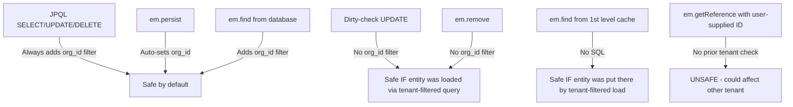

# Hibernate Discriminator-Based Multi-Tenancy

How Hibernate ORM applies tenant isolation when configured with `quarkus.hibernate-orm.multitenant=DISCRIMINATOR`.

## Configuration

```properties
quarkus.hibernate-orm.multitenant=DISCRIMINATOR
```

The entity declares a tenant discriminator column using `@TenantId`:

```java
@Entity
@Table(name = "T_oauth_clients")
public class OAuthClient {

    @Id
    @Column(length = 36)
    private String id;

    @TenantId
    @Column(name = "org_id", length = 36)
    private String orgId;

    // other fields...
}
```

A `TenantResolver` provides the tenant ID for each request:

```java
@PersistenceUnitExtension
@RequestScoped
public class JwtOrgResolver implements TenantResolver {

    @Override
    public String resolveTenantId() {
        // Extract orgId from the JWT Bearer token
        // Falls back to DEFAULT_ORG_ID when no token is present
    }
}
```

## What Hibernate Does Automatically

### INSERT — `org_id` is auto-populated

**Java:**
```java
em.persist(client);
```

**Generated SQL:**
```sql
insert into T_oauth_clients
    (allowed_scopes, auto_subscribe, client_id, client_name, client_type,
     created_at, org_id, redirect_uris, require_pkce, id)
values (?, ?, ?, ?, ?, ?, ?, ?, ?, ?)
```

The `org_id` value is set automatically from the resolved tenant — you never set it in code.

---

### em.find() — `org_id` filter added automatically (when hitting database)

**Java:**
```java
em.clear(); // Clear persistence context to force DB round-trip
OAuthClient found = em.find(OAuthClient.class, id);
```

**Generated SQL:**
```sql
select oc1_0.id, oc1_0.allowed_scopes, oc1_0.auto_subscribe, oc1_0.client_id,
       oc1_0.client_name, oc1_0.client_type, oc1_0.created_at, oc1_0.org_id,
       oc1_0.redirect_uris, oc1_0.require_pkce
from T_oauth_clients oc1_0
where oc1_0.id = ?
  and oc1_0.org_id = ?
```

Hibernate appends `org_id = ?` to the WHERE clause when `em.find()` hits the database.

**Note:** If the entity is already in the persistence context (1st level cache), no SQL is emitted—Hibernate returns the cached entity directly.

---

### JPQL SELECT — `org_id` filter added automatically

**Java:**
```java
em.createQuery("SELECT c FROM OAuthClient c WHERE c.id = :id", OAuthClient.class)
    .setParameter("id", id)
    .getResultList();
```

**Generated SQL:**
```sql
select oc1_0.id, oc1_0.allowed_scopes, oc1_0.auto_subscribe, oc1_0.client_id,
       oc1_0.client_name, oc1_0.client_type, oc1_0.created_at, oc1_0.org_id,
       oc1_0.redirect_uris, oc1_0.require_pkce
from T_oauth_clients oc1_0
where oc1_0.org_id = ?
  and oc1_0.id = ?
```

Hibernate prepends `org_id = ?` to the WHERE clause.

---

### JPQL UPDATE — `org_id` filter added automatically

**Java:**
```java
em.createQuery("UPDATE OAuthClient c SET c.clientName = :name WHERE c.id = :id")
    .setParameter("name", "New Name")
    .setParameter("id", id)
    .executeUpdate();
```

**Generated SQL:**
```sql
update T_oauth_clients oc1_0
set client_name = ?
where oc1_0.id = ?
  and oc1_0.org_id = ?
```

---

### JPQL DELETE — `org_id` filter added automatically

**Java:**
```java
em.createQuery("DELETE FROM OAuthClient c WHERE c.id = :id")
    .setParameter("id", id)
    .executeUpdate();
```

**Generated SQL:**
```sql
delete from T_oauth_clients oc1_0
where oc1_0.id = ?
  and oc1_0.org_id = ?
```

---

## What Hibernate Does NOT Filter

### Dirty-check UPDATE (modify entity + flush)

**Java:**
```java
OAuthClient found = em.find(OAuthClient.class, id);
found.setClientName("Updated Name");
em.flush();
```

**Generated SQL:**
```sql
update T_oauth_clients
set allowed_scopes=?, auto_subscribe=?, client_id=?, client_name=?,
    client_type=?, created_at=?, redirect_uris=?, require_pkce=?
where id=?
```

**No `org_id` in the WHERE clause.** Hibernate considers the entity already tenant-validated because it was loaded through a tenant-filtered operation.

---

### em.remove (delete managed entity)

**Java:**
```java
OAuthClient toDelete = em.find(OAuthClient.class, id);
em.remove(toDelete);
em.flush();
```

**Generated SQL:**
```sql
delete from T_oauth_clients
where id=?
```

**No `org_id` in the WHERE clause.** Same reasoning — the entity was already loaded in a tenant context.

---

### em.find (when entity is already in persistence context)

**Java:**
```java
em.persist(client); // entity now in persistence context
em.flush();
OAuthClient found = em.find(OAuthClient.class, id); // no SQL emitted
```

No SQL generated — Hibernate returns the entity from its first-level cache. The tenant filter is not applied because no database query occurs.

---

## Security Implications



**Safe in practice** because:
1. You can only obtain a managed entity through a tenant-filtered SELECT (`em.find` from DB, JPQL) or by persisting it yourself
2. An attacker cannot inject a cross-tenant entity into the persistence context through normal JPA operations

**Potential risk** if you:
- Use `em.getReference(id)` with an ID from user input without a prior tenant-filtered load
- Manually set an entity's ID from external input and call `em.merge()`
- Call `em.find()` on an entity that was previously loaded into the persistence context by a different tenant (rare edge case)

**Mitigation:** Prefer JPQL for UPDATE and DELETE operations, which always include the tenant filter. Alternatively, always load entities via `em.find` or a JPQL query before mutating them.
