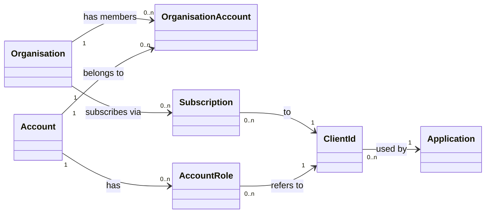
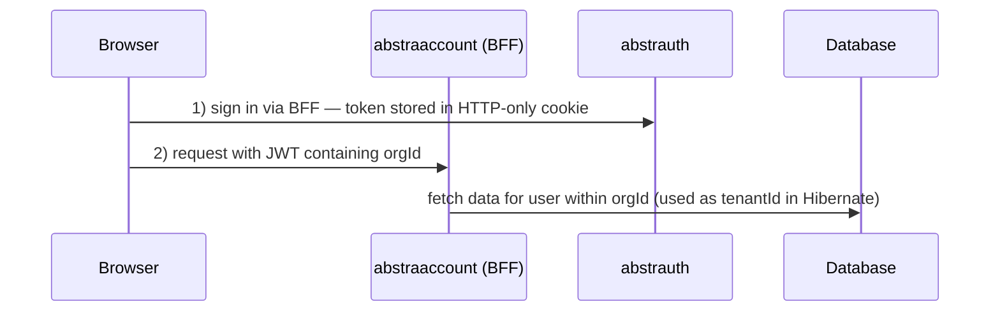
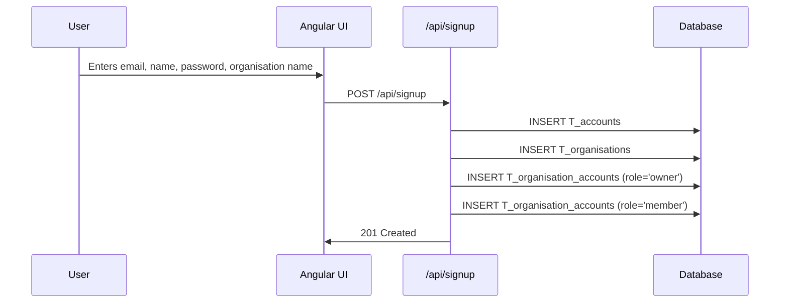

# Multitenancy Design

## Overview

Data isolation uses Hibernate ORM's **discriminator approach**: shared tables with an `org_id` column that discriminates rows at query level. The current organisation is resolved from an `orgId` claim in the signed JWT.

**The `orgId` in a JWT is what downstream applications call `tenantId`.** No separate "tenant" concept exists — the organisation *is* the tenant.

Accounts, credentials, and federated identities are **global** (not scoped to an organisation). A user has one account and belongs to one or more organisations.

## Domain Model



- **`Organisation`** — the billing and membership unit. Has 1..n administrators and 1..m members. Admins control membership.
- **`Account`** — a user's login identity. Belongs to one or more organisations. When someone first registers with abstrauth, an organisation is automatically created; the account becomes both owner and member.
- **`Subscription`** — links an organisation to an application (via `clientId`). Its existence grants the org access to the application.
- **`ClientId`** — represents an application registered in abstrauth. A client can be **private** (`publik = false`, only the owning org can subscribe) or **public** (`publik = true`, any org can subscribe).
- **`AccountRole`** (entity: `T_account_roles`) — models "client & role": an account is assigned roles per `clientId`. These rows are the sole source of truth for roles placed in the JWT `groups` claim at sign-in time. For public clients the backend enforces that every assigned role appears in `T_client_allowed_roles`; for private (own-org) clients roles are free text.

## Runtime Flow



The `orgId` claim in the JWT is used directly as the Hibernate discriminator value (`org_id` column); services call it `tenantId` because that is what Hibernate calls it.

## Database

### New Table: `T_organisations`

Models a named organisation — the billing and membership unit; its `id` is the discriminator value used as `tenantId` downstream. (Could also one day be linked to domains which users validate by setting DNS TXT records, making signing in automatically link a user to an organisation.)

| Column | Type | Description |
|--------|------|-------------|
| `id` | VARCHAR(36) PK | UUID |
| `name` | VARCHAR(255) | Organisation name |
| `created_by_account_id` | VARCHAR(36) FK | References `T_accounts.id` — SET NULL on delete |
| `created_at` | TIMESTAMP | Creation timestamp |

### New Table: `T_organisation_accounts`

Join table linking accounts to organisations with a role (`owner` or `member`); an account can hold one or both roles per organisation.

| Column | Type | Description |
|--------|------|-------------|
| `org_id` | VARCHAR(36) PK/FK | References `T_organisations.id` |
| `account_id` | VARCHAR(36) PK/FK | References `T_accounts.id` — CASCADE delete |
| `role` | VARCHAR(50) PK | `owner` or `member` |
| `added_at` | TIMESTAMP | When the account was linked |

### New Table: `T_subscriptions`

Models an organisation's subscription to an application. Its existence means the org has access.

| Column | Type | Description |
|--------|------|-------------|
| `id` | VARCHAR(36) PK | UUID |
| `org_id` | VARCHAR(36) FK | References `T_organisations.id` |
| `client_id` | VARCHAR(255) FK | References `T_oauth_clients.client_id` |
| `created_at` | TIMESTAMP | Creation timestamp |

### New Table: `T_client_allowed_roles`

Declares which roles a public client permits subscribing organisations to assign to their users. The client owner populates this; subscribing orgs may only choose from it, preventing privilege escalation.

| Column | Type | Description |
|--------|------|-------------|
| `client_id` | VARCHAR(255) PK/FK | References `T_oauth_clients.client_id` |
| `role` | VARCHAR(100) PK | Role name that subscribing orgs may use |
| `is_default` | BOOLEAN | If true, this role is automatically assigned to new users on first sign-in |

### Modified Tables

Organisation-scoped (receive `org_id` VARCHAR(36) column) and JPA entities use @TenantId:
- `T_oauth_clients` — also has `auto_subscribe BOOLEAN` (whether subscriptions are created automatically on first sign-in) and `publik BOOLEAN` (whether third-party organisations may subscribe at all)
- `T_account_roles`
- `T_oauth_client_secrets`
- `T_service_account_roles`

Global (no `org_id`):
- `T_accounts`, `T_credentials`, `T_federated_identities`

Not scoped (no `org_id`):
- `T_authorization_requests` — org unknown before authentication
- `T_authorization_codes` — looked up by unguessable short-lived code value
- `T_revoked_tokens` — looked up by globally unique JTI (id of token)

A non-unique index on `org_id` is added to each scoped table to support efficient discriminator filtering — without it, every query would require a full table scan. Named `I_{table}_org_id` (e.g. `I_oauth_clients_org_id`).


## Organisation Resolution

### JWT Claim

```java
// TokenResource.java
jwtBuilder.claim("orgId", orgId)
```

Both `access_token` and `id_token` include the claim. Downstream applications may treat this value as their `tenantId`.

### Hibernate Discriminator Configuration

```properties
# application.properties
quarkus.hibernate-orm.multitenant=DISCRIMINATOR
```

### Org Resolver

```java
@RequestScoped
public class JwtOrgResolver implements TenantResolver {
    @Override
    public String getDefaultTenantId() {
        return "default";
    }

    @Override
    public String resolveTenantId() {
        // Extract JWT from Authorization header or OIDC cookie
        // Parse and return orgId claim
    }
}
```

### Entity Annotation

Organisation-scoped entities receive a `@TenantId` field. Global entities (`Account`, `Credential`, `FederatedIdentity`) do not.

```java
@Entity
public class OAuthClient {
    @TenantId
    @Column(name = "org_id")
    private String orgId;
}
```

Hibernate automatically appends `org_id = ?` to SELECT/UPDATE/DELETE by primary key and sets it on INSERT.

### Bulk Operations Limitation

`@TenantId` does **not** filter bulk JPQL/Criteria UPDATE or DELETE. A bulk operation can affect rows from other organisations.

**Never use JPQL/Criteria bulk UPDATE or DELETE on organisation-scoped entities.** Use per-row operations on loaded entities instead. Neither MySQL nor H2 supports native Row-Level Security.

## Subscriptions

Organisations subscribe to applications. A subscription links an `org_id` to a `client_id` and governs which roles the org's users may hold for that application.

- **Automatic subscription**: enabled by an `auto_subscribe` flag on the client (defaults to `false`). When enabled and a user signs in from a client whose org does not yet have a subscription, abstrauth creates the subscription automatically. If `auto_subscribe` is `false` and no subscription exists, sign-in is denied with "no subscription" error.
- **Private clients** (`publik = false`): only the owning organisation may subscribe. Useful when an org creates its own application backed by abstrauth.
- **Public clients** (`publik = true`): any organisation may subscribe. The client owner declares assignable roles and their defaults via `T_client_allowed_roles`.
- **Unsubscribe**: an org can unsubscribe, which revokes all user access to the application.
- **Billing vs subscriptions**: subscriptions govern access rights. Billing is related to contracts — a separate concern.

> Idea for the future: if automatic subscription is disabled, users could request a subscription and an admin could approve it (similar to the Microsoft approval flow).

## User Flows

### First Signup



### Sign In

```mermaid
sequenceDiagram
    participant U as User
    participant UI as Angular UI
    participant AS as abstrauth
    participant BFF as Quarkus BFF

    U->>UI: Clicks Sign In
    UI->>BFF: Navigate to /authorize
    BFF->>AS: Initiate OIDC flow
    AS->>UI: 302 Redirect to /signin/{requestId}

    alt Native Authentication
        UI->>AS: POST /oauth2/authorize/authenticate
        UI->>AS: POST /oauth2/authorize (consent)
    else Federated Authentication
        UI->>AS: GET /oauth2/federated/{provider}?request_id=...
        AS-->>UI: callback after provider redirect
    end

    AS->>AS: Query account's organisations
    alt Multiple Organisations
        AS->>UI: 302 Redirect to /org-selection/{requestId}
        UI->>UI: Pre-select lastOrgId from localStorage
        U->>UI: Confirms or changes organisation
        UI->>AS: POST /org-selection (org_id)
        AS->>AS: Store orgId on AuthorizationRequest
    else Single Organisation
        AS->>AS: Store sole orgId on AuthorizationRequest
    end

    AS->>AS: Check subscription; seed AccountRole rows from client default roles if first access
    AS->>BFF: 302 Redirect to /api/auth/callback?code=...&state=...
    BFF->>AS: POST /oauth2/token (code)
    AS->>AS: Load AuthorizationRequest, verify membership, generate JWT with orgId claim from loaded request
    AS->>BFF: 200 OK + Tokens
    BFF->>BFF: Encrypt token into HTTP-only cookie
    BFF->>UI: 302 Redirect to /
    UI->>UI: Store lastOrgId in localStorage
```

After authentication, if the account belongs to multiple organisations, the user selects one. The `lastOrgId` from `localStorage` is used to select the default in the UI. Roles in the JWT come from `AccountRole` rows for that account and clientId combination; on first access those rows are seeded from the client's default roles (roles marked `is_default` in `T_client_allowed_roles`). There is no token switching — to work under a different organisation the user signs out and back in.

### User Invited to an Organisation

When a user is invited, an org owner creates `T_organisation_accounts` rows for them and optionally pre-assigns `AccountRole` entries for the relevant `clientId`(s). The client's default roles are also seeded, regardless of any additional roles the org owner assigns.

### Creating a Private Application

1. User creates a new `clientId` in abstrauth (generates client secret).
2. Client is created with `publik = false` (default).
3. A subscription from the owning org to that client is created automatically at creation time (`ClientsResource.createClient` calls `SubscriptionService.subscribe`).
4. No other organisation can subscribe to it.

### Creating a Public Application

Same as above, but the client is created with `publik = true` and the owner populates `T_client_allowed_roles` with the roles subscribing orgs may assign. Other organisations can then subscribe and choose from that list.

## Roles and Access Control

### Summary

| Role | Scope | Can do |
|------|-------|--------|
| `member` (org) | Per org | Sign in under that org; access org-scoped data |
| `owner` (org) | Per org | Add/remove members; manage subscriptions; assign roles to users from the client's allowlist |
| `Roles.MANAGE_ACCOUNTS` | Per clientId | Manage accounts of their own org for the signed-in org |
| `Roles.MANAGE_CLIENTS` | Per clientId | Manage clients of their own org for the signed-in org |
| `Roles.ADMIN` | Global | Access all orgs' data via non-`@TenantId` entities; abstratium support use only |

`owner` does **not** imply `MANAGE_ACCOUNTS` or `MANAGE_CLIENTS` — those are separate `AccountRole` assignments. An org owner will typically also hold those roles, but they are distinct.

### Automatic role seeding

When a user signs in to an application for the first time (no `AccountRole` rows exist for that account and clientId combination), abstrauth copies the client's default roles (rows in `T_client_allowed_roles` where `is_default = true`) into new `AccountRole` rows. Subsequent sign-ins just read the existing rows, so roles can be adjusted per-user after initial assignment.

### Role allowlist for public clients

A public client owner populates `T_client_allowed_roles` (marking some as `is_default`). When an org owner assigns roles to individual users, abstrauth enforces that every role name is in that allowlist — server-side. The UI presents a select element, never free text. This prevents an org owner from granting `abstratium-abstrauth_admin` to their users by subscribing to abstrauth. The backend enforces this during validation prior to saving the data.

Users who want to assign roles to other users can choose from any client that is in the subscriptions within their organisation. They can assign roles to users who are in their organisation.

### Global `ADMIN` access

Accounts holding `abstratium-abstrauth_admin` access data across all organisations via a dedicated `admin` package of JPA entities that omit `@TenantId`, bypassing the discriminator. For abstratium support staff only.

### General Notes

Users who are owners of organisations can see all the data within their organisations, but must 
sign in using the organisation that they want to manage.

Members of organisations can choose the orgId of such orgs when they sign in, if they are a member of more than one, otherwise the one and only org they are members of is used for the token.

Owners of organisations can administer the organisation by adding/removing accounts to/from 
the organisation, if they chose that organisation when they signed in. They cannot manage accounts/clients of the organisation unless they also have an AccountRole for that (MANAGE_ACCOUNTS or MANAGE_CLIENTS).

Owners of organisations also manage subscriptions so that they decide which applications 
(clients) the organisations users may use.


## Requirements

### Data Access by Role

Org membership roles (`owner`, `member`) come from `T_organisation_accounts` and are checked programatically. Application roles (`user`, `manage-accounts`, `manage-clients`, `admin`) are `AccountRole` values for `client_id = 'abstratium-abstrauth'` and are emitted in the JWT `groups` claim and checked using RBAC (implemented with `@RolesAllowed` in the backend).

| Entity | Reading requires | Writing requires |
|--------|------|-------|
| `T_organisations` | `user` + org `member` (own orgs only) | Create: `user` so that users can create their own organisations; Update/delete members: `user` + org `owner` |
| `T_organisation_accounts` | `user` + org `member` (own orgs only) | Add/remove: `user` + org `owner` |
| `T_subscriptions` | `user` + org `member` (own org's subscriptions) | Add/remove: `user` + org `owner` |
| `T_accounts` | `manage-accounts` (members of own org only) | Create: public (signup); Update/delete: `manage-accounts` |
| `T_account_roles` | `manage-accounts` (own org) or `user` (own roles via token) | Add/remove: `manage-accounts`; role must be in client's allowlist or client must be private |
| `T_oauth_clients` | List: `user` — own org's clients (always visible) plus cross-org subscribed clients; Detail: `manage-clients` | Create/update/delete: `manage-clients` (subscription to owning org created automatically on create) |
| `T_oauth_client_secrets` | `manage-clients` (own org only) | Create/revoke/delete: `manage-clients` |
| `T_client_allowed_roles` | `user` + org `member` (own org's clients only) | Managed by `manage-clients` of the org that owns the client |

**Notes:**
- `admin` (`abstratium-abstrauth_admin`) bypasses org scoping and can read/write all of the above across all organisations via non-`@TenantId` entities.
- "Own org" means the `orgId` in the caller's JWT must match the `org_id` of the data row (enforced by Hibernate discriminator or explicit `isMember` check).
- `T_account_roles` write additionally requires: the target account is a member of the caller's org; the role is in the client's `T_client_allowed_roles` if the client is public.

### Role Assignment Rules

Roles are assigned to accounts in the following circumstances:

| Scenario | Roles Assigned | Mechanism |
|----------|---------------|-----------|
| **New user registers** (signup) | `user` + `manage-accounts` + `manage-clients` (if org owner) + `admin` (if first account ever) | `AccountService.addAbstrauthRoles()` assigns all abstrauth roles based on ownership status |
| **Account created by existing user** (via `/api/accounts`) | `user` for abstrauth only (at creation time) | `addAbstrauthRoles()` assigns `user` role immediately. Roles for other subscribed clients are assigned on first sign-in to each client. |
| **User signs in to a non-abstrauth client** | Only default roles (`is_default = true` from `T_client_allowed_roles`) | `TokenResource` seeds default roles on first access if no roles exist for account+client+org |
| **User creates new organisation** | `manage-accounts` + `manage-clients` for abstrauth client | `OrganisationsResource.createOrganisation()` assigns management roles so owner can manage their org |

Note: if an org owner adds another member as an owner, they do not automatically get the abstrauth management roles, those need to be added manually by the original org owner.

#### Use Case: Application with User and Management Roles

Consider a client (application) registered in abstrauth with these allowed roles:
- `user` (marked as `is_default = true`) — allows basic application access
- `manager` (marked as `is_default = false`) — allows managing data within the user's org

**When a user signs in to this application:**
1. If they have no existing roles for this client in their org, they receive only the `user` role automatically
2. The org owner (who already has `manage-accounts` role for abstrauth) can assign the `manager` role to specific users via the accounts UI
3. Only users explicitly granted `manager` can manage data within their org in that application

This design ensures:
- New users get basic access automatically via default roles
- Management privileges require explicit assignment by the org owner
- Data isolation is maintained — users can only manage data within their own organisation
- The application owner (who defines `T_client_allowed_roles`) controls which roles exist, but org owners control which users hold those roles

### Brain Dump from Ant 20260607

- `T_oauth_clients` - abstrauth lives here by default. These belong to an organisation. Users with the `abstratum-abstrauth_manage-clients` `AccountRole` (in `T_account_roles`) can manage these clients. They can be public, in which case other organisations can subscribe to them. They can be auto-subscribed by setting that property in which case all users that sign in are given the default allowed roles (see `T_client_allowed_roles`). A client is almost a synonym for an application.
- `T_oauth_client_secrets` - OAuth client secrets are required so that an application can forward a user to abstrauth for them to sign into the client (application).
- `T_accounts` - Users sign up themselves, or an admin/org owner creates an account for them via the accounts API, which automatically adds the new account to the caller's org (taken from the caller's JWT `orgId` claim). The first account created in abstrauth automatically receives the `admin` role and can manage other users.
- `T_account_roles` - These roles are added to the JWT that a user gets when they sign in and are used by abstrauth and other applications to do RBAC. In Quarkus that is done using the `@RolesAllowed` annotation. Roles are added to accounts, for existing clients. The client choice is all the clients belonging to the org as well as all the clients that the org subscribes to. The roles that the user can choose are either free text for clients within the org, or from the `T_client_allowed_roles` for clients which the users org is subscribed to.
- `T_organisations` - Every user that signs in is added to their own organisation, except for the very first user that signs in, who is added to just the `rename-me` org. Users can always create new organisations, and become the org owner when they do that. Membership of an organisation is stored in `T_organisation_accounts`. Org owners can also manage subscriptions to public clients, so that their users can use those applications.
- `T_organisation_accounts` - Stores the membership of accounts to organisations. Roles are either `owner` or `member`. Everyone in the org is a `member` and some of the people in an org are also `owner`s.
- `T_subscriptions` - When a user signs in to a public client, abstrauth checks that their organisation has a subscription to the application. If not, one is created if the client allows auto-subscription. Org owners can manage subscriptions to applications. They can also set their org to not auto-subscribe.
- `T_client_allowed_roles` - A list of roles that can be added to `T_account_roles` by org owners who are managing public clients that do not belong to their org.

## Non-Multitenancy Package (`non_multitenancy`)

The `src/main/java/dev/abstratium/abstrauth/non_multitenancy` package contains entity classes and services that **bypass Hibernate's discriminator-based multitenancy** (they do not use the `@TenantId` annotation). This separation is critical for maintaining security boundaries while enabling specific cross-tenant operations.

### When Non-Multitenancy Entities Are Used

| Scenario | Entity/Service Used | Reason |
|----------|---------------------|--------|
| **Account creation & initial role assignment** | `NonMultitenancyAccountRoleService.addRole()` | During signup, no JWT exists yet, so `JwtOrgResolver` cannot determine the tenant. Roles must be persisted with an explicit `orgId` before the session is bound to a tenant. |
| **Token generation (access/id tokens)** | `NonMultitenancyAccountRoleService.findRolesByAccountIdAndClientIdAndOrgId()` | When generating tokens, the `orgId` comes from the `AuthorizationRequest` (not the JWT), so queries must bypass the discriminator to fetch roles for the correct org. |
| **Cross-org public client access** | `NonMultitenancyOAuthClientService.findAllByClientIds()` | Users can view public clients owned by other orgs that their org subscribes to. The `@TenantId` discriminator would filter these out. |
| **Subscription checking during auth** | `NonMultitenancySubscriptionService.ensureSubscribed()` | During the authorization flow (before token issuance), subscriptions must be queried/created without a tenant context. |
| **Reading allowed roles for public clients** | `NonMultitenancyOAuthClientService` (via `ClientsResource`) | When listing allowed roles for a subscribed public client, the client may belong to another org. |

### Package Structure

```
non_multitenancy/
├── boundary/                              # Cross-tenant REST endpoints
│   ├── NonMultitenancyClientsResource.java       # List own-org + subscribed cross-org clients; allowed-roles
│   └── NonMultitenancyOrganisationsResource.java # Create org with initial role assignment (bypasses discriminator)
├── entity/
│   ├── NonMultitenancyAccountRole.java    # T_account_roles without @TenantId
│   ├── NonMultitenancyOAuthClient.java    # T_oauth_clients without @TenantId
│   └── NonMultitenancySubscription.java   # T_subscriptions without @TenantId
└── service/
    ├── NonMultitenancyAccountRoleService.java    # addRole(), findRolesByAccountIdAndClientIdAndOrgId()
    ├── NonMultitenancyOAuthClientService.java    # findAllByClientIds()
    └── NonMultitenancySubscriptionService.java   # ensureSubscribed(), findNonMultitenancySubscription()
```

### Security Considerations

- **Cross-tenant calls are isolated to this package** - All code that bypasses the tenant discriminator is contained within `non_multitenancy`, making it easier to audit and maintain.
- **Explicit orgId required** - All service methods require an explicit `orgId` parameter; they never rely on the `JwtOrgResolver` implicit tenant context.
- **ADMIN role still required for global access** - The `admin` role (`abstratium-abstrauth_admin`) uses these entities but still requires explicit role checks via `@RolesAllowed`.

### Callers of Non-Multitenancy Services

| Caller | Service Method Used | Context |
|--------|---------------------|---------|
| `AccountService.addAbstrauthRoles()` | `NonMultitenancyAccountRoleService.addRole()` | During account creation to assign initial roles |
| `TokenResource.generateAccessToken()` | `NonMultitenancyAccountRoleService.findRolesByAccountIdAndClientIdAndOrgId()` | When building JWT groups claim |
| `TokenResource.generateIdToken()` | `NonMultitenancyAccountRoleService.findRolesByAccountIdAndClientIdAndOrgId()` | When building ID token groups claim |
| `AuthorizationService.checkSubscription()` | `NonMultitenancySubscriptionService.ensureSubscribed()` | During OAuth authorization flow |
| `ClientsResource.createClient()` | `SubscriptionService.subscribe()` | Auto-subscribe the owning org at client creation time |
| `ClientsResource.listClients()` | `NonMultitenancyOAuthClientService.findAllByClientIds()` | To include subscribed public clients from other orgs |
| `ClientsResource.listAllowedRoles()` | `NonMultitenancyOAuthClientService.findAllByClientIds()`, `NonMultitenancySubscriptionService.findNonMultitenancySubscription()` | To verify cross-org client access |

## API Endpoints

| Method | Path | Description | Auth |
|--------|------|-------------|------|
| **Accounts** ||||
| GET | `/api/accounts` | List accounts (self/org/all based on role) | `user` |
| POST | `/api/accounts` | Create account for existing org | `manage-accounts` |
| POST | `/api/accounts/role` | Add role to account | `manage-accounts` |
| DELETE | `/api/accounts/role` | Remove role from account | `manage-accounts` |
| DELETE | `/api/accounts/{accountId}` | Delete account | `manage-accounts` |
| POST | `/api/accounts/reset-password` | Reset own password | Authenticated |
| **Authentication** ||||
| POST | `/api/signup` | Create account and first organisation | Public |
| GET | `/api/userinfo` | Get current user info | Authenticated |
| POST | `/api/auth/bff` | BFF authentication endpoint | `user` |
| GET | `/api/auth/callback` | OAuth callback handler | Authenticated (session) |
| GET | `/api/auth/error` | Error page redirect | Authenticated (session) |
| **Organisations** ||||
| GET | `/api/organisations` | List organisations for current user | `user` |
| GET | `/api/organisations/current` | Get current organisation from JWT | `user` |
| GET | `/api/organisations/{orgId}` | Get organisation by ID | `user` |
| POST | `/api/organisations` | Create a new organisation | `user` |
| PUT | `/api/organisations/{orgId}` | Update organisation name | `user` (org `owner`) |
| DELETE | `/api/organisations/{orgId}/members/{accountId}` | Remove a member | `user` (org `owner`) |
| POST | `/api/organisations/{orgId}/subscriptions` | Subscribe org to a client | `user` (org `owner`) |
| DELETE | `/api/organisations/{orgId}/subscriptions/{clientId}` | Unsubscribe | `user` (org `owner`) |
| **Clients** ||||
| GET | `/api/clients` | List OAuth clients (own + subscribed) | `user` |
| GET | `/api/clients/{id}` | Get OAuth client by ID | `manage-clients` |
| POST | `/api/clients` | Create new OAuth client | `manage-clients` |
| PUT | `/api/clients/{id}` | Update OAuth client | `manage-clients` |
| DELETE | `/api/clients/{id}` | Delete OAuth client | `manage-clients` |
| GET | `/api/clients/{clientId}/allowed-roles` | List assignable roles for a client | `user` |
| **Client Secrets** ||||
| GET | `/api/clients/{clientId}/secrets` | List client secrets | `manage-clients` |
| POST | `/api/clients/{clientId}/secrets` | Create new client secret | `manage-clients` |
| DELETE | `/api/clients/{clientId}/secrets/{secretId}` | Revoke (deactivate) secret | `manage-clients` |
| DELETE | `/api/clients/{clientId}/secrets/{secretId}/permanent` | Permanently delete secret | `manage-clients` |
| **Service Account Roles** ||||
| GET | `/api/clients/{clientId}/roles` | List service account roles | `manage-clients` |
| POST | `/api/clients/{clientId}/roles` | Add service account role | `manage-clients` |
| DELETE | `/api/clients/{clientId}/roles/{role}` | Remove service account role | `manage-clients` |
| **OAuth 2.0 / OIDC** ||||
| GET | `/oauth2/authorize` | Authorization endpoint | Public/Session |
| POST | `/oauth2/authorize` | Approve authorization request | Session |
| POST | `/oauth2/authorize/authenticate` | Native authentication | Session |
| POST | `/oauth2/token` | Token endpoint (code, refresh, client_credentials) | Public |
| POST | `/oauth2/revoke` | Revoke token | Public |
| POST | `/oauth2/introspect` | Introspect token | Public |
| GET | `/oauth2/logout` | Logout/Session termination | Authenticated |
| GET | `/oauth2/federated/{provider}` | Initiate federated login | Session |
| GET | `/oauth2/callback/google` | Google OAuth callback | Session |
| GET | `/oauth2/callback/microsoft` | Microsoft OAuth callback | Session |
| **Org Selection** ||||
| POST | `/api/org-selection` | Select organisation during sign-in | Session |
| GET | `/api/org-selection/{requestId}` | List organisations for selection | Session |
| **Well-Known** ||||
| GET | `/.well-known/openid-configuration` | OIDC discovery document | Public |
| GET | `/.well-known/jwks.json` | JWKS public keys | Public |
| **Public** ||||
| GET | `/config` | Public configuration endpoint | Public |
| **Proxy** ||||
| GET | `/api/profile-picture` | Proxy for profile pictures | Authenticated |

## Angular UI Changes

- **Signup component**: "Organisation Name" field instead of tenant name
- **Org selection component**: shown after login when user belongs to multiple organisations and no `lastOrgId` in `localStorage`, or when `lastOrgId` is invalid
- **Header component**: display current organisation name; add "Switch Organisation" and "New Organisation" actions
- **Auth service**: read/write `lastOrgId` from/to `localStorage`; include it in state when initiating authorization if available
- **Subscription management**: role assignment UI uses a select element populated from `T_client_allowed_roles`; never free text

## Quarkus Changes

- **Database**: create migration files V01.016–V01.029 (see above); update `DATABASE.md`
- **Backend Entities**: add `@TenantId`/`org_id` to `OAuthClient`, `AccountRole`, `ClientSecret`, `ServiceAccountRole`; create `Organisation`, `OrganisationAccount`, `Subscription`, `ClientAllowedRole` entities
- **Backend Services**: create `OrganisationService`, `SubscriptionService`, `JwtOrgResolver`; update `SignupResource` / `AccountService`; update `TokenResource` to emit `orgId` claim, verify membership, and seed `AccountRole` rows from client default roles on first access; create `OrganisationsResource`, `OrgSelectionResource`; update `UserInfoResource`
- **Backend Configuration**: `quarkus.hibernate-orm.multitenant=DISCRIMINATOR`
- **Frontend**: org name on signup; org selection page; `lastOrgId` in `AuthService`; `Token` interface updated; role assignment via select
- **Code Audit**: replace any JPQL/Criteria bulk UPDATE/DELETE on scoped entities with per-row operations
- **Security**: add `OrgAuthorizationFilter`; restrict `AccountsResource` / `ClientsResource` to current org; prevent removal of last owner; rate-limit `/api/signup`; verify org membership on token refresh; audit global-entity endpoints for cross-org leakage; enforce `T_client_allowed_roles` allowlist server-side on all role assignment paths

## Security Considerations

- **No native RLS**: MySQL and H2 do not support Row-Level Security. Isolation is enforced entirely at the application layer.
- **Role scoping**: roles in the JWT come from `AccountRole` rows scoped to the account and clientId combination. A token issued for org A cannot be used to elevate privileges in org B because membership is verified at issuance.
- **Role allowlist enforcement**: when an org owner assigns roles for a public client, abstrauth must verify every role name is in `T_client_allowed_roles`. This prevents an org owner from granting `abstratium-abstrauth_admin` to their users by subscribing to abstrauth itself.
- **Global entity leakage**: `Account`, `Credential`, `FederatedIdentity` have no `org_id`. All endpoints returning account data must filter by `T_organisation_accounts`.
- **Org ownership deletion**: the FK from `T_organisations.created_by_account_id` to `T_accounts` must be `SET NULL` (not CASCADE) to avoid deleting an organisation when its creator's account is deleted.
- **Session fixation during org selection**: `/org-selection` operates within an active OAuth authorization request session. It must verify that the `account_id` stored in the session matches the account that just authenticated before accepting an `org_id` submission — otherwise a race or tab-sharing attack could allow one user's session to select an org on behalf of a different user's authorization flow.
- **ClientId uniqueness**: `T_oauth_clients.client_id` is globally unique (acceptable — client IDs are like domain names).

## Decisions

| # | Question | Answer |
|---|----------|--------|
| 1 | Why "organisation" and not "tenant"? | The domain model is about organisations subscribing to applications. The `orgId` doubles as the Hibernate discriminator (`tenantId` in downstream apps), but the concept in abstrauth is an organisation. |
| 2 | What roles does `T_organisation_accounts` support? | `owner` and `member`. An account can hold one or both. |
| 3 | Can an organisation have multiple owners? | Yes. `created_by_account_id` records who created it; ownership is tracked in `T_organisation_accounts`. |
| 4 | What can an `owner` do? | Add/remove members; manage subscriptions; assign roles to users from the client's allowlist. Does not imply `MANAGE_ACCOUNTS` or `MANAGE_CLIENTS` — those are separate `AccountRole` assignments. |
| 5 | What can a `member` do? | Sign in under that org and access org-scoped data. Cannot modify the organisation, its members, or subscriptions. |
| 6 | How are roles in the JWT determined? | From `AccountRole` rows for the account and clientId combination. On first access those rows are seeded from the client's default roles (`T_client_allowed_roles` where `is_default = true`). |
| 7 | Can the last owner be removed? | No. The endpoint must reject a demotion that would leave an organisation with no owner. |
| 8 | Can an org owner grant any role they like? | No. For public clients, role names must appear in `T_client_allowed_roles`. The client owner controls that list. |
