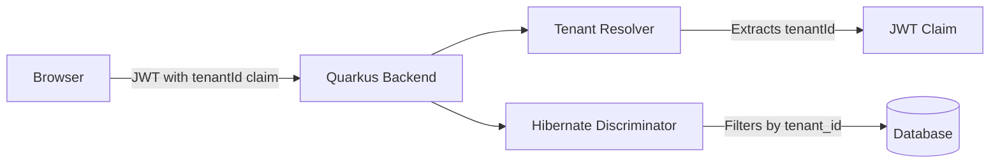
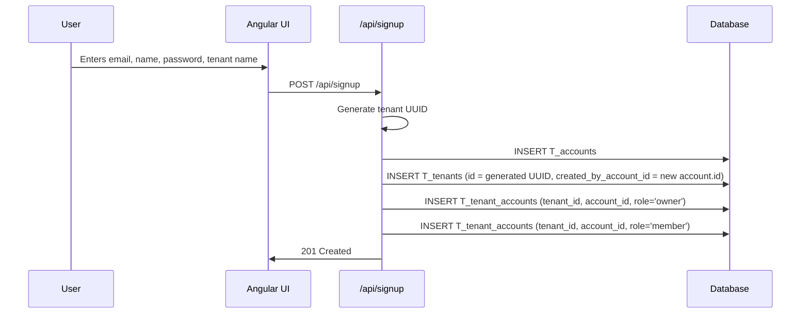
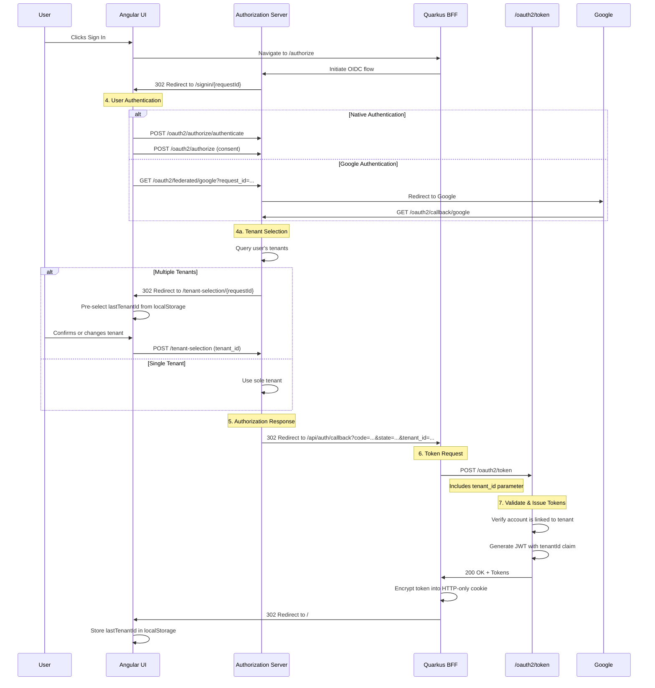

# Multitenancy Design

## Overview

This application will support multitenancy using Hibernate ORM's **discriminator approach**. Tenant data lives in shared tables. A `tenant_id` column on tenant-scoped entities discriminates rows at the query level. The current tenant is resolved from a `tenantId` claim in the signed JWT.

Accounts, credentials, and federated identities are **global** (not scoped to a tenant). A user can have one account and be linked to multiple tenants via a join table.

A user can own multiple tenants. On first signup a tenant is created automatically. When a user with multiple tenants signs in, they select which tenant to work with. The last selection is persisted in `localStorage` as the default.

## Architecture



## Database Changes

### New Table: `T_tenants`

| Column | Type | Description |
|--------|------|-------------|
| `id` | VARCHAR(36) PK | UUID primary key |
| `name` | VARCHAR(255) | Tenant name (user-provided) |
| `created_by_account_id` | VARCHAR(36) FK | References `T_accounts.id` — the account that created the tenant |
| `created_at` | TIMESTAMP | Creation timestamp |

**Constraints:**
- `FK_tenants_created_by_account_id`: Foreign key to `T_accounts` with CASCADE delete
- `I_tenants_created_by_account_id`: Index on `created_by_account_id`

### Modified Tables

The following tables receive a `tenant_id` VARCHAR(36) column:
- `T_oauth_clients`
- `T_account_roles`
- `T_client_secrets`
- `T_service_account_roles`

The following tables are **global** (no `tenant_id`):
- `T_accounts` — A user has one account regardless of how many tenants they belong to.
- `T_credentials` — Belong to the account; the same password works across all linked tenants.
- `T_federated_identities` — Link a global account to an external provider; same identity across all linked tenants.

The following tables **do not** receive `tenant_id`:
- `T_authorization_requests` — Created during the OAuth authorization flow before the user is authenticated, so the tenant is unknown.
- `T_authorization_codes` — Exchanged at the token endpoint before a user JWT exists; looked up by the unique code value, which is already unguessable and short-lived.
- `T_revoked_tokens` — Looked up by globally unique JTI; a revoked token must be rejected regardless of tenant.

**Indexes:**
- A non-unique index on `tenant_id` for each table to support discriminator filtering.

### New Table: `T_tenant_accounts`

| Column | Type | Description |
|--------|------|-------------|
| `tenant_id` | VARCHAR(36) PK/FK | References `T_tenants.id` |
| `account_id` | VARCHAR(36) PK/FK | References `T_accounts.id` |
| `role` | VARCHAR(50) | `owner` or `member`. Roles are independent — an account can hold one, both, or neither for a given tenant. |
| `added_at` | TIMESTAMP | When the account was linked to the tenant |

**Constraints:**
- `PK_tenant_accounts`: Composite primary key on `(tenant_id, account_id, role)`
- `FK_tenant_accounts_tenant_id`: Foreign key to `T_tenants`
- `FK_tenant_accounts_account_id`: Foreign key to `T_accounts` with CASCADE delete
- `I_tenant_accounts_account_id`: Index on `account_id` for fast lookup of a user's tenants

### Migration Files

- `V01.016__create_tenants_table.sql` — Creates `T_tenants`
- `V01.017__create_tenant_accounts_table.sql` — Creates `T_tenant_accounts`
- `V01.018__add_tenant_id_to_scoped_tables.sql` — Adds `tenant_id` columns and indexes

## Tenant Resolution

### JWT Claim

The `tenantId` is added as a custom claim when tokens are generated:

```java
// TokenResource.java
jwtBuilder.claim("tenantId", tenantId)
```

Both `access_token` and `id_token` include the claim.

### Hibernate Discriminator Configuration

```properties
# application.properties
quarkus.hibernate-orm.multitenant=DISCRIMINATOR
```

### Tenant Resolver

Implement `io.quarkus.hibernate.orm.runtime.tenant.TenantResolver` as a request-scoped bean. It reads the incoming HTTP request, extracts the JWT from the `Authorization` header or the OIDC session cookie (for BFF endpoints), and returns the `tenantId` claim value.

```java
@RequestScoped
public class JwtTenantResolver implements TenantResolver {
    @Override
    public String getDefaultTenantId() {
        return "default";
    }

    @Override
    public String resolveTenantId() {
        // Extract JWT from Authorization header or OIDC cookie
        // Parse and return tenantId claim
    }
}
```

### Entity Annotation

Tenant-scoped `@Entity` classes receive a `@TenantId` field. Global entities (`Account`, `Credential`, `FederatedIdentity`) do not.

```java
@Entity
public class OAuthClient {
    @TenantId
    @Column(name = "tenant_id")
    private String tenantId;
    // ...
}
```

Hibernate automatically:
- Appends `tenant_id = ?` to SELECT queries and to UPDATE/DELETE statements that target a loaded entity by primary key
- Sets the column on INSERT from the current tenant context

### Bulk Operations Limitation

`@TenantId` **does not** apply the tenant filter to bulk JPQL/Criteria UPDATE or DELETE queries (e.g., `UPDATE Entity SET ... WHERE ...`, `DELETE FROM Entity WHERE ...`). These execute as direct SQL without injecting the `tenant_id` predicate, which means a bulk operation issued in one tenant's context can affect rows belonging to other tenants.

To avoid cross-tenant data corruption:
- Never use JPQL/Criteria bulk UPDATE or DELETE on tenant-scoped entities
- Use per-row updates/deletes via loaded entities instead
- Application-level enforcement is the only viable mechanism; **neither MySQL nor H2 supports native Row-Level Security (RLS)**

## User Flows

### First Signup



On first signup the tenant name is collected alongside account details. The signup endpoint creates the account, creates the tenant, and inserts both `owner` and `member` roles into `T_tenant_accounts`.

### Sign In



After authentication, the authorization server checks how many tenants the account is linked to. If there is exactly one, it proceeds immediately. If there are multiple, the user is redirected to a tenant selection page. The `lastTenantId` from `localStorage` is used as the default selection. Once a tenant is chosen, the authorization server includes `tenant_id` in the redirect to the BFF callback. The BFF forwards `tenant_id` in its POST to `/oauth2/token`. The token endpoint verifies that the account (resolved from the authorization code) is linked to the specified tenant via `T_tenant_accounts`, then includes `tenantId` in the JWT claims.

There is no token switching. To work with a different tenant, the user signs out and signs in again, selecting the desired tenant during authentication.

### Create Additional Tenant

An authenticated user can create a new tenant via `POST /api/tenants`. The request requires a tenant name. The endpoint:
1. Creates a new `Tenant` with the current user as `created_by_account_id`
2. Inserts rows into `T_tenant_accounts` for the current account with `role='owner'` and `role='member'`
3. Returns the new tenant's ID

An authenticated tenant owner can manage memberships via `POST /api/tenants/{tenantId}/members`. The endpoint inserts a row into `T_tenant_accounts` with the requested role (`member`, `owner`, or both). Promoting an account to owner means inserting the `owner` row; demoting means deleting only the `owner` row, leaving `member` intact. Members (with or without `owner`) can only read their own tenancy membership.

The user can then switch to it using the tenant selection flow.

## API Endpoints

| Method | Path | Description | Auth |
|--------|------|-------------|------|
| POST | `/api/signup` | Create account and first tenant | Public |
| GET | `/api/tenants` | List tenants for current user | Authenticated |
| POST | `/api/tenants` | Create a new tenant | Authenticated |
| POST | `/api/tenants/{tenantId}/members` | Add an account to a tenant | Authenticated (tenant `owner`) |
| POST | `/tenant-selection` | Select tenant during sign-in flow | Authenticated (session) |

## Angular UI Changes

- **Signup component**: Add a "Tenant Name" field
- **Tenant selection component**: Shown after login when user has multiple tenants and no `lastTenantId` in `localStorage`, or when `lastTenantId` is invalid
- **Header component**: Display current tenant name; add "Switch Tenant" and "New Tenant" actions
- **Auth service**: Read/write `lastTenantId` from/to `localStorage`; include it in state when initiating authorization if available

## What Must Change

- **Database**
  - Create `V01.016__create_tenants_table.sql`
  - Create `V01.017__create_tenant_accounts_table.sql`
  - Create `V01.018__add_tenant_id_to_scoped_tables.sql`
  - Update `DATABASE.md` with the new table and column additions
  - migration script to create default tenant "abstratium informatique sàrl" with random UUID for existing data:
    - insert into `T_tenants` with the generated UUID and `created_by_account_id` set to the first account
    - for every existing account in `T_accounts`, insert `owner` and `member` rows into `T_tenant_accounts`
    - update all existing rows in tables receiving `tenant_id` (`T_oauth_clients`, `T_account_roles`, `T_client_secrets`, `T_service_account_roles`) to reference the new tenant UUID

- **Backend Entities**
  - Add `@TenantId` field to tenant-scoped entity classes (`OAuthClient`, `AccountRole`, `ClientSecret`, `ServiceAccountRole`)
  - Create `TenantAccount` join entity for `T_tenant_accounts`

- **Backend Services**
  - Create `Tenant` entity, `TenantService`, and `TenantRepository`
  - Create `JwtTenantResolver` implementing `TenantResolver`
  - Update `SignupResource` and `AccountService.createAccount` to accept a tenant name and create the first tenant
  - Update `TokenResource.generateAccessToken` and `generateIdToken` to include the `tenantId` claim after verifying the account is linked to the tenant
  - Create `TenantsResource` with endpoints for list and create
  - Create `TenantSelectionResource` with `POST /tenant-selection` for the sign-in tenant selection step
  - Update `UserInfoResource` to include the current `tenantId` in the response

- **Backend Configuration**
  - Add `quarkus.hibernate-orm.multitenant=DISCRIMINATOR` to `application.properties`

- **Frontend**
  - Add tenant name input to signup form
  - Create tenant selection page/component
  - Update `AuthService` to store and read `lastTenantId` in `localStorage`
  - Update `Token` interface to include `tenantId`
  - Add header controls for switching/creating tenants

- **Code Audit**
  - Search the entire codebase for JPQL/Criteria bulk UPDATE or DELETE operations on tenant-scoped entities and replace them with per-row operations

- **Security**
  - Add `TenantAuthorizationFilter` (or equivalent) that verifies the caller's JWT `sub` has a matching row in `T_tenant_accounts` for the current `tenantId` before allowing access to tenant-scoped endpoints
  - Update `AccountsResource` so `ADMIN` and `MANAGE_ACCOUNTS` only operate on accounts linked to the current tenant via `T_tenant_accounts`; never return all global accounts
  - Update `ClientsResource` so `MANAGE_CLIENTS` only operates on clients within the current tenant
  - Add endpoint `DELETE /api/tenants/{tenantId}/members/{accountId}` to remove a membership (currently only POST exists) - it must check that the JWT of the user doing this is an owner of the given tenant (but keep tenantId in the url in case they are deleting for a tenant that they are night signed into?)
  - Prevent removal of the last `owner` from a tenant; reject the demotion if it would orphan the tenant
  - Add rate limiting to `POST /api/signup` to prevent mass tenant creation
  - Ensure `TokenResource` verifies account-tenant linkage not only during token issuance but also during any token refresh flow
  - Update `UserInfoResource` to return only the current tenant's roles, not all global roles
  - Audit all endpoints that operate on global entities (`Account`, `Credential`, `FederatedIdentity`) to ensure they do not leak data across tenants

- **Tests**
  - Add unit tests for `JwtTenantResolver`
  - Add integration tests for signup with tenant creation
  - Add integration tests for tenant-scoped data isolation
  - Add integration tests for the tenant selection flow during sign-in
  - Update existing tests to account for `tenant_id` filtering

## Security Considerations

### Verified: MySQL and H2 do not support native RLS
MySQL has no `CREATE ROW SECURITY POLICY` statement. H2 does not support RLS either. Tenant isolation must be enforced entirely at the application layer.

### Global roles are not tenant-scoped
The current JWT `groups` claim contains global roles (`ADMIN`, `MANAGE_ACCOUNTS`, `MANAGE_CLIENTS`, `USER`). With multitenancy, a user could hold `ADMIN` in tenant A but only `USER` in tenant B. `@RolesAllowed` checks JWT groups globally, so a token issued for tenant A (with `ADMIN`) could be used to access admin endpoints in tenant B if the user somehow obtains a token for B. The token endpoint prevents this by verifying membership at issuance, but role enforcement inside endpoints must also become tenant-aware.

### Global entities leak across tenants
`Account`, `Credential`, and `FederatedIdentity` have no `@TenantId`. Endpoints returning account data must explicitly filter by `T_tenant_accounts` or they will expose users from other tenants. `AccountsResource.listAccounts()` currently returns all accounts for `ADMIN`; this must be restricted to accounts linked to the current tenant.

### Tenant ownership deletion
`T_tenants` has `CASCADE delete` on `created_by_account_id`. Deleting an account deletes all tenants they created, even if those tenants have other members. The FK should be `SET NULL` or `RESTRICT` instead.

### Authorization request session fixation
During sign-in, the tenant selection endpoint (`/tenant-selection`) operates within the OAuth authorization request session. It must verify that the session's `account_id` matches the authorization request before allowing tenant selection, otherwise a session fixation attack could allow one authenticated user to select a tenant on behalf of another user's authorization flow.

### Tenant ID in redirect URL
The `tenant_id` is appended to the BFF callback redirect URL as a query parameter. Redirect URLs are logged by proxies, browsers, and servers. This leaks the tenant identifier to any intermediary.

### Unique constraint on OAuth client_id
`T_oauth_clients.client_id` is globally unique. This is acceptable for an authorization server (client IDs are like domain names), but it means tenants cannot independently register the same client ID.

## Decisions

| # | Question | Answer |
|---|----------|--------|
| 1 | What roles are supported in `T_tenant_accounts`? | `owner` and `member`. |
| 2 | Can a tenant have multiple owners? | Yes. `created_by_account_id` records who created the tenant; actual ownership is tracked in `T_tenant_accounts`. |
| 3 | What can an `owner` do? | Manage the tenant, add/remove members, and add or remove the `owner` role for other accounts. Must also hold `member` to access tenant resources as a member. |
| 4 | What can a `member` do? | Read their own tenancy membership; cannot modify the tenant or its members. |
