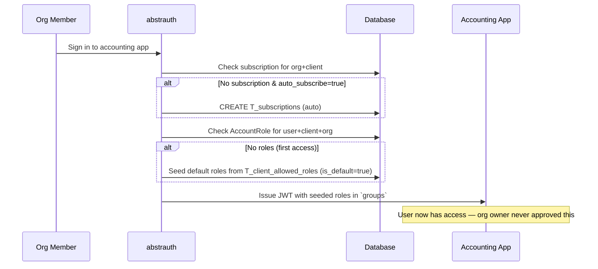
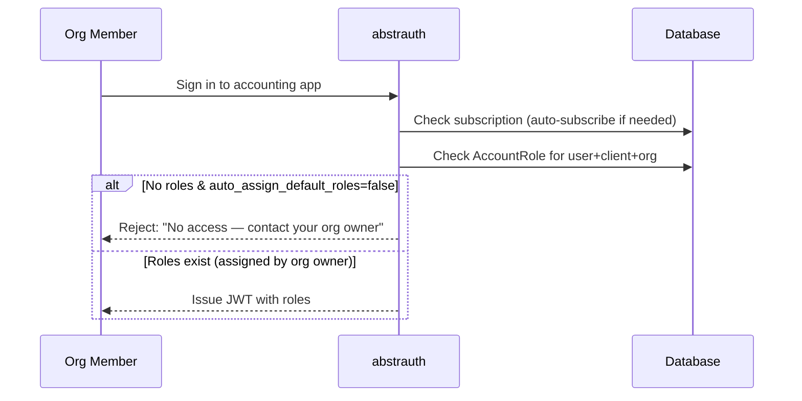
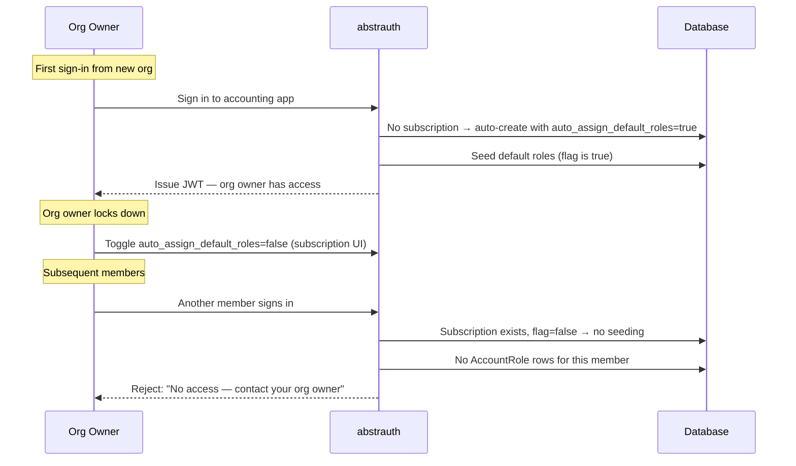
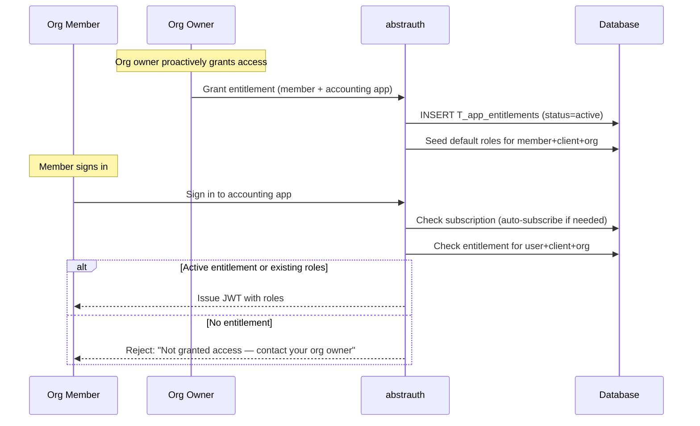
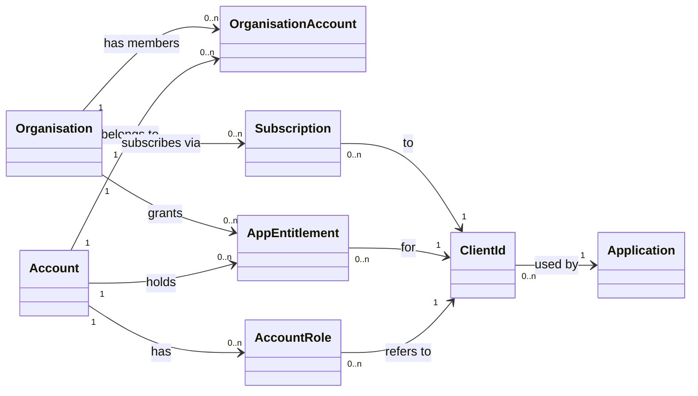
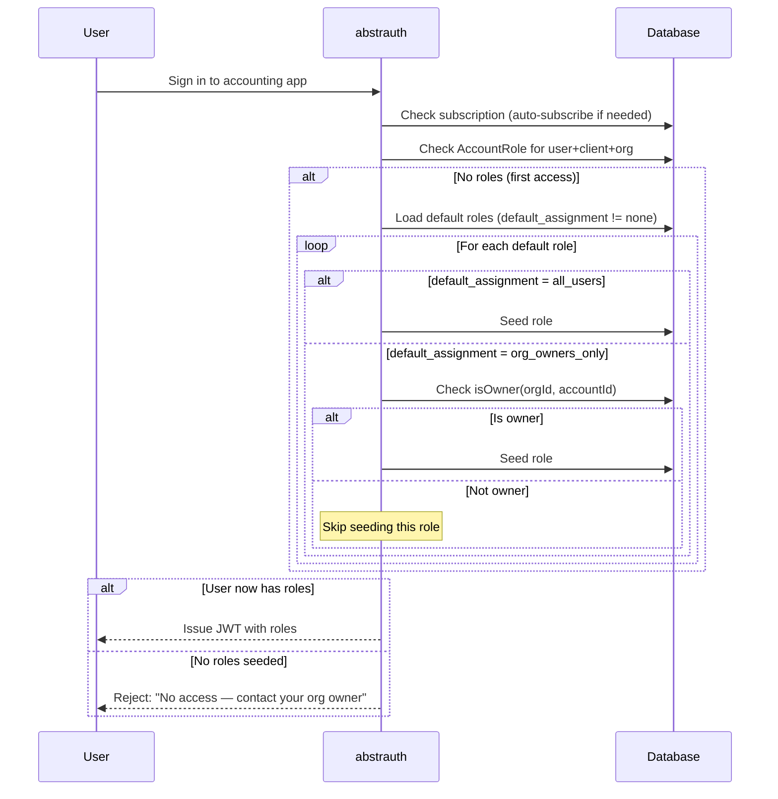

# Per-User Application Access Control

## Problem Statement

An abstrauth customer registers a **public** OAuth client with `auto_subscribe = true` so that any new user — together with the new organisation that is created for them at signup — can immediately sign into the application without manual subscription approval. This is desirable for a frictionless self-service onboarding experience.

The application in question is an **accounting application**. In that domain an organisation owner will typically **not** want every single member of their organisation to have access. Hiring a contractor into the organisation (so they can be a member for other purposes) should not automatically grant them access to the company's books.

Today, the combination of `auto_subscribe = true` and automatic default-role seeding means that **every member of the organisation who signs in to the application receives the default roles automatically**. The organisation owner has no way to proactively restrict which of their members may use the application. They can only reactively remove roles after the fact — by which point the user has already signed in at least once.

### Root Cause

Two distinct concerns are coupled in the current model:

1. **Org-level access** — "may this organisation use this application at all?" — modelled by `T_subscriptions` and gated by `auto_subscribe`.
2. **User-level access** — "may this specific user within the organisation use the application?" — modelled implicitly by the presence of `T_account_roles` rows, which are **auto-seeded** from `T_client_allowed_roles` (where `is_default = true`) on first sign-in.

Because concern 2 is automatic and unconditional (for any org that is subscribed), the organisation owner has no gate. The `auto_subscribe` flag controls concern 1 only; there is no equivalent flag for concern 2.

### Current Flow (problematic)



The organisation owner was never consulted. Every member who attempts sign-in gets in.

## Design Goals

- An organisation owner must be able to **proactively control** which of their members may use a given application.
- The self-service onboarding story for **new organisations** must be preserved (a brand-new user/org can still start using the application without contacting the application vendor).
- The solution must be **backward compatible** — existing clients and subscriptions must continue to behave as before unless explicitly reconfigured.
- The solution must respect the existing security model: the client owner controls the role catalog (`T_client_allowed_roles`); the org owner controls which of their users hold those roles.

## Proposed Solutions

Three solutions are presented, ranging from minimal change to a functionally clean and correct model.

---

### Solution A — Minimal: Client-Level `autoAssignDefaultRoles` Flag

Add a single boolean column to `T_oauth_clients`:

| Column | Type | Default | Description |
|--------|------|---------|-------------|
| `auto_assign_default_roles` | BOOLEAN | `true` | When `false`, default roles are **not** auto-seeded on first sign-in. Users must be explicitly assigned roles by their org owner. |

#### Behaviour

- The accounting application vendor sets `auto_assign_default_roles = false` on their client (a one-time configuration).
- `auto_subscribe` continues to work: new organisations get a subscription automatically on first sign-in by any member.
- On first sign-in, abstrauth **skips** the default-role seeding step. The user receives an empty `groups` claim.
- abstrauth detects that the user has no roles for this client and **rejects** the sign-in with a clear error: *"You do not have access to this application. Contact your organisation owner to request access."*
- The organisation owner signs in to **abstrauth** (which has its own roles, unaffected), navigates to the accounts UI, and explicitly assigns the accounting application's `user` role to selected members.
- Those members can now sign in; unassigned members are rejected.



#### Trade-offs

| Pros | Cons |
|------|------|
| Smallest possible change: one column, one conditional in `NonMultitenancyTokenResource`. | Control is at the **client** level — the vendor decides for **all** organisations. An org that genuinely wants every member to have access cannot opt back in. |
| Backward compatible (defaults to `true`). | The first user from a new org (the org owner themselves) is also rejected on their first sign-in to the app. They must go to abstrauth's accounts UI and assign themselves the role before they can use the app. This is a minor friction point but may confuse users who expect self-service. |
| No new tables, no new UI screens — the existing accounts/role-assignment UI is reused. | The error message on rejection must be carefully worded so the org owner knows to go to abstrauth to grant access, not to the accounting app. |
| No migration of existing data. | Does not model the concept of "invitation" — access is granted retroactively by assignment, not proactively by invitation. |

---

### Solution B — Middle Ground: Per-Subscription `autoAssignDefaultRoles` Flag

Add a boolean column to `T_subscriptions`:

| Column | Type | Default | Description |
|--------|------|---------|-------------|
| `auto_assign_default_roles` | BOOLEAN | `true` | When `false`, default roles are not auto-seeded for users of this org signing in to this client. The org owner must assign roles explicitly. |

#### Behaviour

- When a subscription is auto-created (via `auto_subscribe`), the new `T_subscriptions` row is created with `auto_assign_default_roles = true` (the default). This means the **first** user from a new org (the org owner who triggered the auto-subscribe) **does** get default roles seeded — they can sign in immediately.
- The org owner then navigates to abstrauth's subscription management UI and toggles `auto_assign_default_roles` to `false` for the accounting application.
- From that point on, **no further members** get auto-seeded roles. The org owner assigns roles manually to selected members via the accounts UI.
- Existing subscriptions default to `true`, preserving current behaviour.



#### Trade-offs

| Pros | Cons |
|------|------|
| Control is at the **organisation** level — exactly where the user's scenario demands it. Each org owner decides for their own org. | Slightly more complex than Solution A: the flag lives on a row that is auto-created, so the org owner must discover and toggle it. |
| No chicken-and-egg problem: the first user (org owner) gets access, then locks down. | The org owner must remember to toggle the flag after first sign-in. If they forget, members continue to get auto-access until they do. |
| Backward compatible (defaults to `true`). | Requires a small UI addition to the subscription management screen (a toggle). |
| The vendor does not need to anticipate every org's preference. | The flag is per-subscription, so an org with many clients has many toggles to manage. |
| Reuses the existing role-assignment UI for granting per-user access. | Still reactive assignment rather than proactive invitation (same as Solution A). |

---

### Solution C — Clean & Correct: Explicit Per-User Entitlement (Invitation) Model

Introduce an explicit **application entitlement** concept that decouples org-level subscription from user-level access. The org owner proactively grants a user access to an application; only then may that user sign in.

#### New Table: `T_app_entitlements`

Models an explicit grant of application access to a specific user within an organisation.

| Column | Type | Description |
|--------|------|-------------|
| `id` | VARCHAR(36) PK | UUID |
| `org_id` | VARCHAR(36) FK | References `T_organisations.id` |
| `account_id` | VARCHAR(36) FK | References `T_accounts.id` — CASCADE delete |
| `client_id` | VARCHAR(255) FK | References `T_oauth_clients.client_id` |
| `status` | VARCHAR(20) | `active`, `revoked` |
| `granted_by_account_id` | VARCHAR(36) FK | References `T_accounts.id` — SET NULL on delete |
| `granted_at` | TIMESTAMP | When access was granted |

An entitlement is the **prerequisite** for default-role seeding. Without an active entitlement (or an existing explicit `AccountRole` assignment), sign-in to the application is rejected.

#### Behaviour

- `auto_subscribe` continues to create org-level subscriptions for new orgs — the organisation *may* use the app.
- On sign-in, abstrauth checks for an **active entitlement** (or existing `AccountRole` rows) for the user+client+org. If none exists, sign-in is rejected: *"You have not been granted access to this application. Contact your organisation owner."*
- The org owner grants access via a new "Application Access" UI in abstrauth: they select a member and an application and create an entitlement. Creating the entitlement triggers default-role seeding (from `T_client_allowed_roles` where `is_default = true`, filtered by `available_to_foreign_orgs` for foreign orgs).
- Revoking an entitlement removes the seeded default roles (but preserves any explicitly assigned non-default roles, or optionally removes all roles — a policy decision).
- A client-level flag `auto_entitle_on_first_signin` (default `false`) preserves the old "everyone gets in" behaviour for clients that want it. When `true`, an entitlement is auto-created on first sign-in (equivalent to today's behaviour).



#### Domain Model Update



#### Trade-offs

| Pros | Cons |
|------|------|
| **Functionally correct**: org-level subscription and user-level access are fully decoupled. The model explicitly represents "this user is allowed to use this app in this org." | Most complex solution: new table, new entity, new service, new REST endpoints, new UI screen, new migration. |
| **Proactive**: the org owner grants access before the user ever signs in. No user is surprised by a rejection. | The `auto_entitle_on_first_signin` flag adds a conditional path, reintroducing some of the complexity it aims to remove. |
| **Auditable**: `granted_by_account_id` and `granted_at` provide a clear audit trail of who granted what and when. | Entitlement vs. `AccountRole` overlap must be carefully defined: does revoking an entitlement remove only default-seeded roles, or all roles? This is a policy decision that adds design surface. |
| **Extensible**: the entitlement model naturally supports future features — invitation tokens, approval workflows, time-limited access, role templates per entitlement. | More test surface: entitlement lifecycle (grant, revoke, re-grant), interaction with subscription deletion, interaction with org membership removal. |
| The existing `AccountRole` table and role-assignment UI remain unchanged; the entitlement is an additional gate, not a replacement. | Slightly more work for the org owner (two concepts to understand: subscription = org access; entitlement = user access). UI must make this distinction clear. |
| Aligns with how real-world platforms (Google Workspace, Microsoft 365) model per-user application assignment. | |

---

### Solution D — Role-Level Default Assignment Scope

The existing `T_client_allowed_roles` table already has an `is_default` boolean — the client owner marks which roles are auto-seeded to new users on first sign-in. The UI label for this flag is *"Automatically assign this role to new users when they sign in"*.

Replace the `is_default` boolean with an enum column that expresses **who** the default role is seeded to:

| Column | Type | Values | Description |
|--------|------|--------|-------------|
| `default_assignment` | VARCHAR(30) | `none`, `all_users`, `org_owners_only` | Replaces `is_default`. `none` = not auto-seeded (was `is_default = false`). `all_users` = seeded for every member on first sign-in (was `is_default = true`). `org_owners_only` = seeded only when the signing-in user is an owner of their organisation. |

The UI label becomes: *"Automatically assign this role to new users when they sign in"* with a select offering: *No*, *Yes — all users*, *Yes — organisation owners only*.

#### Feasibility: ownership is known at seeding time

The default-role seeding happens in `NonMultitenancyTokenResource` during token issuance. At that point both the `orgId` (from the `AuthorizationRequest`) and the `account.getId()` are in scope, and `OrganisationService` is already injected and used for the `isMember` check on the preceding line. `OrganisationService.isOwner(orgId, accountId)` performs a direct lookup against `T_organisation_accounts` for a row with `role = 'owner'`. No additional data is required — the solution is feasible as-is.

#### Behaviour

- The accounting application vendor marks the `user` role as `default_assignment = org_owners_only` in their role catalog.
- A new user signs up; their organisation is created and they become its owner.
- The user signs in to the accounting app. `auto_subscribe` creates the subscription. Seeding checks `isOwner(orgId, accountId)` → `true` → the `user` role is seeded. The org owner can use the app immediately.
- The org owner invites a contractor as a `member` (not an owner) of the organisation.
- The contractor signs in to the accounting app. The subscription exists. Seeding checks `isOwner` → `false` → the `user` role is **not** seeded. The contractor has no roles for the client and is rejected: *"You do not have access to this application. Contact your organisation owner to request access."*
- The org owner assigns the `user` role to the contractor via the existing accounts/role-assignment UI in abstrauth. The contractor can now sign in.



#### Trade-offs

| Pros | Cons |
|------|------|
| **Solves the chicken-and-egg naturally.** The first user from a new org is always the org owner, so they always receive `org_owners_only` roles. No rejection on first sign-in, no extra steps. | Control is at the **vendor** level (client owner sets the role catalog). An org that genuinely wants every member to have auto-access cannot override the policy — the vendor decided `org_owners_only` for all subscribing orgs. The org owner can still manually assign roles to every member, but that is tedious for large orgs. |
| **Smallest semantic change.** Replaces one boolean with an enum on a table the vendor already manages. No new tables, no new endpoints, no new UI screens — just a select instead of a checkbox in the existing role-catalog editor. | Replaces a boolean column, requiring a data migration (`is_default = true` → `all_users`, `is_default = false` → `none`). The migration is straightforward but touches existing data. |
| **Role-level granularity.** The vendor can mix policies per role: seed a basic `user` role to owners only, but seed a `viewer` role to all users. More expressive than a single client- or subscription-level flag. | The policy is the same for **all** subscribing organisations. If the vendor has some orgs that want open access and some that want restricted, this solution cannot express that — it is one policy for everyone. (Solution B handles this via per-org toggles.) |
| **Reuses the existing role-assignment UI** for granting access to individual members after the org owner identifies who should have it. | Still reactive assignment for non-owners (the org owner assigns roles after the member is rejected, not via a proactive invitation). Same as Solutions A and B. |
| **No new concepts for users to learn.** The vendor already understands `is_default`; the enum is a natural generalisation. | A role marked `org_owners_only` for a client whose owning org is foreign to the signing-in user: the `available_to_foreign_orgs` flag and the `org_owners_only` scope interact — both must be satisfied. The seeding logic must check `available_to_foreign_orgs` first (as it does today) and then the assignment scope. This is a minor additional conditional, not a new concept. |

---

## Comparison

| Criterion | Solution A (Client flag) | Solution B (Subscription flag) | Solution C (Entitlements) | Solution D (Role-level scope) |
|-----------|--------------------------|--------------------------------|---------------------------|-------------------------------|
| **Change size** | Minimal (1 column, 1 conditional) | Small (1 column, 1 conditional, 1 UI toggle) | Large (new table, entity, service, endpoints, UI, migration) | Small (1 column type change, 1 conditional, 1 UI select) |
| **Who controls per-user access** | Client vendor (for all orgs) | Org owner (per org+client) | Org owner (per user+client+org) | Client vendor (per role, for all orgs) |
| **Proactive vs. reactive** | Reactive (assign after rejection) | Reactive (assign after rejection) | Proactive (grant before sign-in) | Reactive (assign after rejection) |
| **First-user chicken-and-egg** | Present (org owner rejected on first sign-in to app) | Absent (first user = org owner, gets access, then locks down) | Absent (org owner grants themselves an entitlement via abstrauth UI) | Absent (first user is always org owner, receives `org_owners_only` roles automatically) |
| **Backward compatible** | Yes (default `true`) | Yes (default `true`) | Yes (default `auto_entitle_on_first_signin = false` preserves old behaviour only when explicitly enabled; existing clients would need the flag set to `true` to keep current behaviour — see note below) | Yes (migration maps `is_default = true` → `all_users`; existing behaviour unchanged) |
| **Granularity** | All orgs or none | Per org, per client | Per user, per client, per org | Per role, per client (all orgs) |
| **Audit trail** | None (role assignment only) | None (role assignment only) | Yes (`granted_by`, `granted_at`) | None (role assignment only) |
| **Extensibility** | Low | Medium | High (invitations, approvals, time-limited access) | Medium (new enum values e.g. `org_owners_and_managers` are trivial to add) |
| **UX clarity** | Poor (rejection with "contact org owner" — confusing for the org owner who is the first user) | Good (org owner gets in, then controls) | Best (explicit grant flow, no surprises) | Good (org owner gets in automatically; members get a clear rejection) |
| **Security** | Adequate | Adequate | Best (explicit grant is the strongest gate) | Adequate |

> **Backward-compatibility note for Solution C:** to preserve the current behaviour for existing public+auto-subscribe clients, the migration would set `auto_entitle_on_first_signin = true` on all existing clients where `auto_subscribe = true`. New clients default to `false`. This means existing applications continue to work unchanged, while new applications get the controlled-access model by default.

## Recommendation

**Solution D** is recommended as the immediate implementation, with **Solution B** as a complementary option if per-organisation self-service control is later required, and **Solution C** as the documented long-term evolution path.

### Rationale

1. **Solves the chicken-and-egg without any extra steps.** The first user from a new organisation is always the org owner. With `default_assignment = org_owners_only`, they receive the role automatically and can use the app immediately. Solution A fails here (rejects the org owner on first sign-in); Solution B works but requires the org owner to discover and toggle a flag after first sign-in; Solution C works but at far greater cost. Solution D is the most natural fit.

2. **Change is in the most natural place.** The vendor already manages the role catalog (`T_client_allowed_roles`) and already understands the `is_default` flag. Replacing the boolean with an enum is a natural generalisation of a concept they already use — not a new concept to learn. The UI change is a select instead of a checkbox in an existing screen.

3. **Role-level granularity is more expressive.** The vendor can mix policies: seed a `viewer` role to all users but a `user` role to org owners only. A single client- or subscription-level flag (Solutions A/B) cannot express this.

4. **The vendor sets a sensible default policy for their app type.** For an accounting application, "only org owners get auto-access; grant to others explicitly" is the right default for nearly every subscribing organisation. The vendor knows their application's domain; the role catalog is where they express that domain knowledge. Solution B delegates this to each org owner, which is appropriate when orgs have diverse needs — but for a domain-specific app like accounting, a vendor-set default is cleaner and requires no per-org setup.

5. **Solution B remains available as a complement.** If a future requirement emerges for per-organisation control (some orgs want all members in, others want restricted), Solution B's per-subscription flag can be added alongside Solution D. The two are orthogonal: D controls *which roles* are auto-seeded and *to whom*; B controls *whether* auto-seeding happens at all for a given org. They compose without conflict.

6. **Solution C is the architecturally pure model** — explicit entitlements are how mature platforms solve this — but its complexity is not justified by the current problem alone. The entitlement model becomes worthwhile when additional features (invitation tokens, approval workflows, time-limited access, per-entitlement role templates) are needed. Until then, Solution D delivers the core value at minimal cost.

7. **Solution D does not preclude Solutions B or C.** The enum-based scope can coexist with a future per-subscription flag (B) and a future entitlement model (C): the enum becomes the default seeding policy, the flag becomes the org-level override, and entitlements become the explicit grant mechanism. The migration path is additive at each step.

### Implementation Plan for Solution D

This section lists every file that must change, grouped by layer. The enum has three values:

| Enum value | DB string | Meaning |
|------------|-----------|---------|
| `NOT_DEFAULT` | `'not_default'` | Not auto-seeded (was `is_default = false`) |
| `ALL_USERS` | `'all_users'` | Seeded for every member on first sign-in (was `is_default = true`) |
| `ORG_OWNERS_ONLY` | `'org_owners_only'` | Seeded only when the signing-in user is an owner of their organisation |

Using `NOT_DEFAULT` as the third state (rather than reusing `NONE`) allows the column to be `NOT NULL` after migration: every existing row gets a value mapped from `is_default`, and no row is left null.

#### 1. Database Migration

**New file: `src/main/resources/db/migration/V01.045__replace_is_default_with_default_assignment.sql`**

```sql
-- Step 1: Add the new column as nullable so existing rows can be backfilled.
ALTER TABLE T_client_allowed_roles
    ADD COLUMN default_assignment VARCHAR(30);

-- Step 2: Backfill from is_default.
UPDATE T_client_allowed_roles SET default_assignment = 'all_users' WHERE is_default = TRUE;
UPDATE T_client_allowed_roles SET default_assignment = 'not_default' WHERE is_default = FALSE OR is_default IS NULL;

-- Step 3: Make the column NOT NULL now that every row has a value.
ALTER TABLE T_client_allowed_roles
    ALTER COLUMN default_assignment SET NOT NULL;

-- Step 4: Add a CHECK constraint to enforce valid enum values at the database level.
-- This is defense-in-depth: the JPA layer (@Enumerated(EnumType.STRING)) already
-- prevents invalid values from being persisted by the application, but this
-- constraint also protects against raw SQL, manual data entry, and bugs.
-- Both MySQL 9.3 (CHECK enforced since 8.0.16) and H2 (MODE=MySQL) support this.
ALTER TABLE T_client_allowed_roles
    ADD CONSTRAINT CK_client_allowed_roles_default_assignment
    CHECK (default_assignment IN ('not_default', 'all_users', 'org_owners_only'));

-- Step 5: Drop the old column.
ALTER TABLE T_client_allowed_roles
    DROP COLUMN is_default;
```

**Existing migration `V01.037__create_audit_tables.sql`** — the Envers audit table `T_client_allowed_roles_AUD` has an `is_default BOOLEAN` column (line 159). This is a past migration and must not be edited (Flyway checksum validation would fail). Instead, the new migration must also update the audit table:

```sql
-- Step 6: Update the audit table to match.
ALTER TABLE T_client_allowed_roles_AUD
    ADD COLUMN default_assignment VARCHAR(30);

UPDATE T_client_allowed_roles_AUD SET default_assignment = 'all_users' WHERE is_default = TRUE;
UPDATE T_client_allowed_roles_AUD SET default_assignment = 'not_default'
    WHERE is_default = FALSE OR is_default IS NULL;

ALTER TABLE T_client_allowed_roles_AUD
    ALTER COLUMN default_assignment SET NOT NULL;

-- The audit table also gets a CHECK constraint for consistency.
ALTER TABLE T_client_allowed_roles_AUD
    ADD CONSTRAINT CK_client_allowed_roles_aud_default_assignment
    CHECK (default_assignment IN ('not_default', 'all_users', 'org_owners_only'));

ALTER TABLE T_client_allowed_roles_AUD
    DROP COLUMN is_default;
```

> **Note on H2 vs MySQL:** both support `ALTER TABLE ... ADD COLUMN`, `UPDATE`, `ALTER COLUMN ... SET NOT NULL`, `DROP COLUMN`, and `CHECK (column IN (...))` constraints. The migration is compatible with both the H2 test profile (`MODE=MySQL`) and the MySQL 9.3 production profile.
>
> **Why CHECK and not native `ENUM` type:** MySQL's native `ENUM('a','b','c')` type is also an option and is enforced on all MySQL versions. H2 in `MODE=MySQL` accepts the `ENUM(...)` syntax too, but maps it internally to a VARCHAR with an implicit check, and some JDBC drivers report `ENUM` columns with different type metadata — which can cause Hibernate parameter binding issues. Since the project uses `schema-management.strategy=none` (Hibernate neither generates nor validates DDL), this is a lower risk, but `CHECK` on a `VARCHAR` is the safer, more portable, and more standard-SQL choice. The JPA `@Enumerated(EnumType.STRING)` annotation provides application-level validation regardless of which DB-level approach is used.

#### 2. Java Enum

**New file: `src/main/java/dev/abstratium/abstrauth/entity/DefaultAssignment.java`**

```java
package dev.abstratium.abstrauth.entity;

public enum DefaultAssignment {
    NOT_DEFAULT("not_default"),
    ALL_USERS("all_users"),
    ORG_OWNERS_ONLY("org_owners_only");

    private final String dbValue;

    DefaultAssignment(String dbValue) {
        this.dbValue = dbValue;
    }

    public String getDbValue() {
        return dbValue;
    }

    public static DefaultAssignment fromDbValue(String value) {
        if (value == null) return NOT_DEFAULT;
        for (DefaultAssignment da : values()) {
            if (da.dbValue.equals(value)) return da;
        }
        return NOT_DEFAULT;
    }

    public boolean isSeeded() {
        return this != NOT_DEFAULT;
    }
}
```

This enum is shared by both the multitenancy and non-multitenancy entities. It must be annotated for native-image reflection if JPA reflection registration doesn't cover it automatically — verify during the native build test.

#### 3. Entities

**`src/main/java/dev/abstratium/abstrauth/entity/ClientAllowedRole.java`** (lines 51-52, 66-67)

Replace:
```java
@Column(name = "is_default")
private Boolean isDefault = false;
```
with:
```java
@Enumerated(EnumType.STRING)
@Column(name = "default_assignment", nullable = false, length = 30)
private DefaultAssignment defaultAssignment = DefaultAssignment.NOT_DEFAULT;
```

Replace the getter/setter pair `getIsDefault()` / `setIsDefault(Boolean)` with `getDefaultAssignment()` / `setDefaultAssignment(DefaultAssignment)`.

**`src/main/java/dev/abstratium/abstrauth/non_multitenancy/entity/NonMultitenancyClientAllowedRole.java`** (lines 55-56, 70-71)

Same change as above — replace the `isDefault` field and its getter/setter with `defaultAssignment` using the `DefaultAssignment` enum. This entity maps to the same table and must stay in sync.

#### 4. Services

**`src/main/java/dev/abstratium/abstrauth/service/ClientAllowedRoleService.java`**

This is the most heavily affected service. Changes by method:

| Method | Line(s) | Change |
|--------|---------|--------|
| `findDefaultRolesByClientId(String)` | 64-69 | Change JPQL `r.isDefault = true` → `r.defaultAssignment <> dev.abstratium.abstrauth.entity.DefaultAssignment.NOT_DEFAULT`. Update the javadoc (lines 50-63) to reflect the new enum. |
| `findDefaultRolesByClientIdForOrg(String, String)` | 81-98 | Change both JPQL queries: `r.isDefault = true` → `r.defaultAssignment <> DefaultAssignment.NOT_DEFAULT`. The `availableToForeignOrgs` filter stays. |
| `addAllowedRole(String, String, boolean, boolean)` | 177-197 | Change the `isDefault` parameter to `DefaultAssignment defaultAssignment`. Replace `allowedRole.setIsDefault(isDefault)` with `allowedRole.setDefaultAssignment(defaultAssignment)`. |
| `updateAllowedRole(String, String, boolean, boolean)` | 247-277 | Same parameter change. Replace `allowedRole.setIsDefault(isDefault)` with `allowedRole.setDefaultAssignment(defaultAssignment)`. |

**`src/main/java/dev/abstratium/abstrauth/service/AccountRoleService.java`** (lines 224-244)

The `seedDefaultRoles` method receives `List<ClientAllowedRole> defaultRoles` and iterates over them. It calls `allowedRole.getRole()` — it does **not** call `getIsDefault()`. **No change needed** in this method itself; the filtering by `DefaultAssignment` happens in the caller before the list is passed in.

**`src/main/java/dev/abstratium/abstrauth/non_multitenancy/service/NonMultitenancyAccountRoleService.java`** (lines 130-152)

Same as above — `seedDefaultRoles` iterates over `ClientAllowedRole` objects and calls `getRole()` only. **No change needed** in this method; the caller filters by `DefaultAssignment` before passing the list.

**`src/main/java/dev/abstratium/abstrauth/service/AuditHistoryService.java`** (line 102)

The audit column list for `T_client_allowed_roles_AUD` includes `"is_default"`. Change to `"default_assignment"`.

#### 5. Seeding Call Sites (the core logic change)

There are **three** call sites that fetch default roles and seed them. Each must apply the `ORG_OWNERS_ONLY` filter.

**`src/main/java/dev/abstratium/abstrauth/non_multitenancy/boundary/NonMultitenancyTokenResource.java`** (lines 367-373)

This is the primary token issuance path. Currently:
```java
if (orgId != null && !nonMultitenancyAccountRoleService.hasAnyRoleForClient(account.getId(), clientId, orgId)) {
    var defaultRoles = clientAllowedRoleService.findDefaultRolesByClientIdForOrg(clientId, orgId);
    if (!defaultRoles.isEmpty()) {
        nonMultitenancyAccountRoleService.seedDefaultRoles(account.getId(), clientId, orgId, defaultRoles);
    }
}
```

Change to filter the default roles by assignment scope before seeding:
```java
if (orgId != null && !nonMultitenancyAccountRoleService.hasAnyRoleForClient(account.getId(), clientId, orgId)) {
    var defaultRoles = clientAllowedRoleService.findDefaultRolesByClientIdForOrg(clientId, orgId);
    boolean isOwner = organisationService.isOwner(orgId, account.getId());
    var rolesToSeed = defaultRoles.stream()
            .filter(r -> r.getDefaultAssignment() == DefaultAssignment.ALL_USERS
                    || (r.getDefaultAssignment() == DefaultAssignment.ORG_OWNERS_ONLY && isOwner))
            .collect(Collectors.toList());
    if (!rolesToSeed.isEmpty()) {
        nonMultitenancyAccountRoleService.seedDefaultRoles(account.getId(), clientId, orgId, rolesToSeed);
    }
}
```

`organisationService` is already injected (used at line 362 for `isMember`). `Collectors` may need an import.

**`src/main/java/dev/abstratium/abstrauth/non_multitenancy/boundary/NonMultitenancyTokenExchangeResource.java`** (lines 328-333)

The token exchange (RFC 8693) path. Same pattern — filter by `DefaultAssignment` and `isOwner`. `organisationService` must be injected (verify it is; if not, add `@Inject OrganisationService organisationService`). The `subjectOrgId` and `subjectAccountId` are already in scope.

**`src/main/java/dev/abstratium/abstrauth/boundary/api/AccountsResource.java`** (lines 126-131)

This seeds default roles when an existing account is added to the caller's org. Currently seeds unconditionally for all subscribed clients. This path does **not** know whether the *target account* (not the caller) is an org owner. Two options:

1. **Check `isOwner` for the target account** — `organisationService.isOwner(orgId, account.getId())` where `account` is the account being added. This is correct because the seeding is for that account in that org.
2. **Seed only `ALL_USERS` roles here, skip `ORG_OWNERS_ONLY`** — simpler, but an org owner added to another org would not get `ORG_OWNERS_ONLY` roles until they sign in.

Recommended: option 1, for consistency with the token issuance path. The target account's ownership status in the caller's org is known at this point.

**`src/main/java/dev/abstratium/abstrauth/boundary/oauth/AuthorizationResource.java`** (line 457)

This calls `findDefaultRolesByClientId` to check whether default roles *exist* (to decide whether to allow the auth flow to proceed or return 403). The method signature changes to return roles with `DefaultAssignment != NOT_DEFAULT`. The check `!hasDefaultRoles` still works — if no default roles exist at all, the user is rejected. However, this check is now imprecise: a user who is not an org owner might be allowed through the auth flow (because `ORG_OWNERS_ONLY` default roles exist), only to be rejected at token exchange when the `isOwner` filter prevents seeding.

This is acceptable — the auth flow already defers actual seeding to token exchange. But the error message at line 462 ("You do not have any roles for this application") should be reviewed: a non-owner who passes this check but gets no roles seeded at token exchange will receive a token with empty groups. The downstream application must handle this. Alternatively, the `AuthorizationResource` check could be made owner-aware by passing the account ID and checking `isOwner` here too. This is a refinement to decide during implementation.

#### 6. REST Boundary (DTOs and Response Objects)

**`src/main/java/dev/abstratium/abstrauth/boundary/api/ClientsResource.java`**

| Class / Method | Line(s) | Change |
|----------------|---------|--------|
| `AllowedRoleResponse` | 355-368 | Replace `public Boolean isDefault` with `public String defaultAssignment`. Update constructor parameter. |
| `AddAllowedRoleRequest` | 423-430 | Replace `public Boolean isDefault` with `public String defaultAssignment` (accept the enum string value from the UI). |
| `UpdateAllowedRoleRequest` | 432-436 | Same replacement. |
| `addAllowedRole()` | 241-252 | Change `request.isDefault` to `request.defaultAssignment`; parse to `DefaultAssignment` enum; pass to `clientAllowedRoleService.addAllowedRole`. Update the `AllowedRoleResponse` construction. |
| `updateAllowedRole()` | 260-270 | Same change. |
| `listAllowedRoles()` (own-org variant) | 220-233 | Change `r.getIsDefault()` to `r.getDefaultAssignment().getDbValue()` in the `AllowedRoleResponse` mapping. |

**`src/main/java/dev/abstratium/abstrauth/non_multitenancy/boundary/NonMultitenancyClientsResource.java`**

| Class / Method | Line(s) | Change |
|----------------|---------|--------|
| `AllowedRoleResponse` | 274-287 | Replace `public Boolean isDefault` with `public String defaultAssignment`. Update constructor. |
| `listAllowedRoles()` | 189-193 | Change `r.getIsDefault()` to `r.getDefaultAssignment().getDbValue()` in the response mapping. |

#### 7. Angular UI

**`src/main/webui/src/app/model.service.ts`** (line 80)

Change the `AllowedRole` interface:
```typescript
export interface AllowedRole {
  clientId: string;
  role: string;
  defaultAssignment: string;  // 'not_default' | 'all_users' | 'org_owners_only'
  availableToForeignOrgs: boolean;
}
```

**`src/main/webui/src/app/controller.ts`** (lines 457, 469)

Change the `addAllowedRole` and `updateAllowedRole` method signatures: replace `isDefault: boolean` with `defaultAssignment: string` in the request parameter types.

**`src/main/webui/src/app/clients/clients.component.ts`**

| Location | Line(s) | Change |
|----------|---------|--------|
| `addAllowedRoleData` | 114-118 | Replace `isDefault: false` with `defaultAssignment: 'not_default'` |
| `editAllowedRoleData` | 120-123 | Same |
| `toggleAddAllowedRoleForm()` | 884 | Reset `defaultAssignment` to `'not_default'` |
| `addAllowedRole()` | 902-906 | Send `defaultAssignment` instead of `isDefault` |
| `addAllowedRole()` cleanup | 909 | Reset to `defaultAssignment: 'not_default'` |
| `startEditAllowedRole()` | 925-927 | Accept `defaultAssignment: string` instead of `isDefault: boolean`; store in `editAllowedRoleData` |
| `cancelEditAllowedRole()` | 933 | Reset to `defaultAssignment: 'not_default'` |
| `updateAllowedRole()` | 936-960 | Change `wasIsDefault` parameter to `wasDefaultAssignment: string`; adjust the "no longer default" toast logic; send `defaultAssignment` in the request |

**`src/main/webui/src/app/clients/clients.component.html`**

| Location | Line(s) | Change |
|----------|---------|--------|
| Add-role form: "Default role" checkbox | 582-587 | Replace the checkbox with a `<select>` offering three options: *No* (`not_default`), *Yes — all users* (`all_users`), *Yes — organisation owners only* (`org_owners_only`). Update the hint text. |
| Role list: "Default" badge | 617 | Change `*ngIf="allowedRole.isDefault"` to `*ngIf="allowedRole.defaultAssignment !== 'not_default'"`. Optionally show different badge text for `org_owners_only`. |
| Edit button call | 627 | Pass `allowedRole.defaultAssignment` instead of `allowedRole.isDefault` |
| Edit panel: "Default role" checkbox | 644-646 | Replace with a `<select>` like the add form |
| Save button call | 656 | Pass `allowedRole.defaultAssignment` instead of `allowedRole.isDefault` |
| Client-role select (line 502) | 502 | Change `*ngIf="allowedRole.isDefault"` to `*ngIf="allowedRole.defaultAssignment !== 'not_default'"` |

**`src/main/webui/src/app/accounts/accounts.component.html`** (line 256)

Change `*ngIf="allowedRole.isDefault"` to `*ngIf="allowedRole.defaultAssignment !== 'not_default'"`.

#### 8. Test Database Reset Helper

**`src/test/java/dev/abstratium/abstrauth/util/TestDatabaseResetHelper.java`** (lines 174-194)

The `reseedDefaultClientAllowedRoles` method inserts rows with `is_default` column. All four INSERT statements must change from:
```sql
INSERT INTO T_client_allowed_roles (client_id, role, is_default, available_to_foreign_orgs)
SELECT ..., 'manage-accounts', FALSE, TRUE ...
```
to:
```sql
INSERT INTO T_client_allowed_roles (client_id, role, default_assignment, available_to_foreign_orgs)
SELECT ..., 'manage-accounts', 'not_default', TRUE ...
```

The `user` role (line 186-188) changes from `TRUE` to `'all_users'`. The `admin` role (line 191-193) changes from `FALSE` to `'not_default'`.

#### 9. Java Tests — Unit and @QuarkusTest

Every test that constructs `ClientAllowedRole` objects, sends JSON with `isDefault`, or asserts on `isDefault` in responses must be updated.

**Tests that construct `ClientAllowedRole` objects in Java (call `setIsDefault`):**

| Test file | Line(s) | Change |
|-----------|---------|--------|
| `service/AccountRoleServiceTest.java` | 359, 366, 417, 526, 531, 552, 556 | Replace `setIsDefault(...)` with `setDefaultAssignment(DefaultAssignment.ALL_USERS)` or `NOT_DEFAULT` as appropriate |
| `non_multitenancy/service/NonMultitenancyAccountRoleServiceTest.java` | 233, 238, 271, 276, 326 | Same |
| `service/RoleSqlInjectionTest.java` | 207, 214, 221 | Replace `setIsDefault(false)` with `setDefaultAssignment(DefaultAssignment.NOT_DEFAULT)` |
| `boundary/AccountsResourceTest.java` | 302, 545, 1014, 1189 | Replace `setIsDefault(...)` with `setDefaultAssignment(...)` |
| `boundary/AuditHistoryResourceTest.java` | 356 | Replace `setIsDefault(false)` with `setDefaultAssignment(DefaultAssignment.NOT_DEFAULT)` |
| `non_multitenancy/boundary/NonMultitenancyClientsResourceTest.java` | 326, 334 | The `insertAllowedRole` helper methods call `r.setIsDefault(isDefault)` — change to `r.setDefaultAssignment(isDefault ? DefaultAssignment.ALL_USERS : DefaultAssignment.NOT_DEFAULT)` |
| `non_multitenancy/boundary/NonMultitenancyTokenExchangeResourceTest.java` | 747 | Replace `setIsDefault(true)` with `setDefaultAssignment(DefaultAssignment.ALL_USERS)` |

**Tests that send JSON with `"isDefault"` in request bodies:**

| Test file | Line(s) | Change |
|-----------|---------|--------|
| `service/ClientAllowedRoleServiceTest.java` | 103, 154, 189, 198, 234, 244, 279, 315, 401, 410, 583, 694, 747 | Replace `"isDefault": true/false` with `"defaultAssignment": "all_users"/"not_default"` |
| `boundary/ClientsResourceTest.java` | 1033, 1087, 1116, 1135, 1155, 1198, 1240, 1302, 1321, 1339, 1358, 1401 | Same |
| `service/ClientRoleServiceTest.java` | 107 | Same |
| `non_multitenancy/boundary/NonMultitenancyTokenResourceTest.java` | 648, 775, 785, 933 | Same |

**Tests that assert on `"isDefault"` in response JSON:**

| Test file | Line(s) | Change |
|-----------|---------|--------|
| `service/ClientAllowedRoleServiceTest.java` | 110, 121 | `.body("isDefault", equalTo(true))` → `.body("defaultAssignment", equalTo("all_users"))` |
| `boundary/ClientsResourceTest.java` | 1047, 1057, 1249, 1263, 1273 | Same pattern |
| `non_multitenancy/boundary/NonMultitenancyClientsResourceTest.java` | 114, 154 | `.body("isDefault", hasItems(false, true))` → `.body("defaultAssignment", hasItems("not_default", "all_users"))` |

**Tests that insert via native SQL with `is_default`:**

| Test file | Line(s) | Change |
|-----------|---------|--------|
| `boundary/MultiTenancySecurityTest.java` | 292-293 | Change `is_default, available_to_foreign_orgs) VALUES (..., true, true)` to `default_assignment, available_to_foreign_orgs) VALUES (..., 'all_users', true)` |

#### 10. Angular Unit Tests

**`src/main/webui/src/app/clients/clients.component.spec.ts`** (37 matches across lines 1186-2747)

All mock `AllowedRole` objects that have `isDefault: true/false` must change to `defaultAssignment: 'all_users'/'not_default'`. All assertions that check `isDefault` must check `defaultAssignment`. This is a mechanical find-and-replace across the file.

**`src/main/webui/src/app/accounts/accounts.component.spec.ts`** (5 matches at lines 2119, 2131, 2609, 2622, 2623)

Same — replace `isDefault: false/true` with `defaultAssignment: 'not_default'/'all_users'` in mock objects.

#### 11. New Tests to Add

| Test | Layer | Description |
|------|-------|-------------|
| `DefaultAssignmentTest` | Unit | Test the enum: `fromDbValue`, `isSeeded`, round-trip mapping |
| `ClientAllowedRoleServiceTest` (new test methods) | @QuarkusTest | Add a role with `ORG_OWNERS_ONLY`; verify it is returned by `findDefaultRolesByClientIdForOrg` |
| `NonMultitenancyTokenResourceTest` (new test methods) | @QuarkusTest | Sign in as org owner with `ORG_OWNERS_ONLY` default role → role is seeded, token has groups. Sign in as non-owner member → role is not seeded, token has empty groups (or sign-in is rejected). |
| `NonMultitenancyTokenExchangeResourceTest` (new test methods) | @QuarkusTest | Same scenario via token exchange path |
| `AccountsResourceTest` (new test methods) | @QuarkusTest | Add an existing account to an org where the account is an owner → `ORG_OWNERS_ONLY` roles are seeded. Add an account that is not an owner → `ORG_OWNERS_ONLY` roles are not seeded. |
| `clients.component.spec.ts` (new test cases) | Angular unit | Verify the select element renders three options; verify saving sends the correct `defaultAssignment` value |

#### 12. Documentation Updates

| Document | Section | Change |
|----------|---------|--------|
| `docs/MULTITENANCY_DESIGN.md` | Line 90 (`T_client_allowed_roles` table) | Replace `is_default` row with `default_assignment VARCHAR(30)` |
| `docs/MULTITENANCY_DESIGN.md` | Line 232, 265, 332, 340-341, 537 | Update references from `is_default = true` to `default_assignment = 'all_users'` or `default_assignment != 'not_default'` |
| `docs/DATABASE.md` | Lines 165, 380 | Replace `is_default BOOLEAN` with `default_assignment VARCHAR(30)` and update the description |
| `docs/ENVERS_AUDITING.md` | (if it references `is_default`) | Update audit table column reference |

#### 13. Non-Multitenancy Package Impact

Per the `non_multitenancy/AGENTS.md` rules, the following files in the non-multitenancy package are affected:

| File | Change | Justification |
|------|--------|---------------|
| `non_multitenancy/entity/NonMultitenancyClientAllowedRole.java` | Replace `isDefault` field with `defaultAssignment` enum | Entity mirrors the shared table; must stay in sync with `ClientAllowedRole` |
| `non_multitenancy/boundary/NonMultitenancyClientsResource.java` | Update `AllowedRoleResponse` DTO and `listAllowedRoles` mapping | Cross-tenant endpoint returns role catalog data |
| `non_multitenancy/boundary/NonMultitenancyTokenResource.java` | Add `isOwner` filter in seeding block | Core token issuance — the primary place where `ORG_OWNERS_ONLY` is enforced |
| `non_multitenancy/boundary/NonMultitenancyTokenExchangeResource.java` | Add `isOwner` filter in seeding block | Token exchange path — same enforcement |

No new non-multitenancy entities or endpoints are needed. The `NonMultitenancyClientAllowedRole` entity is only referenced by `NonMultitenancyOAuthClient` (as a cascade-delete relationship) — that relationship does not touch `isDefault` and needs no change.

The `AGENTS.md` "Approved Exceptions" table does not need updating because no new cross-package references are introduced — the `DefaultAssignment` enum lives in the `entity` package and is used by both multitenancy and non-multitenancy entities, which is the same pattern as the existing `ClientAllowedRole.Id` class.

#### 14. Implementation Order

The recommended order minimises broken builds at each step:

1. **Enum**: create `DefaultAssignment.java`
2. **Migration**: create `V01.045__replace_is_default_with_default_assignment.sql`
3. **Entities**: update `ClientAllowedRole.java` and `NonMultitenancyClientAllowedRole.java`
4. **Services**: update `ClientAllowedRoleService.java` and `AuditHistoryService.java`
5. **Seeding call sites**: update `NonMultitenancyTokenResource`, `NonMultitenancyTokenExchangeResource`, `AccountsResource`, `AuthorizationResource`
6. **REST DTOs**: update `ClientsResource` and `NonMultitenancyClientsResource` request/response classes
7. **Test helper**: update `TestDatabaseResetHelper`
8. **Java tests**: update all test files (mechanical replacement)
9. **Angular UI**: update model, controller, component, HTML
10. **Angular tests**: update spec files
11. **Documentation**: update `MULTITENANCY_DESIGN.md`, `DATABASE.md`
12. **New tests**: add the new test cases listed in section 11
13. **Run full test suite**: `./mvnw test` (Java) and `npm test` (Angular); fix failures
14. **Native build**: `./mvnw package -Pnative` to verify native-image compatibility of the new enum
