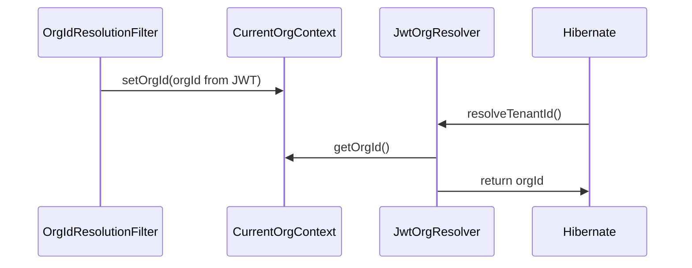

## Testing with Discriminator-Based Multitenancy

Entities use `@TenantId` on their `orgId` field. Org resolution uses a two-component design:

1. **`OrgIdResolutionFilter`** — a JAX-RS `ContainerRequestFilter` that runs after authentication and extracts `orgId` from the authenticated JWT (OIDC ID token, MP-JWT Bearer access token, or raw Bearer header as fallback), then stores it in the request-scoped `CurrentOrgContext`.
2. **`JwtOrgResolver`** — implements `TenantResolver`; reads `orgId` from `CurrentOrgContext`. Falls back to the configured default org (`default.org.uuid` config property) when no request context is active (e.g. in service tests).



### Required Configuration

```properties
quarkus.hibernate-orm.multitenant=DISCRIMINATOR
default.org.uuid=00000000-0000-0000-0000-000000000000
```

### TenantResolver Pattern

`JwtOrgResolver` uses `Arc.container().requestContext().isActive()` to detect when no HTTP request context exists (e.g. in service tests), and falls back to `defaultOrgId`. **In production (`LaunchMode.NORMAL`) the fallback throws** — no request should silently resolve to the default tenant.

```java
@PersistenceUnitExtension
@RequestScoped
public class JwtOrgResolver implements TenantResolver {

    @ConfigProperty(name = "default.org.uuid")
    String defaultOrgId;

    @Inject
    Instance<CurrentOrgContext> currentOrgContextInstance;

    @Override
    public String getDefaultTenantId() { return defaultOrgId; }

    @Override
    public String resolveTenantId() {
        try {
            if (!Arc.container().requestContext().isActive()) {
                return fallbackToDefault("request context not active");
            }
            if (currentOrgContextInstance != null && currentOrgContextInstance.isResolvable()) {
                CurrentOrgContext ctx = currentOrgContextInstance.get();
                if (ctx != null && ctx.getOrgId() != null && !ctx.getOrgId().isBlank()) {
                    return ctx.getOrgId();
                }
            }
        } catch (Exception e) {
            return fallbackToDefault("exception: " + e.getMessage());
        }
        return defaultOrgId;
    }

    private String fallbackToDefault(String reason) {
        if (LaunchMode.current() == LaunchMode.NORMAL) {
            throw new IllegalStateException(
                "Cannot resolve tenant in production without a valid request context. Reason: " + reason);
        }
        return defaultOrgId;  // dev/test only
    }
}
```

| Mistake | Result |
|---------|--------|
| Missing `@PersistenceUnitExtension` | Resolver not discovered |
| Missing `quarkus.hibernate-orm.multitenant=DISCRIMINATOR` | `HibernateException` |
| Returning `null` from `resolveTenantId()` | `HibernateException` |
| Not implementing `getDefaultTenantId()` | Runtime failure |
| Missing `OrgIdResolutionFilter` (or `CurrentOrgContext` not populated) | All requests resolve to default org — data isolation silently broken |

### Service Tests

`@QuarkusTest` service tests work without any mocking — `Arc.container().requestContext().isActive()` returns `false` outside an HTTP request, so operations automatically land in the configured default org:

```java
@QuarkusTest
public class MyServiceTest {
    @Inject MyService service;

    @Test
    @Transactional
    public void testCreate() {
        // entity is persisted with org_id = default.org.uuid automatically
        MyEntity created = service.create(...);
        assertNotNull(created.getId());
    }
}
```

### Cross-Org Isolation Tests

To insert data into a specific org (bypassing Hibernate's tenant filter), use native SQL:

```java
@Inject EntityManager em;

em.createNativeQuery(
    "INSERT INTO T_my_table (id, org_id, ...) VALUES (:id, :orgId, ...)")
    .setParameter("id", UUID.randomUUID().toString())
    .setParameter("orgId", "specific-org-uuid")
    .executeUpdate();
```

For REST API tests, set the tenant via a JWT with the `orgId` claim — `OrgIdResolutionFilter` extracts it from the Bearer token:

```java
private String generateToken(String accountId, String orgId, Set<String> groups) {
    return Jwt.issuer("https://abstrauth.abstratium.dev")
        .subject(accountId)
        .groups(groups)
        .claim("orgId", orgId)
        .sign();
}
```
