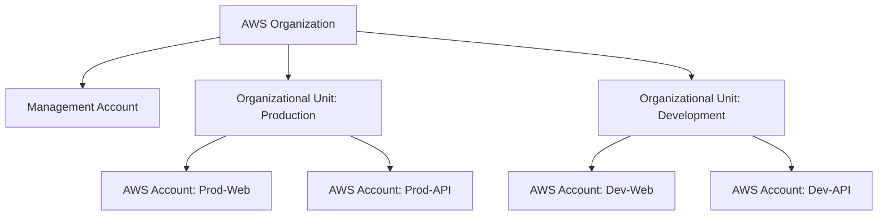
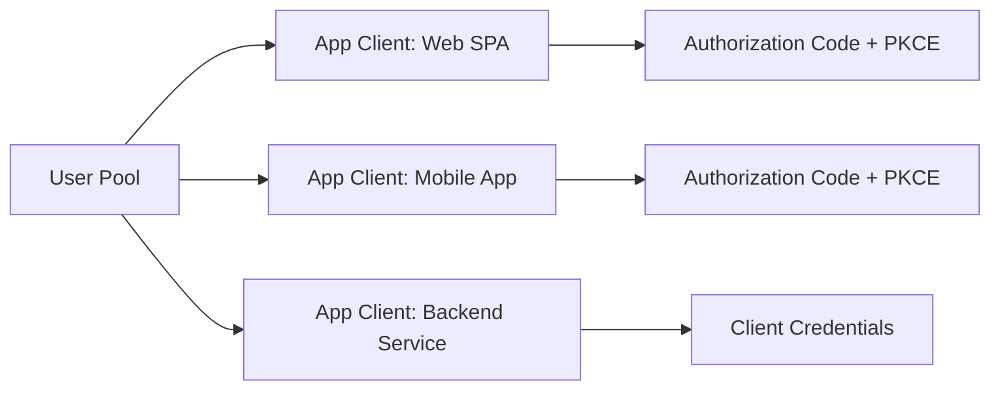
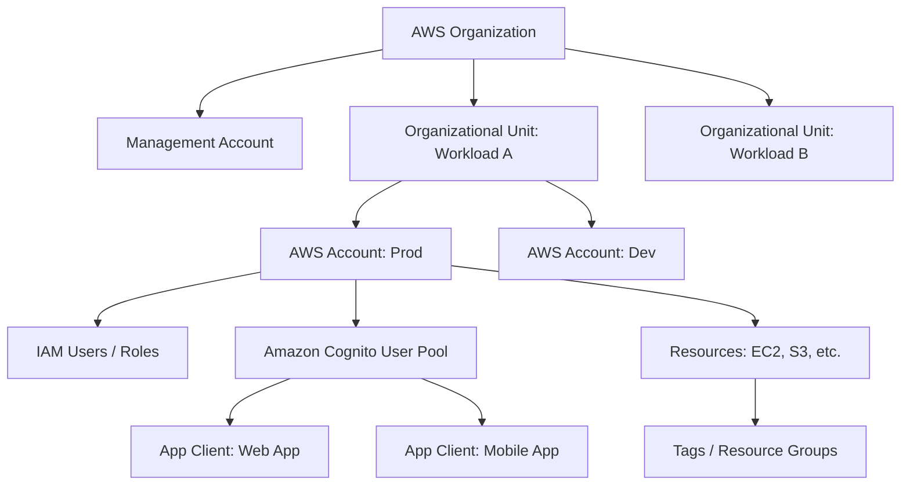

# AWS Tenant, Subscription, and Identity Organization Concepts

This document describes how Amazon Web Services (AWS) organizes tenants, subscriptions, identities, and applications, with comparisons to Microsoft Entra ID (Azure AD) where relevant. The goal is to understand the conceptual model so that design decisions for the Abstratium authorization server can be informed by how major cloud providers solve similar problems.

---

## 1. AWS Account: The Fundamental Boundary

In AWS, the closest equivalent to a "tenant" is the **AWS Account**.

- An AWS Account is the top-level container for all AWS resources.
- It has a unique 12-digit account ID.
- Billing, resource isolation, and service limits are all scoped to the account.
- Unlike Azure's tenant (which can contain multiple subscriptions), an AWS Account is both the billing boundary and the resource boundary.

### Multiple Accounts as a Best Practice

AWS recommends a **multi-account strategy** rather than placing all resources in a single account:

- **Production**, **Staging**, and **Development** each get their own account.
- Different business units or products may each have dedicated accounts.
- This provides blast-radius isolation and cleaner billing separation.

To manage multiple accounts, AWS provides **AWS Organizations**.

---

## 2. AWS Organizations: Hierarchical Management of Accounts

**AWS Organizations** is the service used to group and govern multiple AWS accounts.



### Key Concepts in AWS Organizations

| Concept | Description |
|---------|-------------|
| **Organization** | A container for multiple AWS accounts under centralized management. |
| **Management Account** | The account that creates the organization. It pays the bills and sets policies. |
| **Member Accounts** | All other accounts in the organization. |
| **Organizational Units (OUs)** | Logical groupings of accounts (e.g., by environment, team, or workload). |
| **Service Control Policies (SCPs)** | IAM-like policies attached to OUs or accounts that restrict what actions are allowed across the entire organization. |
| **Consolidated Billing** | All accounts in the organization roll up to the Management Account for billing. |

### Relationship to "Tenants"

- There is **no explicit "tenant" concept** above the account level in AWS.
- The **Organization** serves as an umbrella for governance, but it is not a security boundary.
- Each account remains an isolated boundary. Cross-account access is only possible via explicit IAM role assumptions.

---

## 3. IAM: Users, Roles, and Policies

**AWS Identity and Access Management (IAM)** is the service for controlling who can access what within an AWS Account.

### IAM Users

- Represent a single person or application that needs long-term AWS access.
- Can have passwords (for console access) and/or access keys (for programmatic access).
- Best practice: minimize IAM users; prefer federated access (see below).

### IAM Roles

- **Roles** are the primary mechanism for granting permissions.
- A role defines a set of permissions (via attached policies) but is not associated with a single identity.
- Roles are assumed by:
  - IAM users
  - AWS services (e.g., an EC2 instance assuming a role)
  - Federated identities from an external IdP
- **Trust Policy**: Every role has a trust policy that defines which principals are allowed to assume it.
- **Temporary Credentials**: Assuming a role yields temporary security credentials (access key, secret key, session token).

### IAM Policies

- JSON documents that define permissions.
- Can be attached to users, groups, or roles.
- The policy evaluation engine is based on explicit `Allow` and `Deny`.

### IAM Groups

- Collections of IAM users.
- Policies can be attached to groups, and all members inherit those permissions.
- Groups cannot be nested and cannot contain other groups.

---

## 4. Federated Access: Connecting External Identities to AWS

AWS does not natively function as a user directory for enterprise employees in the same way that Microsoft Entra ID does. Instead, AWS expects that enterprises manage their users in an external **Identity Provider (IdP)** and federate those identities into AWS.

### SAML 2.0 Federation

- Enterprises using Active Directory Federation Services (AD FS), Okta, Ping, or similar can federate into AWS.
- The IdP authenticates the user and sends a SAML assertion to AWS.
- AWS **Security Token Service (STS)** validates the assertion and returns temporary credentials.
- The user assumes an IAM Role mapped from SAML attributes (e.g., group membership).

### OIDC / OAuth 2.0 Federation

- AWS supports OIDC identity providers for both workforce and web/mobile applications.
- **Amazon Cognito** is AWS's primary service for OIDC/OAuth 2.0 based identity for applications.
- IAM can also trust OIDC providers directly (e.g., GitHub Actions, Google, or a custom IdP).

---

## 5. Amazon Cognito: OAuth Clients and Application Access

**Amazon Cognito** is the AWS service that provides authentication, authorization, and user management for web and mobile applications. It is the closest AWS equivalent to Azure AD's application registration and OAuth client model.

### Cognito User Pools

- A **User Pool** is a user directory (like a mini-Entra tenant).
- It stores usernames, passwords, and standard/profile attributes.
- Supports MFA, password policies, email/phone verification, and custom attributes.

### OAuth 2.0 and OIDC in Cognito

- A User Pool can act as an **OIDC Identity Provider**.
- It supports the Authorization Code Flow (with PKCE) and Implicit Flow.

### App Clients (OAuth Clients)

- Within a User Pool, you create **App Clients**.
- Each App Client represents an OAuth 2.0 client.
- App Client settings include:
  - **Client ID** (public identifier)
  - **Client Secret** (optional; used for confidential clients)
  - **Allowed OAuth Flows** (authorization code, implicit, client credentials)
  - **Allowed OAuth Scopes** (openid, email, profile, custom scopes)
  - **Allowed Callback URLs** (redirect URIs)
  - **Allowed Sign-Out URLs**
  - **Token lifetimes** (access token, refresh token, ID token)



### Resource Servers and Custom Scopes

- Cognito allows defining **Resource Servers** to model APIs.
- A Resource Server has custom scopes (e.g., `api/read`, `api/write`).
- App Clients can be configured to request these custom scopes.

### Application Configuration for User Access

To allow users to access an application via Cognito:

1. **Create a User Pool** (if not already existing).
2. **Create an App Client** within the User Pool for the application.
3. **Configure the App Client** with the correct redirect URIs, flows, and scopes.
4. **Optionally configure a domain** for the hosted UI (Cognito provides a login page out of the box).
5. **Assign users or groups** to the application by ensuring they exist in the User Pool and have the necessary attributes/scopes.

Cognito **Hosted UI** provides a pre-built login, signup, and OAuth authorization page. Alternatively, applications can use the Cognito SDK/APIs to build custom flows.

---

## 6. Mapping Domain Users to Application Roles in JWTs

A common scenario: an enterprise has set up federation so all users under its domain can sign in to AWS, and it wants to run third-party software on an AWS VM that requires a JWT containing a `roles` claim. AWS has two paths.

### Path A: Amazon Cognito (the typical choice)

Cognito User Pools can federate with an external IdP (including IAM Identity Center, AD FS, Okta, or Google Workspace). To get application roles into a JWT:

1. **Create a User Pool** and add the corporate IdP as a federated identity provider.
2. **Create Cognito groups** that represent application roles (e.g. `AppAdmin`, `AppUser`).
3. **Assign users to groups**, either manually, via the `AdminAddUserToGroup` API, or dynamically in a **Pre Token Generation Lambda**.
4. When the user signs in, the Cognito **ID token** automatically contains:
   - `cognito:groups` — the list of group names
   - `cognito:roles` — IAM role ARNs (only if IAM roles are attached to groups)
   - `cognito:preferred_role` — the single IAM role with the lowest precedence

If the application expects a custom claim name such as `roles`, a Pre Token Generation Lambda can inject it:

```javascript
event.response = {
  claimsOverrideDetails: {
    claimsToAddOrOverride: {
      roles: event.request.userAttributes['cognito:groups']
    }
  }
};
```

### Path B: IAM Identity Center direct to the application

If the application supports SAML 2.0 or OIDC natively, it can be registered as an application in IAM Identity Center:

1. Add the application in IAM Identity Center.
2. Create directory **groups** (e.g. `AppAdmins`, `AppUsers`).
3. Assign users and groups to the application.
4. In **Attribute mapping**, map the IAM Identity Center group attribute to an application claim (e.g. `groups` → `roles`).

The token will contain the user's directory group memberships. It will **not** contain AWS IAM role ARNs, because IAM Identity Center **Permission Sets** are scoped to AWS account access, not third-party applications.

### The critical conceptual distinction

| Concept | Purpose | Ends up in app JWT? |
|---------|---------|---------------------|
| **IAM Identity Center groups** | Directory groups for SSO assignment | Yes (via attribute mapping) |
| **IAM Identity Center Permission Sets** | AWS IAM policy templates for account access | No |
| **IAM Roles** | AWS resource access credentials | No (unless via Cognito `cognito:roles`) |
| **Cognito Groups** | Application-level roles inside a User Pool | Yes (`cognito:groups`) |

AWS separates **AWS access control** (IAM roles, Permission Sets) from **application access control** (directory groups, Cognito groups). An administrator who wants roles in an application JWT is working in the application-access layer.

---

## 7. Comparison: AWS vs. Microsoft Entra ID

| Concept | AWS | Microsoft Entra ID |
|---------|-----|---------------------|
| **Top-level boundary** | AWS Account | Tenant (Organization) |
| **Billing container** | AWS Account (or consolidated via Organizations) | Subscription |
| **User directory** | IAM (limited), or Cognito User Pool, or external IdP | Entra ID itself (primary) |
| **Federation model** | External IdP -> IAM Role (SAML/OIDC) | External IdP -> Entra ID (or native) |
| **OAuth 2.0 / OIDC provider** | Amazon Cognito | Entra ID (Azure AD) |
| **OAuth Client** | Cognito App Client | App Registration (Client) |
| **Application assignment** | User Pool Group / Scope mapping | Enterprise Application assignment + Roles |
| **Hierarchical grouping** | AWS Organizations -> OUs -> Accounts | Tenant -> Management Groups -> Subscriptions -> Resource Groups |

### Key Differences

- **AWS does not have a "Subscription" concept**. Billing is directly tied to the Account. Organizations provides consolidated billing, but the subscription equivalent is simply "being a member account under a payer account."
- **AWS does not have a native "tenant-level" user directory for workforce**. Enterprise users are federated in. Cognito User Pools are application-focused, not workforce-focused.
- **IAM Roles are central to AWS access**. In Entra, users are directly assigned to applications or groups. In AWS, even federated users assume IAM Roles to get permissions.

---

## 8. Other Organizational Concepts in AWS

Beyond Accounts and Organizations, AWS uses several other mechanisms to organize and govern resources and billing:

### Resource Groups and Tags

- **Tags** are key-value pairs attached to AWS resources.
- **Resource Groups** are collections of resources that share one or more tags.
- Used for cost allocation, automation, and operational organization.

### AWS Control Tower

- Builds on Organizations to set up a **multi-account landing zone** with guardrails.
- Provides **Account Factory** for vending new accounts with pre-configured baselines.
- Enforces governance via **Preventive Guardrails** (SCPs) and **Detective Guardrails** (AWS Config rules).

### AWS Billing Conductor (formerly Billing and Cost Management)

- Allows creating **Billing Groups** and **Pricing Rules** to map usage to specific internal business units or products.
- Can be used to create custom chargeback/showback reports.

### AWS License Manager

- Tracks software licenses across AWS and on-premises environments.
- Helps organize purchased licenses and enforce license rules.

---

## 9. Summary of Organizational Hierarchy



---

## 10. Implications for Abstratium Design

Understanding the AWS model highlights several design considerations:

1. **The "Tenant" boundary must be explicit.** AWS uses the Account as a hard boundary. For Abstratium, the tenant concept should similarly isolate data, users, and OAuth clients.
2. **OAuth clients should be configurable per-application.** Like Cognito App Clients, Abstratium clients should have per-client settings for flows, scopes, redirect URIs, and token lifetimes.
3. **Role assumption is a powerful model.** AWS's use of roles (with trust policies and temporary credentials) provides fine-grained, revocable access. Consider whether Abstratium should support a similar "role assignment at token issuance" concept.
4. **Organizations above tenants are optional.** AWS Organizations sits above Accounts but does not replace them. If Abstratium ever needs multi-tenant aggregation, a separate "Organization" layer could be introduced without changing the tenant boundary.
5. **No single user directory for all use cases.** AWS separates workforce identity (federated to IAM) from application identity (Cognito). Abstratium should remain focused on the OAuth 2.0 application identity use case.
