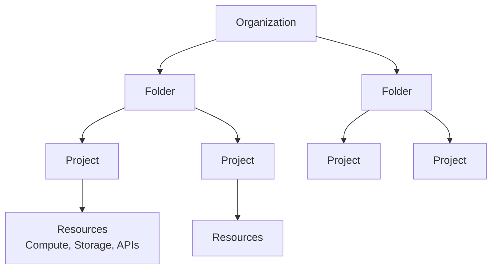
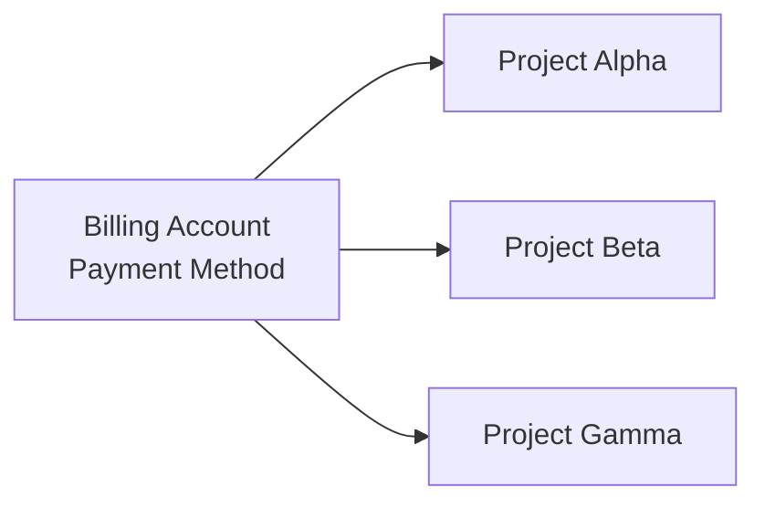
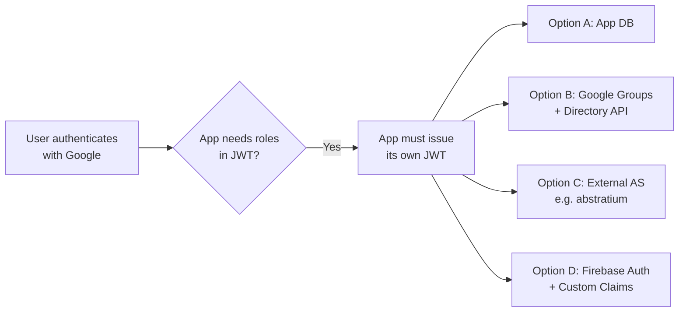

# GCP: Tenants, Subscriptions, Identity, and Application Organization

This document describes how Google Cloud Platform (GCP) organizes its customers,
identities, resources, and applications. It is intended to inform abstratium's
own authorization-server design by understanding how a major cloud provider
solves analogous problems.

---

## 1. The GCP Resource Hierarchy

GCP does **not** use the term "tenant" as a first-class construct in the same
way Microsoft Entra ID or some SaaS platforms do. Instead, GCP organizes
resources through a tree-like hierarchy.

### 1.1 Hierarchy Levels

| Level | Purpose |
|-------|---------|
| **Organization** | The root node. Tied to a Google Workspace or Cloud Identity account (a domain, e.g. `example.com`). Represents the legal entity. |
| **Folder** | Optional grouping mechanism. Used for departments, teams, or environments (e.g. `prod`, `dev`). Policies can be inherited downward. |
| **Project** | The primary **billing and resource-isolation boundary**. Every GCP resource (VM, bucket, API key) belongs to exactly one project. |
| **Resources** | Actual services: Compute Engine VMs, Cloud Storage buckets, Pub/Sub topics, etc. |

### 1.2 What Is the "Tenant" Equivalent?

- The closest concept to a **tenant** in GCP is the **Organization** (linked to a
  Google Workspace / Cloud Identity domain) **or** a standalone **Project**.
- A single Organization can contain many Projects. Each Project is effectively
  an isolated namespace for resources.
- Multi-tenant SaaS vendors on GCP often map their own tenants to GCP Projects
  or to resource namespaces *within* a shared Project, depending on isolation
  requirements.

---

## 2. Identity and Access Management (IAM)

### 2.1 Identities in GCP

GCP identities are **global** to Google (not scoped to a single Project). They
include:

| Identity Type | Description |
|---------------|-------------|
| **Google Account** | A personal `@gmail.com` or custom-domain user (e.g. `alice@example.com`). |
| **Google Workspace Account** | A managed user under a custom domain, administered by an organization. |
| **Cloud Identity Account** | A managed user without Workspace productivity apps (Gmail, Drive); provides pure identity/cloud IAM. |
| **Service Account** | A non-human identity (`...@project-id.iam.gserviceaccount.com`) used by applications and VMs. |
| **Group** | A collection of users or service accounts, managed in Google Workspace / Cloud Identity. |

### 2.2 Roles and Permissions

GCP uses **IAM Roles** to grant permissions. Roles are collections of
fine-grained permissions (e.g. `storage.buckets.get`).

| Role Category | Description |
|---------------|-------------|
| **Primitive Roles** | Legacy broad roles: `Owner`, `Editor`, `Viewer`. Not recommended for production. |
| **Predefined Roles** | Google-curated roles for specific services (e.g. `roles/storage.objectViewer`). |
| **Custom Roles** | Organization- or Project-level roles created by administrators with a specific permission set. |

Roles are attached to identities via **IAM Bindings** on a resource. Because of
hierarchical inheritance, a principal granted a role on a Folder automatically
has that role on all descendant Projects and Resources (unless overridden).

### 2.3 Comparison to Microsoft Entra ID

| Concept | Microsoft Entra ID | GCP IAM |
|---------|-------------------|---------|
| Tenant | **Tenant** (directory, e.g. `contoso.onmicrosoft.com`) | **Organization** (linked to Workspace/Cloud Identity domain) |
| User Store | Entra ID directory | Google Workspace / Cloud Identity directory |
| Role Assignment | Assigned to users/groups at tenant, subscription, or resource scope | Assigned to principals at Organization, Folder, Project, or resource scope |
| App Registration | App registration + Enterprise App | OAuth 2.0 Client ID (see Section 3) |

---

## 3. OAuth 2.0 Clients and Application Configuration

### 3.1 Where Are OAuth Clients Modeled?

In GCP, OAuth 2.0 clients are created inside the **Google Cloud Console**
under a specific **Project**:

1. Navigate to **APIs & Services > Credentials**.
2. Click **Create Credentials > OAuth client ID**.
3. Select an application type:
   - Web application
   - Android
   - iOS
   - Desktop app
   - TVs and Limited Input devices
   - Universal Windows Platform (UWP)

Each OAuth client ID is **tied to the Project** in which it was created. The
Project therefore acts as the administrative boundary for the client.

### 3.2 OAuth Client Configuration

When creating a Web application OAuth client, the following are configured:

| Field | Purpose |
|-------|---------|
| **Authorized JavaScript origins** | Domains from which OAuth requests can be initiated (e.g. `https://app.example.com`). |
| **Authorized redirect URIs** | The exact callback URLs to which Google will send the authorization `code` (e.g. `https://app.example.com/oauth2/callback`). |
| **Client ID** | Public identifier (e.g. `123456789-abc.apps.googleusercontent.com`). |
| **Client Secret** | Confidential secret (only for server-side/web flows). |

### 3.3 Scopes and APIs

Before an OAuth client can request scopes, the **Google APIs** themselves must
be **enabled** on the Project:

- **APIs & Services > Enabled APIs & services**
- Examples: Google Calendar API, Gmail API, BigQuery API.

This is a two-layer model:
1. The **Project** enables APIs (resource usage / billing).
2. The **OAuth client** requests scopes at runtime, and the user consents.

### 3.4 Internal vs. External Apps

GCP classifies OAuth apps by audience:

| Type | Description |
|------|-------------|
| **Internal** | Only users within the same Google Workspace / Cloud Identity organization can authenticate. No verification required. |
| **External** | Any Google user can authenticate. Requires a verification and branding process by Google for sensitive scopes. |

This is conceptually similar to Entra ID's "single tenant" vs. "multi-tenant"
applications.

---

## 4. Application Access and User Consent

### 4.1 How Applications Are Configured to Allow Users

1. **Create the OAuth client ID** (as above).
2. **Configure the OAuth consent screen**:
   - App name, user support email, logo.
   - Authorized domains.
   - Scopes that the app will request.
3. **Publish the app** (if external).
4. **User interaction**: When a user visits the application and clicks "Sign in
   with Google", the application redirects to Google's OAuth 2.0 authorization
   endpoint (`https://accounts.google.com/o/oauth2/v2/auth`).

### 4.2 Consent and Granularity

Google displays a **consent screen** listing:
- The application name and developer information.
- The exact scopes being requested.
- Optional: a security warning if the app is unverified.

The user can choose to allow or deny. Once allowed, the application receives an
authorization code (in the Authorization Code flow) which it exchanges for
access and refresh tokens.

### 4.3 Admin Controls

Google Workspace administrators can restrict OAuth access:

- **App access control**: Block or allow specific third-party apps based on
  OAuth client ID.
- **API controls**: Disable less secure apps, enforce scope restrictions.
- **Trusted apps**: Pre-approve internal apps so users never see a consent
  screen.

---

## 5. Billing and Other Organizational Concepts

### 5.1 Billing Account

A **Billing Account** is a separate entity from Projects:

- A Billing Account is tied to a **payment method** (credit card, invoicing).
- One or more **Projects** are linked to a Billing Account.
- Costs incurred by resources inside a Project are charged to that Project's
  linked Billing Account.
- Billing Accounts can have **Budgets** and **Alerts**.

### 5.2 Subscriptions

GCP does **not** use the term "subscription" as a universal tenant boundary in
the way Microsoft Azure does (where a subscription is the billing and access
boundary for all resources). In GCP:

- **Subscription** refers mainly to **Pub/Sub subscriptions** or
  **Cloud Billing subscriptions** (a historical concept largely superseded by
  Billing Accounts).
- The functional equivalent of an Azure Subscription is a **GCP Project** (for
  resource grouping and billing) combined with a **Billing Account**.

### 5.3 Other Organizational Constructs

| Concept | Description |
|---------|-------------|
| **Resource Manager** | The API and service that manages the Organization, Folder, and Project hierarchy. |
| **Organization Policies** | Constraints applied at Organization or Folder level (e.g. "disable VM serial port access"). These are separate from IAM roles. |
| **VPC (Virtual Private Cloud)** | Network isolation within a Project. Multiple Projects can be connected via VPC peering or Shared VPC. |
| **Shared VPC** | Allows a host Project to share its VPC network with service Projects, centralizing network administration. |
| **Cloud Identity / Google Workspace** | The identity provider and directory service that underpins the Organization. User lifecycle (create, suspend, delete) happens here. |

---

## 6. Summary: GCP vs. Azure / Entra ID Terminology

| Azure / Entra ID Concept | GCP Equivalent |
|--------------------------|----------------|
| Tenant (Entra ID Directory) | Organization (linked to Workspace / Cloud Identity domain) |
| Subscription | Project + Billing Account |
| Resource Group | Folder (loose analogy) or Project |
| App Registration | OAuth 2.0 Client ID (within a Project) |
| Enterprise Application | OAuth consent screen configuration + client ID |
| Service Principal | Service Account |
| User / Group | Google Account / Workspace Group |
| Role Assignment | IAM Binding (at Org/Folder/Project/Resource level) |
| Conditional Access | Organization Policy + IAM Conditions (limited) |

---

## 7. Scenario: Third-Party App on GCE Requiring JWTs with User Roles

This section addresses a concrete scenario:

> A Google Workspace administrator has configured their domain so that all
> employees can sign in via Google. They deploy a third-party application on a
> Google Compute Engine (GCE) VM. That application requires authenticated
> users to present a JWT containing application-specific roles. How does the
> administrator set this up?

### 7.1 The Honest Answer: GCP IAM Does Not Provide This Out-of-the-Box

**Google's identity tokens (ID tokens / JWTs issued by Google's OIDC provider)
do not contain application-specific role claims.**

When a user authenticates with Google (via OAuth 2.0 / OIDC), Google issues:

- An **ID Token** (JWT) with standard claims: `sub`, `email`, `name`, `hd`
  (hosted domain), `picture`, `iss`, `aud`, `iat`, `exp`.
- An **Access Token** (opaque or JWT, but intended for Google APIs, not for
  custom application authorization).

Neither token includes custom claims such as `"roles": ["admin", "editor"]` for
a third-party application.

### 7.2 What the Administrator Can Do

There are four practical approaches. None are pure "GCP Console clicking";
most require application-side logic or an external identity provider.

#### Option A: The Application Maintains Its Own Role Database (Most Common)

1. The administrator configures the third-party app to use **"Sign in with
   Google"** (Google as an OIDC IdP).
2. The app receives the Google ID token, validates it, and extracts the user's
   `email` claim.
3. The app looks up that email in its own user/role database (e.g. a local
   table, LDAP, or an external service).
4. The app issues its **own JWT** containing the application-specific roles.

**Administrator actions in GCP:** None beyond ensuring the GCE VM is running
and network-reachable. All role configuration happens inside the third-party
application's own admin UI.

#### Option B: Derive Roles from Google Workspace Groups

1. The app still uses Google for authentication.
2. After validating the ID token, the app queries the **Google Workspace Admin
   SDK Directory API** (or the Cloud Identity API) to read the user's group
   memberships.
3. The app maps group names to application roles (e.g. `apps-admins@example.com`
   → `admin` role).
4. The app issues its own JWT with those roles.

**Administrator actions:**
- In the Google Workspace Admin Console, create groups (e.g.
  `apps-admins@example.com`, `apps-readers@example.com`) and add users to them.
- In the GCP Console, create a service account for the app and grant it the
  `https://www.googleapis.com/auth/admin.directory.group.readonly` scope so it
  can query the Directory API.

**Caveat:** This requires coding in the application. There is no native GCP
feature that automatically injects group memberships into a JWT.

#### Option C: Use an External Identity / Authorization Server

1. The administrator configures the third-party app to trust an external
   authorization server (e.g. abstratium, Okta, Auth0, Keycloak) rather than
   Google directly.
2. The external AS is configured to federate with Google Workspace (OIDC or
   SAML) for authentication.
3. The administrator assigns application roles **inside the external AS** (not
   in GCP).
4. When a user signs in, the AS issues a JWT containing the roles.

**Administrator actions in GCP:**
- Deploy the AS itself (if self-hosted) on GCE or GKE.
- Optionally, use **Workload Identity Federation** if the AS needs to access
  GCP resources, but this is orthogonal to the user-auth JWT.

#### Option D: Use Firebase Auth / Identity Platform with Custom Claims

1. The administrator sets up **Firebase Authentication** (now part of Google
   Cloud Identity Platform) in a GCP Project.
2. Users sign in with Google through Firebase Auth.
3. An **administrator backend** uses the Firebase Admin SDK to set **custom
   claims** on the user record (e.g. `{ "roles": ["admin"] }`).
4. Firebase Auth issues an ID token containing those custom claims.
5. The third-party app validates the Firebase ID token.

**Administrator actions:**
- In the GCP Console, enable Identity Platform / Firebase Auth.
- Write and deploy a small admin service (e.g. a Cloud Function or app on
  GCE) that uses the Firebase Admin SDK to assign custom claims.
- There is **no GCP Console UI** for directly editing custom claims on a user;
  it must be done programmatically.

### 7.3 Why GCP IAM Cannot Be Used Directly

A common misconception is that GCP IAM roles (e.g. `roles/editor`) could be
embedded in a JWT for an arbitrary application. This does not work because:

| Aspect | GCP IAM | Application-Level Role JWT |
|--------|---------|---------------------------|
| **Purpose** | Control access to GCP resources (VMs, buckets, APIs). | Control access to application features (e.g. `can_delete_invoice`). |
| **Token Type** | Access tokens for Google APIs; not meant for external apps. | ID tokens or custom JWTs meant for the application's own authorization layer. |
| **Role Format** | GCP predefined/custom roles (`roles/...`). | Application-defined strings (`admin`, `editor`, `viewer`). |
| **Claim Inclusion** | IAM bindings are checked at the GCP API layer, not embedded in tokens. | Must be explicitly added to the JWT payload by the token issuer. |
| **Scope** | GCP resource hierarchy (Org/Folder/Project/Resource). | Application business logic. |

### 7.4 Summary for the Administrator

There is **no single GCP Console page** where an administrator can click
"add role `editor` to user `alice@example.com` for application `MyApp`" and
have Google automatically issue JWTs with that role. GCP does not model
third-party application roles natively.

---

## 8. Relevance to abstratium

Understanding GCP's model is useful for abstratium because:

1. **Hierarchy vs. Flattening**: GCP uses a deep hierarchy (Org → Folder →
   Project). abstratium currently uses a flatter model (tenant → clients →
   users). We should consider whether hierarchical scopes (e.g. organization-wide
   policy inheritance) are ever needed.

2. **Project as the Boundary**: GCP treats the Project as the atomic unit of
   billing, API enablement, and resource ownership. In abstratium, the
   **tenant** is the closest analog, but we may want to distinguish between
   "who pays" and "who administers."

3. **OAuth Clients Are Project-Scoped**: In GCP, an OAuth client ID belongs to
   one Project. In abstratium, clients belong to one tenant. This aligns
   well, but we should remain mindful that GCP additionally scopes API usage
   (resource permissions) by Project, whereas abstratium separates the auth
   server from the resource servers.

4. **Consent and Admin Override**: Google's ability for Workspace admins to
   pre-approve or block apps is a powerful enterprise feature. abstratium's
   admin console could eventually offer similar capabilities: mandating or
   suppressing consent for internal applications.
