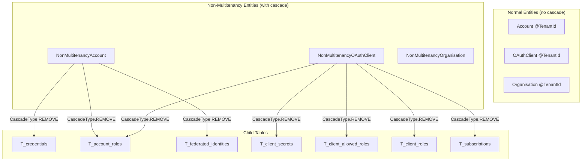

# Replacing DB-Level CASCADE DELETE with JPA Cascades for Hibernate Envers

## Background

The database currently uses `ON DELETE CASCADE` foreign key constraints for child table cleanup. While efficient, these execute entirely in the database engine, **bypassing Hibernate's entity lifecycle events**. Hibernate Envers audits deletions by intercepting `@PreRemove`/`@PostRemove` — events that DB-level cascades never fire.

To make audit trails complete when Envers is adopted, the high-value child relationships must be moved to JPA-level cascades.

## Solution: Non-Multitenancy Package for Cascade Deletes

**All cascade deletes are implemented in the `non_multitenancy` package only.**

The normal `@TenantId` entities (`Account`, `OAuthClient`, `Organisation`) **do not have cascade annotations**. This prevents a "foot-gun" scenario where tenant-scoped deletion would only delete children visible to that tenant, leaving orphaned rows in other tenants.

Cascade logic is centralized in the non-multitenancy entities where cross-tenant (all-organisations) deletion is intentional and safe.

## Current State



## Why This Approach?

### The Problem with `@TenantId` + Cascade

If `Account` (with `@TenantId`) had `cascade = CascadeType.REMOVE` on `roles`:
- Loading `Account` in Org A's session → Hibernate applies tenant filter
- Collection only loads `AccountRole` rows where `org_id = 'org-a'`
- `em.remove(account)` → only deletes those visible roles
- Roles for same account in Org B, C, D remain as orphans

### The Solution

Delete **only** through non-multitenancy services:

```java
// NonMultitenancyAccountService.java
@Transactional
public boolean deleteAccountWithCascade(String accountId) {
    // Load account WITHOUT tenant filter (sees all data)
    NonMultitenancyAccount account = em.find(NonMultitenancyAccount.class, accountId);

    // Business logic: prevent deletion of only admin for abstratium-abstrauth
    if (hasTheOnlyAdminRoleForAbstrauthClient(accountId)) {
        throw new IllegalArgumentException(...);
    }

    // Manual cleanup of entities without cascade FK
    deleteAuthorizationRequestsForAccount(accountId);

    // Cascade happens here - loads ALL roles/credentials across ALL orgs
    em.remove(account);
    return true;
}
```

## REST Endpoint Structure

| Endpoint | Package | Purpose |
|----------|---------|---------|
| `DELETE /api/accounts/{id}` | `non_multitenancy/boundary` | Cross-tenant cascade delete via `NonMultitenancyAccountService` |
| `DELETE /api/clients/{id}` | `non_multitenancy/boundary` | Cross-tenant cascade delete via `NonMultitenancyOAuthClientService` |
| Other account/client operations | `boundary/api` | Normal tenant-scoped CRUD |

## Classification: What to Migrate vs. What to Keep

| Table | Audit value | Action |
|---|---|---|
| `T_credentials` | **High** — password records | Cascade in `NonMultitenancyAccount` |
| `T_account_roles` | **High** — access control records | Cascade in `NonMultitenancyAccount` & `NonMultitenancyOAuthClient` |
| `T_federated_identities` | **High** — identity linkage | Cascade in `NonMultitenancyAccount` |
| `T_client_secrets` | **High** — secret lifecycle | Cascade in `NonMultitenancyOAuthClient` |
| `T_client_allowed_roles` | **High** — access policy | Cascade in `NonMultitenancyOAuthClient` |
| `T_client_roles` | **High** — client-to-client grants | Cascade in `NonMultitenancyOAuthClient` |
| `T_subscriptions` | **High** — org/client relationships | Cascade in `NonMultitenancyOAuthClient` |
| `T_authorization_requests` | Low — transient OAuth state | **Manual delete** in service (no FK cascade) |
| `T_authorization_codes` | Low — transient OAuth state | Keep DB cascade |
| `T_revoked_tokens` | Low — transient security state | Keep DB cascade |

## Risks (Mitigated)

- **N+1 SELECTs on deletion** — Acceptable for low-frequency admin operations (delete account, delete client). Not used for bulk operations.
- **Foot-gun prevention** — Normal entities have NO cascade. Accidental `em.remove()` on tenant-scoped entity fails fast with FK violation rather than partial delete.
- **Transaction scope** — All child deletes happen in same transaction. Hibernate flushes children before parents.

## Rewards

- Hibernate Envers will record a `DEL` audit row for every child entity when parent is deleted
- Cross-tenant cascade ensures no orphaned rows across organisations
- Clear separation: deletion only through `non_multitenancy` package
- Audit trail shows complete deletion path for compliance

## Implementation Details

### Normal Entities (NO cascade)
```java
@Entity
@Table(name = "T_accounts")
public class Account {
    @OneToMany(fetch = FetchType.LAZY)  // NO cascade
    @JoinColumn(name = "account_id", ...)
    private List<AccountRole> roles;
}
```

### Non-Multitenancy Entities (WITH cascade)
```java
@Entity
@Table(name = "T_accounts")  // Same table!
public class NonMultitenancyAccount {
    @OneToMany(fetch = FetchType.LAZY, cascade = CascadeType.REMOVE)
    @JoinColumn(name = "account_id", ...)
    private List<NonMultitenancyAccountRole> roles;
}
```

### REST Resources
- `AccountsResource` (normal package) — no delete endpoint
- `ClientsResource` (normal package) — no delete endpoint
- `NonMultitenancyAccountsResource` — `DELETE /api/accounts/{id}`
- `NonMultitenancyClientsResource` — `DELETE /api/clients/{clientId}`

## Migration Status: COMPLETE

✅ `NonMultitenancyOAuthClient` — cascade on all child collections  
✅ `NonMultitenancyAccount` — cascade on all child collections  
✅ `NonMultitenancyAccountService.deleteAccountWithCascade()` — with admin protection  
✅ `NonMultitenancyOAuthClientService.deleteClientWithCascade()` — with abstrauth protection  
✅ `NonMultitenancyAccountsResource` — DELETE endpoint  
✅ `NonMultitenancyClientsResource` — DELETE endpoint  
✅ Removed delete endpoints from normal boundary resources  
✅ Removed cascade annotations from normal `@TenantId` entities  
✅ Updated AGENTS.md documentation
