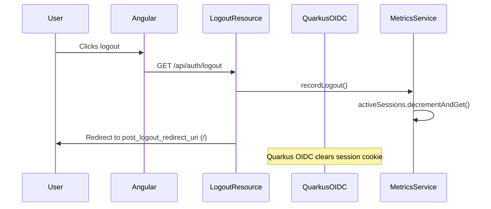
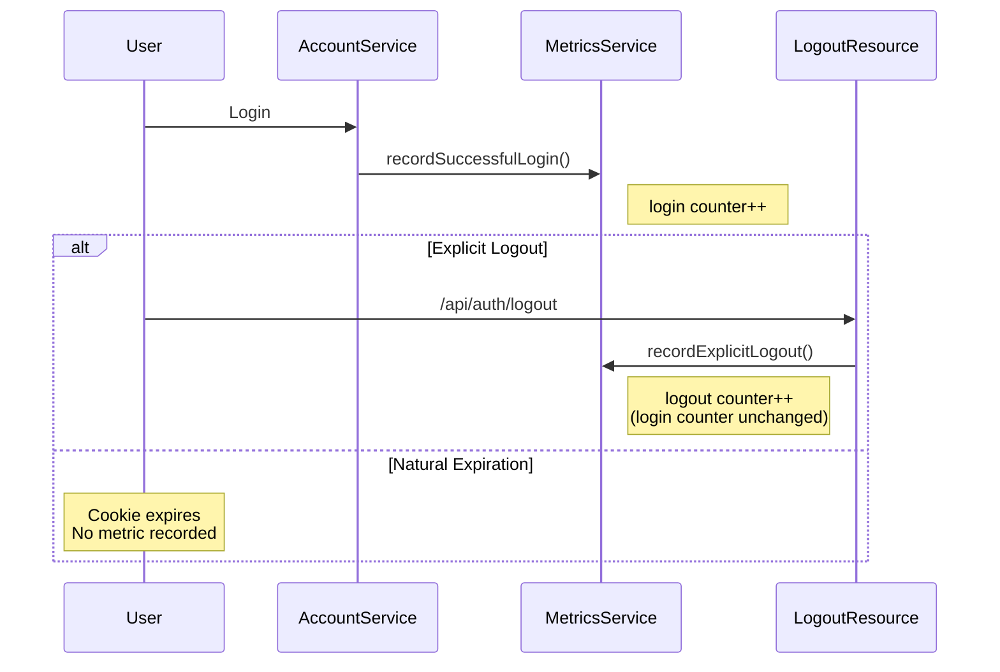

# Logout and Session Management in Abstrauth

## Overview

Abstrauth uses Quarkus OIDC with the Backend For Frontend (BFF) pattern to manage user sessions and logout. This document explains how logout works, how sessions expire, and how metrics are tracked.

## Session Management

### Session Storage
- Sessions are stored in **HTTP-only, encrypted cookies** scoped to `/api`
- Cookie encryption is configured via `COOKIE_ENCRYPTION_SECRET` environment variable
- Session tokens are split (`quarkus.oidc.bff.token-state-manager.split-tokens=true`) for security
- Cookies use `SameSite=Strict` to prevent CSRF attacks

### Session Timeout
- **Default timeout**: 15 minutes (900 seconds) configured via `abstrauth.session.timeout.seconds`
- Session age is extended via `quarkus.oidc.bff.authentication.session-age-extension=PT900S`
- When the ID token expires, the session cookie also expires

### Automatic Session Expiration
When a user closes their laptop or becomes inactive:

1. **Client-side expiration**: The Angular `AuthService` monitors token expiration and automatically redirects to logout when the token expires
2. **Server-side expiration**: When the session cookie expires (after 15 minutes of inactivity), Quarkus OIDC automatically clears the session
3. **No explicit logout request needed**: If the cookie expires naturally, the session is already gone from the server's perspective

**Session Metrics Limitation**: We cannot reliably track active sessions because Quarkus OIDC does not provide callbacks for automatic session expirations. Therefore, we track logins and explicit logouts as **independent counters** that do not decrement/increment each other.

## Logout Mechanisms

### 1. User-Initiated Logout (RP-Initiated Logout)

**Endpoint**: `/api/auth/logout` (GET or POST)

**Flow**:


**Configuration**:
```properties
# Logout endpoint
quarkus.oidc.bff.logout.path=/api/auth/logout

# Where to redirect after logout
quarkus.oidc.bff.logout.post-logout-path=/

# End session endpoint (for RP-initiated logout spec)
quarkus.oidc.bff.end-session-path=/api/auth/logout
```

**Implementation**:
- `LogoutResource` handles the logout request
- Records logout metric via `MetricsService.recordLogout()`
- Decrements `activeSessions` counter
- Redirects to configured post-logout path (default: `/`)
- Quarkus OIDC automatically clears the session cookie

**Limitations**:
- Currently does NOT validate `id_token_hint`
- Does NOT revoke refresh tokens (not yet implemented)
- Does NOT clear server-side session state (sessions are cookie-based only)

### 2. Automatic Token Expiration

When the ID token expires (after 15 minutes):

**Without explicit logout**:
1. Session cookie expires
2. User is redirected to login on next request
3. **Metrics issue**: `activeSessions` counter is NOT decremented

**With Angular-side monitoring**:
1. `AuthService` detects token expiration
2. Calls `signout()` which redirects to `/api/auth/logout`
3. Metrics are properly updated

### 3. Back-Channel Logout

**Not currently configured** in Abstrauth, but supported by Quarkus OIDC.

Back-channel logout allows the OIDC provider to force logout of all applications by calling a specific URL on each application.

**To enable**:
```properties
quarkus.oidc.logout.backchannel.path=/back-channel-logout
```

### 4. Front-Channel Logout

**Not currently configured** in Abstrauth, but supported by Quarkus OIDC.

Front-channel logout is executed by the user agent (browser) rather than in the background.

**To enable**:
```properties
quarkus.oidc.logout.frontchannel.path=/front-channel-logout
```

### 5. Local Logout

**Not currently implemented** in Abstrauth.

Local logout only clears the local session cookie without logging out from the OIDC provider. This would be useful if Abstrauth were using an external OIDC provider like Google.

**Example implementation**:
```java
@Inject
OidcSession oidcSession;

@GET
@Path("logout")
public String logout() {
    oidcSession.logout().await().indefinitely();
    return "You are logged out";
}
```

## Session Metrics Approach

### Why We Don't Track Active Sessions

Quarkus OIDC uses cookie-based sessions and does not provide reliable callbacks when sessions expire naturally (e.g., when a user closes their laptop and the cookie expires). The OIDC `SecurityEvent` types available are:
- `OIDC_LOGIN` - User logs in
- `OIDC_LOGOUT_RP_INITIATED` - User explicitly logs out
- `OIDC_SESSION_REFRESHED` - Session refreshed
- `OIDC_BACKCHANNEL_LOGOUT_COMPLETED` - BackChannel logout
- `OIDC_FRONTCHANNEL_LOGOUT_COMPLETED` - FrontChannel logout

**Missing**: No event for natural session expiration when cookies simply expire.

### Independent Counter Approach

Instead of trying to maintain an "active sessions" count, we track **independent counters**:

**Metrics**:
- `abstrauth.auth.login.success` - Total successful logins (never decrements)
- `abstrauth.auth.logout.explicit` - Total explicit logouts (never decrements)

**Important**: These counters are **completely independent**:
- Login counter does NOT decrement on logout
- Logout counter does NOT increment on login
- `successfulLogins - explicitLogouts` gives a **rough approximation** of sessions that may still be active, but this will drift over time due to automatic expirations

**Flow**:



**Why This Is Acceptable**:
- We can still track login trends over time
- We can track explicit logout behavior
- We avoid the complexity of session state management
- We don't provide misleading "active sessions" metrics that would be inaccurate
- For monitoring purposes, sudden changes in login/logout rates are more useful than absolute session counts

## Configuration Reference

### Current Configuration (application.properties)

```properties
# Session timeout (15 minutes)
abstrauth.session.timeout.seconds=900
quarkus.oidc.bff.authentication.session-age-extension=PT900S

# Logout configuration
quarkus.oidc.bff.logout.path=/api/auth/logout
quarkus.oidc.bff.logout.post-logout-path=/
quarkus.oidc.bff.end-session-path=/api/auth/logout

# Cookie configuration
quarkus.oidc.bff.authentication.cookie-path=/api
quarkus.oidc.bff.authentication.cookie-same-site=strict
quarkus.oidc.bff.token-state-manager.strategy=id-refresh-tokens
quarkus.oidc.bff.token-state-manager.split-tokens=true
quarkus.oidc.bff.token-state-manager.encryption-required=true
```

### Key Properties

| Property | Value | Purpose |
|----------|-------|---------|
| `quarkus.oidc.bff.logout.path` | `/api/auth/logout` | Logout endpoint path |
| `quarkus.oidc.bff.logout.post-logout-path` | `/` | Redirect after logout |
| `quarkus.oidc.bff.authentication.session-age-extension` | `PT900S` | Session duration (15 min) |
| `quarkus.oidc.bff.authentication.cookie-path` | `/api` | Cookie scope |
| `quarkus.oidc.bff.authentication.cookie-same-site` | `strict` | CSRF protection |

## References

- [OpenID Connect RP-Initiated Logout](https://openid.net/specs/openid-connect-rpinitiated-1_0.html)
- [OpenID Connect Session Management](https://openid.net/specs/openid-connect-session-1_0.html)
- [Quarkus OIDC Code Flow Authentication](https://quarkus.io/guides/security-oidc-code-flow-authentication)
- [Quarkus OIDC Logout Documentation](https://quarkus.io/guides/security-oidc-code-flow-authentication#logout-and-expiration)

## Recommendations

1. **Document the metrics limitation**: Add a note in the metrics documentation that `activeSessions` is an approximation
2. **Consider implementing a session listener**: Investigate Quarkus OIDC's `SecurityEventListener` to detect session expiration
3. **Monitor the metric trend**: Track the rate of increase to understand typical user behavior
4. **Future enhancement**: If exact session counts are critical, implement server-side session tracking with Redis
