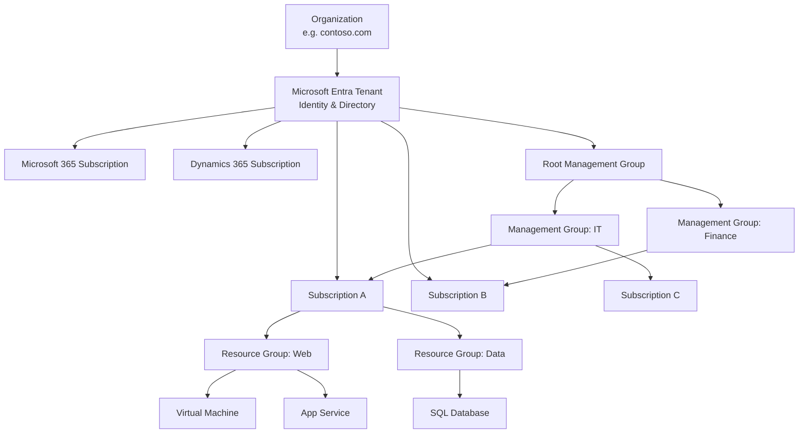
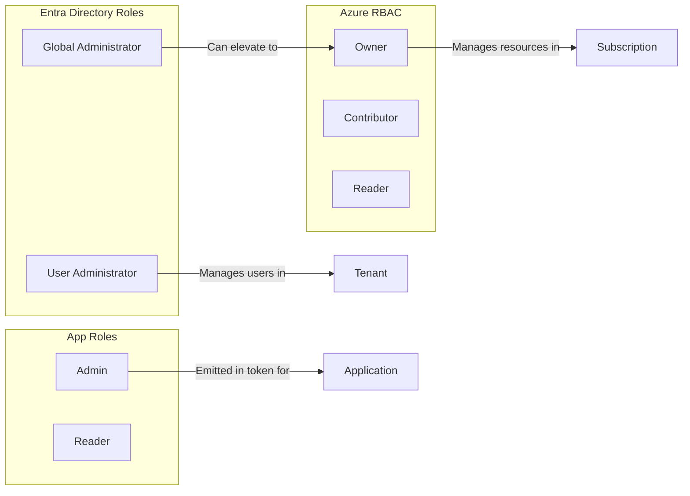
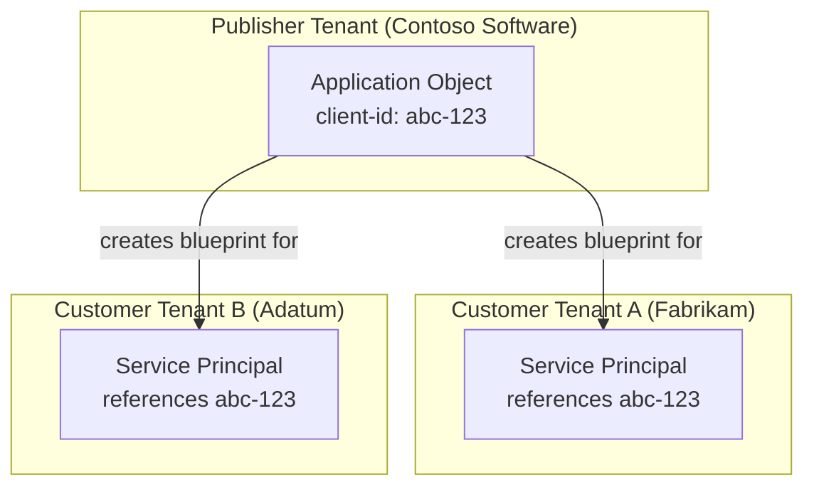
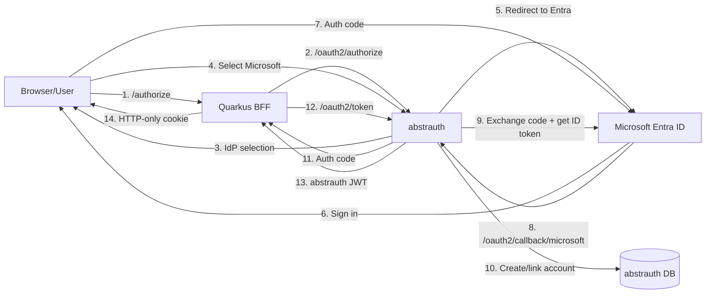

# Microsoft: Tenants, Subscriptions, and Organizational Concepts

This document describes how Microsoft organizes its cloud services, identities, and applications. It covers the hierarchy of tenants, subscriptions, and other organizational constructs; how users and roles are managed in Microsoft Entra; how OAuth clients and applications are modelled; and how applications are configured to allow users to access them.

## Overview of the Organizational Hierarchy

Microsoft uses a layered hierarchy to organize cloud resources, billing, and identity. The key concepts are:

- **Organization**
- **Microsoft Entra Tenant**
- **Subscriptions**
- **Licenses**
- **Management Groups**
- **Resource Groups**
- **Resources**



### Organization

An **organization** represents a business entity using Microsoft cloud offerings. It is typically identified by one or more public DNS domain names (e.g., `contoso.com`). The organization is a billing and legal container for all subscriptions.

### Microsoft Entra Tenant

A **Microsoft Entra tenant** (also called a **directory**) is a specific instance of Microsoft Entra ID containing:

- User accounts
- Groups
- Application registrations
- Service principals
- Enterprise applications
- Domains
- Directory roles

A tenant is the **identity boundary**. All user accounts for an organization live inside a tenant. Multiple subscriptions can trust the same tenant, meaning the same set of users can access resources across different subscriptions.

Key properties:
- A tenant has a globally unique identifier (tenant ID / directory ID).
- A tenant is associated with one or more custom domains (e.g., `contoso.com`).
- Subscriptions can only trust a **single** tenant.
- A single tenant can be trusted by **multiple** subscriptions.
- Paid or trial subscriptions of Microsoft 365 or Dynamics 365 include a free Entra tenant.

### Subscriptions

A **subscription** is an agreement with Microsoft to use one or more cloud platforms or services:

- **Microsoft 365 / Dynamics 365** (SaaS): charged per-user license fees.
- **Azure** (PaaS / IaaS): charged based on cloud resource consumption.

Subscriptions serve three main purposes:
1. **Billing boundary**: how resource usage is reported, billed, and paid for.
2. **Access control boundary**: who can administer resources.
3. **Resource limit boundary**: each subscription has quotas and limits.

An organization can have multiple subscriptions to separate costs by department, project, or environment (e.g., dev, staging, production).

### Licenses

For SaaS offerings (Microsoft 365, Dynamics 365), a **license** allows a specific user account to use the services. Licenses are purchased as part of a subscription and assigned to individual user accounts (or groups, via group-based licensing). A subscription can contain multiple licenses, and a user can hold multiple licenses from different subscriptions.

### Management Groups

**Management groups** provide a governance scope **above** subscriptions. They allow administrators to apply access controls, policies, and compliance rules across multiple subscriptions simultaneously via inheritance.

Key properties:
- A single tenant can support up to **10,000** management groups.
- The tree can be up to **six levels deep** (excluding root and subscription levels).
- Each subscription and management group has exactly **one parent**.
- A management group can have **many children** (subscriptions or other management groups).
- All subscriptions and management groups in a tenant exist within a **single hierarchy** rooted at the **root management group**.
- Anything assigned at the root applies to the **entire tenant**.

Management groups are primarily an Azure concept for organizing Azure resources, not Microsoft 365 services.

### Resource Groups

A **resource group** is a logical container for Azure resources that share the same lifecycle. Resources in a group are deployed, managed, and deleted together. Resource groups do not support inheritance from management groups directly, but policies and RBAC assigned at higher scopes cascade down.

### Service Groups

Microsoft also has a concept called **service groups**, which are used in Azure governance for organizing services at a higher level. They are less commonly encountered than management groups.

## Users and Roles in Microsoft Entra

Microsoft uses multiple distinct role systems. It is critical to understand which role system applies in which context.

### 1. Microsoft Entra Directory Roles

These roles control access to **directory resources** within the tenant: users, groups, domains, licenses, application registrations, and tenant-wide settings.

Key built-in roles:

| Role | Purpose |
|------|---------|
| **Global Administrator** | Full access to all Entra ID features; can assign other admin roles; can reset any password. |
| **User Administrator** | Create and manage users and groups; reset passwords for users and helpdesk admins. |
| **Application Administrator** | Manage all aspects of app registrations and enterprise apps; can consent to any app permission. |
| **Cloud Application Administrator** | Same as Application Administrator but cannot manage on-premise applications. |
| **Privileged Role Administrator** | Manage role assignments in Entra ID andPrivileged Identity Management (PIM). |
| **Billing Administrator** | Make purchases, manage subscriptions, monitor service health. |

Directory roles are assigned at **tenant scope** by default, though some can be scoped to a specific application registration.

### 2. Azure RBAC (Role-Based Access Control)

Azure RBAC is an authorization system built on Azure Resource Manager that provides fine-grained access management to **Azure resources** (VMs, storage, networks, etc.).

Key built-in roles:

| Role | Purpose |
|------|---------|
| **Owner** | Full access to manage all resources; can assign roles. |
| **Contributor** | Full access to manage all resources; **cannot** assign roles. |
| **Reader** | View Azure resources only. |
| **User Access Administrator** | Manage user access to Azure resources; can assign roles including Owner. |

Azure RBAC can be assigned at multiple scopes:
- Management group
- Subscription
- Resource group
- Individual resource

### 3. App Roles

**App roles** are application-specific roles defined by the developer during app registration. They appear as claims in tokens (ID tokens and access tokens) and allow the application itself to implement authorization.

App roles are defined in the **App registration** and assigned to users/groups in the **Enterprise application** (service principal).

Example app roles: `Admin`, `Reader`, `Survey.Writer`.

### Relationship Between the Three Role Systems



## How OAuth Clients and Applications are Modelled

Microsoft Entra ID models applications using three closely related concepts:

1. **Application Object**
2. **Application Registration**
3. **Service Principal**

### Application Object

An **application object** is the **global** representation of an application in its **home tenant**. It acts as a **blueprint** or **template** from which service principals are created.

The application object defines:
- How the service can issue tokens to access the application.
- The resources the application might need to access.
- The actions the application can take (OAuth scopes, app roles, API permissions).
- Redirect URIs, logout URLs, branding, etc.

An application object lives in exactly **one** tenant (the home tenant) and has a globally unique **Application (client) ID**.

### Service Principal

A **service principal** is the **local** representation of an application in a **specific tenant**. It is what actually enables the application to authenticate and access resources secured by that tenant.

There are three types of service principal:

| Type | Description |
|------|-------------|
| **Application** | The local instance of a global application object. Created automatically when an app is registered, or when a multitenant app is consented to. |
| **Managed Identity** | An automatically managed identity for Azure services. No associated app object. |
| **Legacy** | An app created before app registrations existed. Has no associated app registration. |

### Application Registration

When you **register an application** in Microsoft Entra, you create:
- An **application object** in your home tenant.
- A corresponding **service principal** in your home tenant.

For a **single-tenant** application, there is one application object and one service principal (both in the home tenant).

For a **multitenant** application:
- One application object in the **publisher's** home tenant.
- A service principal is created in **each customer tenant** when an admin or user consents to the application.



### Enterprise Applications

In the Microsoft Entra admin center, the **Enterprise applications** blade lists all **service principals** in the tenant. This includes:
- Service principals for apps your organization developed.
- Service principals for third-party SaaS apps (e.g., Salesforce, Slack) integrated from the Entra ID gallery.
- Service principals for multitenant apps that have been consented to.

The **App registrations** blade lists the **application objects** that are homed in your tenant.

### OAuth Client Configuration

An OAuth client is modelled through the application registration. Key settings include:

- **Application (client) ID**: The globally unique identifier for the client.
- **Client Secret / Certificate**: Credentials used in the client credentials flow or as a confidential client.
- **Redirect URIs**: Where authorization codes and tokens are sent after user authentication.
- **Supported account types**: Single tenant, multitenant, or personal Microsoft accounts.
- **API permissions**: Scopes and application permissions the client requests from resource APIs.
- **Authentication flows**: Authorization code, implicit, device code, client credentials, etc.

## How Applications are Configured to Allow Users to Access Them

### 1. Visibility and User Assignment

By default, new app registrations are **hidden from users**. To allow users to discover and access an application:

- In the **Enterprise applications** blade, open the service principal.
- Go to **Properties** and set **Visible to users?** to **Yes**.
- Optionally, set **Assignment required?** to **Yes** to restrict access to explicitly assigned users/groups only.

When **Assignment required** is enabled, only users and groups explicitly assigned to the application can sign in. This is the recommended security posture.

### 2. Assigning Users and Groups

Administrators assign users and groups to an enterprise application via:

1. **Microsoft Entra admin center**: `Entra ID > Enterprise apps > [app] > Users and groups > Add user/group`
2. **Microsoft Graph API**: Programmatic assignment via `appRoleAssignments`.

When assigning, the administrator selects an **app role** (if defined) or uses the default **Default Access** role.

### 3. App Roles and Token Claims

When a user signs in to an application:

1. The user authenticates against the tenant.
2. If the application has defined **app roles**, and the user has been assigned to one or more of them, Microsoft Entra ID includes a `roles` claim in the token.
3. The application reads the `roles` claim and enforces authorization.

Example token claim:
```json
{
  "roles": ["Survey.Writer", "Admin"]
}
```

App roles are preferred over groups for authorization because:
- They are **portable across tenants** (group IDs and names differ per tenant).
- They are **defined by the application developer**, making the authorization contract explicit.
- They work well for **SaaS multitenant apps**.

### 4. Admin Consent

For applications that require permissions to access APIs (e.g., Microsoft Graph), an **administrator must grant consent** before users can access the app. This is done at:

- **Tenant level**: Grant admin consent for the entire organization.
- **User level**: Users can consent to certain low-risk permissions themselves (configurable via tenant consent settings).

### 5. Self-Service Application Access

Microsoft Entra supports **self-service application access**, where users can request access to an application from the My Apps portal, and the request can be routed to an approver (manager or designated admin) before access is granted.

### 6. End-to-End Example: Role-Based SSO for a Third-Party Application on an Azure VM

This section ties the concepts above into a concrete workflow. An organization has domain users in Entra ID and runs third-party software on an Azure VM. The software requires a JWT with a `roles` claim for authorization.

**Step 1 — Register the application**

- In the **Microsoft Entra admin center**, go to `Identity > App registrations > New registration`.
- Name the application (e.g., "Contoso Analytics").
- Set **Supported account types** to **All tenants and private accounts**.
- Add a **Redirect URI** pointing to the application (e.g., `https://<vm-dns>/signin-oidc`).
- Record the **Application (client) ID** and **Directory (tenant) ID**.

**Step 2 — Define app roles**

- In the **App registration**, go to `Manage > App roles > Create app role`.
- Example fields:
  - **Display name**: `Analytics Admin`
  - **Allowed member types**: `Users/Groups`
  - **Value**: `Analytics.Admin`
  - **Description**: `Full admin access to analytics`
- Repeat for additional roles as needed (e.g., `Analytics.Reader`).

**Step 3 — Configure the service principal**

- Go to `Identity > Applications > Enterprise applications` and open the app.
- Under **Properties**:
  - Set **Assignment required?** to **Yes**.
  - Set **Visible to users?** to **Yes**.

**Step 4 — Assign users/groups with roles**

- In the **Enterprise application**, go to `Manage > Users and groups > Add user/group`.
- Select the user(s) or group(s), then under **Select a role** pick the app role defined in Step 2.
- Click **Assign**.

If a user needs multiple roles, assign each role separately. Entra ID emits all assigned roles in the token.

**Step 5 — Grant admin consent (if required)**

- If the application requests API permissions (e.g., Microsoft Graph), go to the **Enterprise application** > `Security > Permissions` and click **Grant admin consent for <tenant>**.

**Step 6 — Configure the application on the VM**

The third-party software must be configured as an OIDC client. Typical settings:

| Setting | Value |
|---------|-------|
| Authority / Issuer | `https://login.microsoftonline.com/{tenant-id}/v2.0` |
| Client ID | Application (client) ID from Step 1 |
| Client Secret | Generated under `Certificates & secrets` in the app registration |
| Redirect URI | Must match the URI registered in Step 1 |
| Scopes | `openid profile email` |

When a user signs in, the application receives an ID token from Entra ID containing:

```json
{
  "roles": ["Analytics.Admin"],
  "oid": "user-object-id",
  "preferred_username": "alice@contoso.com"
}
```

The application validates the token signature against Entra ID's public keys and reads the `roles` claim to enforce authorization.

## Other Organizational Concepts

Beyond tenants and subscriptions, Microsoft uses several other concepts to organize services:

### Resource Groups

Resource groups are logical containers within a subscription for Azure resources. They enable lifecycle management, access control, and cost tracking for related resources. A resource belongs to exactly one resource group and one subscription.

### Tags

**Tags** are name-value pairs applied to Azure resources individually. They can be used for:
- Cost allocation and chargeback.
- Environment identification (e.g., `Environment=Production`).
- Automation and policy targeting.

Tags are not hierarchical and do not inherit.

### Administrative Units

**Administrative units** in Microsoft Entra ID allow an administrator to group users and groups into containers and then delegate administrative authority **only over those units**. For example, a User Administrator could be granted access to manage users in the "Germany" administrative unit without having access to users elsewhere in the tenant.

This is useful for large organizations that need to delegate administration without creating separate tenants.

### Azure AD / Entra ID Connect and Hybrid Identity

Organizations with on-premises Active Directory can use **Microsoft Entra Connect** to synchronize user accounts, groups, and passwords to the cloud tenant. This creates a **hybrid identity** where the same user account exists on-premises and in the cloud, with synchronized passwords or federated authentication.

### Microsoft 365 Groups

**Microsoft 365 Groups** are a membership object that spans multiple Microsoft 365 services (Exchange, SharePoint, Teams, Planner, etc.). Creating a Microsoft 365 Group automatically provisions resources across these services. They are distinct from security groups and distribution lists, though they can serve some of the same purposes.

### Billing Profiles and Invoice Sections (Microsoft Customer Agreement)

For organizations on a **Microsoft Customer Agreement (MCA)**, billing is further organized into:

- **Billing account**: The agreement with Microsoft.
- **Billing profile**: Defines how invoices are generated and who pays.
- **Invoice section**: A grouping of subscriptions on an invoice, useful for internal chargeback.

These are billing-only constructs and do not affect identity or resource access.

## Summary Table: Organizational Concepts

| Concept | Purpose | Scope |
|---------|---------|-------|
| **Organization** | Legal / billing entity | Global |
| **Tenant / Directory** | Identity boundary | Isolated per organization |
| **Subscription** | Billing and resource limit boundary | Trusts one tenant |
| **License** | Grants a user rights to a SaaS service | Within a subscription |
| **Management Group** | Governance and policy inheritance | Hierarchical, within a tenant |
| **Resource Group** | Lifecycle management of Azure resources | Within a subscription |
| **Resource** | Individual Azure service instance | Within a resource group |
| **Administrative Unit** | Delegate admin authority over a subset of users | Within a tenant |
| **Tag** | Metadata for cost, automation, organization | Applied per resource |

## Summary Table: Application Concepts

| Concept | What It Is | Where It Lives |
|---------|-----------|----------------|
| **Application Object** | Global blueprint of the app | Home tenant only |
| **Application Registration** | The developer-facing configuration | Home tenant |
| **Service Principal** | Local instance of the app in a tenant | Every tenant that uses the app |
| **Enterprise Application** | Admin-facing view of a service principal | Current tenant |
| **App Role** | Application-defined authorization role | Defined in app object; assigned via service principal |
| **API Permission** | Scope or app permission requested | Defined in app object; consented on service principal |

## End-to-End Example: abstrauth as an Identity Broker for a Quarkus BFF with Microsoft Entra ID

This section describes a multitenant SaaS architecture where abstrauth federates authentication to each customer's Microsoft Entra tenant. A Quarkus BFF application uses abstrauth as its sole OAuth provider. Users sign in with their corporate Entra credentials, and the BFF receives a JWT signed by abstrauth containing application roles.



### What the Customer Administrator Does in Entra ID

Each organization that wants to use the application must register abstrauth as an OAuth client in their own Entra tenant.

1. **Register an application** in `Microsoft Entra admin center > Identity > Applications > App registrations`:
   - **Name**: e.g., "Contoso - abstrauth"
   - **Supported account types**: Single tenant
   - **Redirect URI**: `https://auth.abstratium.dev/oauth2/callback/microsoft`
2. **Record the Application (client) ID and Directory (tenant) ID**.
3. **Create a client secret** under `Certificates & secrets`.
4. **Define app roles** (optional but recommended) under `Manage > App roles`:
   - Display name: `SaaS Admin`, Value: `SaaS.Admin`
   - Display name: `SaaS User`, Value: `SaaS.User`
5. **Assign users and groups** to those app roles in the corresponding **Enterprise application** (`Users and groups > Add user/group`).
6. **Share the following with the abstrauth operator** (securely):
   - Directory (tenant) ID
   - Application (client) ID
   - Client secret
   - List of app role values defined (e.g., `SaaS.Admin`, `SaaS.User`)

### What the abstrauth Operator Does

abstrauth must be extended to treat Microsoft Entra as a federated identity provider, similar to how Google is already integrated.

1. **Register the customer's tenant as an external IdP** in abstrauth:
   - Store tenant ID, client ID, and client secret against the customer's account/tenant record.
   - The Microsoft endpoints for that tenant are:
     - Authorization: `https://login.microsoftonline.com/{tenant-id}/oauth2/v2.0/authorize`
     - Token: `https://login.microsoftonline.com/{tenant-id}/oauth2/v2.0/token`
     - JWKS: `https://login.microsoftonline.com/{tenant-id}/discovery/v2.0/keys`
2. **Add federated login endpoints**:
   - `GET /oauth2/federated/microsoft?request_id={id}` — initiates the Microsoft OAuth flow using the tenant-specific endpoints and credentials.
   - `GET /oauth2/callback/microsoft` — receives the Microsoft authorization code, exchanges it for tokens, validates the Microsoft ID token signature and claims (`iss`, `aud`, `exp`), and extracts user identity.
3. **Extract roles from the Microsoft ID token**:
   - The Microsoft ID token may contain a `roles` claim (array of strings) if app roles were defined and assigned.
   - Example: `"roles": ["SaaS.Admin"]`
   - abstrauth must read this claim during the federated login callback.
4. **Map or store roles** so they appear in the abstrauth JWT:
   - abstrauth stores user roles per application client in `T_account_roles` (`account_id`, `client_id`, `role`).
   - During the Microsoft federated login, after creating or linking the `Account`, abstrauth should upsert `AccountRole` rows for the user's account and the target BFF client, using a mapping from Microsoft role values to abstrauth role names.
   - Example mapping: Microsoft `SaaS.Admin` → abstrauth role `ADMIN`; Microsoft `SaaS.User` → abstrauth role `USER`.
5. **Register the Quarkus BFF as an OAuth client** in abstrauth:
   - Client type: `confidential`
   - Allowed scopes: `openid profile email`
   - Redirect URI: the BFF callback (e.g., `https://app.example.com/api/auth/callback`)
6. **Ensure the token endpoint includes roles**:
   - `TokenResource.generateAccessToken()` already reads roles via `accountRoleService.findRolesByAccountIdAndClientId()` and prefixes them with `{clientId}_` in the `groups` claim.
   - No change is required here as long as the `AccountRole` rows were populated during federated login.

### Role Flow: From Entra to the BFF

```mermaid
graph LR
    subgraph "Customer Entra Tenant"
        A[Admin defines app roles] --> B[Admin assigns users to roles]
    end
    subgraph "abstrauth"
        B -->|Microsoft ID token<br/>roles claim| C[Extract roles from token]
        C --> D[Map to abstrauth<br/>AccountRole entries]
        D --> E[Issue JWT with<br/>groups claim]
    end
    subgraph "Quarkus BFF"
        E -->|groups: ["clientId_ADMIN"]| F[Quarkus @RolesAllowed]
    end
```

1. **Customer admin** defines and assigns app roles in their Entra tenant.
2. When the user signs in, Microsoft issues an ID token containing the `roles` claim.
3. abstrauth validates the Microsoft token and extracts the `roles` array.
4. abstrauth maps each Microsoft role to an internal abstrauth role name and inserts/updates rows in `T_account_roles`.
5. Later, when the BFF exchanges the abstrauth authorization code for tokens, `TokenResource` reads those rows, prefixes each with the BFF's `client_id`, and places them in the JWT `groups` claim.
6. The BFF uses standard MicroProfile JWT `@RolesAllowed` annotations (e.g., `@RolesAllowed("abstratium-abstrauth_ADMIN")`) to enforce access.

### What the Quarkus BFF Developer Does

The BFF is a standard Quarkus OIDC confidential client that trusts abstrauth.

1. **Configure `application.properties`**:
   ```properties
   quarkus.oidc.auth-server-url=https://auth.abstratium.dev
   quarkus.oidc.client-id=abstratium-abstrauth
   quarkus.oidc.credentials.secret=${BFF_CLIENT_SECRET}
   quarkus.oidc.application-type=web-app
   quarkus.oidc.authentication.redirect-path=/api/auth/callback
   quarkus.oidc.authentication.pkce-required=true
   quarkus.oidc.token.audience=abstratium-abstrauth
   ```
2. **Protect routes** with `@RolesAllowed` using the prefixed role names abstrauth emits:
   ```java
   @RolesAllowed("abstratium-abstrauth_ADMIN")
   @GET
   @Path("/api/admin/dashboard")
   public Response adminDashboard() { ... }
   ```
3. **Access user info** via the `JsonWebToken` injection or by calling `/api/userinfo` on the BFF, which returns the JWT payload (no signature) to the Angular frontend.

### Key Differences from Direct Entra Integration

| Aspect | Direct Entra Integration (Section 6) | abstrauth Broker (This Section) |
|--------|--------------------------------------|--------------------------------|
| **App registration location** | Customer's Entra tenant registers the *application* | Customer's Entra tenant registers *abstrauth* |
| **Redirect URI target** | The application itself | abstrauth's `/oauth2/callback/microsoft` |
| **Token issuer** | Microsoft (`login.microsoftonline.com`) | abstrauth (`auth.abstratium.dev`) |
| **Role source** | Entra app roles | Entra app roles → mapped to abstrauth `AccountRole` |
| **JWT `roles` / `groups` claim** | `"roles": ["Analytics.Admin"]` (Microsoft claim name) | `"groups": ["clientId_ADMIN"]` (abstrauth claim name) |
| **Multitenant support** | One app registration per tenant | One abstrauth deployment supports many customer tenants |
| **Who configures what** | App vendor gives instructions; admin configures app | abstrauth operator provides callback URI; admin registers abstrauth and shares credentials |
