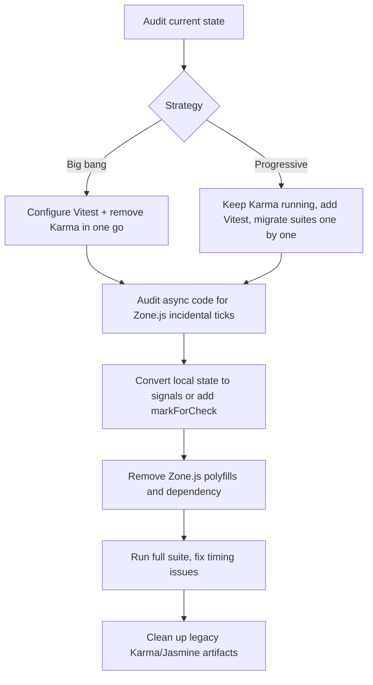

# Migration Plan: Angular Zoneless + Vitest

> General playbook for moving an Angular project from a Zone.js + Karma/Jasmine stack to a zoneless + Vitest stack.
> This plan is intentionally project-agnostic so it can be reused in other Angular codebases.

## Goal

- Remove Zone.js from the runtime and test bundles.
- Run the unit-test suite with Vitest + happy-dom instead of Karma/Jasmine.
- Keep the application working while the migration is in progress.

## Why do this

- **Zone.js is a compatibility tax.** It monkey-patches browser APIs and can break or slow down modern async APIs and third-party libraries.
- **Performance.** Zoneless triggers change detection only when Angular knows state changed, rather than after every async task.
- **Karma is deprecated.** The Angular team has made Vitest the default test runner for new Angular projects.
- **Developer experience.** Vitest starts faster with happy-dom, runs in Node.js without launching a browser, and can still use browser mode when a real DOM is required.

## Assumptions and prerequisites

- Angular 21 or newer (this plan targets Angular 22; adjust provider names for older versions).
- The project is using the new application build system (`@angular/build` / `application` builder).
- Node.js 18 or newer.
- Existing tests are written in Jasmine and run under Karma.

## High-level flow



## Part 1: Migrating to Zoneless

### What changes conceptually

With Zone.js, Angular ran change detection after every microtask, macrotask, and DOM event. With Zoneless, Angular only refreshes when it receives a notification:

- A signal used in the template is updated (`signal.set()` / `signal.update()`).
- An `AsyncPipe` emits a new value.
- A template event handler fires `(click)`.
- Angular-managed subsystems do something (router, `HttpClient`, forms).
- You call `ChangeDetectorRef.markForCheck()` (or `detectChanges()` when you really need synchronous refresh).

### Audit checklist

Search the codebase for:

- `setTimeout`, `setInterval`, `requestAnimationFrame`.
- Raw `addEventListener` / `removeEventListener`.
- WebSocket callbacks.
- Third-party SDK callbacks (analytics, maps, charts, etc.).
- Uses of `NgZone` (`onMicrotaskEmpty`, `onUnstable`, `onStable`, `isStable`, `run`, `runOutsideAngular`).
- In-place mutations like `this.items.push(...)` without a signal or `markForCheck`.

### Migration patterns

| Pattern | Zone.js behavior | Zoneless fix |
|---|---|---|
| Plain field updated in a callback | UI refreshes automatically | Convert to `signal()` or call `cdr.markForCheck()` |
| Raw `setInterval` updating a field | UI refreshes automatically | Use `signal()` or `markForCheck()` |
| Manual HTTP subscription mutating a field | UI refreshes automatically | Use `AsyncPipe` or `toSignal()` or `markForCheck()` |
| `NgZone.onStable` / `onMicrotaskEmpty` | Used to wait for render | Replace with `afterNextRender` or `afterEveryRender` |
| In-place array/object mutation | Often worked because a tick happened | Replace with immutable updates or signal writes |

### Bootstrap changes

1. Remove `provideZoneChangeDetection()` from the bootstrap config.
2. If you are on Angular 20 or want to be explicit, add `provideZonelessChangeDetection()` from `@angular/core`.
3. In Angular 21+, zoneless is the default, so simply removing the zone provider is enough.

### Build configuration changes

1. Remove `zone.js` from the `polyfills` array in `angular.json` for both build and test targets.
2. Remove `zone.js/testing` from the test target polyfills if it was present.
3. Remove `zone.js` from `package.json` dependencies.

### Testing changes

- `fakeAsync()`, `tick()`, `flush()`, and `waitForAsync()` are Zone.js concepts. They cannot be used without Zone.js.
- Replace them with `async`/`await`, explicit `fixture.detectChanges()`, or Vitest/Jest fake timers.
- If you keep Zone.js in tests while removing it from production, Zone.js may hide missing `markForCheck()` calls. Run a subset of tests without Zone.js to catch these early.
- Use `provideZonelessChangeDetection()` in `TestBed.configureTestingModule` if you want to force zoneless behavior while Zone.js is still loaded.
- Use `provideCheckNoChangesConfig({ exhaustive: true, interval: <ms> })` in debug builds to detect bindings that were updated without a notification.

## Part 2: Migrating to Vitest

### Overview

The Angular Vitest integration is built around the `@angular/build:unit-test` builder. It builds the application with the same pipeline as `ng build` and then runs discovered `*.spec.ts` files through Vitest.

### Dependency changes

1. Install Vitest and happy-dom (the chosen DOM emulator):

```bash
npm install -D vitest happy-dom
```

> If a test later needs a jsdom-specific API, jsdom can be installed as a fallback, but the project should default to happy-dom.

2. Optional: install a coverage provider if you want custom coverage output:

```bash
npm install -D @vitest/coverage-istanbul
# or v8
npm install -D @vitest/coverage-v8
```

3. Remove Karma and Jasmine packages:

```bash
npm uninstall karma karma-chrome-launcher karma-coverage karma-jasmine karma-jasmine-html-reporter jasmine-core @types/jasmine
```

### Configuration changes

1. Update the test target in `angular.json`:

```json
"test": {
  "builder": "@angular/build:unit-test",
  "options": {
    "tsConfig": "tsconfig.spec.json"
  }
}
```

2. Update `tsconfig.spec.json` to include Vitest globals:

```json
{
  "extends": "./tsconfig.json",
  "compilerOptions": {
    "outDir": "./out-tsc/spec",
    "types": ["vitest/globals"]
  },
  "include": [
    "src/**/*.d.ts",
    "src/**/*.spec.ts"
  ]
}
```

3. Add a test setup file if you need to mock DOM APIs that are missing in happy-dom (for example, `localStorage`, `matchMedia`, `ResizeObserver`, etc.). Include it in the `include` array of `tsconfig.spec.json` and reference it from a custom Vitest config if you want IDE support.

### Optional custom Vitest config

Angular builds the full Vitest config in memory, but a custom `vitest.config.ts` lets you set `setupFiles`, `coverage`, `environment`, aliases, and makes IDE plugins work. Point the builder to it via `runnerConfig`:

```json
"test": {
  "builder": "@angular/build:unit-test",
  "options": {
    "tsConfig": "tsconfig.spec.json",
    "runnerConfig": "vitest.config.ts"
  }
}
```

Example `vitest.config.ts`:

```typescript
import { defineConfig } from 'vitest/config';

export default defineConfig({
  test: {
    globals: true,
    environment: 'happy-dom',
    setupFiles: ['src/test-setup.ts'],
    coverage: {
      provider: 'istanbul',
      reporter: ['text', 'html', 'lcov']
    }
  }
});
```

### Test-file migration

Angular provides an experimental schematic:

```bash
ng g @schematics/angular:refactor-jasmine-vitest
```

It automates:

- `fit` / `fdescribe` → `it.only` / `describe.only`.
- `xit` / `xdescribe` → `it.skip` / `describe.skip`.
- `spyOn` → `vi.spyOn`.
- `jasmine.objectContaining` → `expect.objectContaining`.
- `jasmine.any` → `expect.any`.
- `jasmine.createSpy` → `vi.fn`.
- `fail()` → `vi.fail()`.

It does not handle:

- Complex spy scenarios.
- `fakeAsync` / `tick` / `waitForAsync`.
- Zone.js timing assumptions.

After running the schematic, review the changes and run `ng test --watch=false` to iterate.

### Common Vitest pitfalls

- **Global type conflicts.** If `describe`, `it`, or `expect` are not recognized, either use explicit imports from `vitest` or add `"vitest/globals"` to `tsconfig.spec.json` types.
- **Missing DOM APIs.** happy-dom does not implement every browser API. Provide mocks in `src/test-setup.ts`.
- **`compileComponents()` is not needed.** Modern Angular tests usually do not need `.compileComponents()`.
- **TestBed cleanup.** Call `TestBed.resetTestingModule()` in `afterEach` when needed, especially if tests override providers or leave pending HTTP requests.
- **Browser mode.** Keep it optional. Use happy-dom for unit tests and only add `@vitest/browser-playwright` for tests that need a real browser.

## Part 3: Combined concerns

Doing both migrations at the same time has a few interactions:

- **Zone.js test patch.** If you move to Vitest but still have Zone.js in tests, you can add `zone.js/plugins/vitest-patch` to the test polyfills to keep `fakeAsync` working temporarily. The long-term goal is to remove Zone.js entirely.
- **Incremental path.** A safe strategy is:
  1. Keep Zone.js and Karma while you add Vitest and migrate one test suite at a time.
  2. Once Vitest is green, remove Karma.
  3. Then remove Zone.js from production and fix the resulting change-detection issues.
  4. Finally, remove Zone.js from tests.
- **Debug first.** Add `provideCheckNoChangesConfig` while the app is still partly on Zone.js to identify missing notifications before you remove the safety net.

## Task list

### Phase 1: Audit and inventory

- [x] Confirm the project is on Angular 21+ and uses the application build system.
- [x] List all Karma-specific configuration (`karma.conf.js`, custom reporters, coverage thresholds, browser launchers).
- [x] Search for `setTimeout`, `setInterval`, `requestAnimationFrame`, raw `addEventListener`, `WebSocket`, and third-party callbacks.
- [x] Search for `NgZone` imports and usages (`onStable`, `onMicrotaskEmpty`, `isStable`, `run`, `runOutsideAngular`).
- [x] Identify all components that mutate plain fields bound to templates.
- [x] Identify all tests using `fakeAsync`, `tick`, `flush`, or `waitForAsync`.
- [x] Decide on big-bang vs. progressive migration strategy.

### Phase 1 findings

- Angular 22.0.4 with `@angular/build:application` and `@angular/build:unit-test`.
- Vitest and `happy-dom` are already installed; Karma has already been removed.
- `zone.js` is still present in the build polyfills and in `package.json`.
- No `NgZone` usage in the application code.
- 20 components explicitly use `ChangeDetectionStrategy.Eager`; most still store mutable state in plain fields.
- Components that need the most attention for zoneless: `accounts`, `clients`, `organisations`, `signin`, `org-selection`, `header`, `user`, `signup`, `audit-history`, `change-password`, `organisation-detail`.
- `setTimeout` hotspots found in: `accounts.component.ts` (error timeout and filter debounce), `clients.component.ts` (scroll into view), `signin.component.ts` (approval check and expiry), `auth.service.ts` (token expiry), `toast.service.ts` (auto-dismiss).
- 15 `*.spec.ts` files still use `fakeAsync`, `tick`, `flush`, or `waitForAsync`.
- Chosen strategy: **progressive**. Keep the Vitest suite running, fix components one by one, then remove `zone.js` from the app and tests.

### Phase 2: Project configuration

- [x] Install `vitest` and `happy-dom` (DOM emulator).
- [x] Install optional coverage provider (`@vitest/coverage-istanbul` or `@vitest/coverage-v8`). (Skipped — optional.)
- [x] Uninstall Karma/Jasmine packages.
- [x] Delete `karma.conf.js` and `src/test.ts` (or equivalent Karma entry files).
- [x] Update `angular.json` test target to use `@angular/build:unit-test`.
- [x] Update `tsconfig.spec.json` to include `"vitest/globals"` types.
- [x] Add `files: []` and `references` to root `tsconfig.json` if it is not already solution-style.
- [x] Create `src/test-setup.ts` for DOM API mocks and any global test initialization.
- [x] (Optional) Create `vitest.config.ts` and reference it via `runnerConfig` in `angular.json`.
- [x] Run `ng test` once and verify the runner starts.

### Phase 2 findings

- `vitest` and `happy-dom` are already in `package.json`.
- No Karma/Jasmine packages remain in `package.json` (only stale transitive references in `package-lock.json`).
- No `karma.conf.js` or `src/test.ts` files remain.
- `angular.json` already uses `@angular/build:unit-test` with `runnerConfig: "vitest.config.ts"`.
- `tsconfig.spec.json` already includes `src/test-setup.ts` and `vitest/globals` types.
- Root `tsconfig.json` already has `"files": []` and references to `tsconfig.app.json` and `tsconfig.spec.json`.
- `src/test-setup.ts` is in place and mocks `localStorage` and `sessionStorage`.
- `vitest.config.ts` is in place and references `src/test-setup.ts`.
- Verification run (`npm test -- --watch=false` in `src/main/webui`) started the Vitest runner successfully. It discovered 28 test files and 654 tests, but 109 tests failed with 5 unhandled errors.
- The failures are **not** a Phase 2 configuration problem. They are caused by tests that are still using Zone.js-based helpers:
  - `fakeAsync`, `tick`, `flush` → `Error: Expected to be running in 'ProxyZone', but it was not found.`
  - Direct `setTimeout` assertions without awaiting or using Vitest fake timers.
  - `localStorage` spies that throw errors, which are not captured by the service under the zoneless runner.
- These failures belong to **Phase 4: Test migration** (removing `fakeAsync`/`tick`, converting to `async`/`await` or Vitest fake timers, and fixing storage mocks). No further Phase 2 changes are needed.

### Phase 3: Component and service migration to zoneless

> For this repository, complete **Phase 4 (Test migration)** before starting Phase 3. The Vitest runner is already zoneless, while the application still uses Zone.js. The tests are the safety net; fixing them first gives a green baseline before changing the application change-detection strategy.


- [x] Remove `provideZoneChangeDetection()` from `app.config.ts` or `AppModule`.
- [x] Add `provideZonelessChangeDetection()` to `app.config.ts`.
- [x] Remove `zone.js` from the `polyfills` array in `angular.json` build and test targets.
- [x] Remove `zone.js` from `package.json`.
- [x] Convert local component state to signals where state changes over time (replaced effects that wrote plain template fields with getters/signals in `accounts`, `clients`, `organisations`, `header`, `signin`, `signup`, and `user`).
- [ ] Replace manual RxJS subscriptions with `AsyncPipe` or `toSignal()` where possible.
- [x] Add `ChangeDetectorRef.markForCheck()` for imperative updates that cannot be signals (added to manual HTTP/route subscriptions in `signin`, `org-selection`, `signup`, `clients`, and `url-filter`; added to async form/action methods in `accounts`).
- [x] Replace `NgZone.onStable` / `onMicrotaskEmpty` with `afterNextRender` or `afterEveryRender` (no `NgZone` usage found in the codebase).
- [ ] Replace in-place mutations with immutable updates or signal writes.
- [ ] Run the application and exercise navigation, forms, HTTP, and third-party integrations.

### Phase 4: Test migration

- [x] Run the `refactor-jasmine-vitest` schematic. (Schematic not found in `@angular/core` in this version; the project is already on Vitest, so we will convert tests manually.)
- [x] Review and fix complex spy scenarios as part of the test conversions below.
- [x] Remove `waitForAsync` and `fakeAsync` usage from all component specs.
- [x] Convert `tick()` and `flush()` to Vitest fake timers or `async`/`await` with `TestBed.flushEffects()`.
- [x] Add explicit `fixture.detectChanges()` / `TestBed.flushEffects()` after state changes.
- [x] Ensure `TestBed.resetTestingModule()` runs in `afterEach` for every component spec.
- [ ] Run `ng test --watch=false` and fix failures until the suite is green. *(User will run; any remaining failures will be fixed in the next cycle.)*
- [ ] Remove `zone.js/testing` from test polyfills once the app itself is zoneless (Phase 3).

> Phase 4 code conversion is complete: every component spec now uses `provideZonelessChangeDetection()` and no `fakeAsync`/`tick`/`waitForAsync` remains. We are proceeding to Phase 3 to remove the remaining `zone.js` runtime dependency, which will also clear the `NG0914` warnings in the tests.

### Phase 5: Verification and cleanup

- [ ] Verify production build still works and bundle size is reduced.
- [ ] Verify CI pipeline runs `ng test` without Karma.
- [ ] Update coverage commands (`ng test --coverage` instead of `--code-coverage`).
- [ ] Remove any remaining Karma/Jasmine artifacts.
- [ ] Add `provideCheckNoChangesConfig` during a temporary debug phase to validate no missing notifications.
- [ ] Document the new testing conventions for the team.

## References

- [Angular Zoneless guide](https://angular.dev/guide/zoneless)
- [Angular DEV: Zoneless migration](https://dev.to/georgehulpoi/angular-zoneless-migrating-off-zonejs-without-breaking-your-ui-3cek)
- [Angular: Migrating from Karma to Vitest](https://angular.dev/guide/testing/migrating-to-vitest)
- [Angular Architects: Migrate from Karma to Vitest](https://www.angulararchitects.io/blog/migrate-from-karma-to-vitest/)
- [DEV Community: Migrating from Jasmine/Karma to Vitest in Angular 21](https://dev.to/codewithrajat/migrating-from-jasminekarma-to-vitest-in-angular-21-a-step-by-step-guide-developers-complete-3g9l)
- [How to migrate your Angular app to zoneless](https://javascript.plainenglish.io/how-to-migrate-your-angular-app-to-zoneless-9f9350040e19) — not accessible during research (HTTP 403)
