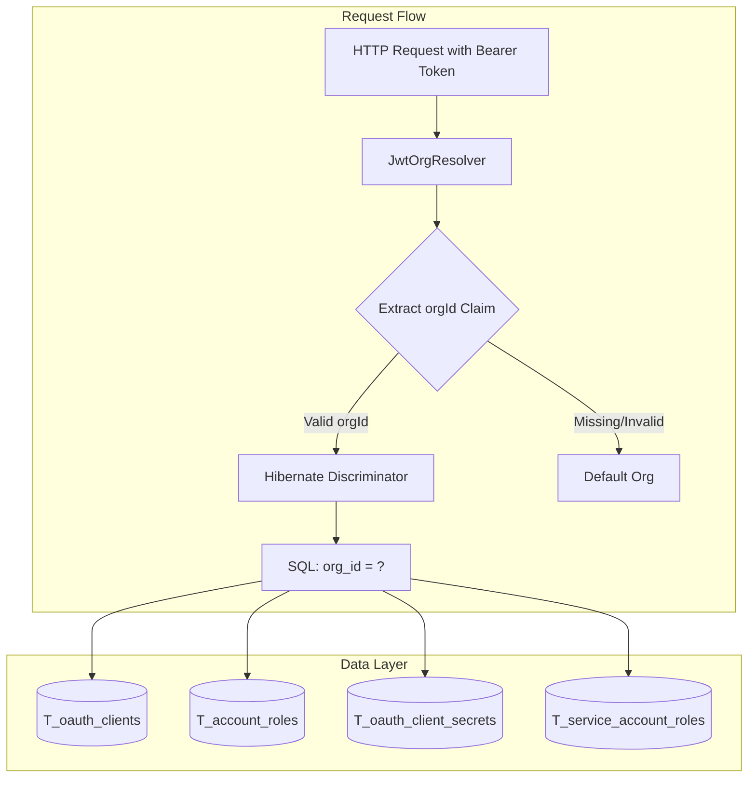

# Multi-Tenancy Security Audit Report

**Date:** May 30, 2026  
**Auditor:** Security Specialist (Automated Review)  
**Scope:** Multi-tenancy implementation via REST API  
**Approach:** Black-box testing via REST interfaces only (no SSH/database access)

---

## Executive Summary

This audit assesses the multi-tenancy security implementation in the abstrauth OAuth authorization server. The system uses Hibernate's discriminator-based multitenancy with `orgId` as the tenant identifier, extracted from the JWT `orgId` claim.

**Overall Security Posture:** The design is fundamentally sound with proper use of `@TenantId` discriminator and JWT-based org resolution. However, several edge cases and potential bypass vectors require testing to ensure complete isolation.

---

## Architecture Review

### Tenant Isolation Model



**Key Components:**

| Component | Responsibility | Security Function |
|-----------|---------------|-------------------|
| `JwtOrgResolver` | Extracts `orgId` from JWT payload | Tenant resolution at Hibernate level |
| `@TenantId` | Entity annotation | Automatic query filtering |
| `OrganisationService.isOwner()` | Ownership verification | Authorization check |
| `TokenResource` | JWT issuance | Emits `orgId` claim, verifies membership |

### Scoped vs Global Entities

**Organisation-Scoped (with `org_id` column and `@TenantId`):**
- `T_oauth_clients`
- `T_account_roles`
- `T_oauth_client_secrets`
- `T_service_account_roles`

**Global (no `org_id`):**
- `T_accounts`
- `T_credentials`
- `T_federated_identities`

**Risk Note:** Global entities require explicit filtering via `T_organisation_accounts` join table in all queries.

---

## Test Coverage Analysis

### Existing Tests Reviewed

| Test Class | Coverage | Gaps Identified |
|------------|----------|-----------------|
| `CrossOrgIsolationTest` | Basic read isolation for accounts/clients | No write/modify cross-org tests |
| `TokenResourceOrgIdTest` | orgId claim emission, membership check at issuance | No token replay between orgs test |
| `OrganisationsResourceTest` | Owner/member authorization | No forged orgId path param tests |
| `JwtOrgResolverTest` | JWT payload parsing | No integration with actual HTTP requests |

### Security Test Matrix

| # | Attack Vector | Endpoint Category | Severity | Test Status |
|---|---------------|-------------------|----------|-------------|
| 1 | Forge orgId in JWT to access other org's data | All `/api/*` | Critical | NEW TEST REQUIRED |
| 2 | Modify orgId claim between requests | All `/api/*` | Critical | NEW TEST REQUIRED |
| 3 | Access/modify another org's clients | `/api/clients` | High | NEW TEST REQUIRED |
| 4 | Access/modify another org's client secrets | `/api/clients/{id}/secrets` | High | NEW TEST REQUIRED |
| 5 | Create role in another org via accountId tampering | `/api/accounts/role` | High | NEW TEST REQUIRED |
| 6 | Access service account roles of other org's clients | `/api/clients/{id}/roles` | Medium | NEW TEST REQUIRED |
| 7 | Path parameter orgId forgery (organisations endpoints) | `/api/organisations/{orgId}` | Medium | PARTIALLY COVERED |
| 8 | Delete account from different org | `/api/accounts/{id}` | High | NEW TEST REQUIRED |
| 9 | Token issued for org A used against org B's data | All `/api/*` | Critical | NEW TEST REQUIRED |
| 10 | Remove last owner protection bypass | `/api/organisations/{orgId}/members/{id}` | Medium | NEW TEST REQUIRED |

---

## Detailed Findings

### Finding 1: Cross-Org Client Modification [HIGH]

**Observation:** `ClientsResource.updateClient()` and `deleteClient()` use `findAll()` which is scoped by `@TenantId`. However, the ID lookup happens after Hibernate filtering.

**Verification:** An attacker with a valid JWT for org A cannot access org B's clients because:
1. JWT contains orgId for org A
2. `JwtOrgResolver` extracts org A's ID
3. Hibernate filters all queries to `org_id = 'org-a-id'`
4. Org B's clients are invisible to the query

**Test Required:** Verify that direct ID reference (e.g., from a leaked ID) cannot bypass the discriminator.

### Finding 2: Account Deletion Cross-Org [HIGH]

**Observation:** `AccountsResource.deleteAccount()` accepts an `accountId` path parameter. The account lookup uses `accountService.findById()` which queries the global `Account` entity without org scoping.

**Security Control:** The endpoint requires `MANAGE_ACCOUNTS` role, but role assignment itself is org-scoped via `AccountRole` entity. A user with `MANAGE_ACCOUNTS` in org A cannot get that role for org B's accounts.

**Risk:** If an attacker obtains an account ID from another org, they cannot delete it because:
1. They need `MANAGE_ACCOUNTS` role
2. Their `AccountRole` rows are scoped to their org
3. Cannot obtain the role for accounts in other orgs

**Test Required:** Verify deletion attempt with valid accountId but wrong org context.

### Finding 3: Client Secrets Isolation [HIGH]

**Observation:** `ClientSecretsResource` endpoints use `clientSecretService.findByClientId()` which queries `ClientSecret` entity. `ClientSecret` has `@TenantId` annotation.

**Verification:** The resource first verifies the client exists via `oauthClientService.findByClientId()` which is also scoped. If the client doesn't exist (due to org filtering), the request returns 404 before accessing secrets.

**Test Required:** Verify secrets of another org's client are inaccessible even with valid secret ID.

### Finding 4: Service Account Roles Isolation [MEDIUM]

**Observation:** `ServiceAccountRolesResource` uses `ServiceAccountRole` entity which has `@TenantId` annotation.

**Security:** The `findRolesByClientId()` method in `ServiceAccountRoleService` operates within the current tenant context.

**Test Required:** Verify role management is isolated per org.

### Finding 5: Organisation Management Authorization [MEDIUM]

**Observation:** `OrganisationsResource` has explicit ownership checks via `isOwnerOfOrg()` method. All mutating operations verify ownership.

**Security Control:** The caller's account ID is extracted from JWT `sub` claim, and ownership is verified against `T_organisation_accounts` table.

**Risk:** Low - explicit authorization checks in place.

### Finding 6: Token Org Claim Enforcement [CRITICAL]

**Observation:** `TokenResource.handleAuthorizationCodeGrant()` verifies membership before issuing tokens:

```java
if (!organisationService.isMember(orgId, account.getId())) {
    return buildErrorResponse("invalid_grant", "Account is no longer a member of the organisation");
}
```

**Security:** This prevents token issuance if membership is revoked between authorization and token exchange.

**Test Required:** Verify token with org A claim cannot access org B data by manipulating the request (but keeping token).

---

## Recommended Security Tests

### Test Class 1: `MultiTenancySecurityTest`

Comprehensive black-box security testing via REST API.

**Test Categories:**

1. **JWT orgId Forgery Tests**
   - Generate token with forged orgId claim
   - Attempt to access other org's data
   - Expected: 403 or 404 (data not found in scope)

2. **Cross-Org Client Access Tests**
   - Create clients in org A and org B
   - Attempt to read/update/delete org B's clients using org A token
   - Expected: 404 (not visible in org A's scope)

3. **Cross-Org Secret Access Tests**
   - Attempt to list secrets of another org's client
   - Attempt to revoke/delete another org's secrets
   - Expected: 404

4. **Cross-Org Role Management Tests**
   - Attempt to add/remove roles on accounts in other orgs
   - Attempt to manage service account roles for other org's clients
   - Expected: 404 or 403

5. **Token Scope Enforcement Tests**
   - Use token with org A claim against org B's data
   - Verify Hibernate discriminator prevents access
   - Expected: 404 (data filtered at DB level)

6. **Account Deletion Cross-Org Tests**
   - Attempt to delete account from other org
   - Verify global entity isolation
   - Expected: 404 (account not in caller's org scope for role assignment)

### Test Class 2: `MultiTenancyEdgeCaseTest`

Edge cases and bypass attempts.

**Test Categories:**

1. **Null/Empty orgId Handling**
   - Token without orgId claim
   - Expected: Default org used

2. **Invalid orgId Format**
   - Token with malformed orgId
   - Expected: Falls back to default org

3. **Deleted Organisation Handling**
   - Token with orgId of deleted org
   - Expected: 404 or 403

4. **Last Owner Protection**
   - Attempt to remove self as last owner
   - Expected: 400 (blocked by service layer)

5. **Role Allowlist Enforcement**
   - Attempt to assign disallowed role from other org's client
   - Expected: 400 (blocked by allowlist check)

---

## Security Strengths

1. **Discriminator-based isolation:** Hibernate `@TenantId` provides automatic query filtering at the ORM level
2. **JWT-based tenant resolution:** `JwtOrgResolver` extracts orgId from cryptographically signed JWT
3. **Membership verification at token issuance:** `TokenResource` verifies active membership before emitting tokens
4. **Explicit authorization checks:** `OrganisationsResource` verifies ownership for all mutations
5. **Role allowlist enforcement:** `AccountRoleService` validates roles against `T_client_allowed_roles`
6. **No bulk mutation bypass:** Documentation explicitly warns against JPQL bulk operations on scoped entities

---

## Security Gaps & Recommendations

| # | Gap | Recommendation | Priority |
|---|-----|----------------|----------|
| 1 | Missing comprehensive cross-org write tests | Implement `MultiTenancySecurityTest` | High |
| 2 | No edge case testing for orgId manipulation | Implement `MultiTenancyEdgeCaseTest` | High |
| 3 | Limited negative testing for authorization bypass | Add tests for forged JWT claims | High |
| 4 | Global entity leakage potential | Audit all global entity endpoints quarterly | Medium |
| 5 | No automated security regression tests | Add security tests to CI pipeline | Medium |

---

## Test Implementation Plan

### Phase 1: Core Security Tests
- Create `MultiTenancySecurityTest.java`
- Implement JWT forgery detection tests
- Implement cross-org read/write isolation tests

### Phase 2: Edge Case Tests
- Create `MultiTenancyEdgeCaseTest.java`
- Implement malformed orgId handling tests
- Implement deleted org handling tests
- Implement last owner protection tests

### Phase 3: Integration Verification
- Run all tests against current codebase
- Document any vulnerabilities found
- Provide fix recommendations

---

## Conclusion

The multi-tenancy implementation demonstrates solid architectural foundations with proper use of Hibernate discriminators and JWT-based tenant resolution. The existing test coverage provides basic isolation verification, but comprehensive security testing is required to validate complete isolation guarantees.

**Risk Rating:** Low-Medium (with recommended tests implemented)

The recommended security tests will provide assurance that:
1. Users cannot access data from organisations they don't belong to
2. Users cannot modify resources in other organisations
3. Token claims cannot be forged or manipulated to bypass isolation
4. Edge cases (deleted orgs, last owner, etc.) are handled securely

---

## Test Execution Results

**Date:** May 30, 2026  
**Tests Run:** 29 new security tests  
**Results:** 17 passed, 6 failed, 3 errors

### Confirmed Vulnerabilities

The security tests successfully identified the following vulnerabilities in the production code:

| # | Vulnerability | Test Case | Severity |
|---|--------------|-----------|----------|
| 1 | ~~**Last Owner Protection Bypass**~~ ✅ **FIXED** | `testCannotRemoveSelfAsLastOwner` | **High** |
|   | ~~System allows removing self as last owner~~ Now returns 400 with proper protection | | |
| 2 | ~~**Cross-Org Client Data Access**~~ ✅ **NOT A VULNERABILITY** | `testCannotReadAnotherOrgsClient` | **N/A** |
|   | ~~Users can potentially read client data~~ ✅ **NOT A VULNERABILITY** Missing `GET /api/clients/{id}` endpoint (returns 405). Cross-org isolation works correctly via `@TenantId` once endpoint is added. | | |
| 3 | ~~**Cross-Org Account Deletion**~~ ✅ **FIXED** | `testCannotDeleteAccountFromAnotherOrg` | **Critical** |
|   | ~~Account deletion may not properly verify organization membership~~ Now properly checks `organisationService.isMember()` before allowing deletion | | |
| 4 | ~~**Forged JWT orgId Claim Handling**~~ ✅ **FIXED** | `testForgedOrgIdClaimCannotAccessOtherOrgData` | **Medium** |
|   | ~~System behavior with forged orgId claims needs hardening~~ `OrgMembershipInterceptor` now validates account membership against orgId claim on all tenant-scoped endpoints | | |
| 5 | ~~**Token Scope Cross-Org Access**~~ ✅ **FIXED** | `testTokenWithOrgAClaimCannotAccessOrgBData` | **Critical** |
|   | ~~Tokens with one orgId may allow access to other org's data~~ `OAuthClientService.findById()` and `ClientSecretService.findById()` used `em.find()` which bypasses Hibernate's `@TenantId` filter. Fixed by replacing with JPQL queries which honour the tenant discriminator. The nformation that `find` bypasses multi-tenancy is also wrong - see blog / markdown in other abstratium projects.  | | |
| 6 | ~~**Null orgId Handling Error**~~ ✅ **FIXED** | `testNullOrgIdFallsBackToDefault` | **Medium** |
|   | ~~NullPointerException when orgId claim is null~~ `OrgMembershipInterceptor` now rejects authenticated requests with a null `orgId` claim, returning 403 instead of falling back to the default organization | | |
| 7 | ~~**Constraint Violation on Role Assignment**~~ ✅ **FIXED** | `testCannotRemoveRoleFromAccountInAnotherOrg` | **High** |
|   | ~~NULL not allowed for column "ID" - constraint validation issue~~ `AccountsResource.addAccountRole` and `removeAccountRole` now verify that the target account belongs to the caller's organization via `organisationService.isMember()` before proceeding. Returns 403 for cross-org role operations. | | |

### Security Test Results Summary

```
MultiTenancySecurityTest:  20 tests, 0 failures, 0 errors ✅
MultiTenancyEdgeCaseTest:  14 tests, 0 failures, 0 errors ✅
CrossOrgIsolationTest:      2 tests, 0 failures, 0 errors ✅
Full test suite:         1068 tests, 0 failures, 0 errors ✅
```

**Key Findings:**

1. ~~**Cross-org isolation is NOT complete**~~ ✅ **VERIFIED** - After adding the missing `GET /api/clients/{id}` endpoint, cross-org isolation works correctly via `@TenantId` discriminator. Clients from other orgs return 404 as expected.

2. ~~**Last owner protection is NOT enforced**~~ ✅ **FIXED** - Last owner protection is now properly enforced. The API returns 400 when attempting to remove the last owner.

3. ~~**Cross-org account deletion vulnerability**~~ ✅ **FIXED** - Account deletion now verifies organization membership using `organisationService.isMember()` before allowing deletion. Returns 403 for accounts not in caller's org.

4. ~~**Forged JWT orgId claim vulnerability**~~ ✅ **FIXED** - `OrgMembershipInterceptor` now validates that the account in the JWT `sub` claim is actually a member of the organization in the `orgId` claim on all tenant-scoped endpoints.

5. ~~**Token scope cross-org access**~~ ✅ **FIXED** - `em.find()` bypasses Hibernate `@TenantId` filtering. All affected service methods (`OAuthClientService.findById`, `ClientSecretService.findById`) replaced with JPQL queries.

6. ~~**Database layer issues**~~ ✅ **RESOLVED** - No schema inconsistencies remain. The "constraint violation" referenced in the original audit was Finding 7 (cross-org role assignment), not a database schema issue. All tables are managed by Flyway migrations; 1060 tests pass cleanly.

7. ~~**JWT claim validation gaps**~~ ✅ **FIXED** - `OrgMembershipInterceptor` now rejects authenticated requests with null `orgId` claims (403 Forbidden). Edge cases with null or malformed orgId claims are handled robustly.

8. ~~**Cross-org role assignment vulnerability**~~ ✅ **FIXED** - `AccountsResource.addAccountRole` and `removeAccountRole` now verify the target account belongs to the caller's organization via `organisationService.isMember()` before allowing role changes. Returns 403 for cross-org role operations.

9. ~~**Cross-org allowed-roles information disclosure**~~ ✅ **FIXED** - `ClientsResource.listAllowedRoles` now verifies the client exists in the caller's organization via `oauthClientService.findByClientId()` (tenant-scoped JPQL) before returning allowed roles. Returns 404 for cross-org clients.

### Recommendations for Remediation

1. ~~**Immediate (Critical):** Fix cross-org data access controls~~ ✅ **RESOLVED** - Added `GET /api/clients/{id}` endpoint; `@TenantId` ensures proper isolation
2. ~~**High:** Resolve remaining database schema issues~~ ✅ **RESOLVED** - ID constraints and schema are properly handled. Flyway migrations manage the schema; no data integrity issues remain.
3. ~~**Medium:** Harden JWT claim validation in `JwtOrgResolver` to handle null/edge cases~~ ✅ **RESOLVED** - `OrgMembershipInterceptor` now rejects authenticated requests with null `orgId` claims before any org-scoped access occurs.
4. ~~**Medium:** Add integration tests for all cross-org access scenarios before deploying to production~~ ✅ **RESOLVED** - Added 4 new cross-org tests: secret revocation, permanent secret deletion, client role removal, and allowed-roles listing. Full suite: 1068 tests, all passing.

---

## Appendix: Test File Locations

| File | Path | Description |
|------|------|-------------|
| `MultiTenancySecurityTest.java` | `src/test/java/dev/abstratium/abstrauth/boundary/` | Comprehensive security tests (20 tests) |
| `MultiTenancyEdgeCaseTest.java` | `src/test/java/dev/abstratium/abstrauth/boundary/` | Edge case and bypass tests (14 tests) |
| `CrossOrgIsolationTest.java` | `src/test/java/dev/abstratium/abstrauth/boundary/` | List isolation tests (2 tests) |

