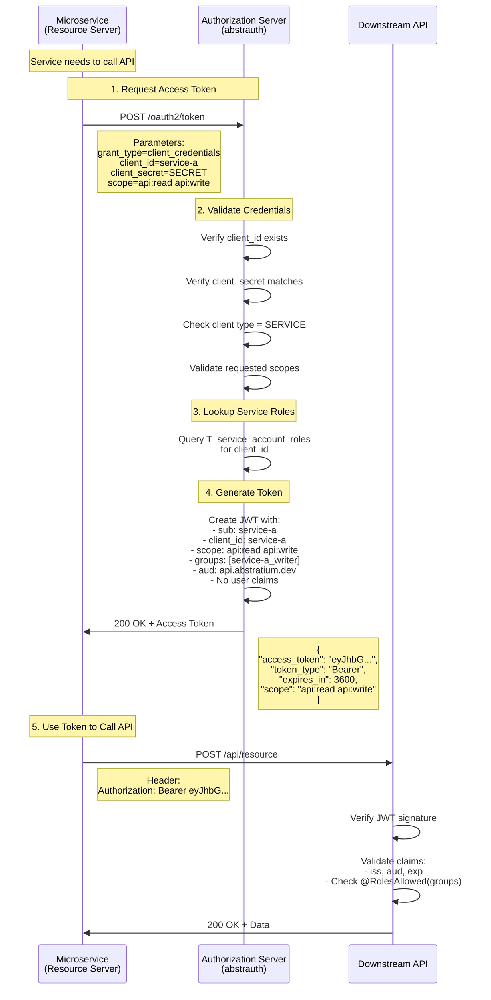

# Service-to-Service Authentication Design

## Overview

This document describes the design for enabling microservices to authenticate with the abstrauth authorization server and obtain access tokens for calling their own endpoints or downstream microservices.

**Industry Standard:** OAuth 2.0 Client Credentials Grant (RFC 6749 Section 4.4)

**Compatibility:** Fully compatible with `quarkus-oidc` and `quarkus-oidc-client`

## Problem Statement

Microservices in the Abstratium ecosystem need to:
1. Authenticate themselves (not on behalf of a user)
2. Obtain access tokens to call protected APIs
3. Call their own endpoints or downstream microservices
4. Use a secure, industry-standard authentication mechanism
5. Integrate seamlessly with Quarkus OIDC
6. **Support `@RolesAllowed` annotations** for endpoint authorization
7. **Enable audit logging** with service identity tracking

### Real-World Use Case: Payment Processing

**Scenario**: Bank sends payment notification → Payment Service → Accounting Service

1. **Bank webhook** triggers Payment Service
2. **Payment Service** needs to authenticate to call Accounting Service
3. **Accounting Service** has endpoint:
   ```java
   @POST
   @Path("/transactions")
   @RolesAllowed("payment-service_accounting-writer")
   public Response createTransaction(TransactionRequest req) {
       String actor = jwt.getSubject();  // "payment-service" for audit log
       auditLog.log("Transaction created by: " + actor);
       // ...
   }
   ```
4. **Requirements**:
   - Payment Service must have role `payment-service_accounting-writer`
   - Token must have `groups` claim for `@RolesAllowed` to work
   - Token must have `sub` claim for audit logging

## Solution: OAuth 2.0 Client Credentials Flow

### What is Client Credentials Flow?

The Client Credentials grant type is used when applications request an access token to access their own resources, not on behalf of a user. This is the standard OAuth 2.0 flow for **machine-to-machine (M2M)** authentication.

**Key Characteristics:**
- ✅ No user interaction required
- ✅ Service authenticates using client ID and client secret
- ✅ Token represents the service itself (not a user)
- ✅ Suitable for backend services, daemons, CLIs
- ✅ Fully supported by Quarkus OIDC Client

**RFC Reference:** [RFC 6749 Section 4.4](https://datatracker.ietf.org/doc/html/rfc6749#section-4.4)

### Flow Diagram



## Architecture

### Client Types

Abstrauth currently supports one client type:
- **WEB_APPLICATION**: Confidential client for BFF pattern (Authorization Code + PKCE)

We need to add a new client type:
- **SERVICE**: Confidential client for service-to-service authentication (Client Credentials)

### Token Characteristics

**Service Tokens vs User Tokens:**

| Aspect | User Token (Authorization Code) | Service Token (Client Credentials) |
|--------|----------------------------------|-------------------------------------|
| Subject (`sub`) | User ID (UUID) | Service client ID |
| User Claims | `email`, `name`, `preferred_username` | None |
| Groups (`groups`) | User roles (e.g., `abstratium-abstrauth_admin`) | Service roles (e.g., `payment-service_accounting-writer`) |
| Scope | User-granted scopes | Service-assigned scopes |
| Audience (`aud`) | Specific API or resource | Specific API or resource |
| Refresh Token | Yes (long-lived sessions) | No (short-lived, re-request) |
| Use Case | User acting through UI | Service-to-service orchestration |

**CRITICAL**: Service tokens MUST include the `groups` claim with roles to support `@RolesAllowed` annotations in resource servers.

### Scope and Role Design

**Services use BOTH scopes AND roles:**

1. **Scopes** (OAuth 2.0 standard): Coarse-grained API access control
   - `api:read` - Read access to APIs
   - `api:write` - Write access to APIs
   - `clients:manage` - Manage OAuth clients
   - `accounts:read` - Read user accounts

2. **Roles** (MicroProfile JWT `groups` claim): Fine-grained endpoint authorization
   - Format: `{client_id}_{role}` (same as user roles)
   - Examples: `payment-service_accounting-writer`, `monitoring-service_metrics-reader`
   - Used by `@RolesAllowed` annotations in resource servers

**Example Service Configurations:**

| Service | Scopes | Roles | Use Case |
|---------|--------|-------|----------|
| **Monitoring Service** | `api:read` | `abstratium-abstrauth_metrics-reader` | Read-only monitoring |
| **Payment Service** | `api:read api:write` | `payment-service_accounting-writer` | Create accounting transactions |
| **Admin Service** | `clients:manage accounts:read` | `abstratium-abstrauth_admin` | Administrative operations |

**Why Both?**
- **Scopes**: OAuth 2.0 compliance, API-level authorization
- **Roles**: Quarkus `@RolesAllowed` compatibility, endpoint-level authorization, audit logging

## Implementation Changes

### 1. Database Schema Changes

**Migration V01.011: Add SERVICE client type and scopes**

```sql
-- Already exists: client_type column supports 'SERVICE'
ALTER TABLE T_oauth_clients 
  MODIFY COLUMN client_type VARCHAR(20) NOT NULL 
  COMMENT 'WEB_APPLICATION or SERVICE';

-- Already exists: allowed_scopes column
ALTER TABLE T_oauth_clients 
  MODIFY COLUMN allowed_scopes VARCHAR(500) 
  COMMENT 'Space-separated list of scopes allowed for SERVICE clients';
```

**Migration V01.015: Create service account roles table**

```sql
CREATE TABLE T_service_account_roles (
    id VARCHAR(36) PRIMARY KEY,
    client_id VARCHAR(255) NOT NULL,
    role VARCHAR(100) NOT NULL,
    created_at TIMESTAMP DEFAULT CURRENT_TIMESTAMP,
    CONSTRAINT FK_service_account_roles_client FOREIGN KEY (client_id) REFERENCES T_oauth_clients(client_id) ON DELETE CASCADE
);

-- FK indexes
CREATE INDEX I_service_account_roles_client ON T_service_account_roles(client_id);

-- other indexes
CREATE UNIQUE INDEX I_service_account_roles_unique ON T_service_account_roles(client_id, role);
```

**Why Service Account Roles Table?**
- Enables `@RolesAllowed` annotations in resource servers
- Provides audit trail (who did what)
- Consistent with user role model (`T_account_roles`)
- Follows Keycloak and Microsoft Entra ID patterns

**Update `ClientType` enum:**

```java
public enum ClientType {
    WEB_APPLICATION,  // For BFF pattern (Authorization Code + PKCE)
    SERVICE           // For service-to-service (Client Credentials)
}
```

### 2. Token Endpoint Changes

**Update `TokenResource.java`:**

Add support for `grant_type=client_credentials`:

```java
@POST
@Path("/token")
@Consumes(MediaType.APPLICATION_FORM_URLENCODED)
@Produces(MediaType.APPLICATION_JSON)
public Response token(
    @FormParam("grant_type") String grantType,
    @FormParam("code") String code,
    @FormParam("refresh_token") String refreshToken,
    @FormParam("client_id") String clientId,
    @FormParam("client_secret") String clientSecret,
    @FormParam("code_verifier") String codeVerifier,
    @FormParam("redirect_uri") String redirectUri,
    @FormParam("scope") String scope
) {
    // Existing authorization_code and refresh_token handling...
    
    if ("client_credentials".equals(grantType)) {
        return handleClientCredentials(clientId, clientSecret, scope);
    }
    
    return Response.status(400)
        .entity(Map.of("error", "unsupported_grant_type"))
        .build();
}

private Response handleClientCredentials(String clientId, String clientSecret, String requestedScope) {
    // 1. Validate client credentials
    OAuthClient client = clientRepository.findByClientId(clientId);
    if (client == null || !client.getClientType().equals(ClientType.SERVICE)) {
        return Response.status(401)
            .entity(Map.of("error", "invalid_client"))
            .build();
    }
    
    if (!passwordEncoder.matches(clientSecret, client.getClientSecret())) {
        return Response.status(401)
            .entity(Map.of("error", "invalid_client"))
            .build();
    }
    
    // 2. Validate and filter requested scopes
    Set<String> allowedScopes = parseScopes(client.getAllowedScopes());
    Set<String> requestedScopes = parseScopes(requestedScope);
    
    if (!allowedScopes.containsAll(requestedScopes)) {
        return Response.status(400)
            .entity(Map.of("error", "invalid_scope"))
            .build();
    }
    
    // 3. Get service account roles for @RolesAllowed support
    Set<String> serviceRoles = serviceAccountRoleRepository.findRolesByClientId(clientId);
    Set<String> groups = new HashSet<>();
    for (String role : serviceRoles) {
        groups.add(clientId + "_" + role);  // Same format as user roles
    }
    
    // 4. Generate service token with BOTH scopes AND groups
    String accessToken = Jwt.issuer(issuer)
        .claim("jti", UUID.randomUUID().toString())
        .subject(clientId)  // Service ID as subject (for audit logging)
        .groups(groups)     // Roles for @RolesAllowed
        .claim("client_id", clientId)
        .claim("scope", String.join(" ", requestedScopes))
        .audience(audience)
        .issuedAt(Instant.now())
        .expiresAt(Instant.now().plusSeconds(3600))  // 1 hour
        .jws()
            .keyId("abstrauth-key-1")
        .sign();
    
    // 5. Return token (no refresh token for client credentials)
    return Response.ok(Map.of(
        "access_token", accessToken,
        "token_type", "Bearer",
        "expires_in", 3600,
        "scope", String.join(" ", requestedScopes)
    )).build();
}
```

### 3. Client Management Changes

**Update `ClientsResource.java`:**

Add fields for service client configuration:

```java
@POST
@RolesAllowed("abstratium-abstrauth_manage-clients")
public Response createClient(CreateClientRequest request) {
    // Validate client type
    if (request.clientType == ClientType.SERVICE) {
        // Validate scopes are provided
        if (request.allowedScopes == null || request.allowedScopes.isEmpty()) {
            return Response.status(400)
                .entity(Map.of("error", "allowed_scopes required for SERVICE clients"))
                .build();
        }
        
        // Validate redirect URIs are NOT provided
        if (request.redirectUris != null && !request.redirectUris.isEmpty()) {
            return Response.status(400)
                .entity(Map.of("error", "redirect_uris not allowed for SERVICE clients"))
                .build();
        }
    }
    
    // Create client...
}
```

**DTO Changes:**

```java
public class CreateClientRequest {
    public String clientName;
    public ClientType clientType;  // WEB_APPLICATION or SERVICE
    public List<String> redirectUris;  // Required for WEB_APPLICATION, forbidden for SERVICE
    public List<String> allowedScopes;  // Required for SERVICE, optional for WEB_APPLICATION
}

public class ClientResponse {
    public String clientId;
    public String clientName;
    public ClientType clientType;
    public List<String> redirectUris;
    public List<String> allowedScopes;
    public String clientSecret;  // Only returned on creation
}
```

### 4. Angular UI Changes

**Update client management UI:**

1. Add "Client Type" dropdown: `WEB_APPLICATION` or `SERVICE`
2. Show/hide fields based on client type:
   - **WEB_APPLICATION**: Show redirect URIs, hide scopes
   - **SERVICE**: Show scopes, hide redirect URIs
3. Add scope input field with common presets:
   - `api:read`
   - `api:write`
   - `clients:manage`
   - `users:read`
   - `users:write`

### 5. Discovery Endpoint Changes

**Update `/.well-known/oauth-authorization-server`:**

```json
{
  "issuer": "https://auth.abstratium.dev",
  "authorization_endpoint": "https://auth.abstratium.dev/oauth2/authorize",
  "token_endpoint": "https://auth.abstratium.dev/oauth2/token",
  "grant_types_supported": [
    "authorization_code",
    "refresh_token",
    "client_credentials"
  ],
  "scopes_supported": [
    "openid",
    "profile",
    "email",
    "api:read",
    "api:write",
    "clients:manage",
    "users:read",
    "users:write"
  ]
}
```

## Quarkus Integration

### Using quarkus-oidc-client

Microservices can use `quarkus-oidc-client` to automatically obtain and refresh tokens:

**1. Add dependency:**

```xml
<dependency>
    <groupId>io.quarkus</groupId>
    <artifactId>quarkus-oidc-client</artifactId>
</dependency>
```

**2. Configure in `application.properties`:**

```properties
# OIDC Client configuration for service-to-service auth
quarkus.oidc-client.auth-server-url=https://auth.abstratium.dev
quarkus.oidc-client.client-id=my-service
quarkus.oidc-client.credentials.secret=${SERVICE_CLIENT_SECRET}
quarkus.oidc-client.grant.type=client
quarkus.oidc-client.grant-options.client.scope=api:read api:write

# Optional: Configure token refresh
quarkus.oidc-client.early-tokens-acquisition=true
quarkus.oidc-client.refresh-token-time-skew=10s
```

**3. Use in code:**

**Option A: Automatic token injection (recommended):**

```java
@Path("/api/data")
@RegisterRestClient(configKey = "downstream-api")
public interface DownstreamApiClient {
    
    @GET
    @Path("/resource")
    @Produces(MediaType.APPLICATION_JSON)
    JsonObject getResource();
}

// Configuration
quarkus.rest-client.downstream-api.url=https://api.example.com
quarkus.rest-client.downstream-api.scope=io.quarkus.oidc.client.filter.OidcClientRequestFilter

// Usage - token added automatically
@Inject
@RestClient
DownstreamApiClient apiClient;

public void callDownstream() {
    JsonObject data = apiClient.getResource();
}
```

**Option B: Manual token retrieval:**

```java
@Inject
OidcClient oidcClient;

public void callApi() {
    Tokens tokens = oidcClient.getTokens().await().indefinitely();
    String accessToken = tokens.getAccessToken();
    
    // Use token in HTTP request
    client.get("/api/resource")
        .header("Authorization", "Bearer " + accessToken)
        .send();
}
```

### Using quarkus-oidc for Token Verification

Resource servers verify incoming service tokens using `quarkus-oidc`:

```properties
# Resource server configuration
quarkus.oidc.auth-server-url=https://auth.abstratium.dev
quarkus.oidc.client-id=my-api
quarkus.oidc.application-type=service

# JWT verification
mp.jwt.verify.publickey.algorithm=PS256
mp.jwt.verify.issuer=https://auth.abstratium.dev
```

**Scope-based authorization:**

```java
@Path("/api/resource")
public class ResourceEndpoint {
    
    @GET
    @Authenticated
    public Response getResource(@Context SecurityContext securityContext) {
        JsonWebToken jwt = (JsonWebToken) securityContext.getUserPrincipal();
        
        // Check scopes
        String scope = jwt.getClaim("scope");
        if (!scope.contains("api:read")) {
            return Response.status(403).build();
        }
        
        return Response.ok(data).build();
    }
}
```

## Security Considerations

### 1. Client Secret Management

**Critical:** Service client secrets must be protected:

- ✅ Store in environment variables or secret management systems (Vault, AWS Secrets Manager)
- ✅ Never commit to version control
- ✅ Rotate regularly (every 90 days recommended)
- ✅ Use different secrets per environment (dev, staging, prod)
- ❌ Never log or expose in error messages

#### Client Secret Rotation Strategy

To enable zero-downtime secret rotation, abstrauth supports **multiple active secrets per client**:

**Database Schema:**
```sql
-- New table for multiple secrets per client
CREATE TABLE oauth_client_secrets (
    id BIGINT AUTO_INCREMENT PRIMARY KEY,
    client_id VARCHAR(255) NOT NULL,
    secret_hash VARCHAR(255) NOT NULL,
    created_at TIMESTAMP NOT NULL DEFAULT CURRENT_TIMESTAMP,
    expires_at TIMESTAMP NULL,
    is_active BOOLEAN NOT NULL DEFAULT TRUE,
    description VARCHAR(255),
    FOREIGN KEY (client_id) REFERENCES oauth_clients(client_id) ON DELETE CASCADE,
    INDEX idx_client_active (client_id, is_active)
);

-- Migrate existing secrets
INSERT INTO oauth_client_secrets (client_id, secret_hash, is_active, description)
SELECT client_id, client_secret, TRUE, 'Migrated from oauth_clients'
FROM oauth_clients
WHERE client_type = 'SERVICE';

-- Remove old column (after migration)
ALTER TABLE oauth_clients DROP COLUMN client_secret;
```

**Rotation Process (Zero Downtime):**

1. **Generate new secret** via API or UI
   ```bash
   POST /api/clients/{clientId}/secrets
   {
     "description": "Rotated secret - Jan 2026"
   }
   ```
   Response includes the new secret (only shown once):
   ```json
   {
     "secretId": "secret_abc123",
     "secret": "new_secret_value_STORE_THIS",
     "expiresAt": null
   }
   ```

2. **Both secrets are now active** - services can use either:
   - Old secret: Still works
   - New secret: Also works

3. **Update services gradually**:
   ```bash
   # Update service A
   kubectl set env deployment/service-a SERVICE_CLIENT_SECRET=new_secret_value
   
   # Update service B
   kubectl set env deployment/service-b SERVICE_CLIENT_SECRET=new_secret_value
   
   # Update service C...
   ```

4. **Verify all services updated**:
   - Monitor token requests to see which secrets are being used
   - Check logs for authentication failures

5. **Revoke old secret**:
   ```bash
   DELETE /api/clients/{clientId}/secrets/{oldSecretId}
   ```

**Benefits:**
- ✅ Zero downtime during rotation
- ✅ Gradual rollout reduces risk
- ✅ Easy rollback if issues occur
- ✅ Audit trail of secret usage

**Secret Lifecycle Management:**

```java
@Path("/api/clients/{clientId}/secrets")
public class ClientSecretsResource {
    
    @POST
    @RolesAllowed("abstratium-abstrauth_manage-clients")
    public Response createSecret(
        @PathParam("clientId") String clientId,
        CreateSecretRequest request
    ) {
        // Generate new secret
        String secret = SecureRandom.generateSecret(32);
        String hash = passwordEncoder.encode(secret);
        
        // Store in database
        ClientSecret clientSecret = new ClientSecret();
        clientSecret.setClientId(clientId);
        clientSecret.setSecretHash(hash);
        clientSecret.setDescription(request.description);
        clientSecret.setActive(true);
        clientSecret.setExpiresAt(request.expiresAt);
        
        repository.persist(clientSecret);
        
        // Return secret (only time it's shown)
        return Response.ok(Map.of(
            "secretId", clientSecret.getId(),
            "secret", secret,  // ONLY SHOWN ONCE
            "expiresAt", clientSecret.getExpiresAt()
        )).build();
    }
    
    @GET
    @RolesAllowed("abstratium-abstrauth_manage-clients")
    public List<SecretInfo> listSecrets(@PathParam("clientId") String clientId) {
        // Return metadata only (never the actual secret)
        return repository.findByClientId(clientId).stream()
            .map(s -> new SecretInfo(
                s.getId(),
                s.getDescription(),
                s.getCreatedAt(),
                s.getExpiresAt(),
                s.isActive()
            ))
            .collect(Collectors.toList());
    }
    
    @DELETE
    @Path("/{secretId}")
    @RolesAllowed("abstratium-abstrauth_manage-clients")
    public Response revokeSecret(
        @PathParam("clientId") String clientId,
        @PathParam("secretId") Long secretId
    ) {
        ClientSecret secret = repository.findById(secretId);
        
        // Ensure at least one active secret remains
        long activeCount = repository.countActiveSecrets(clientId);
        if (activeCount <= 1) {
            return Response.status(400)
                .entity(Map.of("error", "Cannot revoke last active secret"))
                .build();
        }
        
        secret.setActive(false);
        repository.persist(secret);
        
        return Response.noContent().build();
    }
}
```

**Token Endpoint Validation (Multiple Secrets):**

```java
private Response handleClientCredentials(String clientId, String clientSecret, String requestedScope) {
    OAuthClient client = clientRepository.findByClientId(clientId);
    
    // Get all active secrets for this client
    List<ClientSecret> activeSecrets = secretRepository.findActiveSecrets(clientId);
    
    // Try to match against any active secret
    boolean authenticated = activeSecrets.stream()
        .anyMatch(s -> passwordEncoder.matches(clientSecret, s.getSecretHash()));
    
    if (!authenticated) {
        return Response.status(401)
            .entity(Map.of("error", "invalid_client"))
            .build();
    }
    
    // Continue with token generation...
}
```

**Automatic Secret Expiration:**

```java
@Scheduled(cron = "0 0 * * * ?")  // Every hour
void expireOldSecrets() {
    List<ClientSecret> expired = repository.findExpiredSecrets(Instant.now());
    
    for (ClientSecret secret : expired) {
        // Ensure at least one active secret remains
        long activeCount = repository.countActiveSecrets(secret.getClientId());
        if (activeCount > 1) {
            secret.setActive(false);
            repository.persist(secret);
            logger.info("Auto-expired secret {} for client {}", 
                secret.getId(), secret.getClientId());
        } else {
            logger.warn("Cannot auto-expire last secret for client {}", 
                secret.getClientId());
        }
    }
}
```

**UI Changes:**

Add secret management section to client details page:
- List all secrets (with metadata, not actual values)
- "Generate New Secret" button
- "Revoke Secret" button (disabled if only one active)
- Display creation date, expiration date, description
- Show warning when secret is about to expire

### 2. Scope Principle of Least Privilege

Services should only request the minimum scopes needed:

```properties
# Good: Minimal scopes
quarkus.oidc-client.grant-options.client.scope=api:read

# Bad: Excessive scopes
quarkus.oidc-client.grant-options.client.scope=api:read api:write clients:manage users:write
```

### 3. Token Lifetime

Service tokens should have shorter lifetimes than user tokens:

- **User tokens**: 1 hour (with refresh token for extended sessions)
- **Service tokens**: 1 hour (no refresh token, re-request when expired)

Rationale: Services can automatically re-request tokens without user interaction.

### 4. Audience Validation

Always validate the `aud` (audience) claim:

```java
mp.jwt.verify.audiences=api.abstratium.dev
```

This prevents token reuse across different APIs.

### 5. No Refresh Tokens

Client Credentials flow does **not** issue refresh tokens:

- Services re-request tokens when expired
- Reduces attack surface (no long-lived refresh tokens)
- Simplifies token lifecycle management

### 6. Rate Limiting

Apply rate limiting to token endpoint for client credentials:

- Prevent brute-force attacks on client secrets
- Detect compromised credentials (excessive token requests)
- Recommended: 100 requests per minute per client

## Testing Strategy

### 1. Unit Tests

**Test token generation:**

```java
@Test
void testClientCredentialsFlow() {
    // Create SERVICE client
    OAuthClient client = new OAuthClient();
    client.setClientId("test-service");
    client.setClientType(ClientType.SERVICE);
    client.setAllowedScopes("api:read api:write");
    
    // Request token
    Response response = tokenResource.token(
        "client_credentials",
        null, null,
        "test-service",
        "test-secret",
        null, null,
        "api:read"
    );
    
    assertEquals(200, response.getStatus());
    Map<String, Object> body = (Map) response.getEntity();
    assertNotNull(body.get("access_token"));
    assertEquals("Bearer", body.get("token_type"));
    assertEquals(3600, body.get("expires_in"));
}
```

### 2. Integration Tests

**Test end-to-end flow:**

```java
@QuarkusTest
class ServiceAuthIntegrationTest {
    
    @Test
    void testServiceCanCallProtectedEndpoint() {
        // 1. Request token
        Response tokenResponse = given()
            .contentType("application/x-www-form-urlencoded")
            .formParam("grant_type", "client_credentials")
            .formParam("client_id", "test-service")
            .formParam("client_secret", "test-secret")
            .formParam("scope", "api:read")
            .post("/oauth2/token");
        
        assertEquals(200, tokenResponse.statusCode());
        String accessToken = tokenResponse.jsonPath().getString("access_token");
        
        // 2. Call protected endpoint
        Response apiResponse = given()
            .header("Authorization", "Bearer " + accessToken)
            .get("/api/clients");
        
        assertEquals(200, apiResponse.statusCode());
    }
}
```

### 3. Security Tests

**Test invalid scenarios:**

```java
@Test
void testInvalidClientSecret() {
    Response response = given()
        .formParam("grant_type", "client_credentials")
        .formParam("client_id", "test-service")
        .formParam("client_secret", "wrong-secret")
        .post("/oauth2/token");
    
    assertEquals(401, response.statusCode());
    assertEquals("invalid_client", response.jsonPath().getString("error"));
}

@Test
void testInvalidScope() {
    Response response = given()
        .formParam("grant_type", "client_credentials")
        .formParam("client_id", "test-service")
        .formParam("client_secret", "test-secret")
        .formParam("scope", "unauthorized:scope")
        .post("/oauth2/token");
    
    assertEquals(400, response.statusCode());
    assertEquals("invalid_scope", response.jsonPath().getString("error"));
}

@Test
void testWebApplicationCannotUseClientCredentials() {
    Response response = given()
        .formParam("grant_type", "client_credentials")
        .formParam("client_id", "web-app-client")
        .formParam("client_secret", "secret")
        .post("/oauth2/token");
    
    assertEquals(401, response.statusCode());
}
```

## Migration Path

### Phase 1: Core Implementation
1. ✅ Add `SERVICE` client type to database schema
2. ✅ Add `allowed_scopes` column
3. ✅ Update `ClientType` enum
4. ✅ Implement client credentials flow in `TokenResource`
5. ✅ Update discovery endpoint

### Phase 2: Client Management
1. ✅ Update `ClientsResource` to support SERVICE clients
2. ✅ Add scope validation
3. ✅ Update Angular UI for client creation/editing
4. ✅ Add scope presets and validation

### Phase 3: Documentation & Testing
1. ✅ Write comprehensive tests
2. ✅ Update API documentation
3. ✅ Create service integration guide
4. ✅ Add example microservice configurations

### Phase 4: Production Deployment
1. ✅ Run database migrations
2. ✅ Create initial service clients
3. ✅ Configure microservices with OIDC client
4. ✅ Monitor token requests and errors

## Example Use Cases

### Use Case 1: Monitoring Service

**Scenario:** A monitoring service needs to read metrics from multiple APIs.

**Configuration:**
```properties
quarkus.oidc-client.client-id=monitoring-service
quarkus.oidc-client.credentials.secret=${MONITORING_SECRET}
quarkus.oidc-client.grant-options.client.scope=api:read
```

**Client Registration:**
- Client Name: "Monitoring Service"
- Client Type: SERVICE
- Allowed Scopes: `api:read`

### Use Case 2: Data Sync Service

**Scenario:** A service that synchronizes data between systems.

**Configuration:**
```properties
quarkus.oidc-client.client-id=data-sync-service
quarkus.oidc-client.credentials.secret=${SYNC_SECRET}
quarkus.oidc-client.grant-options.client.scope=api:read api:write
```

**Client Registration:**
- Client Name: "Data Sync Service"
- Client Type: SERVICE
- Allowed Scopes: `api:read api:write`

### Use Case 3: Admin CLI Tool

**Scenario:** A command-line tool for administrative tasks.

**Configuration:**
```properties
quarkus.oidc-client.client-id=admin-cli
quarkus.oidc-client.credentials.secret=${ADMIN_CLI_SECRET}
quarkus.oidc-client.grant-options.client.scope=clients:manage users:read users:write
```

**Client Registration:**
- Client Name: "Admin CLI"
- Client Type: SERVICE
- Allowed Scopes: `clients:manage users:read users:write`

## Comparison with Alternatives

### Understanding Different Authentication Approaches

#### Personal Access Tokens (PATs) vs Client Credentials vs API Keys

**Personal Access Tokens (PATs)** - Used by Jira, Confluence, GitHub, GitLab:
- Long-lived tokens (months to years)
- Represent a **specific user** acting through automation
- User creates PAT in their account settings
- PAT inherits the user's permissions
- Used for scripts, CI/CD, integrations that act **on behalf of a user**
- Example: A CI/CD pipeline using your GitHub PAT to push commits as you

**OAuth 2.0 Client Credentials** - What we're implementing:
- Short-lived tokens (minutes to hours)
- Represent a **service** (not a user)
- Admin creates service client in OAuth server
- Service has its own permissions (scopes)
- Used for service-to-service communication
- Example: A monitoring service reading metrics from multiple APIs

**API Keys** - Simple authentication:
- Long-lived credentials (no expiration)
- Represent a service or user (implementation-dependent)
- Usually a single string value
- No standard format or validation
- Example: Google Maps API key, Stripe API key

#### Comparison Table

| Aspect | OAuth 2.0 Client Credentials | Personal Access Tokens (PATs) | API Keys |
|--------|------------------------------|-------------------------------|----------|
| **Standard** | ✅ Industry standard (RFC 6749) | ⚠️ Pattern, not standard | ❌ No standard |
| **Token Lifetime** | ✅ Short (1 hour) | ⚠️ Long (months/years) | ❌ No expiration |
| **Represents** | Service identity | User identity | Service or user |
| **Permissions** | ✅ Service-specific scopes | User's permissions | All-or-nothing |
| **Rotation** | ✅ Automatic (token expires) | ⚠️ Manual (user creates new) | ❌ Manual |
| **Revocation** | ✅ Immediate | ✅ Immediate | ⚠️ Custom logic |
| **Quarkus Support** | ✅ Native (`quarkus-oidc-client`) | ⚠️ Custom implementation | ⚠️ Custom implementation |
| **Use Case** | Service-to-service | User automation | Simple auth |

#### When to Use Each Approach

**Use OAuth 2.0 Client Credentials when:**
- ✅ Service needs to authenticate as itself (not as a user)
- ✅ You want automatic token expiration and refresh
- ✅ You need fine-grained scope-based permissions
- ✅ You want industry-standard OAuth 2.0 compliance
- ✅ You're using Quarkus or another OAuth-aware framework

**Use Personal Access Tokens when:**
- ✅ A user needs to automate tasks as themselves
- ✅ The automation should have the user's permissions
- ✅ You want users to self-service their own tokens
- ✅ Example: User's CI/CD pipeline, user's scripts

**Use API Keys when:**
- ✅ You need very simple authentication
- ✅ You're building a public API with rate limiting
- ✅ You don't need OAuth 2.0 compliance
- ✅ Example: Public APIs like Google Maps, weather services

#### Could We Implement PATs in Abstrauth?

**Yes, PATs could be added as a future enhancement:**

PATs would be a **different grant type** from Client Credentials:

```sql
-- PAT table (user-owned tokens)
CREATE TABLE personal_access_tokens (
    id BIGINT AUTO_INCREMENT PRIMARY KEY,
    user_id BIGINT NOT NULL,
    token_hash VARCHAR(255) NOT NULL,
    name VARCHAR(255) NOT NULL,
    scopes VARCHAR(500),
    created_at TIMESTAMP NOT NULL DEFAULT CURRENT_TIMESTAMP,
    expires_at TIMESTAMP NULL,
    last_used_at TIMESTAMP NULL,
    is_active BOOLEAN NOT NULL DEFAULT TRUE,
    FOREIGN KEY (user_id) REFERENCES users(id) ON DELETE CASCADE,
    INDEX idx_token_hash (token_hash)
);
```

**PAT Flow:**
1. User logs into abstrauth UI
2. User navigates to "Personal Access Tokens" page
3. User clicks "Generate New Token"
4. User selects scopes (limited to their own permissions)
5. System generates token and shows it once
6. User copies token and uses it in scripts/automation

**PAT Usage:**
```bash
# Use PAT like a Bearer token
curl -H "Authorization: Bearer pat_abc123xyz..." \
  https://api.abstratium.dev/api/clients
```

**Key Differences from Client Credentials:**
- PATs are **user-owned** (tied to a specific user account)
- PATs inherit **user's permissions** (not separate service permissions)
- PATs are **self-service** (users create their own)
- PATs are **long-lived** (months to years, user-configurable)
- PATs are **revocable by user** (in their account settings)

**When to Add PATs:**
- When users need to automate tasks as themselves
- When you want to avoid sharing user passwords in scripts
- When CI/CD pipelines need to act on behalf of a user
- Example: Developer's personal script to manage their own OAuth clients

**Current Recommendation:**
- Start with **Client Credentials** for service-to-service auth (this document)
- Add **PATs** later if users request automation capabilities
- Keep them as separate features with different use cases

### Why Not Use API Keys?

| Aspect | OAuth 2.0 Client Credentials | API Keys |
|--------|------------------------------|----------|
| Standard | ✅ Industry standard (RFC 6749) | ❌ No standard |
| Expiration | ✅ Tokens expire automatically | ❌ Manual rotation |
| Scopes | ✅ Fine-grained permissions | ❌ All-or-nothing |
| Revocation | ✅ Immediate via token validation | ⚠️ Requires custom logic |
| Quarkus Support | ✅ Native support | ⚠️ Custom implementation |

### Why Not Use mTLS?

| Aspect | OAuth 2.0 Client Credentials | mTLS |
|--------|------------------------------|------|
| Complexity | ✅ Simple configuration | ❌ Certificate management |
| Token-based | ✅ Works with JWT verification | ❌ Connection-level only |
| Scopes | ✅ Fine-grained permissions | ❌ Binary (authenticated or not) |
| Compatibility | ✅ Works with existing JWT infrastructure | ⚠️ Requires TLS setup |

## References

- [RFC 6749 - OAuth 2.0 Authorization Framework](https://datatracker.ietf.org/doc/html/rfc6749)
- [RFC 6749 Section 4.4 - Client Credentials Grant](https://datatracker.ietf.org/doc/html/rfc6749#section-4.4)
- [Quarkus OIDC Client Guide](https://quarkus.io/guides/security-openid-connect-client)
- [Quarkus Security Architecture](https://quarkus.io/guides/security-architecture)
- [OAuth 2.0 Security Best Current Practice (RFC 9700)](https://datatracker.ietf.org/doc/html/rfc9700)

## Conclusion

The OAuth 2.0 Client Credentials flow provides a secure, standardized, and Quarkus-compatible solution for service-to-service authentication. This design:

✅ Follows industry standards (RFC 6749)
✅ Integrates seamlessly with `quarkus-oidc-client`
✅ Maintains consistency with existing BFF architecture
✅ Provides fine-grained scope-based authorization
✅ Supports automatic token management and refresh
✅ Enables secure microservice communication
✅ Supports zero-downtime secret rotation with multiple active secrets

The implementation requires minimal changes to the existing codebase and leverages Quarkus's built-in OIDC support for both token generation (authorization server) and verification (resource server).

### Key Takeaways

**For Service-to-Service Authentication:**
- Use **OAuth 2.0 Client Credentials** (this document)
- Services authenticate as themselves (not as users)
- Short-lived tokens with automatic expiration
- Native Quarkus support via `quarkus-oidc-client`

**For User Automation:**
- Consider **Personal Access Tokens (PATs)** as a future enhancement
- Users authenticate as themselves in scripts/CI/CD
- Long-lived tokens managed by users
- Similar to GitHub, Jira, Confluence PATs

**Secret Rotation:**
- Multiple active secrets per client enable zero-downtime rotation
- Generate new secret → Update services gradually → Revoke old secret
- Automatic expiration with configurable dates
- Audit trail of secret creation and usage

**Not Recommended:**
- ❌ Simple API keys (no standard, no expiration, no scopes)
- ❌ Sharing user passwords in service configurations
- ❌ Long-lived credentials without rotation capability
