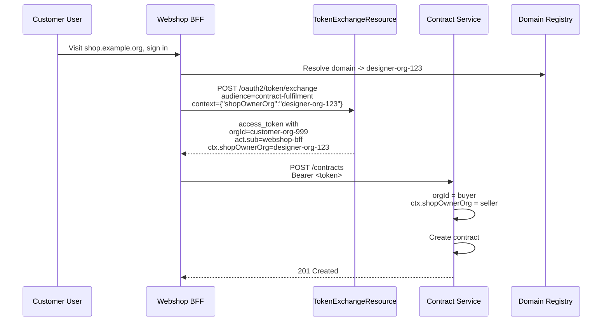

# Delegated Access and Organisational Data Ownership

When a token is exchanged via the [Token Exchange endpoint](TOKEN_EXCHANGE.md), the resulting token carries the user's `orgId` and an `act` claim identifying the caller. This document describes how downstream services determine data ownership in multi-tenant delegation scenarios.

## Core Principle

- **`orgId`** in the token is always the user's organisation — never changed during exchange.
- **`act.sub`** identifies the service that called the exchange endpoint on the user's behalf.
- The combination tells a downstream service whether the user is acting directly, or via a delegated BFF.

## Decision Logic

```java
if (token.containsClaim("act")) {
    // Delegated access — a BFF exchanged the token for the user
    String actorClientId = token.getClaim("act").getString("sub");
    String actorOwnerOrg = lookupClientOwnerOrg(actorClientId);
    storeData(actorOwnerOrg, customerOrgId = token.orgId);
} else {
    // Direct access — user signed into the service themselves
    storeData(token.orgId);
}
```

| Scenario | `act` present? | Data stored in |
|----------|---------------|----------------|
| User signs directly into contract system | No | User's `orgId` |
| Webshop BFF exchanges token to create a purchase contract | Yes (`webshop-bff`) | Service provider's org (BFF owner) |
| Designer BFF exchanges token for a customer purchase | Yes (`designer-bff`) | Determined by domain/`ctx` |

## The Designer Scenario

A service provider offers a **Designer BFF**. Users with the `designer` role can:

1. Sign into the Designer BFF.
2. Configure a custom domain (e.g. `shop.example.org`) owned by their organisation.
3. The BFF verifies domain ownership via a DNS TXT record.
4. Publish their web shop.

### Customer purchase flow

A customer visits `shop.example.org`, signs in via the shared webshop BFF, and makes a purchase. The BFF exchanges the token for a contract-fulfilment token.

The contract service receives a token with:

```json
{
  "sub": "customer-user-789",
  "orgId": "customer-org-999",
  "act": { "sub": "webshop-bff" }
}
```

The webshop BFF is shared — it serves many designer organisations. To identify the seller, the exchange request includes context:

```json
{
  "sub": "customer-user-789",
  "orgId": "customer-org-999",
  "act": { "sub": "webshop-bff" },
  "ctx": { "shopOwnerOrg": "designer-org-123", "domain": "shop.example.org" }
}
```

The contract service creates the contract between:

- **Seller:** `ctx.shopOwnerOrg` (the designer's org)
- **Buyer:** `orgId` (the customer's org)

```java
String sellerOrgId = token.getClaim("ctx").getString("shopOwnerOrg");
String buyerOrgId = token.getClaim("orgId");
createContract(sellerOrgId, buyerOrgId);
```

The `ctx` claim is trusted because the auth server placed it in the token after validating the caller.

## Mermaid Diagram



## Summary

| Pattern | Key signal | Data ownership |
|---------|-----------|----------------|
| Direct access | No `act` claim | User's `orgId` |
| Single-tenant BFF | `act.sub` = provider-owned client | Provider's org |
| Multi-tenant marketplace | `act.sub` = shared BFF + `ctx` | `ctx` determines seller |

The auth server must never alter `orgId` during exchange. The `act` and `ctx` claims are the only mechanisms a downstream service should use to resolve delegation and marketplace semantics.
