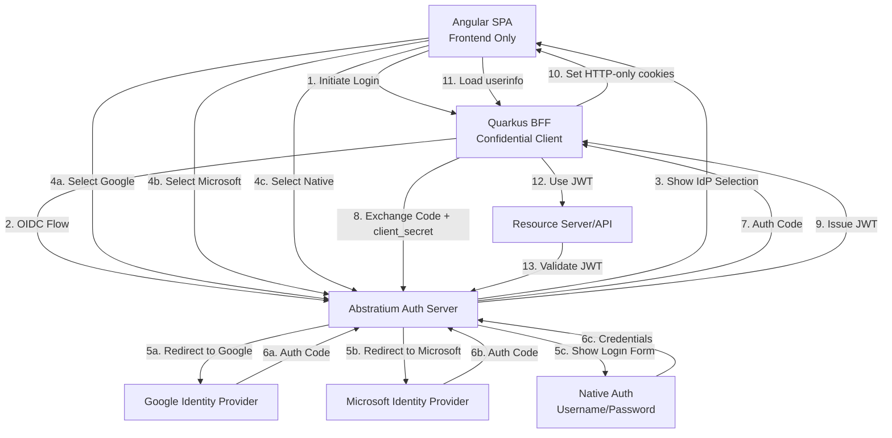
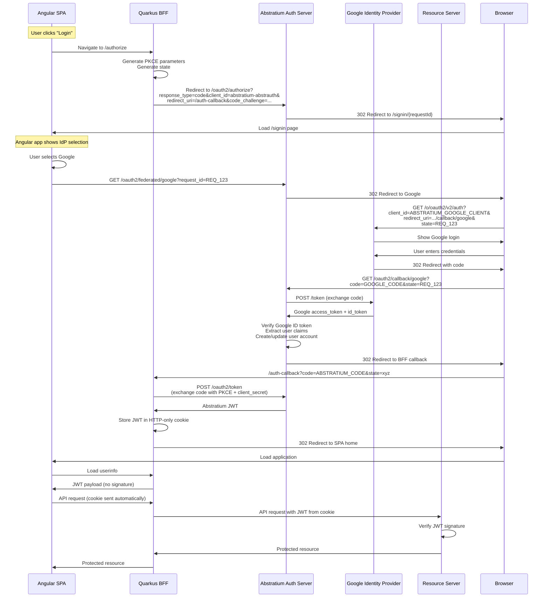
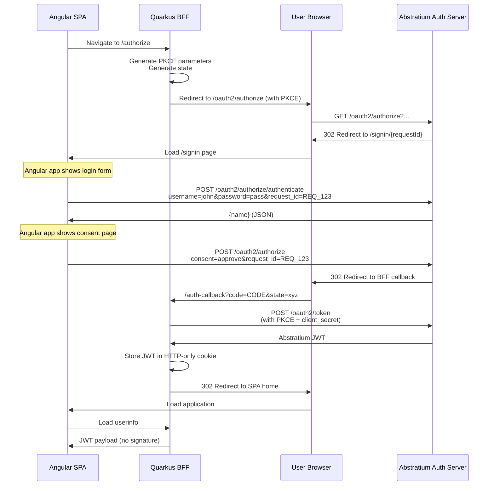
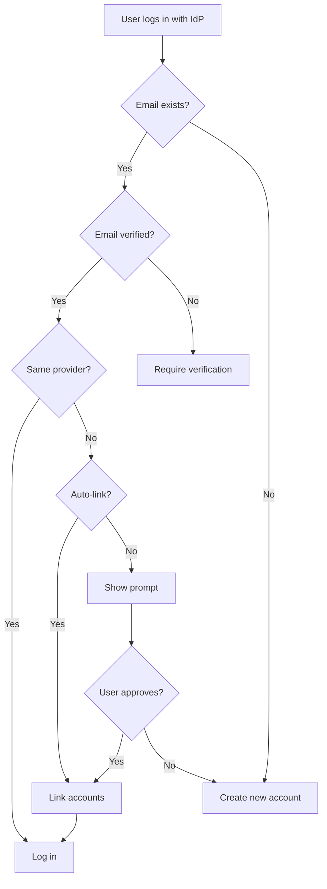

# Federated Login and Identity Provider Integration

This document describes how the Abstratium Authorization Server supports federated login, allowing users to authenticate using external identity providers (Google, Microsoft, etc.) or native Abstratium accounts.

## Table of Contents

- [Overview](#overview)
- [Architecture](#architecture)
- [Flow 1: Federated Login via External IdP](#flow-1-federated-login-via-external-idp)
- [Flow 2: Native Abstratium Login](#flow-2-native-abstratium-login)
- [Identity Provider Selection](#identity-provider-selection)
- [Token Mapping and Claims](#token-mapping-and-claims)
- [Account Linking](#account-linking)
- [Implementation Considerations](#implementation-considerations)
- [Summary](#summary)

## Overview

### What is Federated Login?

Federated login allows users to authenticate using external Identity Providers (IdPs) like Google, Microsoft, GitHub, etc. The Abstratium Authorization Server acts as a **broker** between the client application and external IdPs.

**Important:** This document describes federated login in the context of the **Backend For Frontend (BFF)** architecture. All OAuth token handling is performed by the Quarkus backend, never by the Angular frontend.

### Key Concepts

1. **Angular SPA** - Your Single Page Application (frontend only, no token handling)
2. **Quarkus BFF** - Your backend that handles OAuth flows (confidential client)
3. **Abstratium Authorization Server** - Your OAuth 2.0 server (acts as both Authorization Server and OAuth Client)
4. **External Identity Provider** - Google, Microsoft, GitHub, etc.
5. **Resource Server** - Your backend API that validates Abstratium-issued JWTs

### Trust Model

```
Angular SPA → trusts → Quarkus BFF → trusts → Abstratium Auth Server → trusts → External IdP
                            ↓                           ↓
                    HTTP-only cookies          Issues JWT for
                    (encrypted)                Resource Server
```

The Angular SPA receives only JWT payload (no signature). The BFF and Resource Server **only trust tokens issued by Abstratium**, not tokens from external IdPs.

---

## Architecture

### High-Level Architecture



---

## Flow 1: Federated Login via External IdP

### Complete Flow with Google Example



### Key Steps Explained

#### 1. Initial Authorization Request
```http
GET /oauth2/authorize?
  response_type=code&
  client_id=spa_client&
  redirect_uri=https://app.example.com/callback&
  scope=openid profile email&
  state=xyz123&
  code_challenge=CHALLENGE&
  code_challenge_method=S256
```

#### 2. IdP Selection Page
The auth server shows a page with options:
- Login with Google
- Login with Microsoft  
- Login with Abstratium (native)

#### 3. Redirect to External IdP
```http
GET https://accounts.google.com/o/oauth2/v2/auth?
  response_type=code&
  client_id=ABSTRATIUM_GOOGLE_CLIENT_ID&
  redirect_uri=https://auth.abstratium.com/oauth2/callback/google&
  scope=openid profile email&
  state=REQ_123
```

#### 4. Google Callback
```http
GET /oauth2/callback/google?
  code=GOOGLE_AUTH_CODE&
  state=REQ_123
```

#### 5. Exchange Google Code
```http
POST https://oauth2.googleapis.com/token
Content-Type: application/x-www-form-urlencoded

grant_type=authorization_code&
code=GOOGLE_AUTH_CODE&
client_id=ABSTRATIUM_GOOGLE_CLIENT_ID&
client_secret=GOOGLE_CLIENT_SECRET&
redirect_uri=https://auth.abstratium.com/oauth2/callback/google
```

#### 6. Abstratium Issues Own Token
The auth server:
1. Verifies Google's ID token
2. Creates/updates user in database
3. Generates Abstratium authorization code
4. Redirects to SPA with Abstratium code

#### 7. BFF Exchanges Code for Token
```http
POST /oauth2/token
Content-Type: application/x-www-form-urlencoded

grant_type=authorization_code&
code=ABSTRATIUM_AUTH_CODE&
redirect_uri=https://bff.example.com/auth-callback&
client_id=abstratium-abstrauth&
client_secret=BFF_CLIENT_SECRET&
code_verifier=ORIGINAL_CODE_VERIFIER
```

**Note:** The BFF (Quarkus OIDC) handles this automatically. The code_verifier is generated and stored by the BFF, not the Angular SPA.

---

## Flow 2: Native Abstratium Login

### Username/Password Authentication



### Key Points

1. **OAuth 2.0 Compliant**: Uses Authorization Code Flow, not Resource Owner Password Credentials
2. **No Direct Password to Token**: Credentials go through proper authentication endpoint
3. **BFF Pattern**: Token exchange happens in the backend with client_secret
4. **HTTP-only Cookies**: JWT stored securely, never exposed to JavaScript
5. **Consistent Flow**: Same OAuth flow as federated login from SPA perspective
6. **Consent Support**: Can require user consent for scopes

---

## Identity Provider Selection

### IdP Selection Page UI

The IdP selection is handled by the Angular application at `/signin/{requestId}`. The Angular app:

1. Fetches authorization request details:
```http
GET /oauth2/authorize/details/{requestId}
```

**Response:**
```json
{
  "clientName": "Example Client",
  "scope": "openid profile email"
}
```

2. Displays the IdP selection UI showing:
   - Client name and requested scopes
   - Available identity providers (Google, Microsoft, GitHub, etc.)
   - Native Abstratium login option
   - Sign up link

3. When user selects native login, the Angular app shows a login form and submits:
```http
POST /oauth2/authorize/authenticate
Content-Type: application/x-www-form-urlencoded

username=john.doe&
password=secret&
request_id={requestId}
```

**Response:**
```json
{
  "name": "John Doe"
}
```

4. After successful authentication, the Angular app shows a consent page and submits:
```http
POST /oauth2/authorize
Content-Type: application/x-www-form-urlencoded

consent=approve&
request_id={requestId}
```

**Response:**
```http
HTTP/1.1 302 Found
Location: https://app.example.com/callback?code=AUTH_CODE&state=xyz
```

### Federated Login Flow

When user selects Google login in the Angular app:

1. Angular app calls the federated login initiation endpoint:
```http
GET /oauth2/federated/google?request_id={requestId}
```

**Response:**
```http
HTTP/1.1 303 See Other
Location: https://accounts.google.com/o/oauth2/v2/auth?client_id=...&redirect_uri=...&state={requestId}
```

2. User is redirected to Google for authentication

3. After Google authentication, Google redirects back to:
```http
GET /oauth2/callback/google?code=GOOGLE_CODE&state={requestId}
```

4. The server:
   - Exchanges the Google code for user info
   - Creates or links the account
   - Approves the authorization request
   - Redirects to client with authorization code

**Note:** Microsoft and GitHub federated login are not yet implemented, but will follow the same pattern.

---

## Token Mapping and Claims

### External IdP Token Claims

#### Google ID Token
```json
{
  "iss": "https://accounts.google.com",
  "sub": "110169484474386276334",
  "email": "john.doe@gmail.com",
  "email_verified": true,
  "name": "John Doe",
  "picture": "https://lh3.googleusercontent.com/...",
  "given_name": "John",
  "family_name": "Doe"
}
```

#### Microsoft ID Token
```json
{
  "iss": "https://login.microsoftonline.com/{tenant}/v2.0",
  "sub": "AAAAAAAAAAAAAAAAAAAAAIkzqFVrSaSaFHy782bbtaQ",
  "email": "john.doe@outlook.com",
  "name": "John Doe",
  "preferred_username": "john.doe@outlook.com",
  "oid": "00000000-0000-0000-66f3-3332eca7ea81"
}
```

### Abstratium JWT (Normalized)

```json
{
  "iss": "https://auth.abstratium.com",
  "sub": "abstratium_user_12345",
  "aud": "spa_client",
  "exp": 1719302400,
  "iat": 1719298800,
  "email": "john.doe@gmail.com",
  "email_verified": true,
  "name": "John Doe",
  "given_name": "John",
  "family_name": "Doe",
  "picture": "https://lh3.googleusercontent.com/...",
  "federated_provider": "google",
  "federated_id": "google:110169484474386276334",
  "auth_method": "federated"
}
```

### Claim Mapping

| Abstratium | Google | Microsoft | Native |
|-----------|--------|-----------|--------|
| `sub` | Generated | Generated | User ID |
| `email` | `email` | `email` or `preferred_username` | Email |
| `name` | `name` | `name` | Name |
| `picture` | `picture` | `picture` | Avatar |
| `federated_provider` | `"google"` | `"microsoft"` | `null` |
| `auth_method` | `"federated"` | `"federated"` | `"native"` |

---

## Account Linking

### Email-Based Linking Strategy



### Database Schema

```sql
CREATE TABLE users (
    id UUID PRIMARY KEY,
    email VARCHAR(255) UNIQUE NOT NULL,
    email_verified BOOLEAN DEFAULT FALSE,
    name VARCHAR(255),
    picture VARCHAR(500),
    created_at TIMESTAMP DEFAULT CURRENT_TIMESTAMP
);

CREATE TABLE federated_identities (
    id UUID PRIMARY KEY,
    user_id UUID NOT NULL REFERENCES users(id),
    provider VARCHAR(50) NOT NULL,
    provider_user_id VARCHAR(255) NOT NULL,
    email VARCHAR(255),
    connected_at TIMESTAMP DEFAULT CURRENT_TIMESTAMP,
    UNIQUE(provider, provider_user_id)
);

CREATE TABLE native_credentials (
    id UUID PRIMARY KEY,
    user_id UUID NOT NULL UNIQUE REFERENCES users(id),
    username VARCHAR(100) UNIQUE,
    password_hash VARCHAR(255) NOT NULL,
    failed_login_attempts INT DEFAULT 0,
    created_at TIMESTAMP DEFAULT CURRENT_TIMESTAMP
);
```

---

## Implementation Considerations

### 1. External IdP Configuration

```yaml
oauth2:
  providers:
    google:
      client_id: "YOUR_GOOGLE_CLIENT_ID"
      client_secret: "YOUR_GOOGLE_CLIENT_SECRET"
      authorization_endpoint: "https://accounts.google.com/o/oauth2/v2/auth"
      token_endpoint: "https://oauth2.googleapis.com/token"
      jwks_uri: "https://www.googleapis.com/oauth2/v3/certs"
      scopes: ["openid", "profile", "email"]
      redirect_uri: "https://auth.abstratium.com/oauth2/callback/google"
```

### 2. Required API Endpoints

```java
// Authorization initiation
GET  /oauth2/authorize                    // Redirects to Angular app at /signin/{requestId}
GET  /oauth2/authorize/details/{requestId} // Returns authorization request details (JSON)

// Native authentication
POST /oauth2/authorize/authenticate       // Validates credentials (returns JSON)

// Consent
POST /oauth2/authorize                    // Processes consent (redirects to client)

// Federated login initiation
GET  /oauth2/federated/google             // Redirects to Google OAuth (requires request_id param)
// GET  /oauth2/federated/microsoft       // Not yet implemented
// GET  /oauth2/federated/github          // Not yet implemented

// IdP callbacks
GET  /oauth2/callback/google              // Handles Google OAuth callback
// GET  /oauth2/callback/microsoft        // Not yet implemented
// GET  /oauth2/callback/github           // Not yet implemented
```

### 3. Security Considerations

#### State Parameter Management
- Generate cryptographically random state
- Store with original request in server session
- Validate on callback
- Short expiration (5-10 minutes)

#### ID Token Validation
1. Verify signature using IdP's JWKS
2. Verify `iss` matches expected issuer
3. Verify `aud` matches your client_id
4. Verify `exp` (not expired)
5. Verify `nonce` if used

#### Session Management
- Secure, HTTP-only cookies
- Session timeout
- Regenerate session ID after auth

### 4. Error Handling

Redirect to SPA with error:
```
https://app.example.com/callback?
  error=access_denied&
  error_description=User+cancelled+authentication&
  state=xyz123
```

### 5. User Experience

#### First-Time User
1. Select IdP
2. Authenticate with IdP
3. Abstratium creates account
4. Optional: Profile completion
5. Redirect to SPA

#### Returning User
1. Select IdP
2. IdP may skip login (SSO)
3. Skip consent if previously granted
4. Redirect to SPA

---

## Summary

The Abstratium Authorization Server supports:

1. **Federated Login**: Google, Microsoft, GitHub, etc.
2. **Native Login**: Username/password via OAuth 2.0 flow
3. **BFF Pattern**: All clients must be confidential clients using a backend
4. **HTTP-only Cookies**: Tokens stored securely, never exposed to JavaScript
5. **Consistent Tokens**: All auth methods produce Abstratium JWTs
6. **Account Linking**: Email-based or explicit linking
7. **Security**: PKCE required, confidential clients only, state validation, ID token verification

The BFF (Quarkus backend) handles the OAuth 2.0 Authorization Code Flow with PKCE, regardless of which authentication method the user chooses. The Angular SPA never handles tokens directly.
