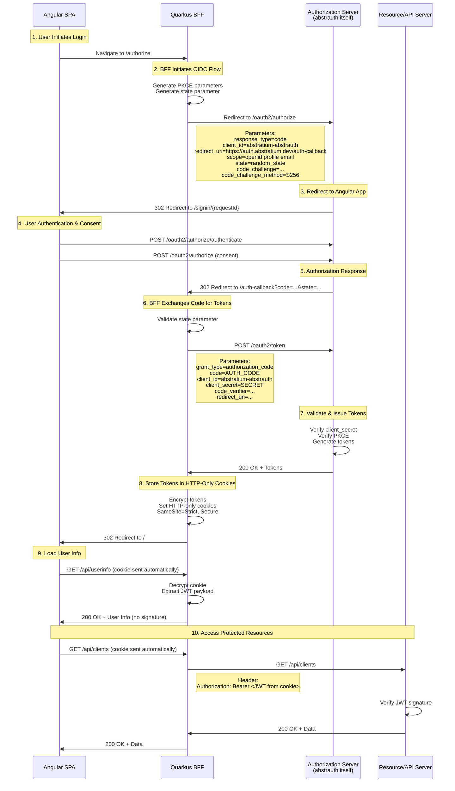
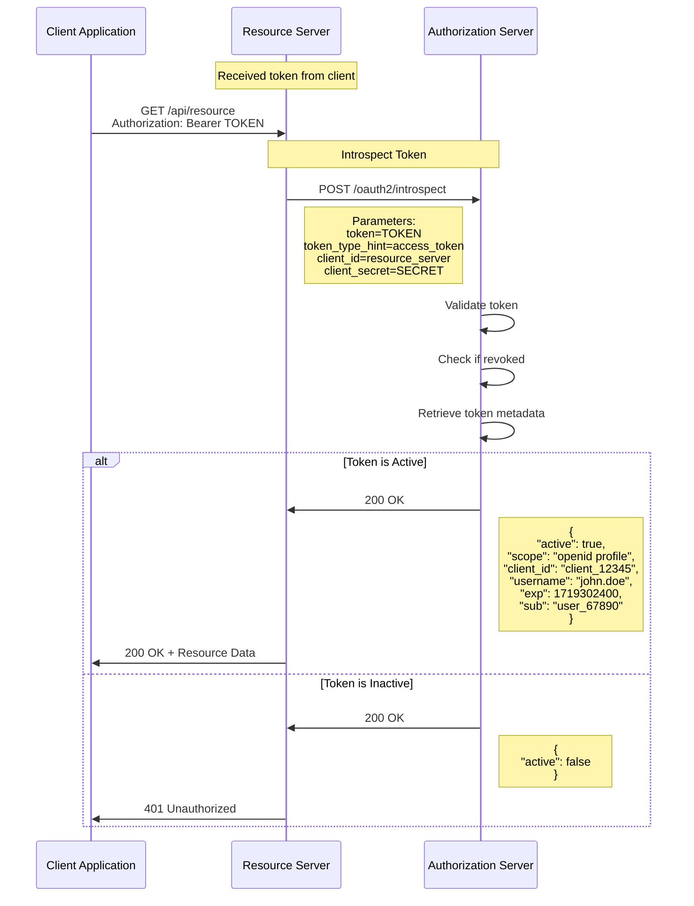
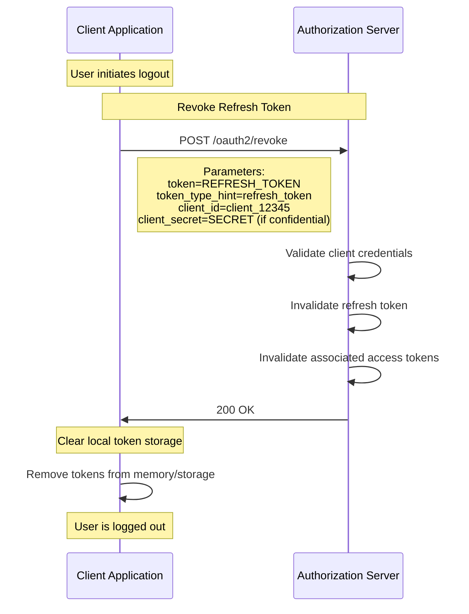
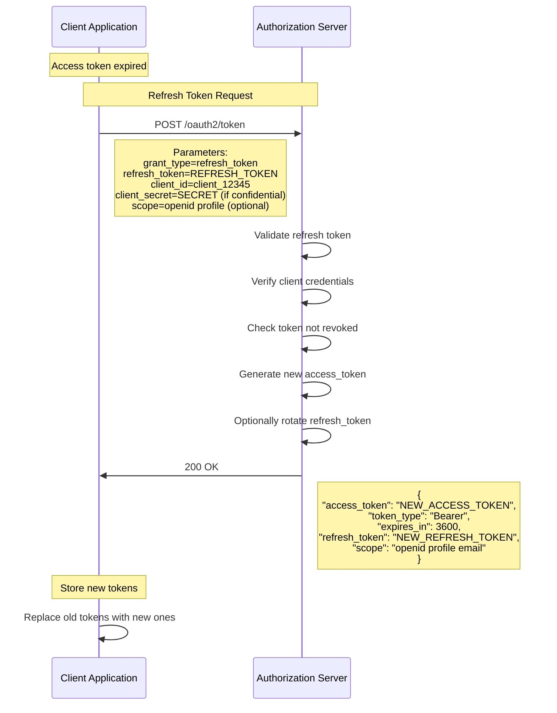

# OAuth 2.0 Authorization Flows

This document describes the OAuth 2.0 authorization flows supported by the Abstratium Authorization Server.

## Table of Contents

- [Supported Flow](#supported-flow)
- [Authorization Code Flow with PKCE (Backend For Frontend)](#flow-1-authorization-code-flow-with-pkce-backend-for-frontend)
- [Optional Operations](#optional-operations)
- [Token Refresh Flow](#token-refresh-flow)
- [Discovery and Key Management](#discovery-and-key-management)

## Supported Flow

This authorization server implements **one** OAuth 2.0 flow:

**Authorization Code Flow with PKCE (Backend For Frontend Pattern)**

This flow is based on:
- [RFC 6749](https://datatracker.ietf.org/doc/html/rfc6749) - OAuth 2.0 Authorization Framework
- [RFC 7636](https://datatracker.ietf.org/doc/html/rfc7636) - Proof Key for Code Exchange (PKCE)
- [RFC 6819](https://datatracker.ietf.org/doc/html/rfc6819) - OAuth 2.0 Threat Model and Security Considerations
- [RFC 9700](https://datatracker.ietf.org/doc/html/rfc9700) - OAuth 2.0 Security Best Current Practice
- [draft-ietf-oauth-browser-based-apps-26](https://datatracker.ietf.org/doc/html/draft-ietf-oauth-browser-based-apps-26) - OAuth 2.0 for Browser-Based Apps

**Important Security Requirements:**
- ✅ **PKCE is REQUIRED** for all authorization requests
- ✅ **Confidential clients ONLY** - Public clients are not supported
- ✅ **BFF pattern REQUIRED** - SPAs must use a backend to handle OAuth
- ✅ **HTTP-only cookies** - Tokens never exposed to JavaScript

---

## Flow 1: Authorization Code Flow with PKCE (Backend For Frontend)

**Use Case:** Single Page Applications using a Backend For Frontend (BFF) architecture

**Security:** BFF acts as confidential client with client secret. Tokens stored in HTTP-only cookies, never exposed to browser. PKCE handled by backend.

**Important:** According to [draft-ietf-oauth-browser-based-apps-26](https://datatracker.ietf.org/doc/html/draft-ietf-oauth-browser-based-apps-26#section-6.1), the BFF pattern is **required** for sensitive applications and applications handling personal data. See [decisions/BFF.md](../../decisions/BFF.md) for rationale.

**All clients using abstrauth MUST be confidential clients with a BFF.** Public clients (SPAs handling tokens directly) are not supported.

### Flow Diagram



### Step-by-Step Details

#### 1. User Initiates Login

The Angular SPA redirects to `/authorize`, which triggers the Quarkus OIDC flow.

#### 2. BFF Generates PKCE Parameters (Automatic)

Quarkus OIDC automatically generates PKCE parameters:
- `code_verifier`: Cryptographically random string (43-128 characters)
- `code_challenge`: BASE64URL(SHA256(code_verifier))
- `code_challenge_method`: S256

**Note:** The Angular frontend does NOT generate PKCE parameters. This is handled entirely by the Quarkus backend.

#### 2. Authorization Request
```http
GET /oauth2/authorize?
  response_type=code&
  client_id=spa_client_12345&
  redirect_uri=https://app.example.com/callback&
  scope=openid%20profile%20email&
  state=xyz123&
  code_challenge=E9Melhoa2OwvFrEMTJguCHaoeK1t8URWbuGJSstw-cM&
  code_challenge_method=S256
```

**Response:**
```http
HTTP/1.1 302 Found
Location: /signin/{requestId}
```

#### 3. Fetch Authorization Request Details
```http
GET /oauth2/authorize/details/{requestId}
```

**Response:**
```json
{
  "clientName": "Example Client",
  "scope": "openid profile email"
}
```

#### 4. Authenticate User
```http
POST /oauth2/authorize/authenticate
Content-Type: application/x-www-form-urlencoded

username=john.doe&
password=secret123&
request_id={requestId}
```

**Response:**
```json
{
  "name": "John Doe"
}
```

#### 5. Submit Consent
```http
POST /oauth2/authorize
Content-Type: application/x-www-form-urlencoded

consent=approve&
request_id={requestId}
```

**Response:**
```http
HTTP/1.1 302 Found
Location: https://app.example.com/callback?code=AUTH_CODE&state=xyz123
```

#### 6. Token Request
```http
POST /oauth2/token
Content-Type: application/x-www-form-urlencoded

grant_type=authorization_code&
code=SplxlOBeZQQYbYS6WxSbIA&
redirect_uri=https://app.example.com/callback&
client_id=spa_client_12345&
code_verifier=dBjftJeZ4CVP-mB92K27uhbUJU1p1r_wW1gFWFOEjXk
```

#### 7. Token Response
```json
{
  "access_token": "eyJhbGciOiJSUzI1NiIsInR5cCI6IkpXVCJ9...",
  "token_type": "Bearer",
  "expires_in": 3600,
  "refresh_token": "tGzv3JOkF0XG5Qx2TlKWIA",
  "scope": "openid profile email"
}
```

---

## Optional Operations

### Token Introspection (Optional)

**Use Case:** Validate token status and retrieve token metadata

**When to Use:**
- Resource servers need to validate opaque tokens
- Need to check if a token has been revoked
- Need detailed token metadata beyond JWT claims



#### Introspection Request
```http
POST /oauth2/introspect
Content-Type: application/x-www-form-urlencoded

token=eyJhbGciOiJSUzI1NiIsInR5cCI6IkpXVCJ9...&
token_type_hint=access_token&
client_id=resource_server&
client_secret=resource_secret
```

#### Introspection Response (Active Token)
```json
{
  "active": true,
  "scope": "openid profile email",
  "client_id": "client_12345",
  "username": "john.doe",
  "token_type": "Bearer",
  "exp": 1719302400,
  "iat": 1719298800,
  "sub": "user_67890",
  "aud": "https://api.example.com",
  "iss": "https://auth.example.com"
}
```

#### Introspection Response (Inactive Token)
```json
{
  "active": false
}
```

---

### Token Revocation (Optional)

**Use Case:** Invalidate access tokens or refresh tokens

**When to Use:**
- User logs out
- Security breach detected
- Token compromise suspected
- User revokes application access



#### Revocation Request
```http
POST /oauth2/revoke
Content-Type: application/x-www-form-urlencoded

token=tGzv3JOkF0XG5Qx2TlKWIA&
token_type_hint=refresh_token&
client_id=client_12345&
client_secret=your_client_secret
```

**Note:** The response is always `200 OK` regardless of whether the token was valid. This prevents token scanning attacks.

---

## Token Refresh Flow

**Use Case:** Obtain new access tokens without re-authenticating the user



#### Refresh Token Request
```http
POST /oauth2/token
Content-Type: application/x-www-form-urlencoded

grant_type=refresh_token&
refresh_token=tGzv3JOkF0XG5Qx2TlKWIA&
client_id=client_12345&
client_secret=your_client_secret&
scope=openid profile
```

#### Refresh Token Response
```json
{
  "access_token": "eyJhbGciOiJSUzI1NiIsInR5cCI6IkpXVCJ9...",
  "token_type": "Bearer",
  "expires_in": 3600,
  "refresh_token": "new_refresh_token_here",
  "scope": "openid profile email"
}
```

---

## Discovery and Key Management

### Server Metadata Discovery

Clients can discover the authorization server's capabilities and endpoints.

```http
GET /.well-known/oauth-authorization-server
```

#### Response
```json
{
  "issuer": "https://auth.example.com",
  "authorization_endpoint": "https://auth.example.com/oauth2/authorize",
  "token_endpoint": "https://auth.example.com/oauth2/token",
  "introspection_endpoint": "https://auth.example.com/oauth2/introspect",
  "revocation_endpoint": "https://auth.example.com/oauth2/revoke",
  "jwks_uri": "https://auth.example.com/.well-known/jwks.json",
  "response_types_supported": ["code"],
  "grant_types_supported": ["authorization_code", "refresh_token"],
  "code_challenge_methods_supported": ["S256", "plain"],
  "scopes_supported": ["openid", "profile", "email"],
  "token_endpoint_auth_methods_supported": ["client_secret_post", "client_secret_basic"]
}
```

### JSON Web Key Set (JWKS)

Resource servers retrieve public keys to verify JWT signatures.

```http
GET /.well-known/jwks.json
```

#### Response
```json
{
  "keys": [
    {
      "kty": "RSA",
      "use": "sig",
      "kid": "key-2024-01",
      "alg": "RS256",
      "n": "0vx7agoebGcQSuuPiLJXZptN9nndrQmbXEps2aiAFbWhM78LhWx...",
      "e": "AQAB"
    }
  ]
}
```

---

## Security Best Practices

### For Single Page Applications (SPAs) - BFF Pattern Required

**IMPORTANT:** All SPAs using abstrauth MUST use the Backend For Frontend (BFF) pattern. Public clients (SPAs handling tokens directly) are NOT supported.

See [decisions/BFF.md](../../decisions/BFF.md) and [draft-ietf-oauth-browser-based-apps-26](https://datatracker.ietf.org/doc/html/draft-ietf-oauth-browser-based-apps-26#section-6.1) for rationale.

**BFF Requirements:**
1. **Use confidential client** - Backend must authenticate with client_secret
2. **PKCE handled by backend** - Quarkus OIDC handles PKCE automatically
3. **HTTP-only cookies** - Tokens stored in encrypted HTTP-only cookies
4. **Never expose tokens to JavaScript** - Frontend receives only JWT payload (no signature)
5. **SameSite=Strict cookies** - Prevents CSRF attacks
6. **Secure flag in production** - HTTPS-only cookie transmission
7. **Cookie encryption** - Encrypt cookie contents for additional security

**What the Frontend Does:**
- Calls `/api/userinfo` to get user information (JWT payload without signature)
- Uses this data for UI decisions (showing user name, checking roles)
- HTTP-only cookies sent automatically by browser

**What the Frontend Does NOT Do:**
- ❌ Does not store JWT tokens
- ❌ Does not parse JWT tokens
- ❌ Does not add Authorization headers
- ❌ Does not handle PKCE
- ❌ Does not validate state parameter

### For Backend Servers (Confidential Clients)
1. **Protect client secrets** - Store securely in environment variables, never in code
2. **Use PKCE** - Defense in depth, even with client secret
3. **Validate redirect URIs** - Prevent authorization code interception
4. **Implement proper session management** - Secure token storage
5. **Use refresh token rotation** - Detect token theft
6. **Monitor for suspicious activity** - Log and alert on anomalies
7. **Encrypt session cookies** - Protect cookie contents

### For Resource Servers
1. **Verify JWT signatures** - Use JWKS endpoint to get public keys
2. **Validate token claims** - Check `iss`, `aud`, `exp`, `nbf`
3. **Use introspection for critical operations** - Real-time token validation
4. **Implement rate limiting** - Prevent abuse
5. **Cache JWKS keys** - But refresh periodically

---

## Error Handling

### Common Error Responses

#### Authorization Endpoint Errors
Errors are returned via redirect to `redirect_uri`:
```
https://client.example.com/callback?
  error=invalid_request&
  error_description=Missing+required+parameter:+client_id&
  state=xyz123
```

#### Token Endpoint Errors
```json
{
  "error": "invalid_grant",
  "error_description": "Authorization code is invalid or expired"
}
```

### Error Codes
- `invalid_request` - Missing or invalid parameters
- `invalid_client` - Client authentication failed
- `invalid_grant` - Authorization code or refresh token is invalid
- `unauthorized_client` - Client not authorized for this grant type
- `unsupported_grant_type` - Grant type not supported
- `invalid_scope` - Requested scope is invalid or exceeds granted scope
- `access_denied` - User denied authorization request

---

## Conclusion

This authorization server provides a secure OAuth 2.0 flow using the Backend For Frontend (BFF) pattern with confidential clients only. 

**Key Security Features:**
- PKCE required for all requests
- Confidential clients only (public clients rejected)
- HTTP-only encrypted cookies
- Tokens never exposed to JavaScript
- Compliant with OAuth 2.0 security best practices

For more information, refer to the RFC specifications and security best practices linked at the beginning of this document.
