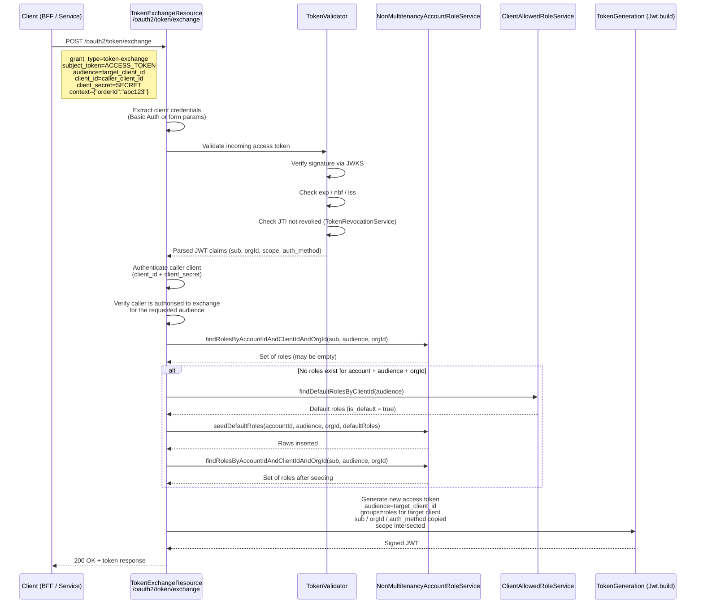

# Token Exchange Endpoint

This document describes the design for a token exchange endpoint that swaps an existing abstrauth access token for a new token scoped to a different client, incorporating that client's role assignments for the same user.

## References

- [RFC 8693](https://datatracker.ietf.org/doc/html/rfc8693) - OAuth 2.0 Token Exchange
- [draft-ietf-oauth-transaction-tokens](https://datatracker.ietf.org/doc/draft-ietf-oauth-transaction-tokens/) - Transaction Tokens
- `TokenResource` — existing token issuance endpoint (`/oauth2/token`)

## Use Case

A BFF or backend service already holds a valid abstrauth access token for **Client A**, but needs to call an API protected by **Client B**. The new token must:

- Represent the *same user* as the original token.
- Contain the *groups (roles)* that user has been assigned for **Client B**.
- Remain bound to the same `orgId` and authentication context.

This avoids forcing the user through a fresh authorization code flow when moving between services owned by the same organisation.

## Endpoint Design

```
POST /oauth2/token/exchange
Content-Type: application/x-www-form-urlencoded
```

### Request Parameters

| Parameter | Required | Description |
|-----------|----------|-------------|
| `grant_type` | Yes | Fixed value: `urn:ietf:params:oauth:grant-type:token-exchange` |
| `subject_token` | Yes | The existing abstrauth access token to exchange |
| `subject_token_type` | Yes | Fixed value: `urn:ietf:params:oauth:token-type:access_token` |
| `requested_token_type` | No | Defaults to `urn:ietf:params:oauth:token-type:access_token` |
| `audience` | Yes | The target `client_id` for which the new token should carry roles |
| `client_id` | Yes | The client making the exchange request |
| `client_secret` | Yes (if confidential) | Secret of the requesting client |
| `scope` | No | Space-delimited scope list; cannot exceed original token scope |
| `context` | No | JSON object with transaction context (e.g. `{"orderId":"abc123"}`). If omitted, `ctx` in the resulting token is inherited from the incoming access token's `ctx` claim. |

### Response

```json
{
  "access_token": "eyJhbGciOiJSUzI1NiIsInR5cCI6IkpXVCJ9...",
  "token_type": "Bearer",
  "expires_in": 3600,
  "scope": "openid profile email",
  "issued_token_type": "urn:ietf:params:oauth:token-type:access_token"
}
```

## Sequence Diagram



## Implementation Steps

### 1. Create the Resource Class

Create `src/main/java/dev/abstratium/abstrauth/non_multitenancy/boundary/TokenExchangeResource.java`.

**Why `non_multitenancy/boundary`?** The endpoint must perform a cross-tenant role lookup: the `orgId` and `accountId` are extracted from the *subject token* rather than resolved from the Hibernate `@TenantId` discriminator of the caller's session. Following the convention established by `TokenResource`, this endpoint belongs in the non-multitenancy boundary package.

Required class annotations:

```java
@Path("/oauth2/token/exchange")
@Tag(name = "OAuth 2.0 Token Exchange", description = "RFC 8693 Token Exchange")
```

Injected dependencies (in addition to those used by `TokenResource`):

```java
@Inject
ClientAllowedRoleService clientAllowedRoleService;

@Inject
NonMultitenancySubscriptionService nonMultitenancySubscriptionService;
```

The method should accept `@FormParam` parameters matching the request table above and return `Response` (JSON or OAuth error).

### 2. Validate the Subject Access Token

Parse and cryptographically verify the incoming JWT using the same public key that the JWKS endpoint advertises (`RSAPublicKey` derived from `mp.jwt.verify.publickey.location` or the in-memory private key PEM).

Checks to perform:

- **Signature** — must validate against the active signing key.
- **Issuer (`iss`)** — must match `mp.jwt.verify.issuer`.
- **Expiry (`exp`)** — token must not be expired.
- **`nbf`** — token must be valid for use now.
- **JTI revocation** — query `TokenRevocationService.isTokenRevoked(jti)`. If revoked, return `invalid_grant`.

If any check fails, return:

```json
{ "error": "invalid_request", "error_description": "..." }
```

### 3. Authenticate the Calling Client

Use the same `authenticateClient` logic as `TokenResource`:

1. Accept `client_id` and `client_secret` from form params or HTTP Basic Auth.
2. Look up the client via `OAuthClientService.findByClientId`.
3. If the client is `confidential`, verify `client_secret` against hashes stored in `ClientSecretService` / `NonMultitenancyClientSecretService` using `BCryptPasswordEncoder`.
4. On failure, return `401` with `invalid_client`.

### 4. Authorise the Exchange

Before issuing a new token, verify the exchange is legitimate. The subject token carries the user's `orgId`; that org must have access to both the caller and the audience.

**Multi-tenant public client scenario:** A service provider (e.g. your company) owns both the BFF client and a downstream microservice client. Both are marked `publik = true` and `auto_subscribe = true`. A customer organisation uses the webshop for the first time; because `auto_subscribe` is enabled, abstrauth creates the subscription automatically during the user's initial sign-in. When the BFF later exchanges the user's token for the downstream service, the same auto-subscription applies. The caller (BFF) and audience (downstream) are **not** owned by the user's org — they are owned by the service provider. Authorisation must therefore be based on **subscriptions**, not client ownership.

Checks to perform:

1. **Audience exists** — `OAuthClientService.findByClientId(audience)` must return a client.
2. **User's org subscribes to the audience** — Query `NonMultitenancySubscriptionService` for an active subscription between the subject token's `orgId` and the `audience` client. Without this, the user's org has no right to access the target application.
3. **User's org subscribes to the caller** — Query for an active subscription between the subject token's `orgId` and the authenticated `client_id` (the caller). This ensures the BFF making the request is also an application the user's org has subscribed to.

```java
String subjectOrgId = /* extracted from subject token's orgId claim */;

// Check audience subscription
if (!nonMultitenancySubscriptionService.hasActiveSubscription(subjectOrgId, audience)) {
    return buildErrorResponse(Response.Status.BAD_REQUEST, "unauthorized_client",
            "User's organisation is not subscribed to the requested audience");
}

// Check caller subscription (the BFF or service exchanging the token)
if (!nonMultitenancySubscriptionService.hasActiveSubscription(subjectOrgId, callerClientId)) {
    return buildErrorResponse(Response.Status.BAD_REQUEST, "unauthorized_client",
            "User's organisation is not subscribed to the calling client");
}
```

> **Note:** `hasActiveSubscription` is a hypothetical convenience method. If the existing `NonMultitenancySubscriptionService` does not expose it, implement it as a query on `T_subscriptions` by `org_id` and `client_id`.

If unauthorised, return:

```json
{ "error": "unauthorized_client", "error_description": "Not authorised to exchange for the requested audience" }
```

### 5. Extract Claims from the Subject Token

Read the following claims from the validated JWT:

| Claim | Purpose |
|-------|---------|
| `sub` | User account ID (carried forward) |
| `orgId` | Organisation context (carried forward) |
| `scope` | Original scope list (to be intersected) |
| `auth_method` | Authentication method (carried forward) |
| `client_id` | Original audience (for audit logging) |

### 6. Resolve Target Roles (with Default Role Seeding)

Invoke:

```java
nonMultitenancyAccountRoleService.findRolesByAccountIdAndClientIdAndOrgId(
    accountId, audience, orgId
)
```

This returns the set of roles the user has for the *target* client within the same organisation.

**If no roles exist** (the user has never accessed this client before), seed default roles from `T_client_allowed_roles` where `is_default = true`, exactly as `TokenResource` does during the authorization code flow:

```java
if (orgId != null && !nonMultitenancyAccountRoleService.hasAnyRoleForClient(accountId, audience, orgId)) {
    var defaultRoles = clientAllowedRoleService.findDefaultRolesByClientId(audience);
    if (!defaultRoles.isEmpty()) {
        nonMultitenancyAccountRoleService.seedDefaultRoles(accountId, audience, orgId, defaultRoles);
    }
}
// Re-query roles after seeding
Set<String> dbRoles = nonMultitenancyAccountRoleService.findRolesByAccountIdAndClientIdAndOrgId(
    accountId, audience, orgId
);
```

Transform the resolved roles into `groups` using the same naming convention as `TokenResource`:

```java
String displayClientId = ClientIdUtil.stripOrgPrefix(audience);
Set<String> groups = new HashSet<>();
for (String role : dbRoles) {
    groups.add(displayClientId + "_" + role);
}
```

### 7. Intersect Requested Scope

If the request includes a `scope` parameter, intersect it with the original token's scope. The new token cannot grant broader access than the subject token.

```java
Set<String> originalScopes = parseScopes(originalScope);
Set<String> requestedScopes = parseScopes(requestedScope);
Set<String> grantedScopes = new HashSet<>(requestedScopes);
grantedScopes.retainAll(originalScopes);
```

If the intersection is empty and the caller requested specific scopes, return `invalid_scope`.

### 8. Generate the New Access Token

Use `io.smallrye.jwt.build.Jwt` (the same builder as `TokenResource.generateAccessToken`) with these claims:

- `iss` — issuer config value.
- `sub` — from subject token.
- `jti` — new `UUID.randomUUID().toString()`.
- `aud` — the `audience` parameter (target client). RFC 8693 requires the issued token to identify its intended recipient when an audience is requested.
- `groups` — roles resolved in step 6.
- `client_id` — the `audience` parameter (target client). The token is issued *for* the downstream service.
- `scope` — the intersected scope string.
- `auth_method` — from subject token.
- `orgId` — from subject token.
- `iat`, `exp` — fresh timestamps (`exp` = now + `abstrauth.session.timeout.seconds`).
- `email` / `name` claims — emitted only if the granted scope contains `email` or `profile`.

**RFC 8693 `act` (actor) claim — REQUIRED for delegated tokens:**

Because this token was obtained via exchange by a calling client on behalf of the user, include an `act` claim identifying the actor:

```java
// Build act claim as a JSON object
var actClaim = jakarta.json.Json.createObjectBuilder()
    .add("sub", callerClientId)   // The client that performed the exchange
    .build();

jwtBuilder.claim("act", actClaim);
```

The `act` claim records who obtained the token on behalf of the user. A downstream resource server receiving this token can inspect `act.sub` to identify which service called the exchange endpoint to get it. If the original subject token already contained an `act` claim (indicating it was itself exchanged), nest the new actor: the new `act` becomes the current caller and the previous `act` moves into `act.act` (actor chaining per RFC 8693 Section 4.1).

**Example (based on RFC 8693 Appendix A.2):**

A user signs in to the webshop (client `webshop-bff`). The webshop needs to call the contract-fulfilment service on the user's behalf. The webshop exchanges the user's token for a token scoped to `contract-fulfilment`.

Subject token (the user's original access token for the webshop):
```json
{
  "sub": "user-123",
  "client_id": "webshop-bff",
  "orgId": "org-456"
}
```

The webshop calls `/oauth2/token/exchange` with `audience=contract-fulfilment` and `client_id=webshop-bff`.

Issued token (the new token for the contract-fulfilment service):
```json
{
  "sub": "user-123",
  "client_id": "contract-fulfilment",
  "orgId": "org-456",
  "act": { "sub": "webshop-bff" }
}
```

The `sub` is still `user-123` — the token is about the user. But `act.sub` is `webshop-bff` — this tells the contract-fulfilment service that the webshop obtained this token on the user's behalf. If the contract-fulfilment service later exchanges this token for another service, the new token would contain:
```json
{
  "sub": "user-123",
  "act": { "sub": "contract-fulfilment", "act": { "sub": "webshop-bff" } }
}
```

The outermost `act` is the current actor; nested `act` claims form a delegation history trail (RFC 8693 Section 4.1).

**Transaction token claims (from draft-ietf-oauth-transaction-tokens):**

If the exchanged token is intended to represent a single downstream transaction rather than a general-purpose access token, consider adding:

| Claim | Purpose |
|-------|---------|
| `txn` | A unique transaction identifier (e.g. `UUID.randomUUID().toString()`). Correlates the token with a specific request/response cycle. Generated if not able to be inherited from incoming access token. |
| `ctx` | A JSON object carrying transaction context. The caller may supply contextual data (e.g. `{"orderId": "abc123"}`) in the exchange request; if omitted, the `ctx` claim from the incoming access token is inherited. Downstream services can trust this data because it was placed in the token by the authorization server after validating the caller. |

> **Note:** `act`, `aud`, `txn`, and `ctx` are not currently emitted by `TokenResource`. Add them only in `TokenExchangeResource`. Existing resource servers that do not expect these claims will ignore them.

Sign with `.jws().keyId("abstrauth-key-1").sign()`.

### 9. Build the Response

Populate and return a `TokenResponse`-style DTO:

```java
TokenResponse response = new TokenResponse();
response.access_token = newAccessToken;
response.token_type = "Bearer";
response.expires_in = sessionTimeoutSeconds;
response.scope = grantedScopeString;
response.issued_token_type = "urn:ietf:params:oauth:token-type:access_token";
```

### 10. Register in Discovery Metadata

Update `WellKnownResource` so that the metadata endpoint advertises token exchange support:

```java
metadata.grant_types_supported = new String[]{
    "authorization_code",
    "refresh_token",
    "client_credentials",
    "urn:ietf:params:oauth:grant-type:token-exchange"
};
```

## Security Considerations

- **Token chaining depth** — A token obtained via exchange should *not* itself be exchangeable. The endpoint must reject exchange requests where `subject_token` contains a `client_id` claim matching a token previously issued by this endpoint, or where the token carries an `act` (actor) claim indicating it is already an exchanged token.
- **Audience restriction** — Never allow exchange for a client in a different organisation unless an explicit, active subscription exists.
- **No refresh tokens** — The token exchange response must not include a refresh token. Refresh tokens are only issued during the authorization code flow.
- **Revocation linkage** — If the original subject token is revoked (by JTI), any tokens issued from it are not automatically revoked in this minimal design. Document this limitation.
- **Metrics** — Add counters for `recordTokenExchangeRequest()`, `recordTokenExchangeSuccess()`, and `recordTokenExchangeFailure()` in `MetricsService`.

## Testing Checklist

- Unit test: valid exchange returns a JWT with target client `groups`.
- Unit test: invalid signature on `subject_token` returns `invalid_request`.
- Unit test: revoked `subject_token` (by JTI) returns `invalid_grant`.
- Unit test: unauthorised audience returns `unauthorized_client`.
- Unit test: requested scope exceeding original scope returns `invalid_scope`.
- Integration test: end-to-end exchange via REST Assured.

## Files to Create or Modify

| File | Action |
|------|--------|
| `src/main/java/dev/abstratium/abstrauth/non_multitenancy/boundary/TokenExchangeResource.java` | Create resource |
| `src/main/java/dev/abstratium/abstrauth/boundary/oauth/WellKnownResource.java` | Update metadata |
| `src/main/java/dev/abstratium/abstrauth/service/MetricsService.java` | Add exchange metrics |
| `src/test/java/.../TokenExchangeResourceTest.java` | Unit tests |
| `src/test/java/.../TokenExchangeIntegrationTest.java` | Integration tests |
