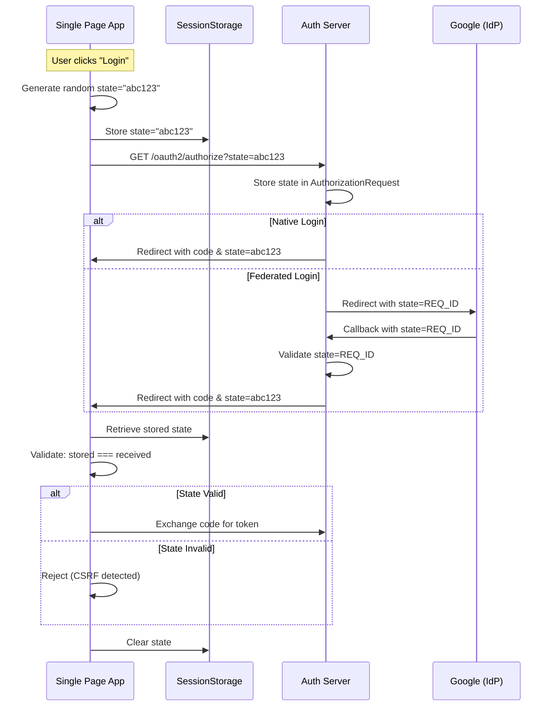

# Security Implementation

This document describes the security implementation for the abstrauth OAuth2 authorization server, including the Backend For Frontend (BFF) architecture.

## Overview

The application uses a **Backend For Frontend (BFF)** architecture where:
- The Quarkus backend acts as a confidential OAuth client for the Angular frontend
- JWT tokens are stored in encrypted HTTP-only cookies (never exposed to JavaScript)
- The backend uses **Quarkus OIDC** for authentication and **SmallRye JWT** for API authorization
- JWT tokens are signed using PS256 (RSA-PSS with SHA-256) algorithm

This architecture follows OAuth 2.0 security best practices as defined in [draft-ietf-oauth-browser-based-apps-26](https://datatracker.ietf.org/doc/html/draft-ietf-oauth-browser-based-apps-26) and is suitable for sensitive applications handling personal data.

## Architecture

### Backend For Frontend (BFF) Pattern

The Angular frontend uses the Quarkus backend as a BFF, which provides several security benefits:

**Authentication Flow:**
1. User initiates login → Angular redirects to `/oauth2/authorize`
2. User authenticates and consents
3. Quarkus OIDC receives callback at `/api/auth/callback`
4. Quarkus exchanges authorization code for tokens using client secret (confidential client)
5. Quarkus stores tokens in encrypted HTTP-only cookies
6. Quarkus redirects to Angular app root `/`
7. Angular APP_INITIALIZER loads user info from `/api/userinfo` (JWT payload without signature)
8. User is authenticated

**Security Benefits:**
- ✅ JWT tokens never exposed to JavaScript (XSS protection)
- ✅ HTTP-only cookies prevent `document.cookie` access
- ✅ Encrypted cookies prevent token inspection
- ✅ PKCE handled by Quarkus OIDC (not browser)
- ✅ State parameter validation by Quarkus OIDC
- ✅ Compliant with OAuth 2.0 security best practices
- ✅ Suitable for sensitive applications and personal data

**Implementation:**
- Backend: `UserInfoResource.java` at `/api/userinfo`
- Frontend: `auth.service.ts` with `APP_INITIALIZER`
- Configuration: `quarkus.oidc.*` properties in `application.properties`

See [decisions/BFF.md](../../decisions/BFF.md) for the architectural decision rationale.

### Token Generation (Authorization Server Role)
- Tokens are generated by the OAuth2 authorization flow in `TokenResource`
- Private key is configured via `smallrye.jwt.sign.key` property
- Algorithm: PS256 (RSA-PSS with SHA-256)
- Issuer: `https://abstrauth.abstratium.dev`

### Token Verification (Resource Server Role)
- Tokens are verified using the public key extracted from the private key
- Public key is configured via `mp.jwt.verify.publickey` property
- Issuer validation ensures tokens are from the correct authorization server
- Signature validation ensures token integrity

### Machine-to-Machine (M2M) Authentication

abstrauth supports M2M authentication using the **OAuth 2.0 Client Credentials Grant** (RFC 6749 Section 4.4). This allows services to authenticate without user interaction.

**Use Cases:**
- Microservice-to-microservice communication
- Backend services accessing APIs
- Automated jobs and scripts
- Service accounts

**Authentication Methods:**
1. **Scope-Based**: Client requests specific scopes (e.g., `api:read`, `api:write`)
2. **Role-Based**: Client has no scopes configured, uses roles in `groups` claim for `@RolesAllowed`

#### Client Credentials Flow

**Step 1: Obtain Access Token**

```bash
curl -X POST http://localhost:8080/oauth2/token \
  -H "Content-Type: application/x-www-form-urlencoded" \
  -d "grant_type=client_credentials" \
  -d "client_id=my-service" \
  -d "client_secret=$SECRET" \
  -d "scope=api:read api:write"
```

**Response:**
```json
{
  "access_token": "eyJhbGciOiJQUzI1NiIsInR5cCI6IkpXVCJ9...",
  "token_type": "Bearer",
  "expires_in": 3600,
  "scope": "api:read api:write"
}
```

**Step 2: Use Token to Access Protected Resources**

```bash
export TOKEN="eyJhbGciOiJQUzI1NiIsInR5cCI6IkpXVCJ9..."

curl -v -X GET http://localhost:8080/api/auth/check \
  -H "Authorization: Bearer $TOKEN"
```

**Success Response (200 OK):**
```json
{
  "authenticated": true,
  "clientId": "my-service",
  "groups": ["my-service_api-reader"],
  "scope": "api:read api:write"
}
```

**Failure Response (401 Unauthorized or 302/303 Redirect):**
- Invalid token: Redirects to login page or returns 401
- Expired token: Returns 401
- No token: Redirects to login page

#### Scope-Based vs Role-Based Authorization

**Scope-Based (OpenID Connect Scopes):**
- Client configured with `allowedScopes`: `["openid", "profile", "email"]`
- Used for user authentication flows
- Claims filtered based on requested scopes
- Scopes: `openid`, `profile`, `email`

**Role-Based (M2M Services):**
- Client configured with **empty** `allowedScopes`: `[]`
- Used for service-to-service authentication
- Roles added to `groups` claim for `@RolesAllowed`
- Format: `{clientId}_{role}` (e.g., `my-service_api-reader`)

**Important:** A client can use **either** scopes **or** roles, but not both. If scopes are configured, roles cannot be added.

#### Creating M2M Service Clients

**Via UI:**
1. Navigate to OAuth Clients page
2. Click "Add Client"
3. Leave "Allowed Scopes" field **empty** for role-based auth
4. Save client
5. Copy the generated client secret
6. Navigate to "Manage Roles" and add roles (e.g., `api-reader`, `api-writer`)

**Via API:**
```bash
curl -X POST http://localhost:8080/api/clients \
  -H "Authorization: Bearer $ADMIN_TOKEN" \
  -H "Content-Type: application/json" \
  -d '{
    "clientId": "my-service",
    "clientName": "My Service",
    "clientType": "confidential",
    "redirectUris": ["http://localhost:3000/callback"],
    "allowedScopes": []
  }'
```

Then add roles:
```bash
curl -X POST http://localhost:8080/api/clients/my-service/roles \
  -H "Authorization: Bearer $ADMIN_TOKEN" \
  -H "Content-Type: application/json" \
  -d '{"role": "api-reader"}'
```

#### Token Claims for M2M

**Scope-Based Token:**
```json
{
  "iss": "https://abstrauth.abstratium.dev",
  "sub": "my-service",
  "aud": "my-service",
  "exp": 1234567890,
  "iat": 1234564290,
  "jti": "unique-token-id",
  "client_id": "my-service",
  "scope": "api:read api:write",
  "groups": ["my-service_api-reader"]
}
```

**Role-Based Token (no scopes):**
```json
{
  "iss": "https://abstrauth.abstratium.dev",
  "sub": "my-service",
  "aud": "my-service",
  "exp": 1234567890,
  "iat": 1234564290,
  "jti": "unique-token-id",
  "client_id": "my-service",
  "groups": ["my-service_api-reader", "my-service_api-writer"]
}
```

**Note:** The `groups` claim is always included for `@RolesAllowed` authorization.

### Role-Based Access Control
- Roles are extracted from the `groups` claim in the JWT
- The `@RolesAllowed` annotation protects endpoints
- Role naming convention: `<client_id>_<role_name>` (e.g., `abstratium-abstrauth_manage-clients`)
- Universal roles (e.g., `user`) are automatically prefixed with the client ID when added to tokens

### Default Roles

All users receive the "user" role automatically, when their account is created. That role is for the default client named `abstratium-abstrauth`. That way, if the sign in they can see their roles for each client that they have been added to.

**Role Formats**:
- `user` - Universal role, auto-prefixed with client ID (becomes `abstratium-abstrauth_user`)
- `abstratium-abstrauth_manage-clients` - Client-specific role, only added if client ID matches

## Configuration

### Signup Control

The `allow.signup` configuration property controls whether new user registration is allowed:

```properties
%dev.allow.signup=true
%test.allow.signup=true
%prod.allow.signup=false
```

**Important**: Regardless of this setting, signup is **always enabled** when there are no accounts in the database. This ensures the first user (administrator) can always be created during initial setup.

**Security Rationale**:
- In production, signup should typically be disabled (`allow.signup=false`)
- The first user to register receives the `abstratium-abstrauth_admin` role
- After initial registration, the user should check the accounts list to verify no other accounts were created simultaneously
- After the first account is created, only administrators should be able to add new users (via future admin APIs)
- This prevents unauthorized account creation on publicly accessible instances
- The automatic first-user exception ensures the system is always accessible for initial setup

### Key Management

The application uses a single RSA key pair for signing and verification:

**Private Key** (for signing tokens):
```properties
%dev.smallrye.jwt.sign.key=<base64-encoded-private-key>
%test.smallrye.jwt.sign.key=${%dev.smallrye.jwt.sign.key}
%prod.smallrye.jwt.sign.key=SET-USING-ENV-VAR
```

**Public Key** (for verifying tokens):
```properties
%dev.mp.jwt.verify.publickey=<base64-encoded-public-key>
%test.mp.jwt.verify.publickey=${%dev.mp.jwt.verify.publickey}
%prod.mp.jwt.verify.publickey=SET-USING-ENV-VAR
```

### Extracting Public Key

To extract the public key from the private key, use the provided script:

```bash
./extract-public-key.sh
```

This will output the public key in base64 format for use in `application.properties`.

### JWT Verification Settings

```properties
# Algorithm used for signature verification
mp.jwt.verify.publickey.algorithm=PS256

# Expected issuer claim value
mp.jwt.verify.issuer=https://abstrauth.abstratium.dev

# Map 'groups' claim to roles for @RolesAllowed
smallrye.jwt.path.groups=groups
smallrye.jwt.claims.groups=groups
```

## Protected Endpoints

### `/api/clients` - OAuth Client Management

**Protection**: `@RolesAllowed("abstratium-abstrauth_manage-clients")`

**Required Role**: `abstratium-abstrauth_manage-clients`

**Behavior**:
- **No token**: Returns HTTP 401 Unauthorized
- **Invalid token**: Returns HTTP 401 Unauthorized
- **Valid token without required role**: Returns HTTP 403 Forbidden
- **Valid token with required role**: Returns HTTP 200 OK with client list

### `/api/signup` - User Registration

**Protection**: `@PermitAll`

**Behavior**:
- Publicly accessible (no authentication required)
- Signup authorization is managed by `AuthorizationService.isSignupAllowed()`
- Signup is **always allowed** when there are no accounts in the database (first user setup)
- After the first account exists, signup is controlled by the `allow.signup` configuration property

**First User Admin Role**:
- The first account created (via native signup or federated login) automatically receives the `abstratium-abstrauth_admin` role
- This admin role enables access to administrative APIs (to be implemented)
- After registration, users should navigate to the accounts list page to verify no other accounts were created simultaneously during initial setup

## OIDC Configuration (BFF Client)

The Quarkus backend acts as an OIDC client to itself for the Angular UI:

```properties
# OIDC auth server URL (abstrauth uses itself as OIDC provider)
quarkus.oidc.auth-server-url=http://localhost:8080
%prod.quarkus.oidc.auth-server-url=https://auth.abstratium.dev

# Client credentials for abstrauth's own Angular UI
quarkus.oidc.client-id=abstratium-abstrauth
quarkus.oidc.credentials.secret=${ABSTRAUTH_CLIENT_SECRET:dev-secret-CHANGE-IN-PROD}

# Application type: web-app (authorization code flow with PKCE)
quarkus.oidc.application-type=web-app

# Enable PKCE (required for security)
quarkus.oidc.authentication.pkce-required=true

# Cookie configuration (HTTP-only, secure, encrypted)
quarkus.oidc.token-state-manager.strategy=id-refresh-tokens
quarkus.oidc.token-state-manager.split-tokens=true
quarkus.oidc.token-state-manager.encryption-required=true
quarkus.oidc.token-state-manager.encryption-secret=${COOKIE_ENCRYPTION_SECRET:dev-encryption-key-must-be-at-least-32-chars-long}

# Session timeout (match token expiry - 1 hour)
quarkus.oidc.authentication.session-age-extension=PT1H

# Cookie settings
quarkus.oidc.authentication.cookie-path=/
quarkus.oidc.authentication.cookie-same-site=strict
%prod.quarkus.oidc.authentication.cookie-secure=true
```

**Important Security Notes:**
- `ABSTRAUTH_CLIENT_SECRET` must be set securely in production (see User Guide)
- `COOKIE_ENCRYPTION_SECRET` must be at least 32 characters
- Cookies are HTTP-only (JavaScript cannot access them)
- Cookies are encrypted (contents not readable even if intercepted)
- `SameSite=Strict` prevents CSRF attacks
- `Secure` flag in production ensures HTTPS-only transmission

## Angular Frontend (No Token Handling)

The Angular frontend **does not handle JWT tokens directly**:

**What Angular Does:**
- Calls `/api/userinfo` on startup (via `APP_INITIALIZER`)
- Receives JWT payload (claims) without signature
- Uses this data for UI decisions (e.g., showing user name, checking roles)
- HTTP-only cookies are sent automatically by the browser

**What Angular Does NOT Do:**
- ❌ Does not store JWT tokens
- ❌ Does not parse JWT tokens
- ❌ Does not add Authorization headers (cookies sent automatically)
- ❌ Does not handle PKCE (Quarkus OIDC handles it)
- ❌ Does not validate state parameter (Quarkus OIDC handles it)

**Implementation**: 
- `src/main/webui/src/app/auth.service.ts` - Loads userinfo from backend
- `src/main/webui/src/app/app.config.ts` - APP_INITIALIZER configuration
- No auth interceptor needed (cookies sent automatically)

## Testing

### Backend Tests

Tests use `io.smallrye.jwt.build.Jwt` to generate test tokens:

```java
// Generate valid token with required roles
String token = Jwt.issuer("https://abstrauth.abstratium.dev")
    .upn("test@example.com")
    .groups(Set.of("abstratium-abstrauth_user", "abstratium-abstrauth_manage-clients"))
    .claim("email", "test@example.com")
    .claim("name", "Test User")
    .sign();

// Use token in request
given()
    .header("Authorization", "Bearer " + token)
    .when()
    .get("/api/clients")
    .then()
    .statusCode(200);
```

**Note**: In test environments, default roles (`user`, `manage-clients`) are automatically added to all tokens. Tests can override this by explicitly setting the `groups` claim.

### Test Coverage

The `ClientsResourceTest` includes:
- ✅ Returns 401 when no token is provided
- ✅ Returns 401 when invalid token is provided
- ✅ Returns 403 when valid token lacks required role
- ✅ Returns 200 when valid token with required role is provided
- ✅ All functional tests updated to use valid tokens

### Angular Tests

The Angular interceptor has comprehensive tests covering:
- ✅ Adds Authorization header to `/api/*` requests with JWT
- ✅ Does not add header when user is not authenticated
- ✅ Does not add header to non-API requests
- ✅ Handles token changes and signout correctly

## OAuth2 State Parameter and CSRF Protection

### What is CSRF in OAuth2?

**Cross-Site Request Forgery (CSRF)** in OAuth2 occurs when an attacker tricks a victim into completing an OAuth flow initiated by the attacker. This can lead to:
- Account linking attacks (victim's session linked to attacker's account)
- Data leakage (victim unknowingly uses attacker's account)
- Session hijacking

### How the State Parameter Prevents CSRF

The `state` parameter is a **cryptographically random string** that:
1. Is generated by the client before initiating OAuth flow
2. Is stored in the client's session storage
3. Is sent to the authorization server
4. Is returned unchanged in the callback
5. **Must be validated** by the client to ensure the callback matches the original request

**Attack Scenario Without State Validation:**
```
1. Attacker initiates OAuth: /oauth2/authorize?client_id=...&state=ATTACKER_STATE
2. Attacker captures authorization code from redirect
3. Attacker tricks victim to visit: https://victim-app.com/callback?code=ATTACKER_CODE
4. Victim's session gets linked to attacker's account
5. Victim unknowingly uses attacker's account, exposing data
```

**Protection With State Validation:**
```
1. Client generates random state: "abc123xyz"
2. Client stores in sessionStorage
3. Client initiates OAuth with state=abc123xyz
4. Authorization server returns: /callback?code=...&state=abc123xyz
5. Client validates: sessionStorage.state === callback.state
6. If mismatch → reject (CSRF attack detected)
```

### Implementation Status

#### ✅ Server-Side (Secure)

**Native Login Flow:**
- State is stored in `AuthorizationRequest` entity
- State is validated when generating authorization code
- State is returned to client in redirect

**Federated Login Flow (Google):**
- State parameter contains the `AuthorizationRequest.id`
- Google callback validates state by looking up the authorization request
- Invalid state returns 400 Bad Request
- State is returned to client in final redirect

**Code References:**
- `AuthorizationResource.java` - Stores state in authorization request
- `GoogleCallbackResource.java` - Validates state parameter
- `FederatedLoginResource.java` - Uses request_id as state

#### ✅ Client-Side (Secure)

**Authorization Initiation:**
- Generates cryptographically random state (32 characters)
- Stores state in sessionStorage
- Sends state to authorization server

**Callback Validation:**
- Retrieves state from URL query parameter
- Compares with stored state in sessionStorage
- Rejects callback if state doesn't match
- Clears state from sessionStorage after validation

**Code References:**
- `authorize.component.ts` - Generates and stores state

### State Parameter Flow



### Additional CSRF Protections

1. **PKCE (Proof Key for Code Exchange)**:
   - Prevents authorization code interception
   - Code verifier stored in sessionStorage
   - Code challenge sent to authorization server
   - Server validates code_verifier matches code_challenge

2. **Short-Lived Authorization Codes**:
   - Codes expire after 10 minutes
   - Single-use only (marked as used after exchange)
   - Reduces window for CSRF attacks

3. **Redirect URI Validation**:
   - Server validates redirect_uri matches registered client
   - Prevents code leakage to attacker's domain

4. **SameSite Cookies**:
   - Cookies use `SameSite=Strict` attribute
   - Prevents CSRF

## Security Best Practices

### ✅ Implemented

1. **Token Signature Verification**: All tokens are cryptographically verified using RSA-PSS
2. **Issuer Validation**: Tokens must be issued by `https://abstrauth.abstratium.dev`
3. **Role-Based Access Control**: Fine-grained permissions using `@RolesAllowed`
4. **Proper HTTP Status Codes**: 401 for authentication failures, 403 for authorization failures
5. **Secure Key Management**: Private keys configured via environment variables in production
6. **Token Expiration**: Tokens include `exp` claim (handled by SmallRye JWT automatically)
7. **HTTPS in Production**: Recommended via reverse proxy configuration
8. **CSRF Protection**: State parameter validation in OAuth2 flows
9. **PKCE**: Proof Key for Code Exchange prevents authorization code interception
10. **Authorization Code Security**: Single-use, short-lived (10 minutes), validated redirect URIs
11. **Content Security Policy (CSP)**: Comprehensive CSP headers prevent XSS and code injection
12. **Security Headers**: X-Frame-Options, X-Content-Type-Options, Referrer-Policy, etc.
13. **Rate Limiting**: OAuth endpoints protected against brute-force and abuse attacks

### 🔒 Production Deployment

For production deployment:

1. **Set environment variables**:
   ```bash
   export SMALLRYE_JWT_SIGN_KEY="<your-private-key>"
   export MP_JWT_VERIFY_PUBLICKEY="<your-public-key>"
   ```

2. **Generate production keys**:
   ```bash
   # Generate new RSA key pair
   openssl genpkey -algorithm RSA -out privateKey.pem -pkeyopt rsa_keygen_bits:2048
   
   # Extract public key
   openssl rsa -in privateKey.pem -pubout -out publicKey.pem
   
   # Convert to base64 (no headers/newlines)
   grep -v '^-----' privateKey.pem | tr -d '\n'
   grep -v '^-----' publicKey.pem | tr -d '\n'
   ```

3. **Use HTTPS**: Configure reverse proxy (nginx, Apache, etc.) to terminate TLS

4. **Rotate keys periodically**: Update keys and redeploy application

## Content Security Policy (CSP)

### What is CSP?

Content Security Policy is an HTTP header that helps prevent Cross-Site Scripting (XSS), clickjacking, and other code injection attacks by controlling which resources the browser is allowed to load.

### Current CSP Configuration

```
Content-Security-Policy: 
  default-src 'self'; 
  script-src 'self'; 
  style-src 'self' 'unsafe-inline'; 
  img-src 'self' data: https:; 
  font-src 'self' data:; 
  connect-src 'self'; 
  frame-ancestors 'none'; 
  base-uri 'self'; 
  form-action 'self'
```

### CSP Directives Explained

| Directive | Value | Purpose |
|-----------|-------|---------|
| `default-src` | `'self'` | Default policy: only load resources from same origin |
| `script-src` | `'self'` | Allow scripts only from same origin (no inline scripts for better XSS protection) |
| `style-src` | `'self' 'unsafe-inline'` | Allow styles from same origin and inline styles (required for component styles) |
| `img-src` | `'self' data: https:` | Allow images from same origin, data URIs, and HTTPS sources |
| `font-src` | `'self' data:` | Allow fonts from same origin and data URIs |
| `connect-src` | `'self'` | Allow AJAX/fetch requests only to same origin |
| `frame-ancestors` | `'none'` | Prevent page from being embedded in iframes (clickjacking protection) |
| `base-uri` | `'self'` | Restrict `<base>` tag to same origin |
| `form-action` | `'self'` | Forms can only submit to same origin |

### Additional Security Headers

The `SecurityHeadersFilter` also adds these headers:

- **X-Content-Type-Options: nosniff** - Prevents MIME type sniffing
- **X-Frame-Options: DENY** - Prevents clickjacking (backup for CSP)
- **X-XSS-Protection: 1; mode=block** - Legacy XSS protection for older browsers
- **Referrer-Policy: strict-origin-when-cross-origin** - Controls referrer information
- **Permissions-Policy** - Restricts browser features (geolocation, camera, etc.)
- **Strict-Transport-Security (HSTS)** - Forces HTTPS (enabled only in production)

### Customizing CSP

To customize the CSP policy, update `application.properties`:

```properties
# Disable CSP (not recommended)
security.csp.enabled=false

# Custom CSP policy
security.csp.policy=default-src 'self'; script-src 'self' https://trusted-cdn.com
```

### HSTS Configuration

HSTS (HTTP Strict Transport Security) forces browsers to only connect via HTTPS:

```properties
# HSTS is disabled by default (dev/test/e2e use HTTP)
security.hsts.enabled=false
security.hsts.max-age=31536000           # 1 year in seconds
security.hsts.include-subdomains=true    # Apply to all subdomains
security.hsts.preload=true               # Eligible for browser preload lists

# Automatically enabled in production
%prod.security.hsts.enabled=true
```

**Important:** Only enable HSTS when serving over HTTPS. Enabling HSTS on HTTP will break your application.

**HSTS Header Example (Production):**
```http
Strict-Transport-Security: max-age=31536000; includeSubDomains; preload
```

### CSP Violation Reporting (Future Enhancement)

To monitor CSP violations in production, add a `report-uri` directive:

```properties
security.csp.policy=default-src 'self'; ...; report-uri /api/csp-report
```

Then implement a `/api/csp-report` endpoint to log violations.

## Rate Limiting

### What is Rate Limiting?

Rate limiting restricts the number of requests a client can make to prevent:
- **Brute-force attacks** on authentication endpoints
- **Denial of Service (DoS)** attacks
- **Credential stuffing** attacks
- **API abuse**

### Current Rate Limit Configuration

**Default Limits:**
- **10 requests per minute** per IP address
- **5-minute ban** after exceeding limits
- Applied to OAuth and authentication endpoints only

**Protected Endpoints:**
- `/oauth2/authorize` - Authorization initiation
- `/oauth2/token` - Token exchange
- `/oauth2/callback/*` - OAuth callbacks
- `/oauth2/federated/*` - Federated login
- `/api/signup` - User registration
- `/api/signin` - User authentication

### Rate Limit Headers

Clients receive these headers in responses:

```http
X-RateLimit-Limit: 10
X-RateLimit-Remaining: 7
X-RateLimit-Reset: 1733174400
```

- **X-RateLimit-Limit**: Maximum requests allowed in window
- **X-RateLimit-Remaining**: Requests remaining in current window
- **X-RateLimit-Reset**: Unix timestamp when the window resets

### Rate Limit Response

When rate limit is exceeded:

```http
HTTP/1.1 429 Too Many Requests
Retry-After: 300
Content-Type: text/plain

Rate limit exceeded. Too many requests from your IP address.
```

### Configuration

Customize rate limits in `application.properties`:

```properties
# Enable/disable rate limiting
rate-limit.enabled=true

# Maximum requests per window
rate-limit.oauth.max-requests=10

# Time window in seconds (60 = 1 minute)
rate-limit.oauth.window-seconds=60

# Ban duration in seconds after exceeding limits (300 = 5 minutes)
rate-limit.oauth.ban-duration-seconds=300
```

### Production Recommendations

For production, consider stricter limits:

```properties
%prod.rate-limit.oauth.max-requests=5
%prod.rate-limit.oauth.window-seconds=60
%prod.rate-limit.oauth.ban-duration-seconds=600
```

### IP Address Detection

The rate limiter detects client IP from:
1. **X-Forwarded-For** header (for requests behind reverse proxy)
2. **X-Real-IP** header (alternative proxy header)
3. **Remote address** (fallback)

**Important:** When deployed behind nginx or another reverse proxy, ensure the proxy sets the `X-Forwarded-For` header correctly.

### Nginx Configuration Example

```nginx
location / {
    proxy_pass http://localhost:8080;
    proxy_set_header X-Forwarded-For $proxy_add_x_forwarded_for;
    proxy_set_header X-Real-IP $remote_addr;
    proxy_set_header Host $host;
}
```

### Distributed Deployments

**Note:** The current implementation uses in-memory storage, suitable for single-instance deployments.

For **multi-instance deployments**, consider:
- Using Redis for distributed rate limiting
- Implementing at the nginx/load balancer level
- Using a dedicated rate limiting service

### Monitoring Rate Limits

To monitor rate limiting effectiveness:

1. **Log rate limit violations**:
   ```java
   // Add logging in RateLimitFilter
   logger.warn("Rate limit exceeded for IP: {}", clientIp);
   ```

2. **Track metrics**:
   - Number of rate-limited requests
   - IPs that are frequently banned
   - Peak request rates

3. **Alert on suspicious patterns**:
   - Sudden spikes in rate-limited requests
   - Same IP repeatedly hitting limits

## Troubleshooting

### Common Issues

**401 Unauthorized with valid token**:
- Check issuer claim matches `mp.jwt.verify.issuer`
- Verify public key matches the private key used for signing
- Ensure token is not expired

**403 Forbidden with valid token**:
- Verify user has the required role in `groups` claim
- Check role name matches exactly (case-sensitive)

**Token not being sent from Angular**:
- Verify user is authenticated (`authService.isAuthenticated()`)
- Check browser console for interceptor errors
- Ensure request URL starts with `/api/`

## References

- [Quarkus Security JWT Guide](https://quarkus.io/guides/security-jwt)
- [MicroProfile JWT RBAC Specification](https://github.com/eclipse/microprofile-jwt-auth)
- [RFC 7519 - JSON Web Token (JWT)](https://tools.ietf.org/html/rfc7519)
- [RFC 8725 - JWT Best Current Practices](https://tools.ietf.org/html/rfc8725)
